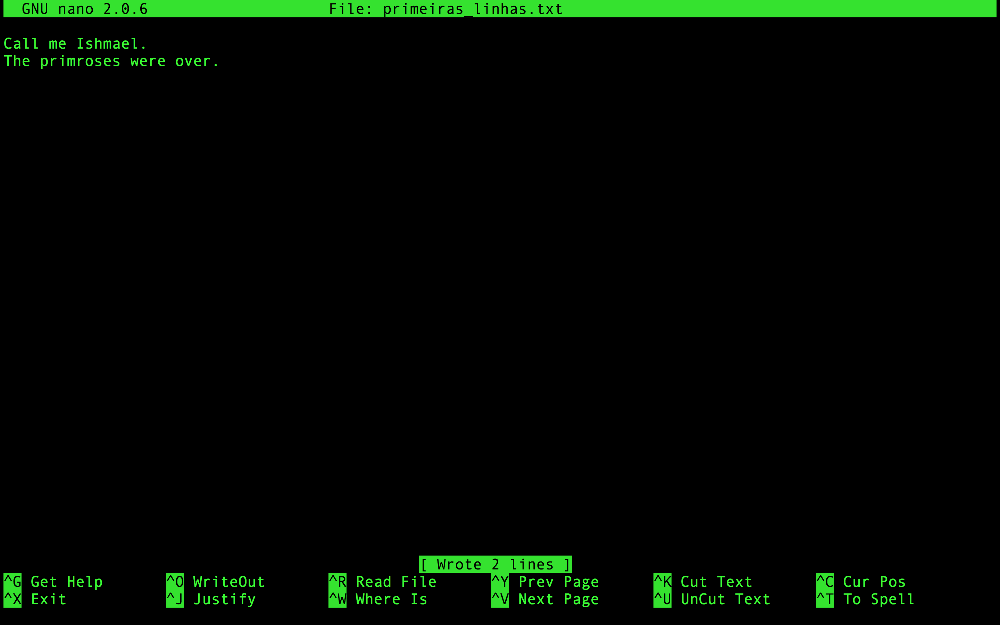

# Introdução a linha de comando - UNIX

***Observações:***

- Este tutorial foi adaptado a partir do Livro *The Biostars Handbook* (Istvan Albert, 2022) e do [*Command-line Bootcamp*](http://korflab.ucdavis.edu/bootcamp.html) por Keith Bradnam e está licenciado via [Creative Commons Attribution 4.0 International License](https://creativecommons.org/licenses/by/4.0/). O conteúdo original foi traduzido e modificado em parte de sua estrutura ***apenas para fins didáticos***. <span style="color:red">**A reprodução dele para qualquer outro fim não é permitida e nem consentida.**</span>
- O usuário de cada discente para acesso ao servidor tem restrições e o endereço IP de cada acesso é registrado. Muito cuidado ao usar.

## Como acessar a linha de comando:

##### Em sua máquina pessoal com Windows 10/11:

Há um *bash* (com um subsistema Ubuntu) apenas para o Windows 10 em diante (caso queira utilizar seu computador pessoal). Se quiser se aventurar, para habilitá-lo siga [ESTES PASSOS](https://www.howtogeek.com/249966/how-to-install-and-use-the-linux-bash-shell-on-windows-10/) ou procure no Google como proceder.

No caso de usar o subsistema acima, não é necessário o acesso a um servidor para treinar, apenas para verificar os arquivos pedidos.

### Em Máquinas Linux/MacOS:

Em máquinas Linux e Mac, basta abrir o programa Terminal. Não é necessário o acesso a um servidor para treino.

### Acessar Terminal via *Web* ou por Chromebooks:

> *Para treinos sem acesso a um servidor*

#### Opção 1:

Para usar o terminal via *web* utilizaremos o [COCALC](cocalc.com/doc/terminal.html). Ao acessar a página, clique no botão verde `Run Terminal Now`.

No Cocalc você poderá executar os comandos diretamente, sem necessidade de acesso ao servidor para treinar, apenas para verificar os arquivos pedidos.

#### Opção 2:

Para testar o terminal Linux vá no seguinte endereço

[JSLinux](https://bellard.org/jslinux/)

e clique em: `Alpine Linux - Console`

> *Ambas opções de terminal web podem apresentar algumas limitações na execução deste tutorial.*

## Primeiros passos no Terminal:

- Abra um terminal ou *shell*. Os exemplos abaixo podem variar de acordo com o tipo de shell que está sendo utilizada, mas os resultados serão os mesmos.
- Quando o terminal estiver aberto uma tela como a abaixo será vista:

```shell
Welcome to Ubuntu 20.04.4 LTS (GNU/Linux 5.4.0-107-generic x86_64)

 * Documentation:  https://help.ubuntu.com
 * Management:     https://landscape.canonical.com
 * Support:        https://ubuntu.com/advantage

  System information as of Wed 06 Apr 2022 02:38:23 PM -03

  System load:  0.06               Processes:             166
  Usage of /:   16.5% of 18.32GB   Users logged in:       1
  Memory usage: 1%                 IPv4 address for eth0: 10.7.41.67
  Swap usage:   0%

0 updates can be applied immediately.

Last login: Wed Apr  6 14:35:24 2022
johndoe@bioinfo:~$
```

> *A tela não é exatamente igual a esta, mas bem parecida.*

- O primeiro passo que deve ser feito é criar um diretório ``teste`` , usando o comando abaixo (o qual será detalhado depois):

```shell
mkdir teste
```

- Após criar o diretório, entre e faça o restante deste e do outro tutorial (102) dentro dele. Você entra neste diretório usando o seguinte comando:

```shell
cd teste
```

- Identifique o nome da máquina que estás trabalhando/acessando, e o nome do usuário.
- Observe o símbolo ```$```. Ele denota o fim do prompt de comando. Quando não há nada depois dele, significa que a máquina está pronta para próxima instrução. Nos exemplos abaixo o ```$``` não será colocado, para que os comandos possam ser copiados e colados. No entanto, recomendamos que os comandos sejam digitados para que você ganhe familiaridade e rapidez com eles.
- Primeiro comando:

```shell
echo 'Hello World!'
```

- O resultado do comando deve ser algo parecido como:

```shell
mcb:~ bioinfo$ echo 'Hello World!'
Hello World!
```

**Dica**: *Existirá situações onde trabalhar com múltiplos terminais ao mesmo tempo será extremamente útil.*

> **Importante:** O sistema UNIX é *case sensitive*, ou seja, ele diferencia letras maiúsculas de minúsculas em todos os seus comandos, nomes de arquivos e de diretórios.

- É importante ressaltar que você sempre estará dentro de um único diretório quando estiveres usando o terminal. O comportamento padrão é sempre quando abrires uma nova janela do terminal, você inicia no seu próprio diretório *home* (que você pode modificar nativamente).
- Para verificar os arquivos e diretórios que estão em diretório *home* usaremos o seguinte comando:

```shell
ls
```

- Ele dará o seguinte resultado (e claro, depende do computador que utilizas):

```shell
Applications Desktop Documents Downloads
```

- A saída do comando ```ls``` mostra diretórios e arquivos. Os diretórios que estão aparecendo estarão de acordo com o conteúdo deste tutorial.
- Após o comando ```ls```, um novo prompt de comando **$** aparecerá, mostrando que a máquina está pronta para receber o próximo comando.
- Embora você sempre esteja em um único diretório, o comando ```ls``` é utilizado para listar o conteúdo de qualquer diretório presente na máquina. Tente o comando a seguir:

```shell
ls /bin  
```

- Isto irá mostrar na tela (o que chamamos de *print*) vários nomes de programas, entre eles:

```shell
bash pwd mv
```

- No início, olhar os diretórios a partir de um terminal Unix pode ser confuso. Mas estes são os exatos tipos de pastas que você ver quando utiliza qualquer explorador de arquivos em interfaces gráficas. A partir do nível root (```/```) existem inúmeros diretórios, assim você tratá-lo como qualquer outro diretório, com o seguinte comando:

```shell
ls /
```

o que retornará algo como:

```shell
bin   dev   initrd.img      lib64       mnt   root  software  tmp  vmlinuz
boot  etc   initrd.img.old  lost+found  opt   run   srv       usr  vmlinuz.old
data  home  lib             media       proc  sbin  sys       var
```

- A saída pode ser observada em cores diferentes, que diferenciam os nomes. Muitos sistemas Unix (o Ubuntu, por exemplo) irá mostrar arquivos e diretórios com cores diferenciadas. Lembre-se que ao logar em computador, você sempre estará em seu diretório, que estará dentro de outro *home* ou *Users*.
- Como podem existir centenas de diretórios em qualquer máquina Unix e que sempre estarás em um diretório, você frequentemente precisará se localizar. Isto é realizado com o seguinte comando:

```shell
pwd
```

que irá mostrar:

```shell
/home/nome_usuario
```

- Você logou como o usuário 'bioinfo', portanto seu diretório será  um subdiretório do diretório *home*. Este por sua vez será o diretório *Pai* (parental) do *bioinfo*. Os diretórios e subdiretórios são sempre separados por **/**. Quando há apenas a **/** inicial, significa que estás no diretório raiz (*root directory*).
- Este comando é um dos que você irá mais utilizar, principalmente quando estiveres trabalhando apenas em terminal. Frequentemente os comandos digitados não dão certo porque foram executados no diretório errado. Assim, utilize o ```pwd``` sempre.

**Quick Question:** *Existem outros usuários nesta máquina? Utilize um dos comandos acima para obter sua resposta.*

## Manipulando, navegando e modificando

- Vamos agora criar um diretório, utilizando o seguinte comando e depois verificando com o ```ls```:

```shell
mkdir aulas
ls
```

deverá aparecer o seguinte:

```shell
aulas
```

- Vamos criar um outro diretório:

```shell
mkdir tmp
ls
```

- Você está no diretório do seu usuário, mas irá agora ter de trabalhar no diretório recentemente criado ```/aulas```. Para mudar os diretórios no Unix, use o seguinte comando:

```shell
cd aulas
```

Em seguida, verifique com o comando ```pwd``` se estás realmente no diretório desejado:

```shell
pwd
```

o que deverá mostrar:

```shell
/home/bionfo/aulas
```

*O nome 'bioinfo' estará substituído pelo nome do seu usuário* 

- Vamos criar mais dois subdiretórios dentro de 'aulas':

```shell
mkdir tutoriais
mkdir dados
```

- Existem duas outras formas de fazer isto. Uma dentro do próprio diretório:

```shell
mkdir tutoriais dados
```

- A outra seria no diretório do usuário, na 'home', utilizando a opção de comando **-p**:

```shell
mkdir -p ~/aulas/dados
```

> *Note os espaços antes e depois da opção '-p'.*

- Para voltar a um diretório parental, utilize o seguinte comando:

```shell
cd ..
```

> *Note o espaço entre o 'cd' e '..'*

Se você pretende navegar dois níveis de diretórios de uma só vez, use o comando:

```shell
cd ../..
```

- Use os comandos ```cd``` e ```pwd``` para navegar entre eles.
- Vamos mudar para o diretório raiz (root) e retornar ao diretório de trabalho:

```shell
cd /
cd /home
cd /bioinfo
```

Aqui novamente, também poderíamos ir diretamente, com apenas um único comando:

```shell
cd /home/bioinfo
```

- Neste caso, o posicionamento da **/** é crucial. Veja os dois exemplos abaixo de comandos (não os execute):

```shell
cd /step1/step2
cd step1/step2/
```

O primeiro comando é um caminho absoluto. Ele instrui a máquina a ir para o diretório raiz (**/**), depois ir ao diretório ```step1``` e depois ao diretório ```step2``` que está dentro de ```step1```. Neste caso apenas um único diretório ```/step1/step2``` poderá existir nesta máquina. O segundo comando especifica um caminho relativo. Ele instrui a máquina que a partir da localização atual, ele vá ao diretório  ```step1``` e depois ao diretório ```step2```. Podem existir outros diretórios ```step1/step2``` mas dentro de outros diretórios.

- O uso do comando ```cd ..``` nos permite mudar diretórios relativos aonde estamos no momento. Você pode ser mudar para um diretório baseado na localização absoluta.

- Quando você está no seu diretório *home*, ao invés do nome do diretório antes do **$**, teremos o caractere ```~```. Isto por o Unix utiliza **~** como um forma curta de representar a *home* do usuário. Veja o que acontece quando você usa os seguintes comandos (use o comando ```pwd``` após cada um deles para confirmar os resultados):

```shell
cd /
cd ~
cd
```

- Você perceberá que ```cd``` e ```cd ~``` fazem a mesma coisa: ambos te levam para o seu diretório *home*, de onde quer que estejas na estrutura da máquina. Utilizando ```cd``` é uma maneira rápida de chegar lá.
- Você também pode utilizar o caractere **~** como uma maneira rápida de navegar nos subdiretórios da sua *home*, quando estiveres em qualquer outro:

```shell
cd ~/aulas/dados
```

- Se você está trabalhando no diretório ```~/aulas/dados``` e quer ir para o diretório ```~/bioinfo/tmp``` você poder fazer qualquer um dos comandos a seguir:

```shell
cd
cd tmp
pwd
```

ou

```shell
cd ../../tmp
pwd
```

nos dois, a saída deve ser a mesma:

```shell
/home/bioinfo/tmp
```

- O operador ```..``` também pode ser utilizado com o comando ```ls```, ou seja, você também pode listar o conteúdo de diretórios acima do atual:

```shell
cd ~/aulas/tutoriais
ls ../../
```

- Ainda utilizando o ls, uma outra linha de comando é extremamente útil: ```-l```:

```shell
ls -l ~
```

Dependendo do sistema, terás algo como o abaixo:

```shell
drwxr-xr-x@ 21 jpmatos  staff      714 18 Fev 11:04 Bioinfo
drwxr-xr-x@  4 jpmatos  staff      136 15 Fev 14:42 Desktop
drwxr-xr-x@  8 jpmatos  staff      272  9 Fev 15:43 Documents
drwx------+ 11 jpmatos  staff      374 17 Fev 13:53 Downloads
drwxr-xr-x@ 14 jpmatos  staff      476 22 Nov 22:41 Genoma
-rw-r--r--@  1 jpmatos  staff   168258 31 Jan 11:04 IMG_1346.jpg
-rw-r--r--@  1 jpmatos  staff   581920 31 Jan 11:02 IMG_1347.png
drwx------@ 72 jpmatos  staff     2448  2 Fev 10:59 Library
drwxr-xr-x+  5 jpmatos  staff      170 10 Nov 18:51 Public
```

Para cada arquivo ou diretório teremos mais informações. O *'d'*  no início das linhas indica um diretório. O resto das letras serão as permissões de cada diretório ou arquivo. Existem outras  opções para o comando ```ls```. Teste cada uma e observe as diferenças:

```shell
ls -l 
ls -R 
ls -l -t -r 
ls -lh
```

Note que o último utilizou múltiplas opções sob um único traço (**-**).

- Como sabemos as opções existentes em cada comando? Felizmente cada comando Unix tem um *manual*, que é facilmente acessado utilizando o seguinte comando:

```shell
man ls
man cd
man man
```

> *Sim, até o comando man tem uma página de manual!*

Quando utilizando o comando ```man```, pressione ```espaço``` para descer uma página, ```b``` para ir para a página anterior e ```q``` para sair. Você também pode usar as setas direcionais para ir vendo linha a linha. O comando ```man``` na verdade usa um outro programa Unix, um visualizador de texto chamado ```less```.

- Agora você vários diretórios vazios, que precisam ser removidos. Para fazer isto, utilizamos o comando ```rmdir```. Ele apenas removerá diretórios vazios, portanto sua utilização é segura.

```shell
cd ~/aulas
ls
rmdir tutoriais
ls
rmdir dados
ls
```

**Importante:** *Você tem de estar fora do diretório antes de removê-lo.*

- O Unix possui um recurso de autocompletar nativo, utilizando a tecla ```tab```. É digitar as primeiras letras de diretórios ou arquivos e apertar ```tab```, que o Unix completa o resto. Isto é muito útil para salvar tempo. Se apertar ```tab``` não der resposta, significa que você não digitou letras únicas diferentes para ocorrer o *autocomplete*. Neste caso, você aperta a ```tab``` duas vezes e todas as opções são mostradas! Isso salva bastante tempo e digitação!
- Uma outra *"santa"* característica é que o Unix salva todos os comandos que você digitou em cada sessão de login. Você pode acessar esta lista utilizando o comando ```history``` ou utilizando as setas para baixo ou para cima para navegar entre os mais recentes.

## Trabalhando com arquivos

A partir de agora, trabalharemos com comandos de Unix que estão diretamente relacionados ao trabalho com arquivos. Antes disso, teremos de criar alguns arquivos. O comando ```touch``` nos permitirá criar arquivos novos, vazios (ele faz outras coisas também, mas por enquanto só precisamos de arquivos).

```shell
cd aulas
touch jedi.txt
touch federal.txt
ls
```

Você verificará então os dois arquivos.

- Agora vamos assumir que nós queremos mover estes arquivos para um novo diretório, *temp*. Vamos agora utilizar o comando ```mv``` (não esqueça de utilizar ```tab``` para completar daqui por diante):

```shell
mkdir temp
mv jedi.txt temp
mv federal.txt temp
ls temp
```

Para o comando ```mv``` sempre temos de especificar um arquivo ou diretório fonte (*source*) que nós queremos mover, e daí especificar o local alvo, a localização destino. Poderíamos ter movido ambos arquivos de uma única vez, utilizando algum dos comandos abaixo:

```shell
mv *.txt temp 
mv *t temp 
mv *ed* temp
```

O ```*``` é um coringa, que significa *qualquer padrão que tenha*. O caractere ```?``` é um outro coringa, com um significado um pouquinho diferente. Veja o que ele significa.

- O comando ```mv``` pode também renomear arquivos. Faça o exemplo abaixo:

```shell
touch samurai
ls
mv samurai temp/ninja
ls temp/
```

Tendo como resultado:

```shell
jedi.txt federal.txt ninja
```

A extensão lógica disto é que você também pode utilizar o comando ```mv``` para renomear um arquivo sem movê-lo. Para renomear você também pode utilizar o comando ```rename``` (veja em seu manual as opções dele).

- É importante que você entenda que desde que você descreva em um comando um diretório **origem** e um **destino** quando moves um arquivo, então não importa em qual diretório estás. Mover diretórios é semelhante a mover arquivos:

```shell
mv temp temp2
ls temp2
```

- Remover diretórios que possuem arquivos é uma etapa que deve ser realizada com extremo cuidado. Isto porque não há volta em muitos casos. O comando ```rm``` é extremamente perigoso exatamente por isso. Você pode deletar tudo com este comando, inclusive o diretório *home*. 

> Leia com atenção o uso do comando ```rm``` para evitar muita *morte e destruição do mundo como conhecemos*.

- Felizmente existe uma maneira de deixar o comando ```rm``` um pouco mais seguro: usando a opção ```-i```, que irá pedir confirmação antes da execução. Se habitue a usar sempre o ```rm -i```. 

```shell
cd temp
ls
rm -i jedi.txt federal.txt ninja
```

o que irá perguntar em cada etapa, que você confirma pressionando ```y```:

```shell
rm: remove regular empty file 'jedi.txt'? y
rm: remove regular empty file 'federal.txt'? y
rm: remove regular empty file 'ninja'? y”
```

Esse comando também poderia ter sido simplificado utilizando alguns dos *coringas* acima aprendidos ou mais complexo apagando cada arquivo com um comando diferente.

- O comando ```cp``` é utilizado para cópias de arquivos e diretórios e tem uma sintaxe similar a do comando ```mv```, no entanto ele deixa o arquivo na *origem*. Vamos criar um novo arquivo e então fazer uma cópia:

```shell
touch file1
cp file1 file2
ls
```

E para copiar um arquivo em um diretório diferente:

```shell
touch ~/aulas/file3
cp ~/aulas/file3 ~/aulas/tutoriais/
```

Para cópias de diretórios, o comando ```cp``` é utilizado com as opções ```-R``` ou ```-r```. Verifique no ```man cp``` a diferença entre elas.

## Visualizado e editando o conteúdo de arquivos

Dois comandos úteis para visualizar o conteúdo dos arquivos são: ```more``` ou ```less```. Eles não editam o conteúdo. Utilizaremos o primeiro comando que aprendemos, o ```echo``` para colocar texto em um arquivo e depois visualizar:

```shell
echo "Call me Ishmael."
Call me Ishmael.
echo "Call me Ishmael." > primeira_linha.txt
ls
```

dando:

```shell
primeira_linha.txt
```

O caractere ```>``` quando inserido ao final de um comando redireciona o *print* daquele comando para um arquivo. Neste caso, estamos colocando o resultado do comando ```echo``` para um arquivo ```primeira_linha.txt```. 

> *Tome bastante cuidado ao utilizar o redirecionamento com ```>```: ele irá apagar qualquer arquivo que já exista com o nome que foi utilizado.*

Podemos agora ver o conteúdo do arquivo:

```shell
more primeira_linha.txt
```

Ao utilizar ```more``` ou ```less```, você pode acessar uma página de comandos de ajuda, pressionando ```h```, passar uma página usando ```espaço```, navegar linha a linha usando ```j``` ou ```k```, ```b``` para ir para a página anterior e ```q``` para sair. Estes comandos também realizam um milhão de outras coisas, incluindo procura em texto, mas veremos isso depois.

O comando ```cat``` é um dos comandos mais utilizados quando estamos trabalhando com textos e caracteres no terminal. Vamos a uma pequena demonstração, adicionando um nova linha ao arquivo anterior:

```shell
echo "The primroses were over." >> primeira_linha.txt
cat primeira_linha.txt”
```

O resultado é:

```shell
Call me Ishmael.
The primroses were over.
```

Preste bem atenção que agora o que foi utilizado foi ```>>``` e não apenas ```>```. Este operador adiciona a um arquivo. Se ```>``` tivesse sido usado, o arquivo primeira_linha.txt teria sido sobrescrito.

O comando ```cat``` ele apenas mostrar o conteúdo de um arquivo e o retorna para a linha de comando. Diferentemente do ```less``` você não tem nenhum controle na visualização. Você pode utilizar ```cat``` para rapidamente combinar múltiplos arquivos ou até mesmo copiar um:

```shell
cat primeira_linha.txt > primeira_linha_copia.txt
```

Muitas vezes precisamos de informações sobre um arquivo sem ter de visualizá-lo com ```more``` ou ```less```. Um exemplo disto é quando precisamos contar caracteres em um arquivo. Para isso, um comando muito utilizado é o ```wc``` (*word count*):

```shell
wc primeira_linha.txt
2  7 42 primeira_linha.txt

$ wc -l primeira_linha.txt
2 primeira_linha.txt
```

Este comando retorna o número de linhas, palavras e caracteres em um arquivo específico e você pode usar opções de linha de comando para ver apenas uma destas estatísticas (caso do ```wc -l```).

**Quick Question:** *Pense numa aplicação do comando ```wc``` ao utilizar arquivos de sequências biológicas na interface de linha de comando.*

### O editor nano

A maioria dos sistemas Unix vem com um editor de texto extremamente leve, chamado *nano*. Existem editores mais potentes e com mais recursos (como o *emacs* e o *vi*), mas eles têm curvas de aprendizagem mais complicadas. O nano é muito simples. Você pode editar ou criar arquivos digitando:

```shell
nano primeiras_linhas.txt
```

Você deverá ver algo como:



Na parte de baixo da tela há uma série de comandos simples que são acessíveis digitando a tecla *Control* (indicada como ```^```) mais uma letra.

## O comando ```grep```

Utilize o nano para criar um arquivo chamado `texto_teste.txt`, que irá conter as seguintes linhas (não precisa digitar, você pode copiar e colar):

```shell
É um período de guerra civil. Partindo de uma base secreta, naves rebeldes atacam e conquistam sua primeira vitória contra o perverso Império Galáctico.

Durante a batalha, espiões rebeldes conseguem roubar os planos secretos da arma decisiva do Império, a ESTRELA DA MORTE, uma
estação espacial blindada com poder suficiente para destruir um planeta inteiro.

Perseguida pelos sinistros agentes do Império, a princesa Leia, apressa-se em voltar para casa a bordo de sua nave estelar, protegendo os planos roubados que podem salvar seu povo e
restaurar a liberdade na galáxia....
```

Trabalhando na linha de comando, em várias ocasiões você terá de procurar padrões dentro de arquivos. Um exemplo em bioinformática é a procura do número de sequências em um determinado arquivo fasta (veremos mais adiante) ou o número de ```ATG``` (que é o códon de iniciação) em uma determinada sequência. O comando Unix ```grep``` faz isso (e muito, muito mais). Os exemplos a seguir mostram como você pode usar as opções de linha de comando do ```grep``` para:

- Mostrar linhas que possuem um determinado padrão.
- Ignorar maiúsculas e minúsculas quando procurar (```-i```)
- Apenas procurar palavras inteiras (```-w```).
- Mostrar as linhas que NÃO possuem um padrão (```-v```).
- Utilizar *coringas* e outros padrões para permitir alternativas (```*```, ```.``` e ```[]```). Vamos lá:

Linhas que contém a palavra 'planos':

```shell
$ grep planos texto_teste.txt
```

Ressaltar a palavra encontrada:

```shell
$ grep --color=AUTO planos texto_teste.txt
```

Mostrar as linhas que não possuem o padrão 'planos':

```shell
$ grep -v planos texto_teste.txt
```

## Combinando comandos com *pipes*

Uma das características maios poderosas do Unix é que você pode mandar a saída de um programa para outro comando (desde que o outro programa aceite), utilizando algo conhecido como ```pipe```. Isto é implementado utilizando o caractere "|". É como conectar dois programas. Vejamos alguns exemplos:

```shell
grep planos texto_teste.txt | wc -c
    310
```

Lembra do comando `history`? Você pode procurar entre os comandos que você digitou utilizando um pipe com o `grep`:

```shell
history | grep mkdir
```

Com o comando acima você extraiu do histórico dos seus comandos apenas as linhas que tinham o comando `mkdir`.

## Outros comandos úteis

- Vamos trabalhar com um arquivo fasta de sequências de nucleotídeos. Este arquivo está alocado em um outro servidor, iremos fazer a cópia do arquivo remotamente, utilizando o comando ```wget```. Coloque o arquivo em um diretório de trabalho ```~/aulas```:

```shell
cd /home/bioinfo/aulas ou cd ~/aulas
```

- Agora executaremos o `wget`:

```shell
wget 'https://drive.google.com/uc?export=download&id=15OCaUzNHqp2hD6sfAnQPxebBclr6tQTS' -O teste.fasta
```

- Agora vamos conhecer alguns outros comandos úteis, utilizando *pipes* de diferentes comandos. Vamos ver as últimas 10 linhas de um arquivo, fazendo um *pipe* de dois comandos, o ```tail``` e o ```head```. 

```shell
tail -n 20 teste.fasta | head
```

*O primeiro, com a opção ```-n 20``` dá as últimas 20 linhas do arquivo, e fazendo o 'pipe' com o ```head``` irá mostrar as primeiras 10 linhas das últimas 20.*

- Mostrar as linhas do arquivo que começam com um códon de iniciação ATG:

```shell
grep "^ATG" teste.fasta
```

*Neste caso, o caractere ```^``` procura padrões no início de uma linha.*

- Agora vamos contar quantas linhas em um arquivo contêm as trincas 'CAT' ou 'GAT':

```shell
grep -c '[CG]AT' teste.fasta
```

*A opção ```-c``` do comando ```grep``` conta o número de linhas. A descrição '[CG]' denota a expressão regular para procura.* 

- Transformar letras minúsculas em maiúsculas no arquivo ``min.fasta``, utilizando o comando ```tr```:
  - Verifique primeiro como está o arquivo com o comando ```more``` :

```shell
more min.fasta
```

- Agora utilize a combinação dos comandos `cat`e `tr`:

```shell
cat min.fasta | tr 'a-z' 'A-Z'
```

- Mudar todas as ocorrências de 'Chr1' para 'Chromosome 1' e escrever o *output* para um novo arquivo, utilizando o comando ```sed```:

```shell
cat arquivoexemplo1.txt | sed 's/Chr1/Chromosome 1/' > arquivoexemplo2.txt
```

## A variável de ambiente `$PATH`

Um outro uso do comando `echo` é mostrar o conteúdo das variáveis de ambientes (*environment variables*). Estas contêm valores específicos dos usuários ou do sistema que, ou refletem informações ou lista localizações úteis. no sistema de arquivos. Alguns exemplos:

```shell
$ echo $USER
bioinfo
$ echo $HOME
/home/bioinfo
$ echo $PATH
/usr/local/sbin:/usr/local/bin:/home/bioinfo/bin”
```

A última mostra o conteúdo da variável de ambiente `$PATH`, que mostrar a lista de diretórios onde se espera que estejam os programas que você irá executar (os executáveis). Isto inclui todos os comandos de Unix utilizados até agora. Conhecer como mudar o seu `$PATH` para incluir diretórios customizados é necessário muitas vezes (por exemplo, quando for necessário instalar uma nova ferramenta de bioinformática em uma localização não-padrão).