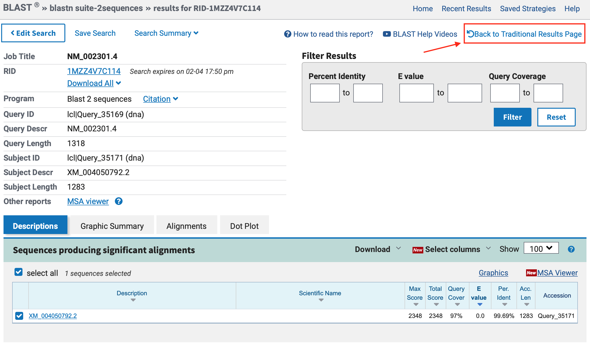
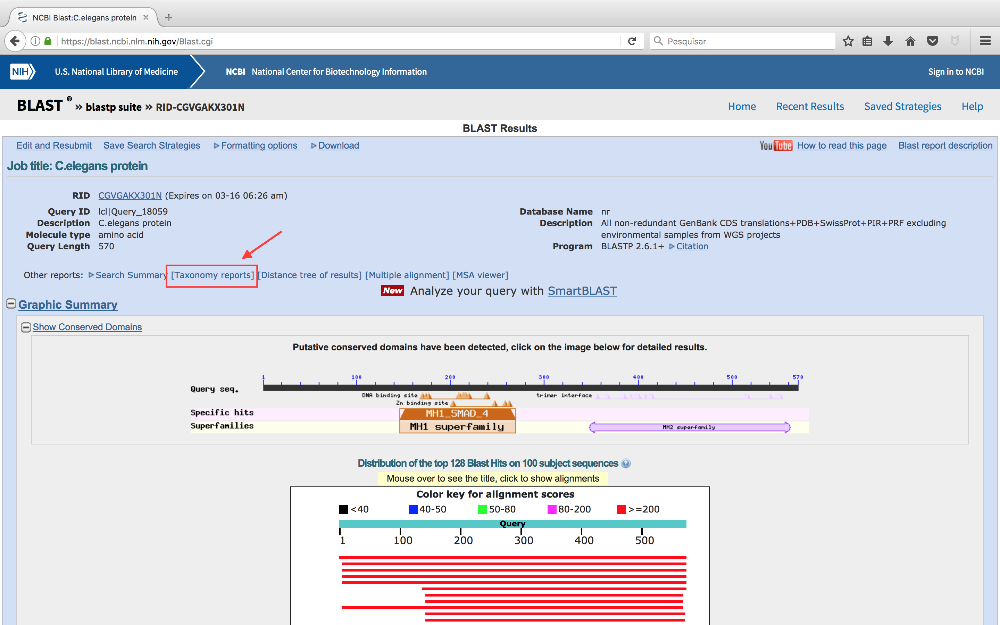
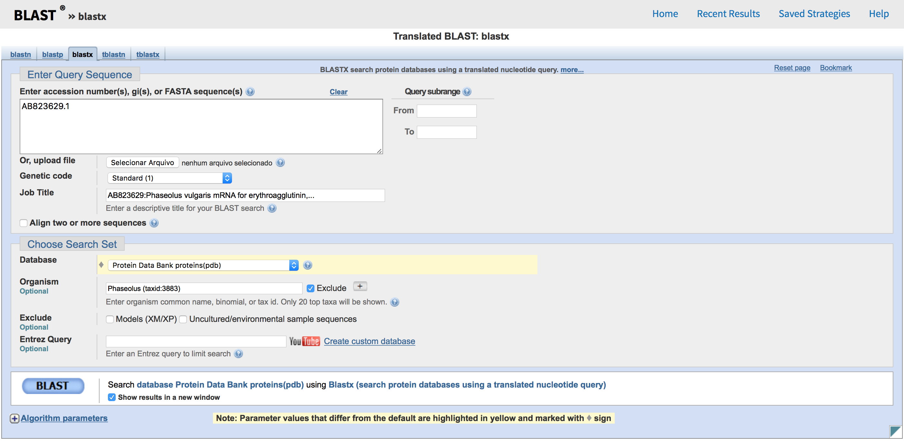
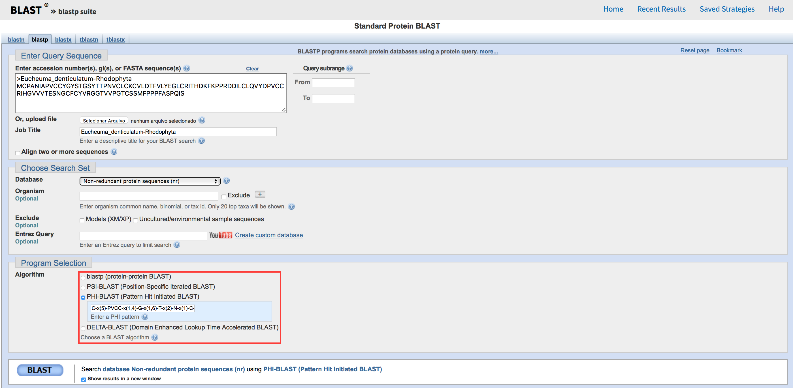

# Buscas de similaridade a partir de sequências proteicas

**Observação:**

- Este tutorial foi construído ***apenas para fins didáticos***. <span style="color:red">**A reprodução dele para qualquer outro fim não é permitida e nem consentida.**</span>

## Objetivos

Nos passos que seguem, você deverá aprender:

- Busca de similaridades entre sequências utilizando as diferentes versões do BLAST.
- Descobrir informações sobre uma proteína a partir da sequência.
- Buscar proteínas homólogas que possuam baixa similaridade em suas sequências.

**Observação:**

- Este tutorial foi adaptado a partir dos tutoriais do BLAST disponíveis no NCBI. O conteúdo original foi traduzido e modificado em parte sua estrutura ***apenas para fins didáticos***. <span style="color:red">**A reprodução dele para qualquer outro fim não é permitida e nem consentida.**</span>

## BLASTp

Utilize o [BLASTp](https://blast.ncbi.nlm.nih.gov/Blast.cgi?PROGRAM=blastp&PAGE_TYPE=BlastSearch&LINK_LOC=blasthome), para executar uma busca contra o banco **nr** (*non redundant protein database*) para encontrar proteínas de vertebrados homólogas a proteína abaixo:

``` 
>C.elegans protein
MFHPGMTSQPSTSNQMYYDPLYGAEQIVQCNPMDYHQANILCGMQYFNNSHNRYPLLPQMPPQFTNDHPY
DFPNVPTISTLDEASSFNGFLIPSQPSSYNNNNISCVFTPTPCTSSQASSQPPPTPTVNPTPIPPNAGAV
LTTAMDSCQQISHVLQCYQQGGEDSDFVRKAIESLVKKLKDKRIELDALITAVTSNGKQPTGCVTIQRSL
DGRLQVAGRKGVPHVVYARIWRWPKVSKNELVKLVQCQTSSDHPDNICINPYHYERVVSNRITSADQSLH
VENSPMKSEYLGDAGVIDSCSDWPNTPPDNNFNGGFAPDQPQLVTPIISDIPIDLNQIYVPTPPQLLDNW
CSIIYYELDTPIGETFKVSARDHGKVIVDGGMDPHGENEGRLCLGALSNVHRTEASEKARIHIGRGVELT
AHADGNISITSNCKIFVRSGYLDYTHGSEYSSKAHRFTPNESSFTVFDIRWAYMQMLRRSRSSNEAVRAQ
AAAVAGYAPMSVMPAIMPDSGVDRMRRDFCTIAISFVKAWGDVYQRKTIKETPCWIEVTLHRPLQILDQL
LKNSSQFGSS
```

Após alguns minutos, você deverá ter um resultado como o descrito abaixo. Clique no local indicado para trocar para a página tradicional de resultados do BLAST:



>*Na página tradicional, os resultados ficam mais acessíveis, no entanto, fique a vontade para usar a versão mais nova.*

- Basedo no *hit* idêntico a *C. elegans*, qual é a identidade desta proteína?

Acima do sumário gráfico da busca BLAST existe o link ***Taxonomy Report*** (Veja a figura abaixo). Clique e observe a nova página aberta.



- O que você observa nesta nova página?
- Procure nesta páginas os registros de proteínas homólogas de espécies de aves.
- Procure o hit com a espécie *Xenopus laevis* e verifique os parâmetros de alinhamento BLAST entre essas sequências.

Voltando para a página dos resultados do BLAST, clique no primeiro hit, que leva a entrada do GenBank da sequência [P45897.1](https://www.ncbi.nlm.nih.gov/protein/1173454?report=genbank&log$=protalign&blast_rank=1&RID=CGVGAKX301N). Este código é referente ao UniprotKB. Quando a entrada do GenBank é uma proteína do Uniprot, o NCBI já traz resultados pré-compilados do BLAST para ela. Para verificar estes resultados, basta clicar no link **BLink** que fica na lateral direita, logo abaixo de ***Related information***.

A saída (*output*) do BLink mostra um gráfico denotando a extensão do alinhamento com a *Query* (P45897):

- O escore BLAST é relacionado ao alinhamento Blast 2 sequences.
- O número de acesso está ligado ao registro no Entrez.
- Os números de distribuição taxonômica nas caixas coloridas indicam que esta via de sinalização é provavelmente restrita a animais multicelulares (Metazoa).
- Em *display options* você reformatar a visualização dos resultados.
- Os botões acima, em *Other views (reports)* mostram outras visualizações possíveis.
- Qual o nome da espécie de porco-espinho (*hedgehog*) que tem uma proteína relacionada a esta?

> *Depois voltaremos a esta proteína no exemplo de PSI-BLAST.*

## BLASTx

Muitas vezes a obtenção de uma sequência alvo é realizada por meio de sequenciamento de DNA (em projetos genomas ou transcriptomas), pois normalmente estes métodos são mais acessíveis do que métodos de obtenção de sequências de aminoácidos. Para fazer a busca por similaridade a partir da sequência codificante de nucleotídeos, você tem duas opções:

- Traduzir a sequência de nucleotídeos nos 3 *frames* (janelas de leituras) e submeter as sequências resultantes a buscas de similaridade utilizando o BLASTp. Esta tradução pode ser realizada utilizando ferramentas do [EXPASY](https://web.expasy.org/cgi-bin/translate/dna2aa.cgi) ou do [EBI](https://www.ebi.ac.uk/Tools/st/).
- Utilizar o [BLASTx](https://blast.ncbi.nlm.nih.gov/Blast.cgi?PROGRAM=blastx&PAGE_TYPE=BlastSearch&BLAST_SPEC=&LINK_LOC=blasttab&LAST_PAGE=blastn&QUERY=AB823629.1). Este variação do BLAST traduz a sequência de nucleotídeos de entrada (*Query*) e a compara com bancos de proteínas.

Para sermos mais práticos e diretos, utilizaremos a busca [BLASTx](https://blast.ncbi.nlm.nih.gov/Blast.cgi?PROGRAM=blastx&PAGE_TYPE=BlastSearch&BLAST_SPEC=&LINK_LOC=blasttab&LAST_PAGE=blastn&QUERY=AB823629.1), com a sequência no formato ```fasta``` abaixo:

```
>AB823629.1
GAATGCATACATGGCTTCCTCCAACTTACTCTCCCTAGCCCTCTTCCTTGTGCTTCTCACCCACGCAAAC
TCAGCCAGCCAAACCTCCTTCAGCTTCCAAAGGTTCAACGAAACCAACCTTATCCTCCAACGCGATGCCA
CCGTCTCATCCAAAGGCCAGTTACGACTAACCAATGTTAATGACAACGGAGAACCCACGTTGAGCTCTCT
GGGCCGTGCCTTCTACTCCGCCCCCATCCAAATCTGGGACAACACCACCGGCGCCGTGGCCAGCTTCGCC
ACCTCCTTCACATTCAATATCGACGTTCCCAACAATTCAGGACCCGCCGATGGCCTTGCCTTTGTTCTCC
TCCCCGTGGGCTCTCAGCCCAAAGACAAAGGCGGTCTTCTAGGTCTGTTCAACAACTACAAATACGACAG
CAATGCCCATACTGTGGCTGTGGAGTTCGACACCCTCTACAACGTTCACTGGGACCCCAAACCGCGTCAT
ATTGGCATCGACGTGAACTCCATCAAGTCTATCAAAACGACGACGTGGGATTTTGTCAAAGGAGAAAACG
CGGAGGTTCTGATCACCTATGACTCCTCCACGAAGCTCTTGGTGGCTTCTCTGGTTTACCCTTCTCTGAA
AACAAGCTTCATCGTCTCTGACACAGTGGACCTGAAGAGCGTTCTTCCCGAGTGGGTGATCGTTGGGTTC
ACTGCCACCACTGGGATTACTAAAGGGAACGTTGAAACGAACGACATCCTCTCTTGGTCTTTTGCTTCCA
AGCTCTCCGATGGCACCACATCTGAAGCTTTGAATCTTGCCAACTTCGCCCTCAACCAAATCCTCTAG
```

Agora vamos ver quais outras proteínas semelhantes a esta já possuem estrutura 3D resolvida. Para isso iremos utilizar um [BLASTx](https://blast.ncbi.nlm.nih.gov/Blast.cgi?PROGRAM=blastx&PAGE_TYPE=BlastSearch&BLAST_SPEC=&LINK_LOC=blasttab&LAST_PAGE=blastn&QUERY=AB823629.1). Na página de busca do BLASTx, não esquecer de mudar o campo *Database* para ***Protein Data Bank (pdb)***. No entanto, não queremos receber *hits* do gênero *Phaseolus*. Para isso, no campo *Organism*, colocamos o nome *Phaseolus* (taxid: 3883) e clicamos em *Exclude* (Veja a figura abaixo).



Clique em BLAST e espere os resultados.

- Qual é a porcentagem de identidade da sequência de aminoácidos que possui estrutura no pdb mais similar a esta sequência?

## PSI-BLAST

A proteína Sma-4 de *C. elegans* que usamos anteriormente pertence a uma grande família de proteínas envolvidas na sinalização mediada por TGF-beta. (Volte para a pesquisa do BLASTp do início deste tutorial). Alguns membros desta família não são prontamente identificados numa pesquisa blastp normal, pois já apresentam muitas modificações ao longo do tempo evolutivo em suas sequências. No entanto, outros homólogos mais distantes de Sma-4 podem ser encontrados utilizando o PSI-BLAST mais específico sensível à posição específica dos aminoácidos nas proteínas. 

Inicie uma pesquisa PSI-BLAST com o número de acesso para a proteína *C. elegans* Sma-4, **P45897.1**, como consulta. Para usar o PSI-BLAST, você inicia como um BLASTp comum e seleciona embaixo a opção PSI-BLAST (observe a figura abaixo):


Observe a primeira saída de resultados. Ela não difere muito da saída de um BLASTp normal, exceto por ser formatada de forma diferente. As sequências já vêm marcadas/selecionadas. Em alguns casos, existe uma linha entre os resultados correspondentes ao limiar de inclusão PSI-BLAST de 0,005. As informações específicas de posição de um alinhamento múltiplo das sequências acima desta linha são usadas para gerar uma matriz de pontuação específica de posição (PSSM) na próxima iteração.

Agora iremos fazer uma nova rodada de iterações. Nesta o programa irá calcular uma nova matriz de posicionamento de aminoácidos e irá procurar por proteínas que possuam sequências menos similares, mas que ainda respeitem a matriz de posicionamento calculada. Agora clique no botão *Go* ao lado de *Run PSI-BLAST iteration 2*. 

Os hits não encontrados na busca anterior aparecerão destacados em amarelo.

- Qual o primeiro *hit* amarelo encontrado? Qual a similaridade de sequência?

Você pode continuar realizando novas etapas de iteração. Depois de mais algumas iterações não serão mais encontradas sequências novas. Neste ponto é dito que a pesquisa atingiu convergência.

>*Nos últimos anos o NCBI lançou a ferramenta Delta-BLAST, que traz resultados semelhantes ao PSI-BLAST, no entanto de forma mais rápida e mais integrada ao BLASTp comum.*

## PHI-BLAST

O PHI-BLAST ele procura sequências que possuam um determinado padrão ou assinatura. Vamos fazer inicialmente uma busca BLASTp, utilizando a sequência abaixo:

```
>Protein_X
MCPANIAPVCCYGYSTGSYTTPNVCLCKCVLDTFVLYEGLCRITHDKFKPPRDDILCLQVYDPVCCRIHGVVVTESNGCFCYVRGGTVVPGTCSSMFPPPFASPQIS
```

- Quantos *hits* foram encontrados?

Embora apenas estas sequências tenham sido encontradas, pode ser que existam outras proteínas que possuam uma assinatura de sequência similar a estas proteínas. A partir de um alinhamento múltiplo das proteínas obtidas, a seguinte assinatura de sequência foi montada:

```
C-x(5)-PVCC-x(1,4)-G-x(1,6)-T-x(2)-N-x(1)-C-x(7,14)-G-x(1)-C-x(1,5)-[HN]-x(4)-P
```

> *Não mostraremos este procedimento agora. O que pode ser descrito é que eles correspondem a regiões que apresentam aminoácidos iguais, separadas por outras bem diferentes. Esta assinatura tem de ser construída no formato do banco de dados do [PROSITE](http://prosite.expasy.org).*

Agora vamos utilizar este padrão, como um padrão de busca no PHI-BLAST. Na página inicial do BLASTp, selecione **PHI-BLAST** (fica logo abaixo do PSI-BLAST - veja a figura abaixo). A clicar em PSI-BLAST, uma caixa abaixo é aberta. Nela você insere a assinatura acima. Clique em BLAST e espere os resultados (Pode demorar bastante!!!).



- Novas proteínas apareceram nesta busca?
- Qual a similaridade destas novas proteínas?


