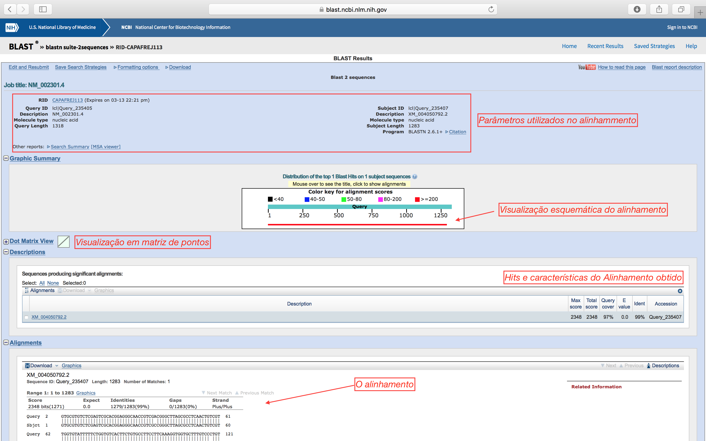
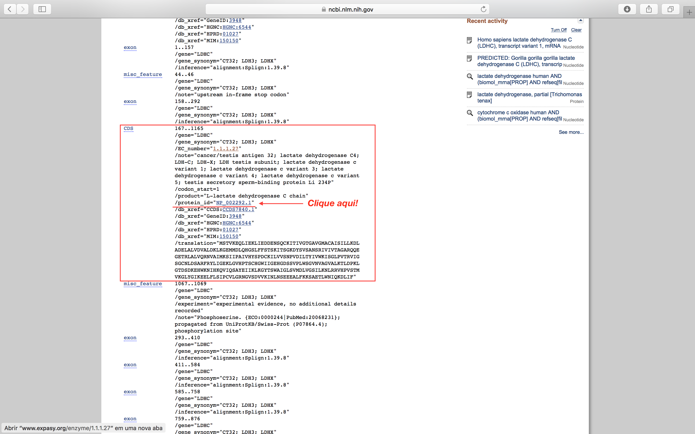
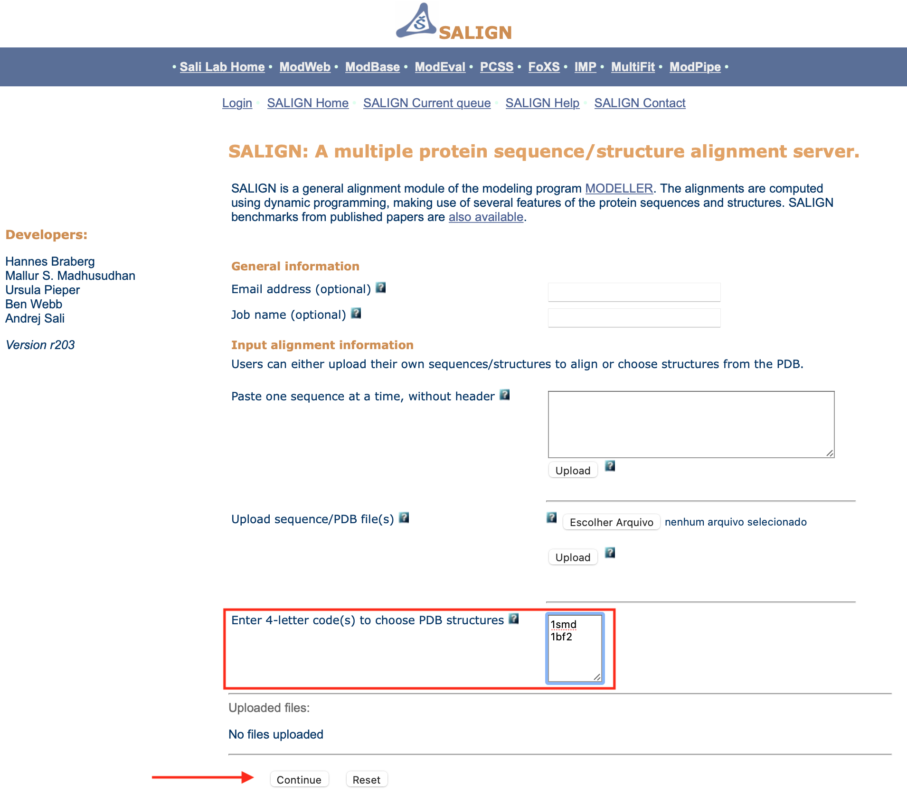

# Alinhamentos e busca de similaridade

Nos passos que seguem, você deverá aprender:

- Alinhamento entre pares de sequências de nucleotídeos e aminoácidos.
- Busca de similaridades entre sequências.
- Usar informações estruturais no alinhamento consultando outros bancos de dados.

> *Antes de realizar este tutorial, é importante que os tutoriais 103 (GenBank & Cia.) e 104 tenham sido realizados.*

**Observação:**

- Este tutorial foi construído ***apenas para fins didáticos***. <span style="color:red">**A reprodução dele para qualquer outro fim não é permitida e nem consentida.**</span>

## Entre pares de sequências (*Pairwise alignment*)

### Sequências de nucletídeos

Utilizando o BLAST, vamos alinhar as duas sequências abaixo, uma contra a outra. Como são sequências de nucleotídeos, teremos de usar inicialmente o BLASTN. 

Para isso abra a página do [*blastn 2 sequences*](https://blast.ncbi.nlm.nih.gov/Blast.cgi?PROGRAM=blastn&PAGE_TYPE=BlastSearch&BLAST_SPEC=blast2seq&LINK_LOC=blasttab&LAST_PAGE=blastp&BLAST_INIT=blast2seq).

>*Além do link direto acima, o alinhamento entre duas sequências utilizando o BLAST também pode ser alcançado diretamente da página inicial de qualquer um dos "sabores" do BLAST, basta clicar na caixa de seleção* ***"Align two or more sequences"*** *que fica logo abaixo do campo destinado a sequência* ***"Query"***.

Copie a sequência abaixo e cole no primeiro quadro:

```
>NM_002301.4
CGTGCGTGTCTCGAGTCGCACGGAGGGCAACCGTCGACGGGCTTAGCGCCTCAACTGTCGTTGGTGTATT
TTTCTGGTGTCACTTCTGTGCCTTCCTTCAAAGGTGGTGCTTTGTCCCTGTGGGTCATCTGTACTGATTG
CGCCAAGCAAAGCATTTGTTCTCCAAATGTCAACTGTCAAGGAGCAGCTAATTGAGAAGCTAATTGAGGA
TGATGAAAACTCCCAGTGTAAAATTACTATTGTTGGAACTGGTGCCGTAGGCATGGCTTGTGCTATTAGT
ATCTTACTGAAGGATTTGGCTGATGAACTTGCCCTTGTTGATGTTGCATTGGACAAACTGAAGGGAGAAA
TGATGGATCTTCAGCATGGCAGTCTTTTCTTTAGTACTTCAAAGATTACTTCTGGAAAAGATTACAGTGT
ATCTGCAAACTCCAGAATAGTTATTGTCACAGCAGGTGCAAGGCAGCAGGAGGGAGAAACTCGCCTTGCC
CTGGTCCAACGTAATGTGGCTATAATGAAATCAATCATTCCTGCCATAGTCCATTATAGTCCTGATTGTA
AAATTCTTGTTGTTTCAAATCCAGTGGATATTTTGACATATATAGTCTGGAAGATAAGTGGCTTACCTGT
AACTCGTGTAATTGGAAGTGGTTGTAATCTAGACTCTGCCCGTTTCCGTTACCTAATTGGAGAAAAGTTG
GGTGTCCACCCCACAAGCTGCCATGGTTGGATTATTGGAGAACATGGTGATTCTAGTGTGCCCTTATGGA
GTGGGGTGAATGTTGCTGGTGTTGCTCTGAAGACTCTGGACCCTAAATTAGGAACGGATTCAGATAAGGA
ACACTGGAAAAATATCCATAAACAAGTTATTCAAAGTGCCTATGAAATTATCAAGCTGAAGGGGTATACC
TCTTGGGCTATTGGACTGTCTGTGATGGATCTGGTAGGATCCATTTTGAAAAATCTTAGGAGAGTGCACC
CAGTTTCCACCATGGTTAAGGGATTATATGGAATAAAAGAAGAACTCTTTCTCAGTATCCCTTGTGTCTT
GGGGCGGAATGGTGTCTCAGATGTTGTGAAAATTAACTTGAATTCTGAGGAGGAGGCCCTTTTCAAGAAG
AGTGCAGAAACACTTTGGAATATTCAAAAGGATCTAATATTTTAAATTAAAGCCTTCTAATGTTCCACTG
TTTGGAGAACAGAAGATAGCAGGCTGTGTATTTTAAATTTTGAAAGTATTTTCATTTGATCTTTAAAAAA
TAAAAACAAATTGGAGACCTGTGAAAAAAAAAAAAAAAAAAAAAAAAAAAAAAAAAAA
```
Agora, copie a sequência abaixo e cole no segundo quadro:

```
>XM_004050792.2
GTGCGTGTCTCGAGTCGCACGGAGGGCAACCGTCGCCGGGCTTAGCGCCTCAACTGTCGTTGGTGTATTT
TTCTGGTGTCACTTCTGTGCCTTCCTTCAAAGGTGGTGCTTTGTCCTTGTGGGTCATCTGTACTGATTGC
GCCAAGCAAAGCATTTGTTCTCCAAATGTCAACTGTCAAGGAGCAGCTAATTGAGAAGCTAATTGAGGAT
GATAAAGACTCCCAGTGTAAAATTACTATTGTTGGAACTGGTGCCGTAGGCATGGCTTGTGCTATTAGTA
TCTTACTGAAGGATTTGGCTGATGAACTTGCCCTTGTTGATGTTGCATTGGACAAACTGAAGGGAGAAAT
GATGGATCTTCAGCATGGCAGTCTTTTCTTTAGTACTTCAAAGATTACTTCTGGAAAAGATTACAGTGTA
TCTGCAAACTCCAGAATAGTTATTGTCACAGCAGGTGCAAGGCAGCAGGAGGGAGAAACTCGCCTTGCCC
TGGTCCAACGTAATGTGGCTATAATGAAATCAATCATTCCTGCCATAGTCCATTATAGTCCTGATTGTAA
AATTCTTGTTGTTTCAAATCCAGTGGATATTTTGACATATATAGTCTGGAAGATAAGTGGCTTACCTGTA
ACTCGTGTAATTGGAAGTGGTTGTAATCTAGACTCTGCCCGTTTCCGTTACCTAATTGGAGAAAAGTTGG
GTGTCCACCCCACAAGCTGCCATGGTTGGATTATTGGAGAACATGGTGATTCTAGTGTGCCCTTATGGAG
TGGGGTGAATGTTGCTGGTGTTGCTCTGAAGACTCTGGACCCTAAATTAGGAACGGATTCAGATAAGGAA
CACTGGAAAAATATCCATAAACAAGTTATTCAAAGTGCCTATGAAATTATCAAGCTGAAGGGGTATACCT
CTTGGGCTATTGGACTGTCTGTGATGGATCTGGTAGGATCCATTTTGAAAAATCTTAGGAGAGTGCACCC
AGTTTCCACCATGGTTAAGGGATTATATGGAATAAAAGAAGAACTCTTTCTCAGTATCCCTTGTGTCTTG
GGGCGGAATGGTGTCTCAGATGTTGTGAAAATTAACTTGAATTCTGAGGAGGAGGCCCTTTTCAAGAAGA
GTGCAGAAACACTTTGGAATATTCAAAAGGATCTAATATTTTAAATTAAAGCCTTCTAATGTTCCACTGT
TTGGAGAACAGAAGATAGCAGGCTGTGTATTTTAAATTTTGAAAGTATTTTCATTTGATCTTTAAAAAAT
AAAAACAAATTGGAGACCTGTGA
```
Deixe o resto das opções da forma como estão e clique em **BLAST**.

> *É sempre recomendável clicar na caixa de seleção* ***"Show results in a new window"****, para que os resultados sejam visualizados em uma nova janela/aba.*

Após alguns minutos, você deverá ter um resultado como o descrito abaixo. Clique no local indicado para trocar para a página tradicional de resultados do BLAST:


- Na página tradicional, os resultados ficam mais acessíveis e são explicados na figura abaixo:



Neste caso, onde os identificadores da sequência (o nome que vem depois do ```>```) são os códigos de registro do GenBank, o mesmo procedimento acima pode ser realizado, colocando apenas a descrição de cada sequência (sem o identificador ```>```) nos campos da ***Query***. Basta colocar ```NM_002301.4``` no 1º campo e ```XM_004050792.2``` no 2º campo. Assim, a tela de resultados já retornará links para consulta direta a anotação das sequências.

**Perguntas:**

1. Você considera este alinhamento bom? Justifique utilizando os parâmetros do BLAST.
2. Observe quantas diferenças existem entre estas duas sequências e onde elas estão.
3. Sendo sequências de mRNA, você diria que os produtos proteicos delas possuem função relacionada?

### Sequências de aminoácidos

Vamos agora abrir e verificar o registro do Genbank destas sequências. Para facilitar, abaixo estão os links direto para as entradas (abra em abas diferentes):

- [NM_002301.4](https://www.ncbi.nlm.nih.gov/nuccore/NM_002301.4)
- [XM_004050792.2](https://www.ncbi.nlm.nih.gov/nuccore/XM_004050792.2)

Vamos agora verificar nas entradas destas sequências, a região codificante para a proteína (CDS). Esta estará descrita nas *features*, de acordo com a figura abaixo:

- Role a página até encontrar **CDS**:



- Clique no local identificado na figura acima.

Agora você tem a sequência de aminoácidos da proteína resultante. Faça o mesmo para obter a sequência de aminoácidos que a outra sequência (XM_004050792.2) codifica.

Vamos alinhar as duas sequências de aminoácidos agora, utilizando o blast2sequences, na variação [BLASTp](https://blast.ncbi.nlm.nih.gov/Blast.cgi?PAGE=Proteins&PROGRAM=blastp&BLAST_PROGRAMS=blastp&PAGE_TYPE=BlastSearch&BLAST_SPEC=blast2seq&DATABASE=n/a&QUERY=&SUBJECTS=).

**Perguntas:**

4. Todas as diferenças encontradas no alinhamento das sequências de mRNA são encontradas nas sequências de aminoácidos?
5. Você afirmaria que as trocas observadas dos aminoácidos influenciariam a estrutura da proteína? Explique.  

## Importância das informações estruturais em alinhamentos de aminoácidos

Considere que você esteja trabalhando com a seguinte sequência de uma amilase:

```
>1smd
GRTSIVHLFEWRWVDIALECERYLAPKGFGGVQVSPPNENVAIHNPFRPWWERYQPVSYK
LCTRSGNEDEFRNMVTRCNNVGVRIYVDAVINHMCGNAVSAGTSSTCGSYFNPGSRDFPA
VPYSGWDFNDGKCKTGSGDIENYNDATQVRDCRLSGLLDLALGKDYVRSKIAEYMNHLID
IGVAGFRIDASKHMWPGDIKAILDKLHNLNSNWFPEGSKPFIYQEVIDLGGEPIKSSDYF
GNGRVTEFKYGAKLGTVIRKWNGEKMSYLKNWGEGWGFMPSDRALVFVDNHDNQRGHGAG
GASILTFWDARLYKMAVGFMLAHPYGFTRVMSSYRWPRYFENGKDVNDWVGPPNDNGVTK
EVTINPDTTCGNDWVCEHRWRQIRNMVNFRNVVDGQPFTNWYDNGSNQVAFGRGNRGFIV
FNNDDWTFSLTLQTGLPAGTYCDVISGDKINGNCTGIKIYVSDDGKAHFSISNSAEDPFI
AIHAESKL
```

Os 3 resíduos que formam o sítio ativo da proteína e são essenciais à catálise são: **D** (...FRI**D**AS...), **E** (...YQ**E**VID...) e **D** (...NH**D**NQR...). Você pode obter mais informações desta sequência no **UniProtKB**, com o código [P04745](http://www.uniprot.org/uniprot/P04745).

Considere ainda que você conhece a proteína abaixo e sabe que se trata de uma amilase:

```
>1bf2
DVIYEVHVRGFTEQDTSIPAQYRGTYYGAGLKASYLASLGVTAVEFLPVQETQNDANDVV
PNSDANQNYWGYMTENYFSPDRRYAYNKAAGGPTAEFQAMVQAFHNAGIKVYMDVVYNHT
AEGGTWTSSDPTTATIYSWRGLDNATYYELTSGNQYFYDNTGIGANFNTYNTVAQNLIVD
SLAYWANTMGVDGFRFDLASVLGNSCLNGAYTASAPNCPNGGYNFDAADSNVAINRILRE
FTVRPAAGGSGLDLFAEPWAIGGNSYQLGGFPQGWSEWNGLFRDSLRQAQNELGSMTIYV
TQDANDFSGSSNLFQSSGRSPWNSINFIDVHDGMTLKDVYSCNGANNSQAWPYGPSDGGT
STNYSWDQGMSAGTGAAVDQRRAARTGMAFEMLSAGTPLMQGGDEYLRTLQCNNNAYNLD
SSANWLTYSWTTDQSNFYTFAQRLIAFRKAHPALRPSSWYSGSQLTWYQPSGAVADSNYW
NNTSNYAIAYAINGPSLGDSNSIYVAYNGWSSSVTFTLPAPPSGTQWYRVTDTCDWNDGA
STFVAPGSETLIGGAGTTYGQCGQSLLLLISK
```

>*O registro do SwissProt para esta sequência [P10342](http://www.uniprot.org/uniprot/P10342) mostrará que é realmente uma amilase, no entanto, iremos considerar que não temos esta informação.*

Para identificar possíveis resíduos candidatos na sequência 1bf2 que podem participar do sítio ativo, faremos alinhamento com 2 diferentes algorítmos: o do BLAST e o do Smith-Waterman. 

- Obtenha o alinhamento das sequências acima utilizando o blast2sequences, na variação [BLASTp](https://blast.ncbi.nlm.nih.gov/Blast.cgi?PAGE=Proteins&PROGRAM=blastp&BLAST_PROGRAMS=blastp&PAGE_TYPE=BlastSearch&BLAST_SPEC=blast2seq&DATABASE=n/a&QUERY=&SUBJECTS=).

- Obtenha o alinhamento também com o algorítmo [Smith-Waterman](http://www.ebi.ac.uk/Tools/psa/emboss_water/) do EBI (*European Bioinformatics Institute*).

Vamos agora comparar os resultados obtidos a um alinhamento baseado em estrutura. Neste, os resíduos de aminoácidos são alinhados de acordo com a sua posição na estrutura tridimensional da proteína (portanto, só é possível quando as duas sequências possuem estruturas resolvidas). Isto pode ser realizado utilizando o [SALIGN](http://modbase.compbio.ucsf.edu/salign/), vinculado a [ModWeb](http://modbase.compbio.ucsf.edu/modweb/), um servidor para modelagem computacional de proteínas do grupo que criou o programa Modeller ([SaliLab](http://salilab.org)): 

- Coloque os códigos 1smd e 1bf2, em cada linha, no campo “*Enter 4-letter code(s) to choose PDB structures*”, de acordo como demonstrado nas figuras abaixo.
- Clique em ```Continue```.



> *Os resultados podem demorar alguns minutos para aparecerem.*

- O arquivo deste alinhamento pode ser baixado [AQUI](https://drive.google.com/uc?id=1SPFai_F7-rHWI-vWROFx6VLmAs9WghQP).

- Abra o arquivo do alinhamento no ClustalX ou no Jalview (veja o tutorial 104).

Analise cuidadosamente cada um dos alinhamentos obtidos. Verifique a diferença entre o alinhamento do BLAST e os algoritmos de SW e do SALIGN.

**Pergunta:**

6. Os alinhamentos de sequência e de estrutura identificam os mesmos resíduos em 1bf2 como equivalentes aos resíduos do sítio ativo em 1smd?


## Questões desafios

1. Em qual janela (*frame*) está codificada a proteína nas sequências ```NM_002301.4``` e ```XM_004050792.2```?
2. Os *gaps* no alinhamento estrutural tendem a ser associados com elementos de estrutura secundária (alfa-hélices ou fitas-beta) ou regiões de loop? Justifique.