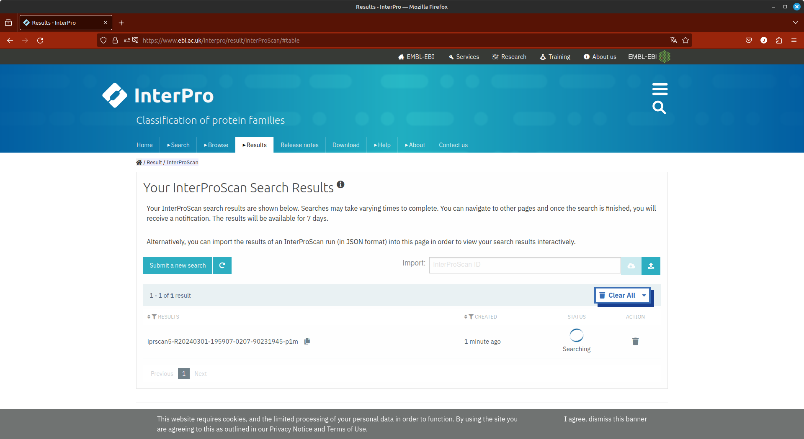

# Bancos de dados de informação proteica

**Objetivos**

- Usar os diferentes bancos de dados de informação de proteínas.
- Caracterizar proteínas desconhecidas utilizando não apenas a sequência, mas perfis, motivos e domínios.
- Obter informações sobre a família de uma determinada proteína.
- Obter alinhamentos e matrizes de posicionamento específicas para uma família de proteínas.
- Verificar alergenicidade em proteínas.
- Verificar regiões de determinada proteína que podem ser epitopos para células B e T.

**Observação:**

- Este tutorial foi construído ***apenas para fins didáticos***. <span style="color:red">**A reprodução dele para qualquer outro fim não é permitida e nem consentida.**</span>

## Identificação de Proteínas utilizando o UniPROT

O UniProt é uma base de conhecimento de referência para a obtenção de informação de proteínas, com *links* e informações cruzadas para diversos outros bancos de dados. É normalmente nele que as primeiras informações de uma determinada proteína são obtidas.

### Quando utilizar o Uniprot?

- Para obter informações gerais sobre uma proteína.
- Registro de anotação mais completo para proteínas únicas.
- Swiss-Prot: proteínas anotadas e revisadas, com intervenção humana.
- Para realizar busca de similaridade com proteínas conhecidas.
- Encontrar homólogos curados e já confirmados experimentalmente.
- Encontrar dados relacionados a mutantes naturais e variações associadas a doenças ou fenótipos alterados.
- Obter informações sobre a estrutura e resíduos importantes para a atividade/função.

Buscas de similiaridade utilizando o BLAST também poderão ser realizadas diretamente no site do UniProt. Vamos a um exemplo?

- Abrir a Home Page do UNIPROT: [http://www.uniprot.org](http://www.uniprot.org).

- Clicar no link **BLAST** (Canto superior esquerdo).


- Copiar e colar a sequência abaixo no campo *Query*:

```shell
>Seq5
MASFTTTTAAAASRLLPSSSSSISRLSLSSSSSSSSSLKCLRSSPLVSHLFLRQRGGSAYVTKTRFSTKC
YASDPAQLKNAREDIKELLQSKFCHPIMVRLGWHDAGTYNKDIKEWPQRGGANGSLSFDVELRHGANAGL
VNALKLLQPIKDKYSGVTYADLFQLASATAIEEAGGPTIPMKYGRVDATGPEQCPEEGRLPDAGPPSPAQ
HLRDVFYRMGLDDKDIVALSGAHTLGRSRPERSGWGKPETKYTKDGPGAPGGQSWTAEWLKFDNSYFKDI
KEKRDADLLVLPTDAALFEDPSFKVYAEKYAADQEAFFKDYAEAHAKLSNQGAKFDPAEGITLNGTPAGA
APEKFVAAKYSSNKRSELSDSMKEKIRAEYEGFGGSPNKPLPTNYFLNIMIVIGVLAVLSYLAGN
```

- Clicar em BLAST, e após o aparecimento dos resultados, analisar a tabela de hits (Sequências similares ou iguais presentes no banco de dados).

- Verificar os 6 primeiros *Hits*.

- Clique no primeiro *hit* e verifique a estrutura das informações contidas no Uniprot.

## Obtendo informações sobre estrutura proteíca no UniProt:

Abrir novamente o site do UniProt: [http://www.uniprot.org](http://www.uniprot.org)

- No campo Query, inserir o termo **PGH2_MOUSE**.

- Observar os resultados.

- Em uma outra janela/aba do navegador, na mesma página acima, faça a busca pelo termo **GYS2_HUMAN**.

- Observe os resultados e veja a quantidade de informações presentes para estas proteínas.

### Importante

O UniProt possui duas formas de especificar o registro de uma proteína: o [*Entry name*](https://www.uniprot.org/help/entry_name) e o [*Accession number*](https://www.uniprot.org/help/accession_numbers). O primeiro é uma forma rápida para memorizar uma determinada entrada, mas não é estável. Já o segundo é estável e é o registro que deve ser utilizado em publicações ou trabalhos científicos. Utilizamos acima o *entry name*. Mais informações sobre como as informações de um registro do UniProt estão organizadas podem ser obtidas em seu [Manual](https://www.uniprot.org/help/uniprotkb_manual).

## Explorando o *Protein Data Bank*

O RCSB PDB é o principal banco de estruturas de proteínas resolvidas experimentalmente. É dele que retiramos as proteínas molde para realização de modelagem comparativa.


#### Quando utilizar o PDB?

- Para obter estruturas de proteínas resolvidas experimentalmente.
- Para obter informações estruturais sobre uma proteína.
- Para verificar e encontrar estruturas proteicas homólogas.
- Para obter informações sobre sítios importantes para a atividade enzimática.
- Obter informações sobre os ligantes das proteínas.

Vamos agora verificar o registro de uma entrada no banco PDB:

- Abrir a Home Page do Protein Data Bank (PDB): [www.rcsb.org](www.rcsb.org)
- No campo “PDB ID or Text” insira o termo: [3HTB](www.rcsb.org/structure/3HTB)
- A partir da página aberta, obter as seguintes informações:
  
  - Identificação da Proteína.
  - Organismo Fonte.
  - Número de Cadeias Polipeptídicas.
  - Método Experimental pelo qual o modelo foi obtido.
  - Outras estruturas relacionadas.
  - Mutações encontradas (se existirem).
  - Clicar na estrutura e observar o modelo 3D utilizando a ferramenta Jmol.

O registro de uma estrutura no banco PDB está sempre vinculado a um *Accession number* desta proteína no UniProt. Portanto, ao abrir o registro a partir do código PDB, um link direto para o registro no UniProt estará descrito abaixo da parte *Macromolecules*.

> *Existe um arquivo que é frequentemente atualizado que faz a indexação entre os Uniprot Accession number e o código PDB de uma proteína no Protein Databank. O nome desse arquivo é pdbtosp.txt e pode ser obtido [AQUI](https://www.uniprot.org/docs/pdbtosp).* *Utilizando linguagens de script ou até mesmo comandos "Localizar/Buscar" em programas de edição de texto, você rapidamente faz um levantamento das estruturas experimentalmente resolvidas de uma proteína com o Accession number do Uniprot.*

## Identificando os domínios de uma proteína

Vamos agora identificar a arquitetura dos domínios que esta proteína abaixo possui e a família a qual pertence. 

```shell
>1smd
GRTSIVHLFEWRWVDIALECERYLAPKGFGGVQVSPPNENVAIHNPFRPWWERYQPVSYK
LCTRSGNEDEFRNMVTRCNNVGVRIYVDAVINHMCGNAVSAGTSSTCGSYFNPGSRDFPA
VPYSGWDFNDGKCKTGSGDIENYNDATQVRDCRLSGLLDLALGKDYVRSKIAEYMNHLID
IGVAGFRIDASKHMWPGDIKAILDKLHNLNSNWFPEGSKPFIYQEVIDLGGEPIKSSDYF
GNGRVTEFKYGAKLGTVIRKWNGEKMSYLKNWGEGWGFMPSDRALVFVDNHDNQRGHGAG
GASILTFWDARLYKMAVGFMLAHPYGFTRVMSSYRWPRYFENGKDVNDWVGPPNDNGVTK
EVTINPDTTCGNDWVCEHRWRQIRNMVNFRNVVDGQPFTNWYDNGSNQVAFGRGNRGFIV
FNNDDWTFSLTLQTGLPAGTYCDVISGDKINGNCTGIKIYVSDDGKAHFSISNSAEDPFI
AIHAESKL
```

Para isto, iremos utilizar primeiramente o banco [CDD](https://www.ncbi.nlm.nih.gov/Structure/cdd/cdd.shtml) (*Conserved Domain Databases*), o qual é vinculado ao NCBI. A ferramenta que faz esta identificação é o [SPARCLE](https://www.ncbi.nlm.nih.gov/sparcle) (*Subfamily Protein Architecture Labeling Engine*), que é um recurso que caracteriza funcionalmente e rotula sequências de proteínas que foram agrupadas por sua arquitetura de domínio conservado. Uma arquitetura de domínio é definida como a ordem sequencial de domínios conservados numa sequência de proteínas (CDD-NCBI).

### Quando usar o CDD?

- Para procurar domínios conservados de proteínas.
- Encontrar informações sobre famílias de proteínas.
- Inclusive superfamílias e subfamílias.
- Para obter matrizes PSSM específicas para cada família de proteína.
- Para obter alinhamentos entre representantes de cada família.
- Entre os mais distantes e os mais representativos.
- Verificar relações de proximidade entre as famílias proteicas.

A utilização do SPARCLE pode ser realizada de duas maneiras: a partir de uma sequência de aminoácidos ou por uma palavra-chave. Para utilizar a partir da sequência, utilizaremos o [CD-Search](https://www.ncbi.nlm.nih.gov/Structure/cdd/wrpsb.cgi):

Abra o [CD-Search](https://www.ncbi.nlm.nih.gov/Structure/cdd/wrpsb.cgi).
Copie a sequência fasta ```1smd``` na caixa de consulta, como indicado na figura abaixo:


Deixe as opções já marcadas no campo ***Options***.
Clique em ***Submit***.

O primeiro resultado que é retornado é uma tela como a seguinte:


Nesta, podem ser identificados:

- A classificação da proteína (*Protein Classification*), com o link para o ID da arquitetura do domínio (do SPARCLE).
- A superfamília (*Superfamilies*) e os hits específicos (*Specific hits*) dentro desta superfamília.
- Os domínios identificados (*Domain hits*).

> **Pergunta**: *Quantos domínios esta proteína apresenta?*

Na lista de domínios clique no primeiro e veja a descrição da família que contém este domínio. É uma tela como a representada abaixo:


Role esta página até que o alinhamento de proteínas pertencentes a este CD seja mostrado. A opção padrão é o alinhamento dos membros mais diversos (*most diverse members*), ou seja, aqueles que apresentam sequências menos similares.

Três resíduos (tríade DED) são importantes para a atividade catalítica desta proteína e podem ser evidenciados ao clicar na aba *Catalytic Site*. Eles serão destacados no alinhamento obtido mais abaixo nesta página.

> ***Podemos afirmar que os resíduos marcados são realmente característicos desta família?***
> 
> *Sim. Isto pode ser verificado ao clicar em* ***catalytic site***, na caixa ***Conserved Features/Sites***.

O código da matriz de escores de posicionamento específico (PSSM) para esta família pode ser obtida na caixa ***Statistics***, presente na lateral esquerda. 

## Usando o InterPro

O [Pfam](http://pfam-legacy.xfam.org/) era banco para obtenção de informações, funcionais, de famílias proteicas e domínios. No entanto, ele deixou de ser atualizado e suas funcionalidades (ainda que não completamente) e dados alimentam agora o [Interpro](https://www.ebi.ac.uk/interpro/). Além da classificação das proteínas em famílias, você poderá também obter modelos HMMs (*Hidden Markov Models*) para classificação dessas famílias.

> ***HMMs:*** *É um modelo estatístico para qualquer sistema que pode ser representado como uma sucessão de transições entre estados discretos.*

### Quando usar o Interpro?

- Obter informações de famílias proteicas e domínios.
- Obter informações funcionais.
- Obter alinhamentos múltiplos de sequências de proteínas de uma mesma família.
- Obter perfis (profiles) *Hidden Markov Models*.
- Obter informações sobre a estrutura e resíduos importantes para a atividade.
- Obter informações ligadas com outros bancos de dados biológicos.

Nesta parte, também utilizaremos a sequência ```1smd```. Para isso siga os passos abaixo:



- Abra a página do [Interpro](https://www.ebi.ac.uk/interpro/).
- Clique em ***Sequence Search***.
- Copie a sequência da proteína ```1smd``` no campo indicado.
- Espere os resultados.

A primeira página de resultados será a seguinte:


- Clique agora no link correspondente a família das alfa-amilases.
- Observe todos os resultados, clicando no menu de navegação a direita.
- O código [**InterPro**](http://www.ebi.ac.uk/interpro/) para esta família proteica, que é [IPR006046](https://www.ebi.ac.uk/interpro/entry/InterPro/IPR006046/).


## Usando o PROSITE

O banco de dados [PROSITE](http://prosite.expasy.org) é um outro banco muito útil para obter informações funcionais e de famílias proteicas e domínios. 

### Quando o usar o PROSITE?

- Para obter informações de famílias proteicas e domínios.
- Para obtenção de informações funcionais.
- Obter as assinaturas de sequência que caracterizam as famílias de proteínas.
- Usar para buscas de similaridade utilizando o PHI-BLAST.

Para este exemplo, iremos utilizar a sequência abaixo:

```
>Enzyme_Test_1
MVKIVTVKTQAYQDQKPGTSGLRKRVKVFQSSANYAENFIQSIISTVEPAQRQEATLVVGGDGRFYMKEAIQLIARIA
AANGIGRLVIGQNGILSTPAVSCIIRKIKAIGGIILTASHNPGGPNGDFGIKFNISNGGPAPEAITDKIFQISKTIEE
YAVCPDLKVDLGVLGKQQFDLENKFKPFTVEIVDSVEAYATMLRSIFDFSALKELLSGPNRLKIRIDAMHGVVGPYVK
KILCEELGAPANSAVNCVPLEDFGGHHPDPNLTYAADLVETMKSGEHDFGAAFDGDGDRNMILGKHGFFVNPSDSVAV
IAANIFSIPYFQQTGVRGFARSMPTSGALDRVASATKIALYETPTGWKFFGNLMDASKLSLCGEESFGTGSDHIREKD
GLWAVLAWLSILATRKQSVEDILKDHWQKYGRNFFTRYDYEEVEAEGANKMMKDLEALMFDRSFVGKQFSANDKVYTV
EKADNFEYSDPVDGSISRNQGLRLIFTDGSRIVFRLSGTGSAGATIRLYIDSYEKDVAKINQDPQVMLAPLISIALKV
SQLQERTGRTAPTVIT
```

### Passo a Passo

- Abra a página inicial do [PROSITE](http://prosite.expasy.org).
- Na caixa ***Quick Scan mode of ScanProsite***, cole a sequência acima.


- Marque a opção ***Exclude motifs with a high probability of occurrence from the scan***.

> *Esta opção serve para excluir motivos lineares na sequência proteica que são muito comuns, em inúmeras proteínas.*

- Clique em ***Scan***.
- Observe os resultados, que devem estar de acordo com a figura abaixo:


Os resultados mostram que entre as posições 111 e 120 há a assinatura de enzimas do tipo fosfoglucomutase e fosfomannomutase fosfoserine. Clique no link indicado acima ([PS00710](http://prosite.expasy.org/cgi-bin/prosite/nicedoc.pl?PS00710)) e veja as informações deste motivo.

Nesta mesma página, mais abaixo, temos um quadro denominado ***PGM_PMM, PS00710; Phosphoglucomutase and phosphomannomutase phosphoserine signature  (PATTERN)***. Nele temos o seguinte consenso padrão:

```shell
Consensus pattern:
[GSA]-[LIVMF]-x-[LIVM]-[ST]-[PGA]-S-H-[NIC]-P
```

Esta é assinatura PROSITE deste tipo de proteínas. Ela pode ser usada em uma busca PHI-BLAST ([ver tutorial Buscas de Similaridade](104.md)) para identificar proteínas que tenham esta assinatura em buscas de similaridade utilizando o BLAST. 

### Vamos a um exemplo?

Você quer verificar quais proteínas obtidas a partir de amostras ambientais de metagenomas possuem esta assinatura de fosfoglicomutase, para uma possível aplicação biotecnológica. Para isso, siga os passos abaixo (acompanhe também pela figura):


- Utilize o [BLASTp](https://blast.ncbi.nlm.nih.gov/Blast.cgi?PROGRAM=blastp&PAGE_TYPE=BlastSearch&LINK_LOC=blasthome), para executar uma busca contra o banco **env_nr** (*Metagenomic proteins*). Não esqueça de colar a sequência ```Enzyme_Test_1``` no campo de busca.
- Na seção ***Program Selection*** selecione PHI-BLAST. Ao clicar em PSI-BLAST, uma caixa abaixo é aberta. Nela você insere a assinatura PROSITE acima. 
- Clique em BLAST e espere os resultados (Pode demorar!!!).
- Verifique os resultados.

> *Pelos resultados, há algo promissor para aplicação?*

## Qual banco utilizar?

Esta não é uma pergunta trivial. É importante que você explore as informações disponíveis em cada banco e extraia o máximo de informações sobre a proteína de interesse. Como pode ser notado, embora exista uma redundância nas informações disponíveis, cada banco tem sua especificidade e particularidade.