# Modelagem Comparativa de Proteínas

Uma pequena introdução a modelagem computacional de proteínas. As etapas aqui utilizam o processo de modelagem por homologia clássico. Hoje, a utilização do AlphaFold é recomendada. A utilização do AlphaFold é abordada no tutorial Modelagem de proteínas utilizando abordagens de IA.

## Descrição do Tutorial

### Objetivos

*Geral*

Entender os princípios e etapas necessárias para a modelagem comparativa de uma proteína

*Específicos*

- Obter informações sobre uma proteína a partir da sequência.
- Identificar a partir de buscas de similaridade contra o banco *pdb* possíveis *templates* (moldes) para serem utilizados para uma modelagem comparativa.
- Realizar uma modelagem comparativa utilizando o programa Modeller (1), a partir de uma interface com o UCSF Chimera (2).
- Fazer uma primeira inspeção dos modelos obtidos e avaliar a sua qualidade.

### Indicações

Este tutorial é indicado para a modelagem básica de uma proteína, levando em conta as seguintes condições:

- Partindo de sequências-alvo (*target*) com mais de 60% de similaridade com proteínas molde (*templates*) retiradas do banco PDB.
- Proteínas abaixo desse limiar de similaridade, desde que tenham um único domínio conservado.
- Proteínas que não apresentem baixa similaridade com os possíveis *templates* em suas regiões N ou C-terminal.

**Observação:**

- Este tutorial foi construído ***apenas para fins didáticos***. <span style="color:red">**A reprodução dele para qualquer outro fim não é permitida e nem consentida.**</span>

### Definições Iniciais

Na modelagem por homologia, sempre modelamos uma proteína cuja a estrutura normalmente* não é conhecida a partir da comparação da sua sequência primária com as sequências de proteínas que possuam estrutura resolvida experimentalmente, que são chamadas de **moldes** (*templates*). Neste tutorial, a proteína que se deseja modelar a partir de sua sequência primária é chamada de **proteína-alvo** ou **sequência-alvo** (do inglês *target*).

> *Por que "normalmente"?*
> 
> *Existem casos onde precisamos modelar proteínas que já tenham sua estrutura conhecida, como por exemplo: modelar mutações ou SNPs, prever modificações na estrutura por meio da engenharia genética, etc.*

## Instalação e execução do UCSF Chimera

O UCSF Chimera é um programa escrito em Python com várias funções para o trabalho com proteínas e outras estruturas supramoleculares. É uma ferramenta acessível, no entanto, seu desenvolvimento foi parado em definitivo. O mesmo grupo desenvolve uma nova ferramenta mais moderna chamada ChimeraX. Nem todas as funções do UCSF Chimera foram ainda implementadas no ChimeraX, embora este último tenha novas funções como a possibilidade de modelar proteínas usando abordagens de modelagem mais recentes, como a do AlphaFold.

### Linux - sem privlégios de root

UCSF Chimera é um programa bastante versátil para a visualização e edição de moléculas pequenas e macromoléculas. Para instalar será necessário baixar o programa em:

[https://www.cgl.ucsf.edu/chimera/download.html](https://www.cgl.ucsf.edu/chimera/download.html). 

- Após baixar, vá ao terminal e vá até a pasta onde o arquivo de instalação foi baixado (normalmente a pasta Downloads).

```shell
cd Downloads
chmod a+x chimera-1.17.3-linux_x86_64.bin 
```

> *Pode ser que a versão do programa mude, fique atento. Evite fazer o download de versões Release Candidate, pois estas ainda podem conter diversos bugs.*

Agora basta executar para instalar:

```shell
./chimera-1.17.3-linux_x86_64.bin
```

- Direcione a instalação para uma pasta dentro da sua ```home```
- Responda ***No*** para a pergunta abaixo:

```shell
Install symbolic link to chimera executable for command line use in which directory?
```

- Responda ***Yes*** para instalar a opção de atalho no desktop.

Desta forma, você só conseguirá executar o UCSF Chimera pelo ícone da área de trabalho, ou descrevendo o caminho inteiro do executável.

#### Com privilégios de root

Após tornar o arquivo do instalador do UCSF Chimera executável (primeiros passos acima), basta você digitar executar o arquivo com o comando ```sudo```:

```shell
sudo ./chimera-1.17.3-linux_x86_64.bin
```

- Vão aparecer algumas perguntas, basta pressionar ```Enter```, mas uma em especial garante que o programa fique fácil de executar:

```shell
Install symbolic link to chimera executable for command line use in which directory?
```

- Escolha a opção 2 ```- /usr/local/bin```, se você usar o Ubuntu ou similar.
- Responda ***Yes*** para instalar a opção de atalho no desktop.

Neste tipo de instalação, você poderá também executar o UCSF Chimera digitando no terminal o seguinte comando:

```shell
chimera
```

### Ambientes Windows ou MacOS

Instaladores para ambos os sistemas estão disponíveis na página de Download do UCSF Chimera. Após o download, dê um duplo clique e siga as instruções de instalação.

> *Para instalar no Windows sem privilégios de usuário administrador, basta direcionar a pasta de instalação do UCSF Chimera para uma pasta do seu usuário.*

## Obtendo informações da Sequência Alvo (*Target Sequence*)

A proteína *target* (alvo) que iremos utilizar em uma modelagem é a proteína superóxido dismutase da espécie *Drosophila melanogaster* (mosca da fruta). O código Uniprot desta proteína é [P61851](http://www.uniprot.org/uniprot/P61851). A sequência fasta dessa proteína está descrita abaixo:

```shell
>SODC_DROME
MVVKAVCVINGDAKGTVFFEQESSGTPVKVSGEVCGLAKGLHGFHVHEFGDNTNGCMSSG
PHFNPYGKEHGAPVDENRHLGDLGNIEATGDCPTKVNITDSKITLFGADSIIGRTVVVHA
DADDLGQGGHELSKSTGNAGARIGCGVIGIAKV
```

> *Salve esta sequência em um arquivo de texto puro, com a terminação .fasta., pois ele será necessário depois.*

Observe com atenção todos os campos do registro do Uniprot, principalmente:

- Organismo.
- Função.
- Atividade Catalítica.
- Via Metabólica.
- Sítios importantes e ligantes.
- Localização subcelular.
- Interações com outras proteínas.

> *Esta será a proteína que irás modelar, usando a abordagem de modelagem comparativa, especificamente utilizando proteínas homólogas*

## Procurando por moldes (*Templates*) e Modelando no Swiss-Model

Para obter informações sobre prováveis moldes para a proteína, temos de fazer uma busca de similaridade usando o BLAST, contra o banco de dados do pdb. A primeira pergunta a ser respondida é se existem proteínas com estruturas tridimensionais resolvidas experimentalmente (cristalografia, RMN, etc.) que apresentam similaridade suficiente para que a modelagem da ```SODC_DROME``` seja realizada.

Siga os passos:

1. Abrir a Home Page do NCBI: [www.ncbi.nlm.nih.gov](www.ncbi.nlm.nih.gov)

2. Clicar no link **BLAST** (Na lateral direita ou ir diretamente em [www.ncbi.nlm.nih.gov/blast](www.ncbi.nlm.nih.gov/blast)).

3. Clicar em *protein BLAST* (BLASTP).

4. Copiar e colar a sequência alvo no campo *Query*.

5. Não esqueça de selecionar o banco pdb.

6. Verifique os resultados. 

#### Perguntas de direcionamento:

Na busca por moldes, as seguintes perguntas devem ser sempre respondidas:

a) Existem moldes (*templates*) para esta proteína? Observe sempre a similaridade e a cobertura da sequência.

b) Os moldes presentes são adequados para o processo de modelagem comparativa? Veja a resolução e o método experimental usado para resolver a estrutura do molde (clicando nos resultados).

c) Quais dos possíveis moldes você utilizará? Ou seja, a partir das informações acima, qual(is) molde(s) você escolheria?

É comum também fazermos exaustivas buscas de informações sobre as proteínas molde que iremos utilizar.

> *Observações:*
> 
> - *Preste bem atenção em regiões não-alinhadas entre a proteína alvo e o molde.  Elas podem ser indicativos de regiões clivadas na proteína final ou de regiões transmembrana que não possuem moldes.*
> - *Lembre-se que estruturas com menor número são os que possuem maior resolução. Por exemplo: uma proteína resolvida a 1.5 Å tem uma resolução maior do que uma resolvida com 2.5 Å. Portanto, estruturas de maior resolução são aquelas que preferencialmente têm resolução ≤ 2.5 Å. Na presença de mais de uma possibilidade de proteína molde para um determinado alvo, evite usar estruturas de resolução menor, ou seja, ≥ 2.8 Å.*
> - *A procura por moldes também pode ser realizada em muitos servidores de modelagem, como veremos abaixo.*

#### Busca de moldes (*templates*) com baixa similaridade (homólogos mais distantes evolutivamente)

Quando o alinhamento **proteína alvo-proteína molde** retorna valores acima de 40% de identidade e cobertura maior que 70% da proteína **alvo**, **moldes** adequados são encontrados em buscas simples com o BLASTp contra o banco PDB. Em valores distantes dos acima relatados, **moldes** para a modelagem só serão encontrados em buscas com o PSI-BLAST ou em buscas específicas por domínios ou *folds*.

### Criando uma conta no servidor Swiss-Model

O [Swiss-Model](https://swissmodel.expasy.org) possui um módulo de busca por **moldes**, que pode ser utilizado para ajudar nesta tarefa. Iremos também utilizar o Swiss-Model para modelar e avaliar diferentes estruturas. Podemos fazer isto sem uma conta específica, mas recomendamos que você crie sua própria conta para ter registros dos seus trabalhos submetidos ao servidor. A conta é ***Free*** e não requer e-mail institucional.

- Vá ao site do [Swiss-Model](https://swissmodel.expasy.org) e clique em **Create Account** no canto superior direito.

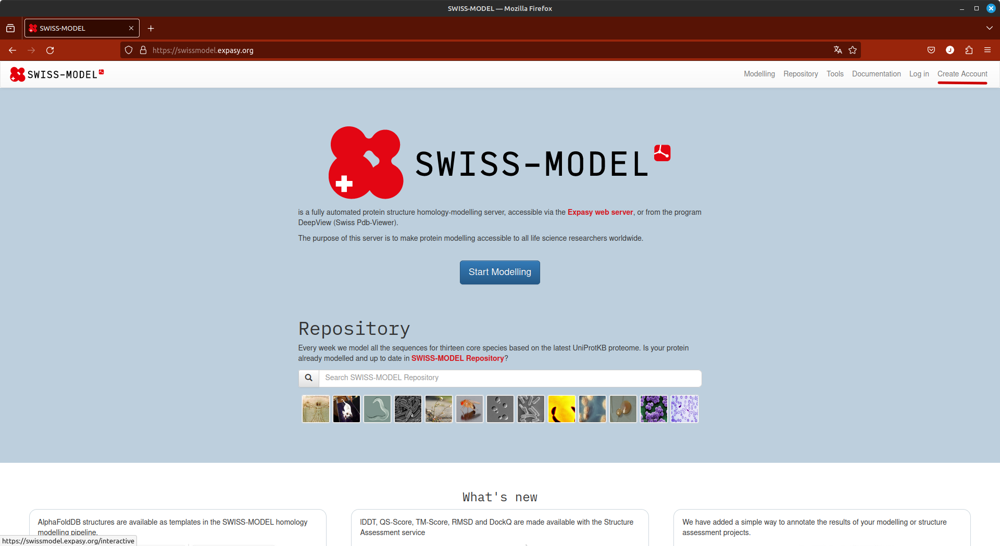

- Insira seu e-mail, e depois verifique-o, pois a senha para entrada é enviada logo após o cadastro.

### Modelagem usando o Swiss-Model

Depois de sua conta criada, seguiremos a busca por moldes a partir da execução dos seguintes passos:

- Abra a página do [Swiss-Model](https://swissmodel.expasy.org).
- Clique em ```Log in``` no canto superior direito e entre com suas credenciais. (criadas na etapa acima).
- Clique em ```Modelling``` e no menu que aparece, clique em ```myWorkspace```.
- Cole a sequência no espaço indicado, e ela deverá ser imediatamente reconhecida.

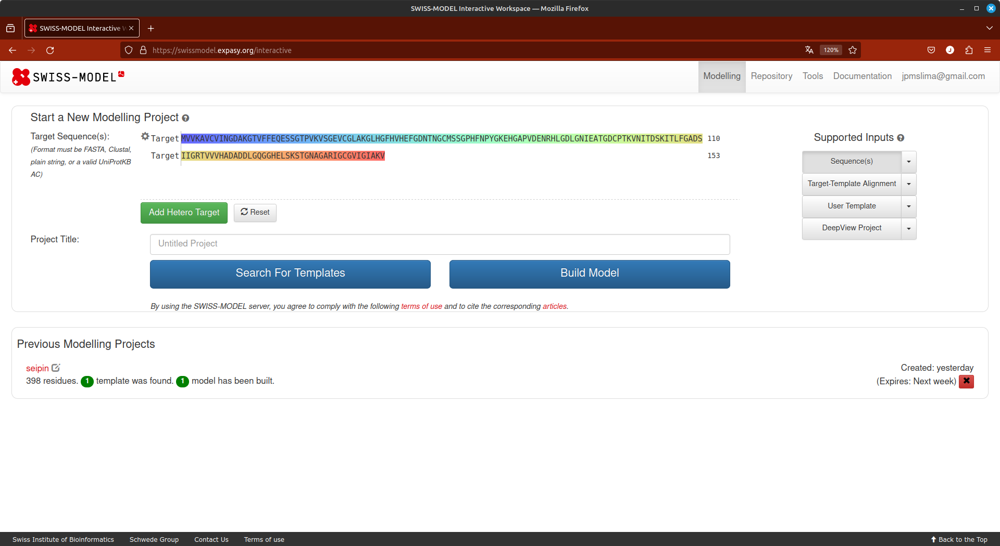

- Dê um nome ao seu projeto e clique em ```Search for Templates```.

A grande vantagem deste módulo do Swiss-Model é a quantidade de informações que ele retorna sobre os **moldes** possíveis. Como pode ser observado na figura abaixo:

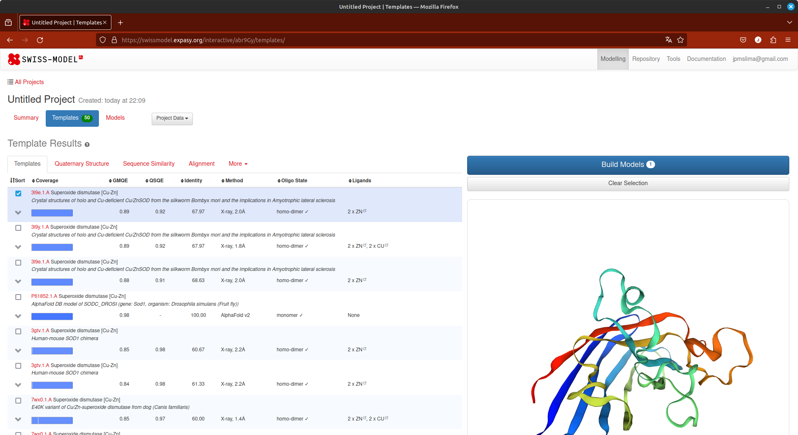

Cada aba (logo abaixo de ***Template Results***) possui informações relevantes sobre sua busca.

**Condições para a escolha do *molde*:**

- Seja uma proteína que tenha função similar a da proteína alvo. Em alguns casos isso pode ser ignorado, principalmente se o *fold* de alguma região seja conhecido.
- Melhor identidade e similaridade.
- Maior cobertura possível.
- No caso de modelos obtidos a partir de cristalografia de raios-X, dê preferência a modelos com maior resolução (lembre-se, de preferência os que possuem resolução ≤2.5 Å).
- Se ligantes são importantes para o seu problema, escolha moldes que possuam ligantes.

Avaliando a lista de moldes, verificamos que o pdb [3l9e](https://www.rcsb.org/structure/3l9e) está dentro dos critérios acima. Caso você queira continuar com a modelagem no próprio Swiss-Model, basta selecionar aqueles ***templates*** que você acredita serem mais adequados e clicar em ```Build Models```, para iniciar uma modelagem por homologia, no próprio Swiss-Model.

> *Observe que na lista de templates, a parte inicial da Q7GDV4_SPIOL não apresenta similaridade com nenhuma estrutura conhecida. Esta região é clivada e possui um peptídeo sinal, como visto no tutorial anterior. A modelagem com o Swiss-Model tem esta desvantagem: ele não modelará qualquer região da proteína alvo que não esteja alinhada com a proteína molde ou que tenha molde, pois apenas usa a abordagem de homologia. Ele também irá ser menos efetivo em modelagem de loops e regiões de coil.*

Ao final da modelagem, você obterá uma tela como a seguinte:

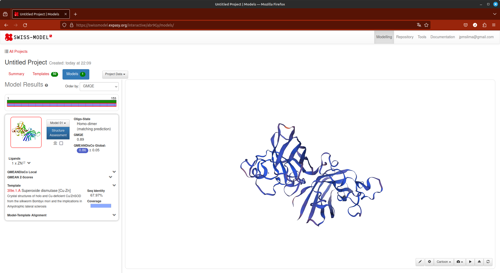

Nesta página você verificar o alinhamento, os escores de avaliação, e gráficos da cobertura e da própria estrutura.

**Algumas observações sobre a modelagem no Swiss-Model:**

- Retorna modelos excelentes com proteínas *target* que apresentam alta identidade com proteínas no banco PDB.
- Caso sejam proteínas com múltipas cadeias, o Swiss-Model já pode retornar modelos simulando a estrutura quaternária da proteína *target*.
- Os modelos gerados já podem ser diretamente avaliados. Será a mesma avaliação que faremos com os modelos gerados por outras plataformas.
- Ele só modela regiões que apresentam similaridade com os *templates*. Não há etapas de refinamento de *loops* ou modelagem por *ab initio* de regiões desordenadas sem similaridade com estruturas conhecidas (Ver nota acima).

## PARTE 3: Modelando por homologia uma proteína utilizando o Chimera/Modeller

Para a modelagem da ```SODC_DROME``` utilizaremos o programa MODELLER (2) a partir de uma interface com a suíte UCSF Chimera (2). É uma abordagem bem simples para obter um modelo proteico para trabalho inicial.

O programa MODELLER utiliza Pyhton pode ser obtido em [https://salilab.org/modeller/](https://salilab.org/modeller/). É um dos programas mais citados e utilizados para a modelagem por homologia de proteínas. É baseado em um método chamado *satisfação de restrições espaciais*. Para isso ele precisa de uma proteína molde (que você escolheu no passo anterior) resolvida experimentalmente, alinhada com a proteína alvo (que no nosso caso é ```SODC_DROME```). O programa é um *freeware* apenas para uso acadêmico.

A suíte UCSF Chimera pode ser obtida em [https://www.cgl.ucsf.edu/chimera/](https://www.cgl.ucsf.edu/chimera/). É um excelente programa de visuzalização, edição e construção de moléculas *In silico*. Ele possui uma grande diversidade de funções, que permite trabalhar desde níveis atômicos até complexos supramoleculares. As fontes de informãções e tutoriais para uso deste programa são vastos na internet e na própria literatura científica.

O primeiro passo é instalar o UCSF Chimera (que pode ser utilizado em Linux/Windows/macOS). A instalação é bem simples (exceção do Linux, que tem de necessariamente ser realizada por linha de comando).

- Ao abrir o Chimera, clicar em *Open* e abra o arquivo fasta da sequência alvo (Parte 1).
- Uma janela adicional como a seguinte irá ser aberta:

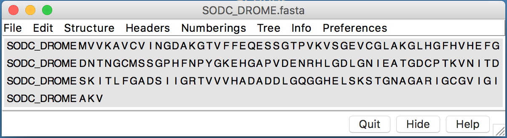

- Nesta janela, ir em: Info > Blast Protein. 

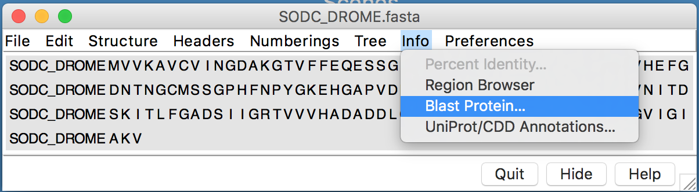

- O seguinte diálogo irá aparecer:

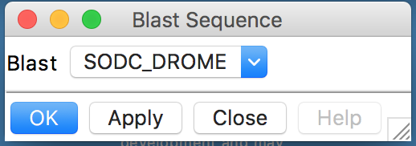

- Clicar em Ok no diálogo.
- Revisar e confirmar os parâmetros na caixa *Blast Parameters*.

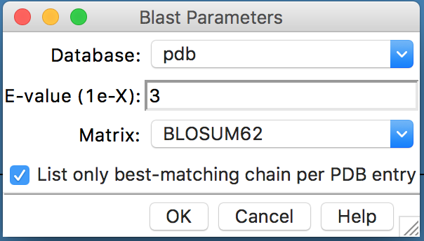

- Na janela *BLAST Query*, selecionar (pressionando control) até 3 *hits*, com *E values* adequados:

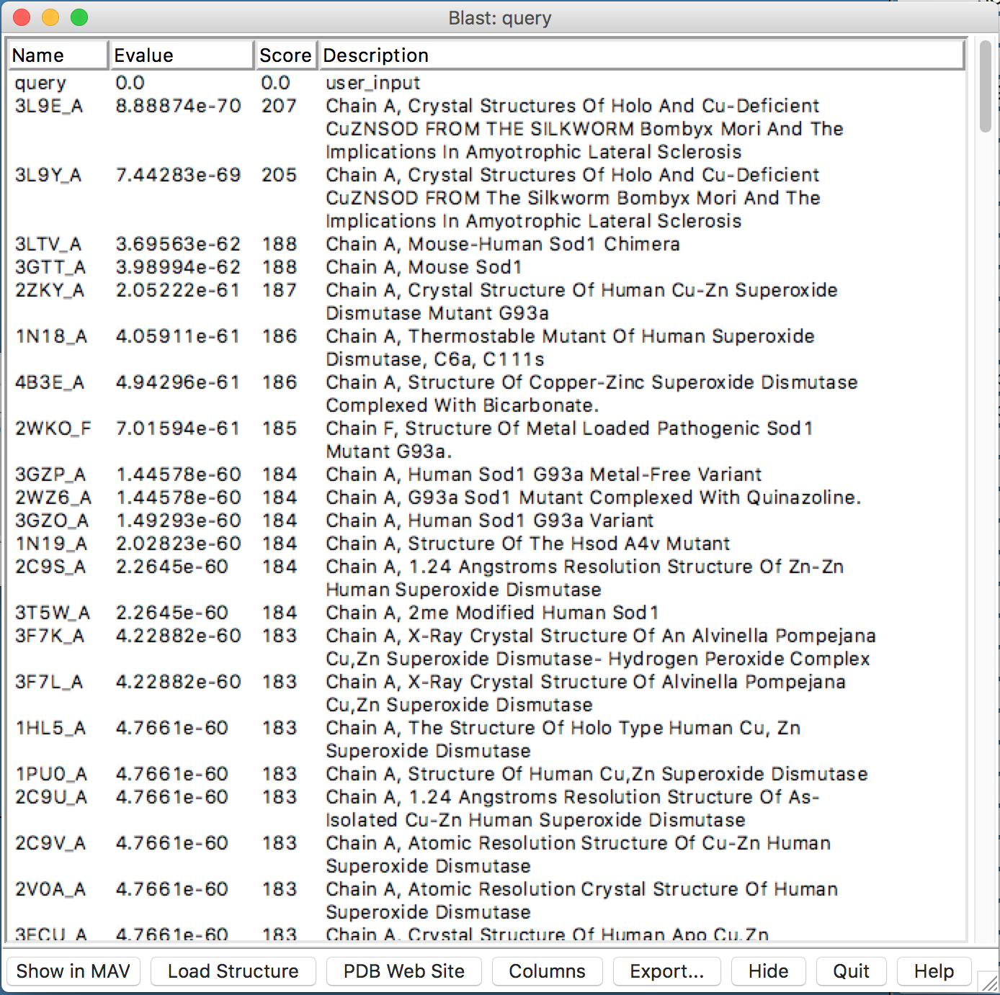

> *A similaridade não é mostrada nesta janela, então a escolha é baseada nos menores* *E-values* *e maiores* *scores*.

- Nesta janela, clicar em “Show in MAV”. O alinhamento múltiplo da proteína alvo, com os prováveis moldes será mostrado.

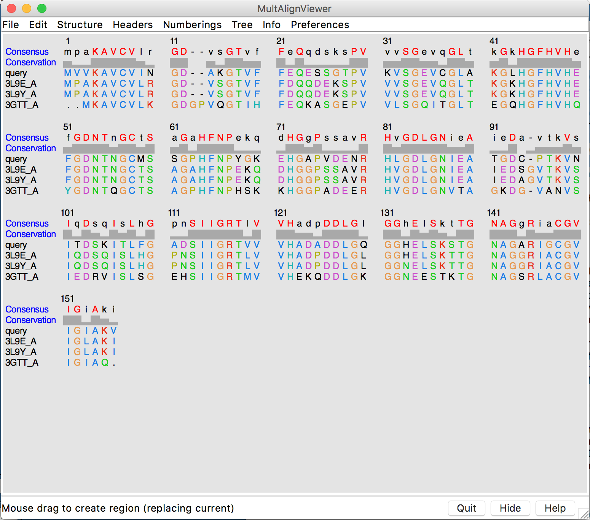

- Na janela do alinhamento múltiplo (MAV), ir em: *Structure > Modeller (Homology)*.

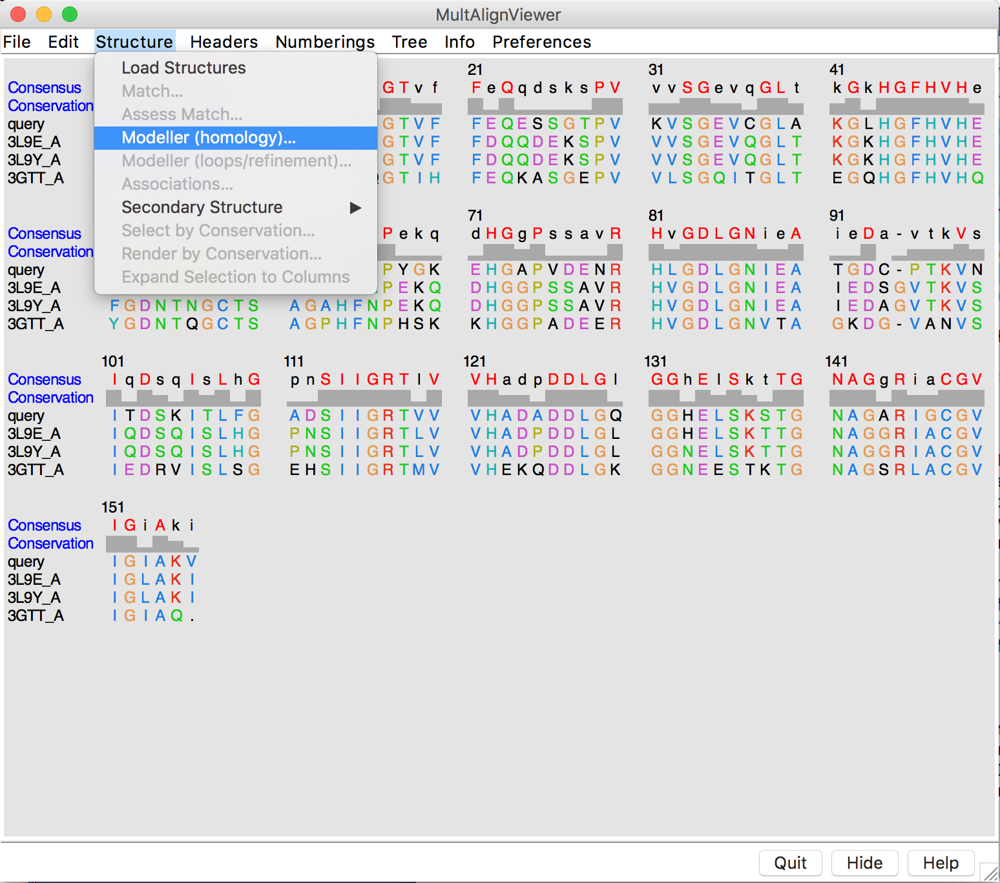

- Na caixa de diálogo aberta, estarão os parâmetros que serão utilizados como entrada para o programa Modeller:

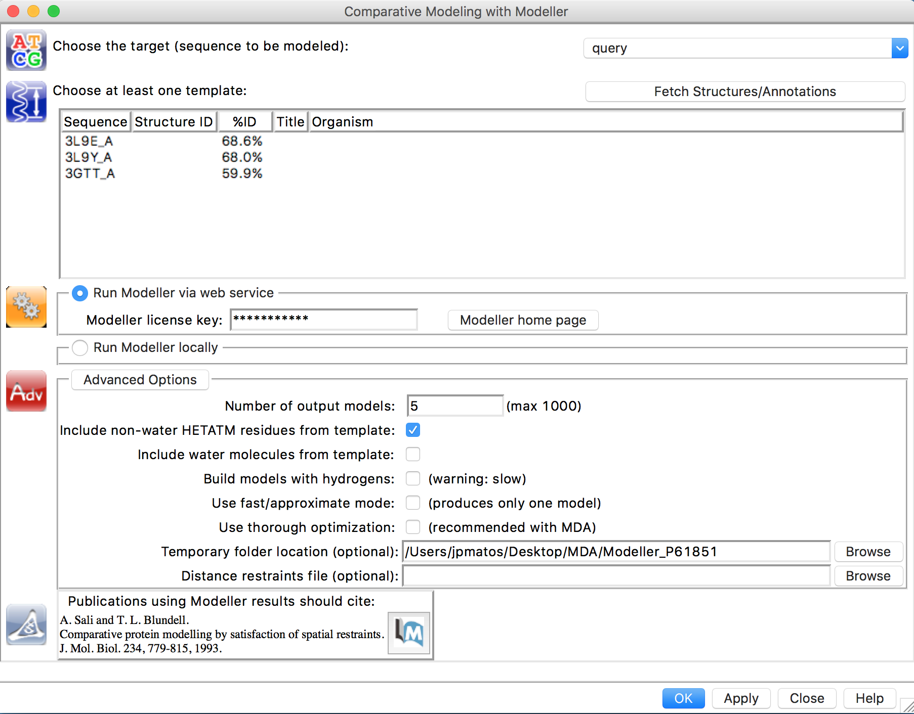

- Selecionar os modelos na listagem.
- Iremos rodar o Modeller pela internet, para não termos que instalar em todos os computadores. Clique em *Run Modeller via web service*. 
- Inserir a chave (será dada em sala de aula).
- Verificar as *Advanced Options* (Pode manter todas por padrão ou da forma como está a figura).
- Clicar em OK ou Apply.
- Esperar a construção dos Modelos. Quando estiverem prontos, uma nova janela com os escores de cada modelo gerado irá aparecer. 

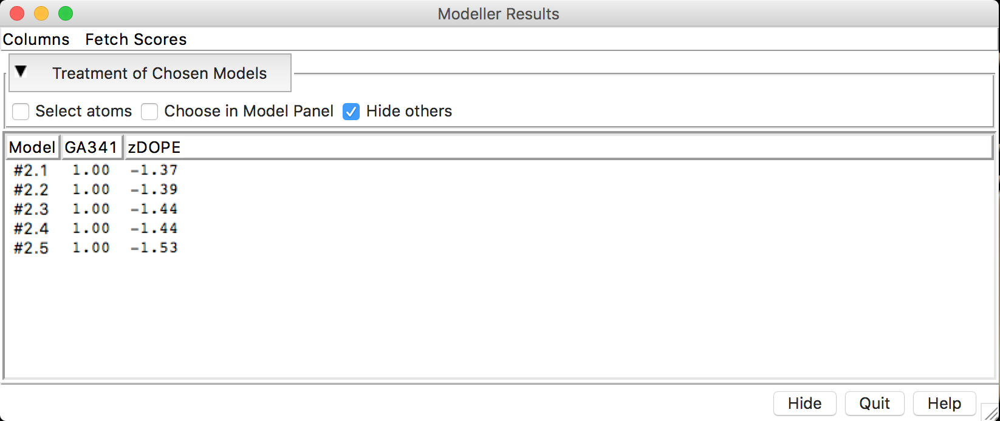

- Cada modelo construído (aqui estão sendo mostrados 5, mas depende de quantos você instruiu para o programa construir) vem acompanhado de escores de avaliação. Antes de continuarmos na avaliação dos escores, faremos o cálculo de mais alguns escores de avaliação. Clicar em *Fetch Scores* > *zDOPE and estimated RMSD/Overlap*.

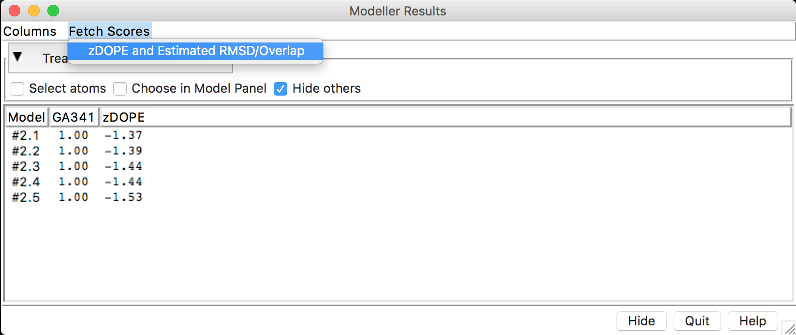

- Após o cálculo dos escores, você deverá ter uma janela como a seguinte:

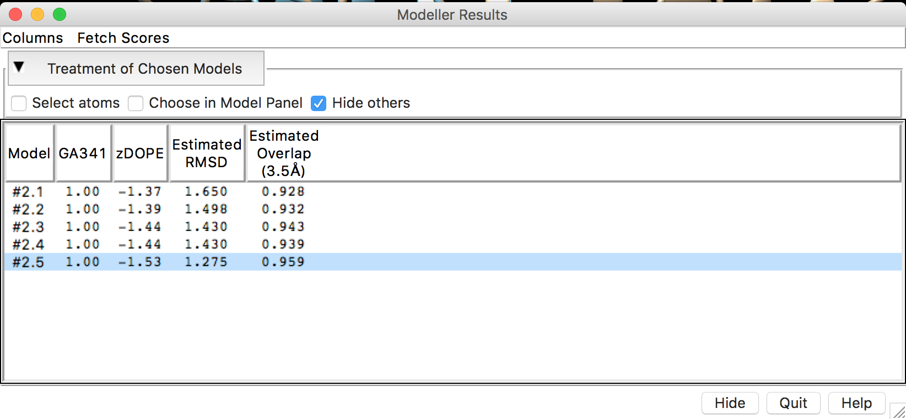

Para avaliar os modelos obtidos com base nos escores retornados, é importante que o significado de cada escore seja entendido. Segue, um resumo dos escores obtidos.

- **DOPE** - *Discrete Optimized Protein Energy*. É um potencial estatístico utilizado para avaliar modelos construídos por homologia. É baseado em um estado de referência que corresponde a átomos que não interagem em uma esfera homogênea, com o raio dependente de uma estrutura nativa de amostra. Portanto, é relativo a forma nativa e esférica das estruturas nativas. Escores menores são mais favoráveis. No Modeller-Chimera ou no ModEval é representado como um escore Z (z-DOPE). Escores positivos provavelmente representam modelos pobres, enquanto escores menores do que -1 estão relacionados a estruturas nativas.
- **RMSD** - *Root-mean-square deviation*. É a medida distância média entre os átomos de duas proteínas superpostas. Em relação as coordenadas atômicas do C-α ou em relação a todos os átomos (depende da forma como ele é computado).
- ***Predicted Native Overlap***: Fração dos átomos Cα que estão preditos a estar dentro de 3.5 Å das suas posições na estrutura nativa (ou do molde utilizado).
- **GA341**: Escore para a confiabilidade de um modelo, derivado de potenciais estatísticos. Um modelo é considerado confiável quando o escore de modelagem é maior que um valor de corte pré-especificado (0.7). Um modelo confiável tem a probabilidade de ter assumindo um *fold* correto maior do que 95%. Um fold é correto quando pelo menos 30% dos seus Cα estão sobrepostos dentro de 3.5 Å de suas posições corretas.

### Perguntas:

a) Dos modelos construídos, qual você considera melhor? Explique em termos dos escores obtidos, pois os modelos podem variar entre diferentes execuções do programa.

b) Houve alguma região dos modelos construídos que apresentou diferenças significativas em relação ao seu molde? Estas regiões estão associadas a diferenças na estrutura primária?

## Referências

(1) B. Webb, A. Sali. Comparative Protein Structure Modeling Using Modeller. Current Protocols in Bioinformatics, John Wiley & Sons, Inc., 5.6.1-5.6.32, 2014.

(2) Yang Z, Lasker K, Schneidman-Duhovny D, et al. UCSF Chimera, MODELLER, and IMP: An integrated modeling system. Journal of Structural Biology. 2012;179(3):269-278. doi:10.1016/j.jsb.2011.09.006.

**Vídeo-tutorial**:

[http://www.rbvi.ucsf.edu/chimera/videodoc/Modeller](http://www.rbvi.ucsf.edu/chimera/videodoc/Modeller)