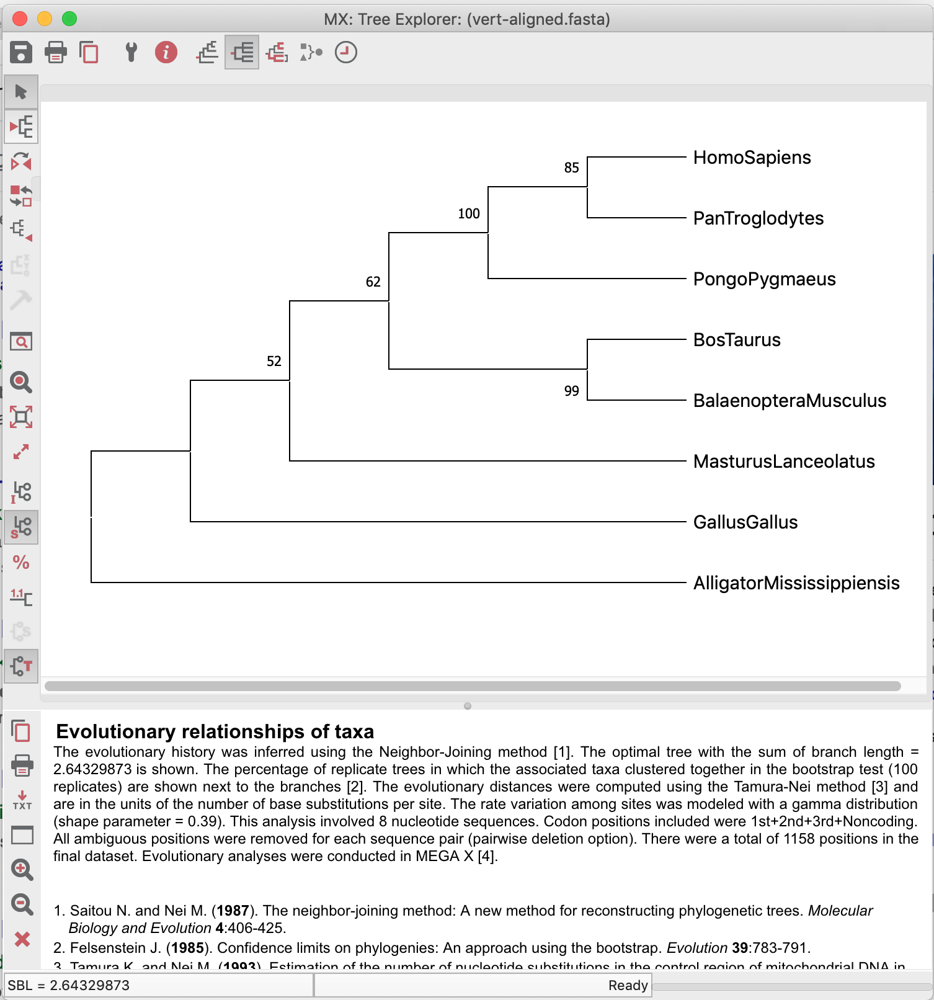

# Inferindo Filogenias

*A crash course*.

## Primeiras observações:

- Este tutorial foi construído ***apenas para fins didáticos***. <span style="color:red">**A reprodução dele para qualquer outro fim não é permitida e nem consentida.**</span> 
- As etapas abaixo demonstram como obter dendrogramas pelos diferentes métodos usando a ferramenta [MEGAX](www.megasoftware.net). Lembre-se que a obtenção de Árvores Filogenéticas para estimar uma Filogenia é um problema muito complexo, que envolve teste de hipóteses e alterações na amostragem de sequências.

## Objetivo

O objetivo deste tutorial é familiarizar o usuário com a interface e as principais funções do programa MEGAX, relacionadas à obtenção de um dendrograma inicial para estimar uma filogenia.

## Obtendo o *dataset* e avaliando suas estatísticas

Nós utilizaremos [este *dataset*](https://drive.google.com/uc?export=download&id=12-vfD16vil2cTmNM2VOMfuj48LGo9iT2) para a construção dos dendrogramas. Estas sequências já se encontram alinhadas. Siga os passos abaixo:

- Abra o alinhamento com o MEGAX. Na janela seguinte, clique em `Analyze` e marque a opção *protein coding nucleotide sequences and the genetic code*.

- Examine as estatísticas de alinhamento. Clique no ícone TA na superior esquerda para abrir o *Data Explorer*.


## Teste do modelo de substituição nucleotídica

Nas suas primeiras versões o programa [MEGA](www.megasoftware.net)  não possuía uma rotina para realização de testes do modelo de substituição. Mesmo assim, ele foi um dos primeiros programas a incluir nativamente esta função. O algoritmo é rápido, no entanto ele testa um número maior de modelos dos que estão disponíveis na própria ferramenta.

- Utilizaremos o arquivo de alinhamento múltiplo de sequências [vert-aligned.fasta](https://drive.google.com/uc?export=download&id=12-vfD16vil2cTmNM2VOMfuj48LGo9iT2).
- Execute o programa MEGAX (nos computadores do curso o ícone estará na área de trabalho).
- Abra o alinhamento clicando no botão ``TA`` e em seguida em *Open a File/Session...*, de acordo com a figura abaixo:


- Na janela *pop-up* seguinte, clique em *Analyze* (essas sequências já foram alinhadas anteriormente):


- O MEGA lhe fará as seguintes perguntas: se são sequências de nucleotídeos. Clique em Ok.


- Se são sequências codificantes para proteínas. Responda *Yes*.


- Ao responder, você precisará selecionar o código genético específico. Clique em *Vertebrate Mitochondrial*:


- Com o arquivo aberto, agora você clicará em ```Models```,


- E selecione o primeiro item, *Find Best DNA/Protein Models (ML)...*:


- E responda sim na caixa de diálogo que aparece logo depois, para usar o conjunto de dados que está aberto:


- Após a confirmação, a seguinte caixa irá aparecer:


- Vamos as opções (da forma como apresentadas na figura acima):
	- Utilizaremos uma árvore automática de *Neighbor-Joining* como hipótese inicial para estes dados.
	- Como as sequências desse alinhamento são de nucleotídeos, utilizaremos o tipo de substituições adequado.
	- Nas opções dos subgrupos de dados, utilizaremos todos os sítios, todas as posições de códons e não utilizaremos filtros para troca de ramos (*Branch-swap filter*).
	- Deixe o número de *Threads* no padrão que apareceu no computador que você está usando.
	- Finalmente, clique em Ok. O processo irá demorar um pouco, dependendo dos recursos computacionais disponíveis. Os resultados aparecerão como a tabela abaixo:


Os resultados são descritos na forma de uma lista do melhor modelo para o menos adequado para os dados utilizados. No MEGA X o critério de informação utilizado é o Bayesiano (BIC). Por ele, podemos verificar que o modelo GTR (*General Time-reversible*) mais correção gamma (+G) foi o modelo escolhido pelo critério bayesiano, embora não seja o modelo com a menor verossimilhança (*lnL*). O restante das informações desta tabela serão discutidas presencialmente.

> *Não esqueça de salvar esta tabela em um dos formatos que o MEGA X disponibiliza, a partir dos ícones presentes no canto superior esquerdo da tela.*

> *O MEGA X também possui a função de calcular o melhor modelo de substituição de aminoácidos. Para isso, basta iniciar as análises com um alinhamento de aminoácidos e na caixa de diálogo escolher a opção correta.*

## Construindo os dendrogramas

- Construa uma árvore filogenética de Neighbor-joining, com um teste de bootstrap. Use *Complete deletion* nesse conjunto de dados. Você pode usar o modelo Tamura-Nei 93, já que o modelo GTR não está disponível para o método Neighbor-Joining. Não se esqueça de examinar o parâmetro *gamma* (+G) para o modelo TN93 e a proporção de sítios invariantes (+I) (se necessário).


- Construa uma árvore filogenética usando *Parsimony* e também *Maximum Likelihood*. Para esse último, você pode usar o modelo GTR (General Time-reversible), selecionado pelo teste do modelo de substituição de nucleotídeos. Use também *Complete deletion* em ambos os métodos.


> No método ML, você não precisa ajustar um parâmetro específico de distribuição gamma, basta definir o uso de *Gamma* 

- Não se esqueça de fazer o root das árvores quando necessário e de salvá-las.

>*A árvore demonstrada abaixo não está enraizada com o grupo externo mais plausível!*



## Perguntas:

- Qual espécie você escolheria para ser o grupo externo do conjunto de dados acima? Explique.

- Compare as árvores obtidas e explique a filogenia, sempre procurando por valores de bootstrap favoráveis (ou não).