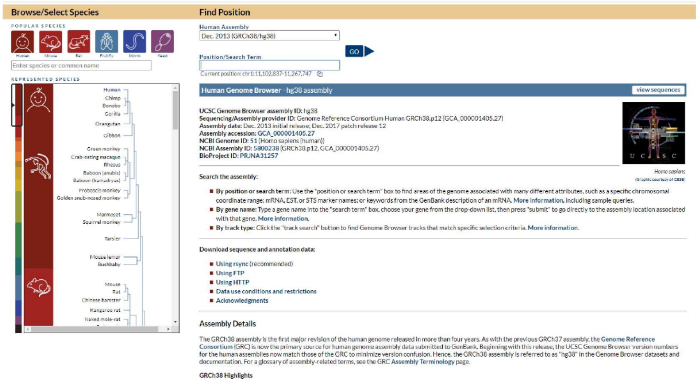
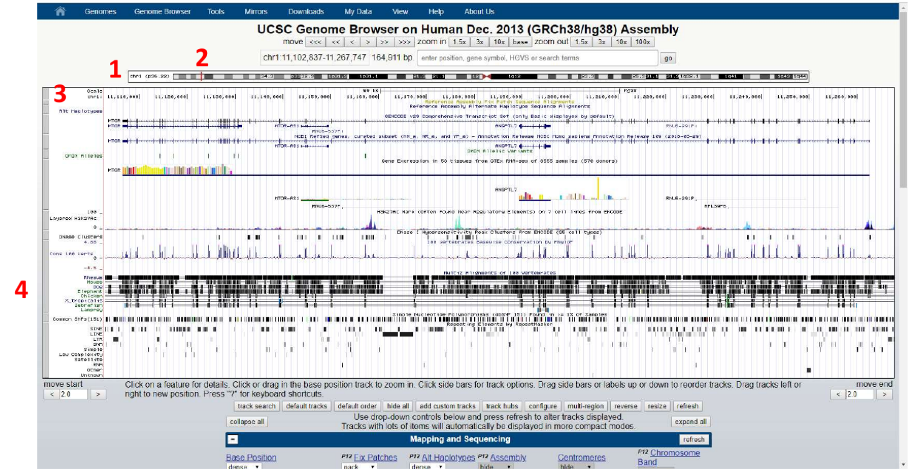
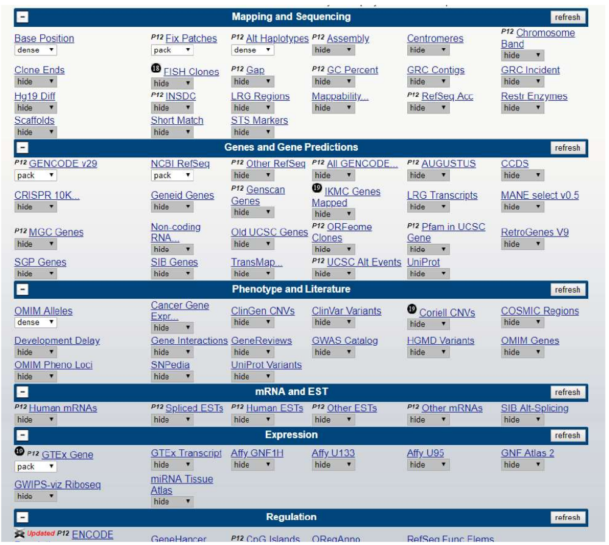
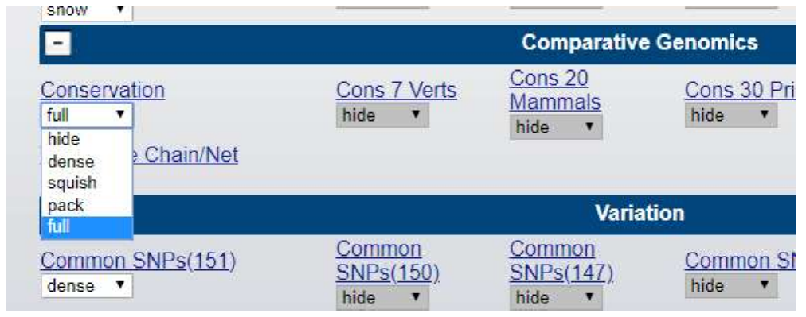
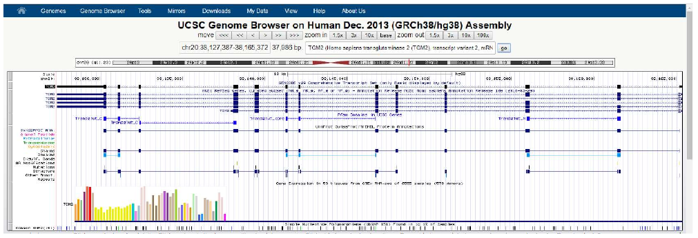
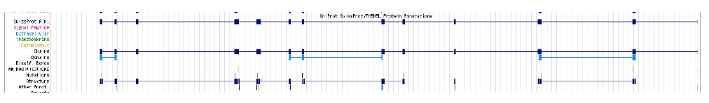
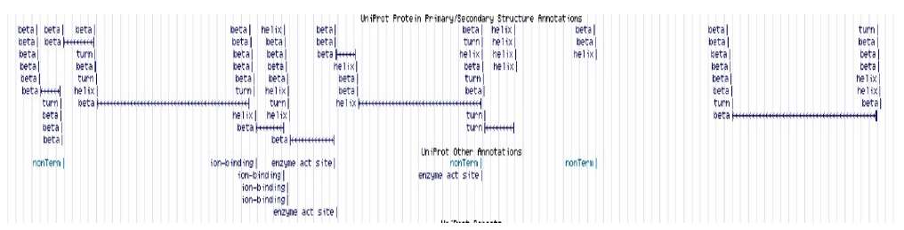

# Navegando por genomas

Com a contribuição do Prof. Gustavo Antônio de Souza, BioME/UFRN.

## Introdução

O navegador de genomas da Universidade da California de Santa Cruz permite visualização de genomas de diversos organismos, e integração do dado de genoma com dados paralelos em diferentes níveis (presença de região codificadora, estrutura do gene, domínios protéicos, dados clínicos, etc). Se usada em sua plenitude, é uma ferramenta de bastante alcance, principalmente nas áreas de Biologia Molecular e Biotecnologia.

A busca de regiões de interesse pode ser realizada usando a posição do genoma (ex: nucleotídeos 11,102,837 a 11,267,747), a posição no cromossomo (Ex: chr1q44), ou o nome do gene de interesse (usando nome oficial do gene por ex: TGM2, para transglutaminase 2). Se você não conhece a região ou nome do gene que você tem dado de sequência, o navegador também possui uma opção de busca de sequências, chamada de **BLAT**. De maneira simples, o BLAT é uma ferramenta de alinhamento como o BLAST, mas com a vantagem de que permite o alinhamento de uma proteína com uma sequência de nucleotídeos e vice-versa (embora também faça busca por similaridade, o BLAST só realiza o alinhamento entre proteínas ou entre nucleotídeos).

## Navegando pelo genoma humano

**Passo 1:** Abra o navegador da internet e vá no seguinte endereço: [https://genome.ucsc.edu/]([UCSC Genome Browser Home](https://genome.ucsc.edu/)).

**Passo 2:** Em “*Our Tools*”, clique em “*Genome Browser*”.



**Passo 3:** Na coluna à esquerda, você pode selecionar o organismo de interesse. Além de dados de genoma humano, hà tambem outros organismos modelos relevantes como camundongo, *Drosophila*, leveduras e até algumas espécies vegetais. Geralmente essa janela automaticamente já inicia com a espécie *Homo sapiens* selecionada. Note que para cada organismo, existe diferentes versões do genoma (ao longo do tempo, erros de sequenciamento são corrigidos, novas regiões como exons são descobertos, etc). **Escolha o organismo *Homo sapiens*.**

**Passo 4:** Em “*Find Position*” à direita, escolha a versão do genoma a ser carregado (em humanos, a versão mais atual disponível é Dec.2013 (GRCh38/hg38). “*Position/Search Term*” pode ser deixado em branco, ou já coloquem o nome de um gene, posição ou cromossomo. Não é obrigatório, quando o Browser for carregado com o genoma, existe um campo de busca para termos disponível. No momento, não preencha nada aqui.
**Passo 5:** Aperte “*Go*”.



É compreensível que, em uma primeira impressão, o Browser parece desnecessariamente confuso. Como nós não demos o termo de busca no início, o Browser carregou aproximadamente 165 mil pares de base do cromossomo 1. Em (1) acima mostra a representação gráfica do cromossomo, a linha vermelha abaixo do (2) mostra a posição do cromossomo 1 que estamos visualizando. Você pode clicar e arrastar essa barra vermelha pra visualizar outras regiões do cromossomo 1.

A coluna mais à esquerda (3) com nomes como “*Alt haplotypes*” ou “*OMIM alleles*” são exemplos de módulos que foram carregados que integram dados de RNA, proteína, expressão em tecidos, mutações relacionadas a condições clínicas, etc. Cada módulo individual pode ser “ligado/desligado” de acordo com seu interesse. Por exemplo, a figura mostra um módulo (4) de comparação de genomas de 100 organismos diferentes nessa região (“*Multiz alignments of 100 vertebrates*”). Se vocês como profissionais de ciências agrárias não têm interesse nesse tipo de análise, simplesmente desliguem esse módulo e essa informação deixa de ser visualizada no Browser.

**Passo 6:** Para desligar/ligar módulos, cheque a tabela abaixo do Browser.



Para o presente roteiro prático, vamos manter o Browser o mais simples possível, portanto vamos manter o mínimo de informações abertas:

- *Mapping and Sequence*, selecione somente “*Base Position*” como “*dense*”. O resto tudo fica escondido (*hide*).
- *Genes and Gene Predictions:* “GENCODE v32”, “NCBI RefSeq” e “*Pfam in UCSC Gene*” selecionados como “*Pack*”, e “UniProt” como “*dense*”.
- *Phenotypes and Literature*, todos ficam “*hide*”.
- *mRNA and ESTs*, todos ficam “*hide*”.
- *Expression*, “GTEx Gene” ficam em “*pack*”, o resto em “*hide*”
- *Regulation*, todos ficam em “*hide*”.
- *Comparative Genomics,* todos em “*hide*”.
- *Variation, “Common SNPs(151)”* ficam em “*dense*”, o resto em *hide*.
- *Repeats*, todos ficam em “*hide*”.

##### Exemplo:

**Passo 7:** Encontre seção “*Comparative genomics*”.
**Passo 8:** Altere “*Conservation*” da opção “*full*” para opção “*hide*”.



**Passo 9:** Quando mudar todos, clique em “*Refresh*” e aquela análise selecionadas como “*hide*” irão sumir do Browser.

> **IMPORTANTE:** *Clicando no nome de cada módulo no Browser ou na tabela abaixo do Browser irá abrir uma página com uma breve explicação do que aquele módulo demonstra na análise.*

**Passo 10:** Carregando um gene: digite TGM2 (uma importante enzima em casos de doença celíaca) no campo de busca, clique no nome que o autocompletar sugerir, e clique em “*Go*”.



Cada dado carregado por cada módulo é separado por um titulo, por exemplo a primeira linha em preto demostra o modelo genético do gene de acordo com Gencode v29 (título “*Gencode v29 Compreheensive Transcript Set*”), onde todos os exons e íntrons estão presentes. Passando o mouse sobre cada intron/exon, a informação do número do exon/intron aparece.

- **Pergunta:** esse gene se encontra na fita senso (5'--3') ou na fita complementar do genoma (3'--5)?

Em **azul escuro**, abaixo, estão demonstrados os variantes de *splicing* presentes no NCBI RefSeq (dados de cDNA). Linhas delimitan introns e barras delimitam exons. Você pode usar as opções “*Zoom out*” e “*Zoom in*”.

- **Pergunta:** Quantas variantes estão presentes? Que tipos de eventos de *splicing* você consegue identificar (existem 3 tipos, em um deles precisa dar um *zoom out* de 1,5x). 

Em **azul claro** está os domínios funcionais da proteína de acordo com PFAM. Lembre, o Genome Browser é uma ferramenta de anotação do genoma, então o que voce está visualizando aqui são os exons que traduzem o domínio funcional da proteína TGM2. Cada domínio é clicável para que informações mais detalhadas possam ser obtidas.

Em seguida estão presentes várias informações anotadas a nível proteico presentes no Uniprot. Use o nome das linhas à esquerda para auxiliar o que está demonstrando.



Clicando nas linhas “*Domains*” ou “*Structure*”, por exemplo, a predição da
estrutura secundária é carregada.



Abaixo, as barras coloridas mostram dados de expressão do gene em 53 tecidos de acordo com o projeto GTEx, passe o mouse sobre cada coluna e o Browser informa o tecido representado e o valor da quantificação em RPKM. Finalmente, abaixo das barras, informações com mutações (SNPs) presentes nesse gene.

- **Pergunta:** As mutações estão presentes somente em regiões codificantes? O que significa polimorfismos em preto, verde e azul?

## Submetendo dados ao Genome Browser

Digamos que em um projeto de pesquisa ou em um laboratório clínico, voce descobriu e sequenciou uma possível nova isoforma de um gene que está associado a uma doença. Como visualizar esse dado com ajuda do Browser?

**Passo 11:** Copie a sequência abaixo.

```
>Seq1
MDLSALRVEEVQNVINAMQKILECPICLELIKEPVSTKCDHIFCKFCMLKLLNQKKGPSQCPLCKN
DITKRSLQESTRFSQLVEELLKIICAFQLDTGLEYANSYNFAKKENNSPEHLKDEVSIIQSMGYRN
RAKRLLQSEPENPSLQETSLSVQLSNLGTVRTLRTKQRIQPQKTSVYIELGSDSSEDTVNKATYCS
VGDQELLQITPQGTRDEISLDSAKKAACEFSETDVTNTEHHQPSNNDLNTTEKRAAERHPEKYQGS
SVSNLHVEPCGTNTHASSLQHENSSLLLTKDRMNVEKAEFCNKSKQPGLARSQHNRWAGSKETCND
RRTPSTEKKVDLNADPLCERKEWNKQKLPCSENPRDTEDVPWITLNSSIQKVNEWFSRSDELLGSD
DSHDGESESNAKVADVLDVLNEVDEYSGSSEKIDLLASDPHEALICKSERVHSKSVESNIEDKIFG
KTYRKKASLPNLSHVTENLIIGAFVTEPQIIQERPLTNKLKRKRRPTSGLHPEDFIKKADLAVQKT
PEMINQGTNQTEQNGQVMNITNSGHENKTKGDSIQNEKNPNPIESLEKESAFKTKAEPISSSISNM
ELELNIHNSKAPKKNRLRRKSSTRHIHALELVVSRNLSPPNCTELQIDSCSSSEEIKKKKYNQMPV
RHSRNLQLMEGKEPATGAKKSNKPNEQTSKRHDSDTFPELKLTNAPGSFTKCSNTSELKEFVNPSL
PREEKEEKLETVKVSNNAEDPKDLMLSGERVLQTERSVESSSISLVPGTDYGTQESISLLEVSTLG
KAKTEPNKCVSQCAAFENPKGLIHGCSKDNRNDTEGFKYPLGHEVNHSRETSIEMEESELDAQYLQ
NTFKVSKRQSFAPFSNPGNAEEECATFSAHSGSLKKQSPKVTFECEQKEENQGKNESNIKPVQTVN
ITAGFPVVGQKDKPVDNAKCSIKGGSRFCLSSQFRGNETGLITPNKHGLLQNPYRIPPLFPIKSFV
KTKCKKNLLEENFEEHSMSPEREMGNENIPSTVSTISRNNIRENVFKEASSSNINEVGSSTNEVGS
SINEIGSSDENIQAELGRNRGPKLNAMLRLGVLQPEVYKQSLPGSNCKHPEIKKQEYEEVVQTVNT
DFSPYLISDNLEQPMGSSHASQVCSETPDDLLDDGEIKEDTSFAENDIKESSAVFSKSVQKGELSR
SPSPFTHTHLAQGYRRGAKKLESSEENLSSEDEELPCFQHLLFGKVNNIPSQSTRHSTVATECLSK
NTEENLLSLKNSLNDCSNQVILAKASQEHHLSEETKCSASLFSSQCSELEDLTANTNTQDPFLIGS
SKQMRHQSESQGVGLSDKELVSDDEERGTGLEENNQEEQSMDSNLGEAASGCESETSVSEDCSGLS
SQSDILTTQQRDTMQHNLIKLQQEMAELEAVLEQHGSQPSNSYPSIISDSSALEDLRNPEQSTSEK
AVLTSQKSSEYPISQNPEGLSADKFEVSADSSTSKNKEPGVERSSPSKCPSLDDRWYMHSCSGSLQ
NRNYPSQEELIKVVDVEEQQLEESGPHDLTETSYLPRQDLEGTPYLESGISLFSDDPESDPSEDRA
PESARVGNIPSSTSALKVPQLKVAESAQSPAAAHTTDTAGYNAMEESVSREKPELTASTERVNKRM
SMVVSGLTPEEFMLVYKFARKHHITLTNLITEETTHVVMKTDAEFVCERTLKYFLGIAGGKWVVSY
FWVTQSIKERKMLNEHDFEVRGDVVNGRNHQGPKRARESQDRKIFRGLEICCYGPFTNMPTDQLEW
MVQLCGASVVKELSSFTLGTGVHPIVVVQPDAWTEDNGFHAIGQMCEAPVVTREWVLDSVALYQCQ
ELDTYLIPQIPHSHY
```

**Passo 12:** Na barra azul do começo da página, selecione “*Tools > BLAT*”.
**Passo 13:** Cole a sequência no campo correto e clique *Submit*.

**Passo 14:** Note o tempo que levou a busca (comparado ao BLAST que vocês fizeram na outra aula). Repare parâmetros dos resultados como Score, % de identidade, etc.
**Passo 15:** Clique em “*Details*”. Resultados mostram na primeira parte (“*Yourseq*”) os aminoácidos que alinharam no genoma (azul escuro), posição dos limites dos “*gaps*” (em azul claro). 

> **ATENÇÃO:** *gaps aqui, significa as bordas entre exons e introns - repare na segunda parte do resultado (“Human.chr17”), nucleotídeos em azul escuro correspondem aos códons dos aminoácidos em azul escuro na primeira parte e fazem parte de um exon do gene. O primeiro e último códon de cada exon (a borda do exon) está anotado em azul claro (borda do “gap” como descrito acima).*

- **Pergunta:** Que parte do gene representam os nucleotídeos em preto?

**Passo 16:** Clique em “Browser” e sua sequência será carregada juntamente a posição do gene que melhor alinhou a ele no resultado do Blat.

- **Pergunta:** Qual o nome do gene?

## Considerações finais

Muitos dos bancos de dados que serão apresentados na Unidade II da disciplina se encontram disponíveis numa interface única no Genome Browser. Todos esses dados podem ser baixados e analizados localmente. Basta voltar à pagina inicial da UCSC e selecionar “*Downloads – Genome Data*”. 

Finalmente: para maiores informações e detalhes, o próprio site do Browser oferece tutoriais e vídeos para usuário iniciantes e avançados. O link para iniciantes é:
[http://genome.ucsc.edu/goldenPath/help/hgTracksHelp.html#GetStarted](http://genome.ucsc.edu/goldenPath/help/hgTracksHelp.html#GetStarted).
