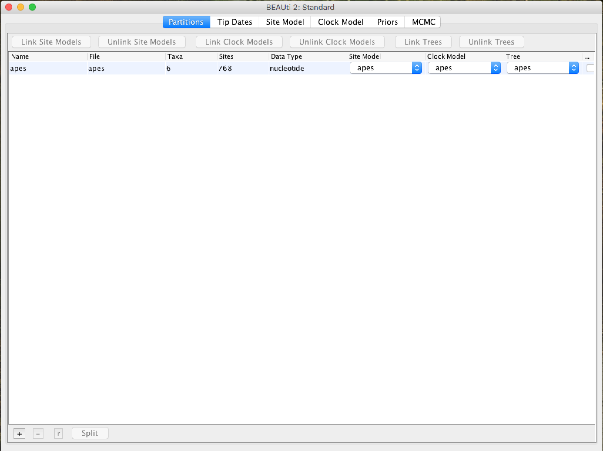
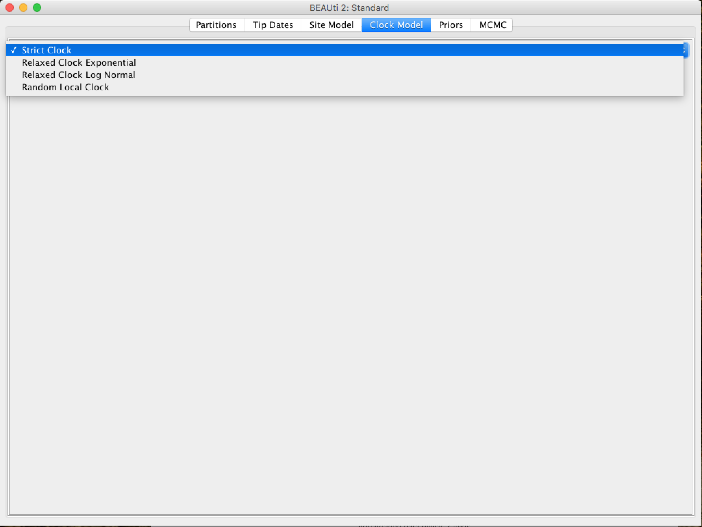
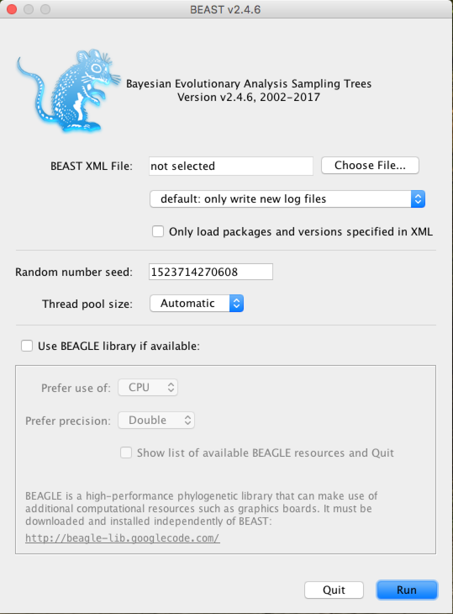
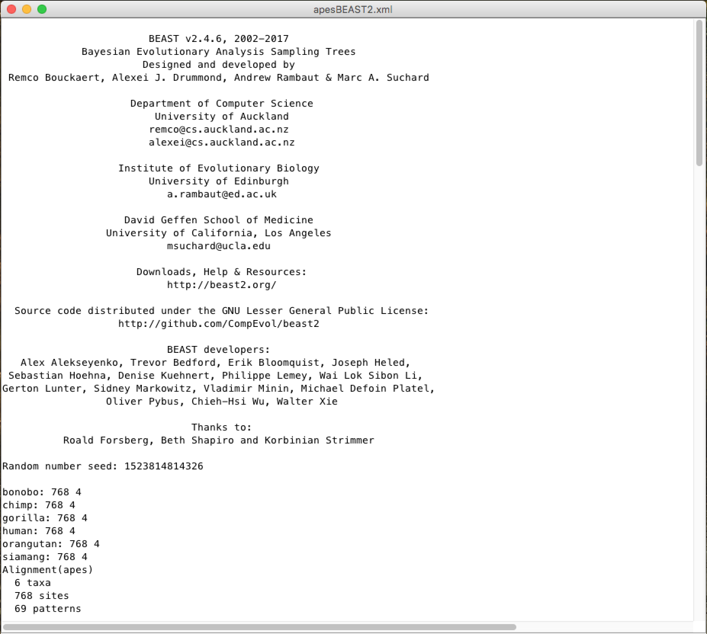
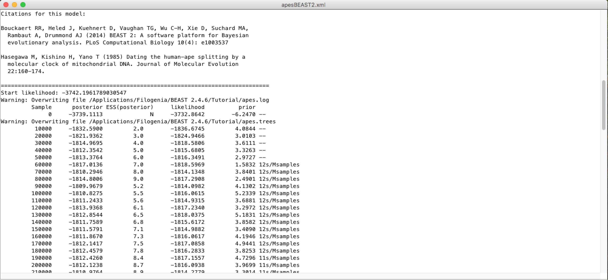
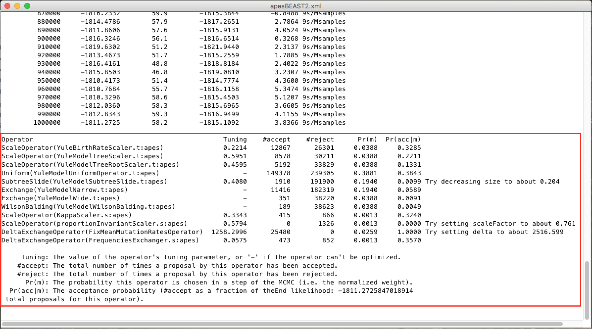
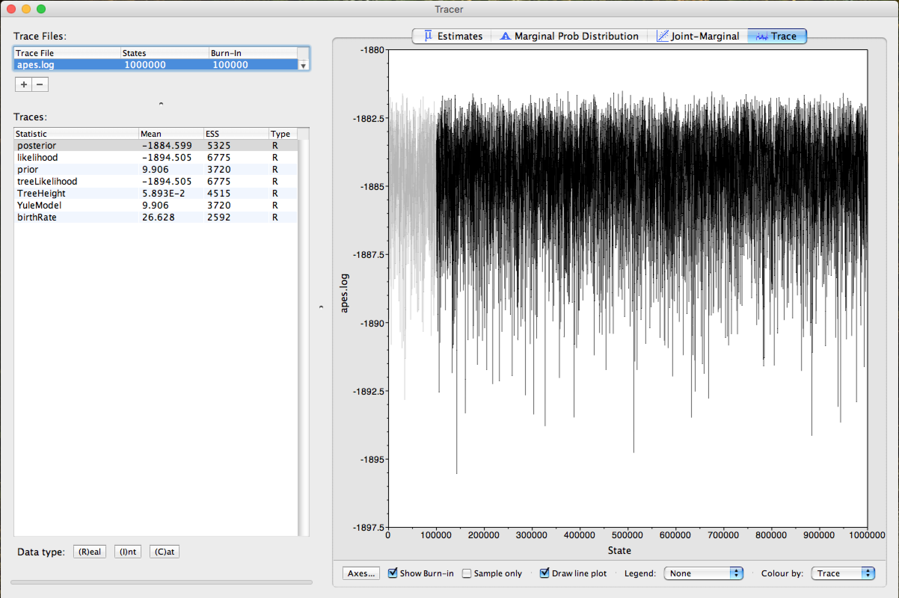

# First steps in BEAST

## Aims

### *Geral*

- Learn the first steps to perform an analysis with the BEAST phylogenetic analysis package.

### *Specific*

- Importing an alignment file.
- Choice of model
- Learn how to build the input XML files using BEAUti.
- Run BEAST for the first time.
- First steps of analyzing the output BEAST files.

### Remarks:

- This tutorial has been adapted to BEAST2 from [*First tutorial*](http://beast.community/first_tutorial) available in the BEAST online community, **unique and exclusively for educational purposes**. <span style="color:red">**For any purpose, the original tutorial is the one to be cited or referenced.**</span>
- Part of this tutorial can also be run with BEAST1.x. Differences between BEAST2 and BEAST1.x features and applications can be found [HERE](http://www.beast2.org/beast-features/).
- This tutorial requires a basic knowledge of molecular phylogeny concepts and some terminologies used in the field.
- Citation of the BEAST Program:
  - Bouckaert R, Heled J, Kühnert D, et al. BEAST 2: A Software Platform for Bayesian Evolutionary Analysis. Prlic A, ed. PLoS Comput Biol. 2014;10(4):e1003537-6. doi:10.1371/journal.pcbi.1003537.

> *BEAST1.x and BEAST2 are now independent projects. Read carefully the link above listed with the differences in the functions/analysis from both programs.*

## Importing the alignment

The initial working data group will be an alignment of mitochondrial tRNA sequences of 6 primates (5 monkeys and 1 gibbon as outgroup), [apes.nex](https://drive.google.com/uc?export=download&id=1ChU5EcP_3-c78qUK6Y7VwiMe5bdtYKhm). The nexus file is very common in phylogeny and several multiple sequence alignment programs have the ability to export the alignment in this format.

The nexus file is represented below (with truncated lines):

```
#NEXUS

BEGIN DATA;
    DIMENSIONS NTAX=6 NCHAR=768;
    FORMAT MISSING=? GAP=- DATATYPE=DNA;
    MATRIX
    human      AGAAATATGTCTGATAAAAGAGTTACTTTGATAGAGTAAATAATAGGAGC...
    chimp      AGAAATATGTCTGATAAAAGAATTACTTTGATAGAGTAAATAATAGGAGT...
    bonobo     AGAAATATGTCTGATAAAAGAATTACTTTGATAGAGTAAATAATAGGAGT...
    gorilla    AGAAATATGTCTGATAAAAGAGTTACTTTGATAGAGTAAATAATAGAGGT...
    orangutan  AGAAATATGTCTGACAAAAGAGTTACTTTGATAGAGTAAAAAATAGAGGT...
    siamang    AGAAATACGTCTGACGAAAGAGTTACTTTGATAGAGTAAATAACAGGGGT...
    ;
END;
```

To use this alignment in analysis with BEAST, we will have to import it with the BEAUti tool. It is an interactive graphical application to outline your analysis and generate the control file (an XML file) used by BEAST to perform the analysis.

 
This is the BEAUti icon. Just double-click it to execute it.

Once BEAUti is executed, a window similar to the one below should appear:


To load the nexus alignment file, you have two options:

- Click on "File" and then "Import Alignment".
- Click on the ``+`` symbol in the bottom left corner of the screen.

BEAUti can also import fasta files (as long as the sequences are aligned) or BEAST XML files. However, in the latter case, only the data will be imported, not the race parameters and settings.

Once loaded, the alignment will be displayed in table format in the main window:



By double-clicking on the table row, the alignment can be viewed (although not good):


At the top of the main window, a series of "tabs" can be observed:


Each of these tabs has settings and options. In general, you should always work with them from left to right. However, not all guides will be relevant for all analyses. After the Partitions tab, you can go to the tab called Tip Dates.

## Setting the *Tip Dates* (when applicable)

The ``Tip Dates`` tab is used to put dates for each of the *rates* in your analysis. In it, you will see a table with all the taxonomic groups you are analyzing. Taxon dates (*Tip dates*) are only important in some cases, for example when you are working with rapidly evolving viruses or DNA from old samples or fossils. In the case of this analysis of primates that we are performing in this tutorial, the tree represents millions of years of evolution, so the dates can be assumed to be zero. This is the pattern - all *rates* have a date of zero, and the use of the *Tip Dates* tab is not selected.


## Setting up the evolutionary model

In the ``Site Model`` tab you can adjust the molecular evolution model (nucleotide and amino acid substitution model) to the sequence data you have loaded (apes.nex). The exact options will appear depending on the type of data you have loaded (nucleotides, amino acids or other form of data). The options that will appear after the ``apes.nex'' alignment data has been loaded are as follows:


This tutorial assumes that you have read or studied the different evolutionary models available. In this analysis, we will use the [HKY](https://www.ncbi.nlm.nih.gov/pubmed/3934395) model.

> *In previous versions of BEAST (1.7 or 1.8) it is easier to choose the codon positions to run the analysis (an alignment based on codons is required). If you need partition analysis, you have to use these versions. However, these data are from mitochondrial tRNAs, so this option would not apply.*

## Configuring the Molecular Clock Model (*Molecular Clock*)

In the next tab, ``Clock Model``, we will determine the molecular clock model that will be used in the analysis. Unlike many other phylogenetic analysis programs, BEAST exclusively uses molecular clock models so that trees have a time scale (an inferred root and a direction in time). The simplest model is the "*Strict clock*" or restricted clock pattern. Such model assumes that all branches in the tree have the same rate of evolution. Other molecular clock models relax these assumptions in various ways, and other advanced tutorials can be used to verify their application.



Select *Strict Clock* and switch to the ``Priors`` tab.

## Setting the *priors*

It is on this panel that the *priors* of Bayesian analysis will be determined. In the first checkbox, you can put the model that will provide a *priori* in the tree for the MCMC race.

The *priori* of the tree (*Tree Prior*) has many possibilities, usually divided into coalescing models (*Coalescent*), which are generally suitable for populations, and speciation models (*Speciation*), which as the name suggests are directed to species-level data. As the alignment we have is of several species, we will select the model of [Yule](http://rstb.royalsocietypublishing.org/content/213/402-410/21), which is the simplest speciation model, where it is assumed that each lineage presented speciation at a fixed rate.


For each *priori* model of the tree, the following specific parameters appear in the window. Each parameter in the model has operators, which specify how the parameters change as the MCMC rotates. For the Yule model, only two parameters are needed: ``kappa``, which means the tendency of transitions-transversions in the HKY model; and the birth rate of new species ``birthRate``.

BEAST reasonably maintains the standard values for the *priors* of each model. Selecting the *priors* is one aspect of the BEAST analysis that should be taken most seriously. Only modify these parameters if you are sure of what you are doing, with specific knowledge of each one. In the rest of this tutorial, we will use these default values, so leave them as they are and move to the ``MCMC`` tab.

## Setting the MCMC run Options

On this tab, we will have the settings to run the Bayesian analysis by BEAST.


First we have the length of the chain (or referred to as the number of generations). This is the number of steps that the MCMC will do in the chain before finishing the process. How long it should depend on the size of the data set, the complexity of the model, and the quality of the required response. In this case, the default value is entirely arbitrary and must be adjusted according to the size of the data set that will be analyzed. To verify that the string size is adequate, the resulting log file (*log file*) can be analyzed using the **Tracer** program (we will verify this later). The goal of selecting an adequate chain size is to achieve a reasonable (*ESS - Effective Sample Size*). 

*Ways to achieve an adequate ESS can be checked in other [BEAST community] tutorials (beast.community)*.

The following options specify how much such parameters should be logged in the log file (``tracelog``) and shown on the screen (``screenlog``).

For the ``tracelog``, the value must be relative to the chain size's total value. Performing a very frequent sampling (value logging) will result in huge files with little extra benefit in terms of accuracy. On the other hand, sampling infrequently will result in a log file without sufficient information about the parameter distributions. Typically, 10,000 samplings is an adequate number, and to store this, just put a number that is the chain size / 10,000. The other options can be left at the default values (stressing again that in BEAST, the defaults are reasonable).

For this data set (which is quite small), we will start the analysis with a chain size of 1,000,000, as this value will run very quickly on most computers today. Therefore, put the frequency record (sampling) in the log file for 100.


The screen output is simply to monitor the progress of the BEAST race, so any value  can be placed (however, if you choose a too small value, the amount of information that will appear on the screen may slow down the program terminal).


> *The frequency of screen log sampling and trace log can be different. In this case, our analysis will run very fast, so sampling the screen log for every 100 steps will cause a quick movement on the screen due to a large amount of information.*

For the `tree log` option, leave the same sampling number in `trace log`.


## Saving and uploading the BEAUti files

By selecting *Save* from the *File* menu, a file in BEAUti format will be saved. Note that this is not the format that BEAST "understands" - BEAUti will only reopen it. This way, the settings and data can be saved and loaded later. Save the BEAUti files with the extension ``.beauti``.  

> *So as the BEAUti files cannot be read and "understood" by BEAST, you cannot open the BEAST XML files back directly in BEAUti. If necessary, they can be imported in the same way as FASTA or NEXUS files. The sequence data, the ``Tip Dates`` and other information will be imported.* 

## Generating the BEAST XML file

The XML BEAST file can now be created. Select *Save as...* from the *File* menu and save it with an appropriate name. Do not forget to add the ``.xml`` extension when saving. On Computers 
Now the file is ready to be run with BEAST.

## Running BEAST

Turn BEAST2 by clicking the following icon:


The following window will appear:



From now on, all you need to do is click on ``Choose File...``, select the XML file you saved in the previous steps and press ``Run``.

> *To speed up analysis with larger data sets and/or larger MCMC chain sizes, installing the BEAGLE library is strongly recommended, especially if you have a video card with CUDA (GPU) support. In BEAST1.x, the BEAGLE library can be run directly from this window. In version 2, it recommends installing JAVA JDK and running BEAST2 from the terminal command line (on computers with Unix-based systems). The beagle_SSE instruction setting also dramatically speeds up the analysis of computers with newer processors. An example of a general command to run BEAST2 from a terminal is:*
> 
> ``/bin/beast -beagle_CPU -beagle_SSE -threads 4 -instances 4 -overwrite file_name.xml``
> 
> The window to run on BEAST1.x versions is very similar.

When running, BEAST (in any version) will load the XML file, configure the parsing and run it without additional interaction. It starts with the title and credits of the software. You will see the output screen, with various information, similar to the one below:



A little lower, in this same window you will be able to see the citations of the models used and the MCMC chain screen log, with an estimate of the time of the analysis (time unit / Millions of samples):



And at the end, a diagnosis of the adequacy of the analysis parameters to the data group:



> To learn more about the changes in these parameters, look for the BEAST documentation. Only change them with absolute certainty of what you are doing.*

After the race, BEAST generates the following files that you will use later:

- File ``.log`` (with the Bayesian MCMC analysis log).
- File ``.trees`` (with all trees generated and logged).

## Analyzing the log file with TRACER

Tracer](http://tree.bio.ed.ac.uk/software/tracer/) is a program to analyze the files generated by Bayesian MCMC races (that is, the continuous values of the parameters sampled from the chain. The analysis with Tracer is very detailed. For simplicity purposes in this tutorial, we will comment only on the actual sample size parameters to check if there is a greater need for sampling or larger chain size.

Run TRACER by clicking on the icon:


When opened, Tracer will show the following window:


To open the MCMC trace log file (file ``.log``), click the ``+`` symbol just below ``Trace Files:`` (indicated by the arrow on the figure above). After this step, a window like this should be displayed:


Note that the <span style="color:red">***Arrow 1***</span> shown in the figure above is indicating that Tracer assigns 10% to **Burn-In**. This is the number of steps at the beginning of the chain that is discarded from the analysis, which tends to present a greater variation in the parameters.

> *The discard or burn-in of 10% of the total chain size is the recommended one. However, this can be changed. This value can be increased in races with larger MCMC chain sizes.* docs/MEGAX_ENG.md

Observe the parameters highlighted by the red frame. In all, the values in the **ESS** column (*Effective Sample Size*) must be in black. This demonstrates that the values are suitable for analysis. When they are not, they are marked in the colors <span style="color:orange">orange</span>, which indicates that they are partially adequate, or <span style="color:red">red</span>, which indicates that they are not adequate. The parameters that should be analyzed initially are *posterior*, *likelihood*, and the model's statistical parameters as *prior* or *YuleModel*.

To match the parameter statistics that the ESS is marked in red, you can increase the size of the string, and depending on the parameter, changes in *priors* in the XML file with BEAUti should be performed. The analysis of these parameters and the BEAST diagnostic indications at the end of each race are strongly recommended.

Click on <span style="color:red">***Arrow 2***</span> and the ***Trace*** of the race can be observed. The gray part in Trace demonstrates exactly the ***Burn-In*** employed in the analysis, as can be seen in the figure below:



*This same burn-in will also be used when summarizing the trees of Bayesian analysis.*

Finally, select the statistics of the *posterior* and *likelihood* parameters (using the ``ctrl`` key on your keyboard) and click on <span style="color:red">***Arrow 3***</span>. Tracer will return you a graph of the point distribution of the 2 parameters, similar to the figure below:


For further details on the analysis with Tracer and its other functions, in-depth readings on Bayesian Inference, the Tracer manual/readme and the BEAST community are recommended.

## Summarization and Viewing of Generated Trees

Now we will work with the ``.trees`` file, generated by BEAST. As described previously, this file has each tree generated and recorded by MCMC analysis. Since we had a chain size of 1,000,000 and asked to make records every 100 (the same as *trace log*), we will have a file with 10,000 trees.

We have to summarize all these trees, in one, with the *a posteriori* (PP) probability values in each node of the tree. For that, we will use a program provided with the BEAST, called TreeAnnotator. To run it, click on its respective icon:


A window similar to the one below will appear:


In the **Burnin percentage** box, you will put the *burn-in* percentage of this analysis, that is, the first generated trees that will be discarded from the analysis because they are at the beginning of the chain.

The ***Posterior probability limit*** option serves to avoid solving tree nodes below the PP limit entered in this field. For example, if you place the limit of 50, nodes with less than 50 PP will not be solved.

In the options ***Target tree type*** and ***Node heights*** choose the options demonstrated in the picture above, from ***Maximum clade credibility tree*** and ***Common Ancestor heights**, respectively.

In the ***Input Tree File*** field, you will click on ``Choose File...`` and add the ``.trees`` generated in the analysis. And in the ***Output File*** field, you will also click on ``Choose File...``, in which case, you will name the file and insert it in the folder of your choice. Do not forget to put the extension ```.tree``` at the end of the file name so that the tree visualization programs will more easily recognize it.

A recommended program for tree visualization is the FigTree program, which can be obtained [HERE](http://tree.bio.ed.ac.uk/software/figtree/).

The file ``.trees`` can also be viewed with the **DensiTree** program. This program makes a schematic representation with all the trees, facilitating the analysis of inconsistencies. ***DensiTree*** can be executed by the icon:

