# Phylogenetics analysis with *Extended Bayesian Skyline Plots* (EBSP) using BEAST

##### Diego Gomes Teixeira (Ph.D.) and João Paulo M S Lima (Ph.D., Associate Professor)

*[Bioinformatics Multidisciplinary Environment - BioME](http://bioinfo.imd.ufrn.br/),
Universidade Federal do Rio Grande do Norte.*

## Introduction

BEAST is a framework that uses an evolutionary approach based on a Bayesian model, which involves a wide range of analyses, resulting in the inference of one or more phylogenies or family trees. It also includes traditional phylogenies, phylodynamics, and phylogeographic inferences, as well as coalescence analysis of the evolutionary history of a population, usually obtained from a single analysis ([Drummond et al., 2005](https://www.ncbi.nlm.nih.gov/pubmed/15703244); [Bouckaert et al., 2014](https://www.ncbi.nlm.nih.gov/pubmed/24722319)).

The demographic history of a population leaves a signature on the genome of current representatives. The reconstruction of this history allows us to gain insights into various evolutionary processes involving population genetics, such as tracing the transmission and spread of a virus. The method for estimating population history from DNA or AA sequences depends only on the coalescing events' time and not exactly on the genealogical relationships between the sequences. For example, coalescence events occurring in rapid succession are indicative of a small gene population size ([Ho; Shapiro, 2011](https://www.ncbi.nlm.nih.gov/pubmed/21481200)).  

This tutorial will guide you through a phylogenetic analysis of an alignment of ZIKA virus sequences, sampled during the outbreak period in South America. This tutorial is an adaptation of the study conducted by [FARIA et al. (2016)](https://www.ncbi.nlm.nih.gov/pubmed/27013429) which investigated the approximate date of introduction of the virus in the Americas by identifying a possible common ancestor among American and Asian isolates. The aim is to reproduce the results obtained in this study, with a small additional population analysis through an *Extended Bayesian Skyline Plot (EBSP)*.

## BEAUTi

### Loading the NEXUS file

To load the alignment, select the "*Import Alignment*" option from the "*File*" menu. The file ```Zika.nexus_Tutorial``` can be downloaded [HERE](https://drive.google.com/uc?export=download&id=1AmXKP7hkGh5lXUyx-LSoBjbfrPxDZ5y6) and contains an alignment of 23 Zika Virus sequences.

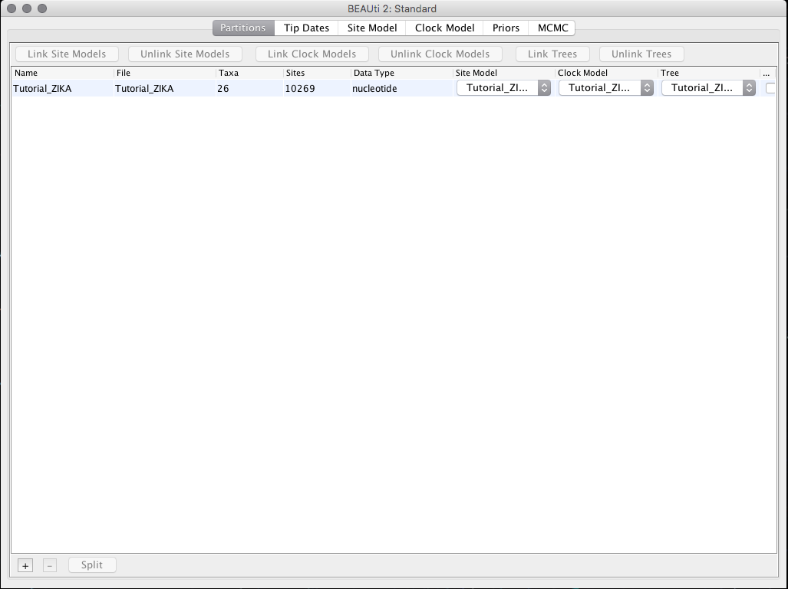  

### Adding the sampling date of the sequences

In the top menu, select the ``Tip Dates`` tab and then check the Use tip date box. You will have the option to manually add each of the dates in the **Date** field, or you can upload a pre-assembled file containing the list of sequence names and the date, separated by a tab. In this example, we will use this list, clicking on the ``Guess`` button and then selecting the ```read from file``` field. Then, load the file [Tutorial_ZIKA_tips.dat](https://drive.google.com/uc?export=download&id=1t1rB0GRBd1O4etVYwe-rqYc2dKTyTZnE).

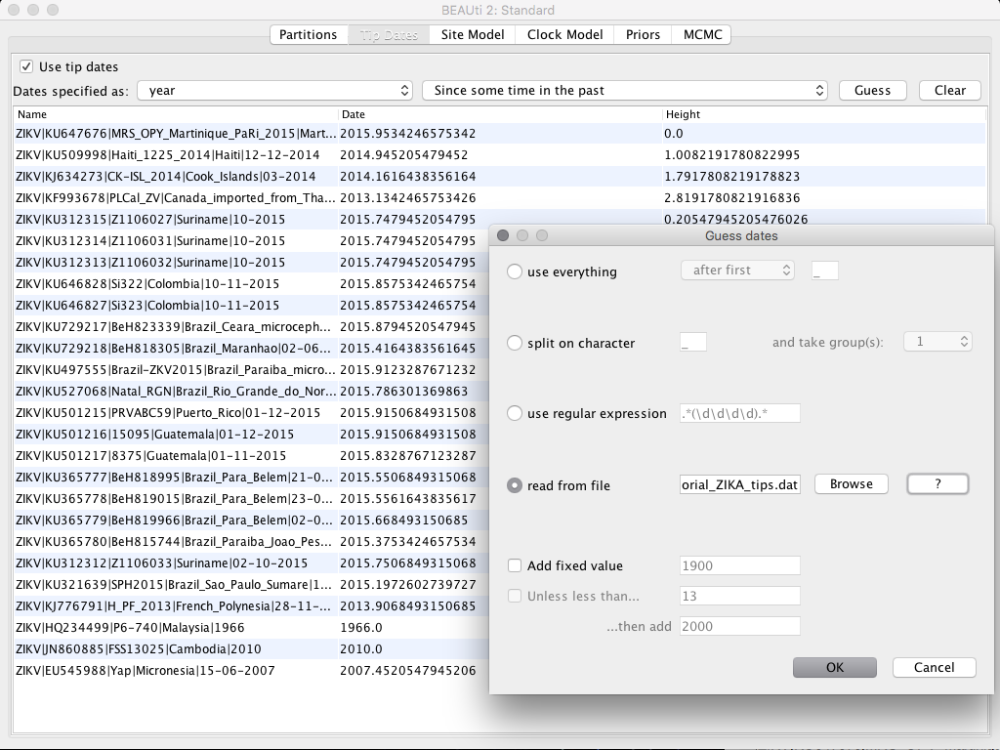  

### Selecting the model

In the top menu, select the tab ```Site Model``` and the field **Subset Model** change to the option **GTR**.

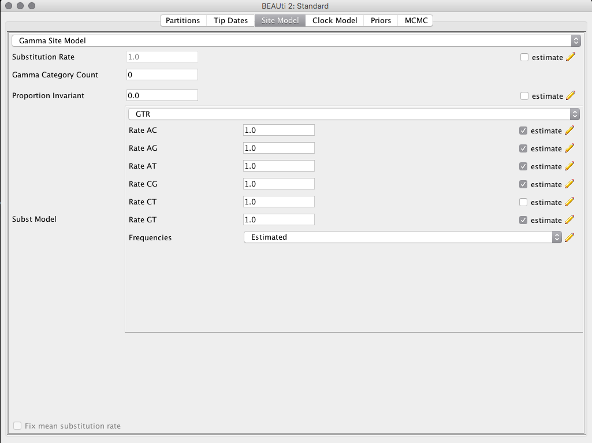  

### Configuring the Priors

In the ```Priors``` tab at **Tree.t:Tutorial_ZIKA** select the ***Coalescent Extended Bayesian Skyline*** option. Then click the ```+``` and select the option **MRCA Prior**. In the box that will appear, set the name of the taxon you want to work in the box **Taxon set label**. In this example, we will give the name of <span style="color:red">**taxon A**</span> for the taxon that contains the sequences from South America plus the sequence from French Polynesia, and <span style="color:red">**taxon B**</span> for the sequences from South America only.

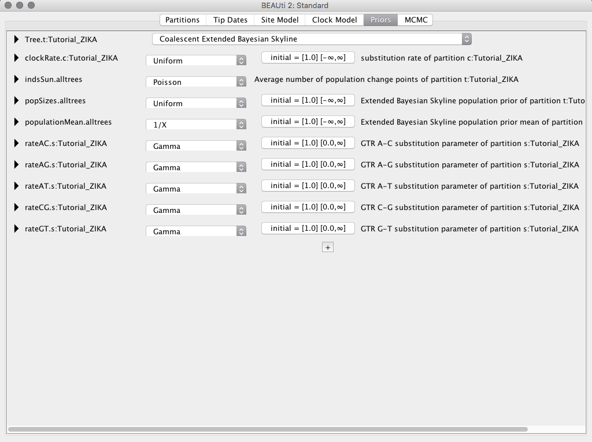

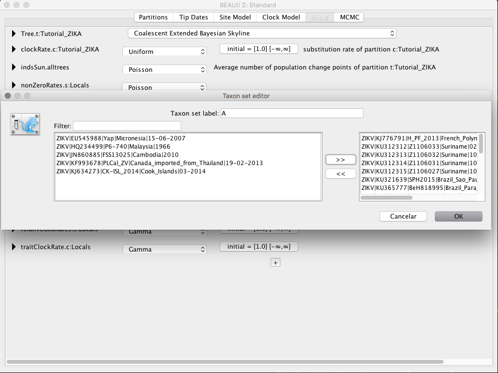   

### Configuring discrete features

Back to the ```Partitions``` tab, let us click the ```+``` button located at the bottom of the BEAUTi window and select the option **Add Discrete Trait**. In the resulting box, we will set the name **Locals** in the box **Trait Name**. 

The next window will ask for the Trait name for each sequence. In that option, we will put the country of origin of each of the samples. Again we have the option to manually put the country name of one in one or to load a tabulated file containing the sequence name and the country name. In the ```Guess``` tab we will select the option **Read from file** and load the file [Tutorial_ZIKA_locals.dat](https://drive.google.com/uc?export=download&id=1k1z4MIelEWTt9nTI672DvAePcgWA3gvL)

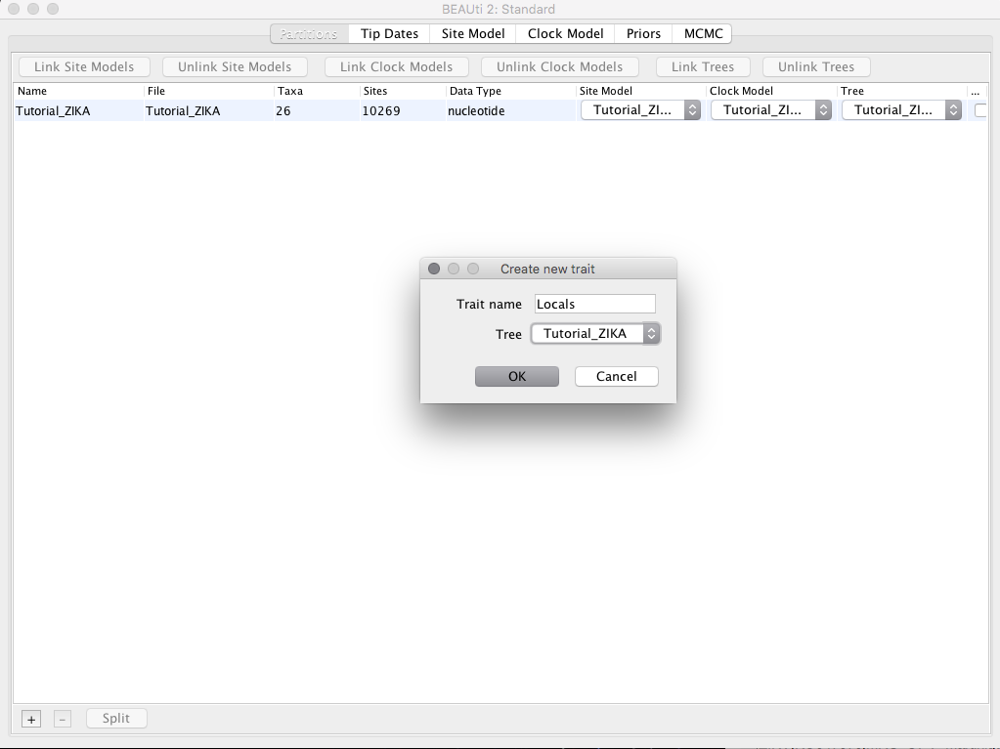

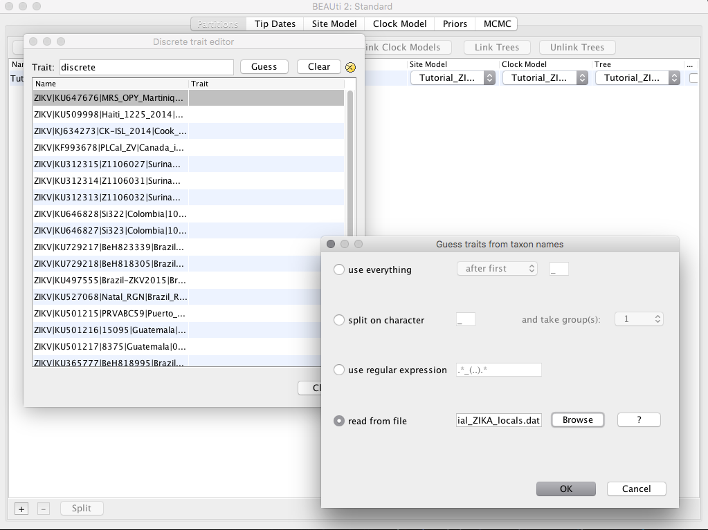

### Configuring the MCMC

In the ```MCMC``` tab we will set the **Chain Length** to 50,000,000 and change the values of **Log Every** in the boxes **tracelog**, **treelog.t:Tutorial_ZIKA**, **treeWithTraitLogger.Locals** and **EBSPLogger** to 5,000. 

> *Depending on your computer, this chain size can be considerable, and the program will take a long time running. However, it is necessary for EBSP. If you cannot run it, use the files already run at the end of this tutorial.*

After this step, go to ```File > Save``` and save the .xml file.

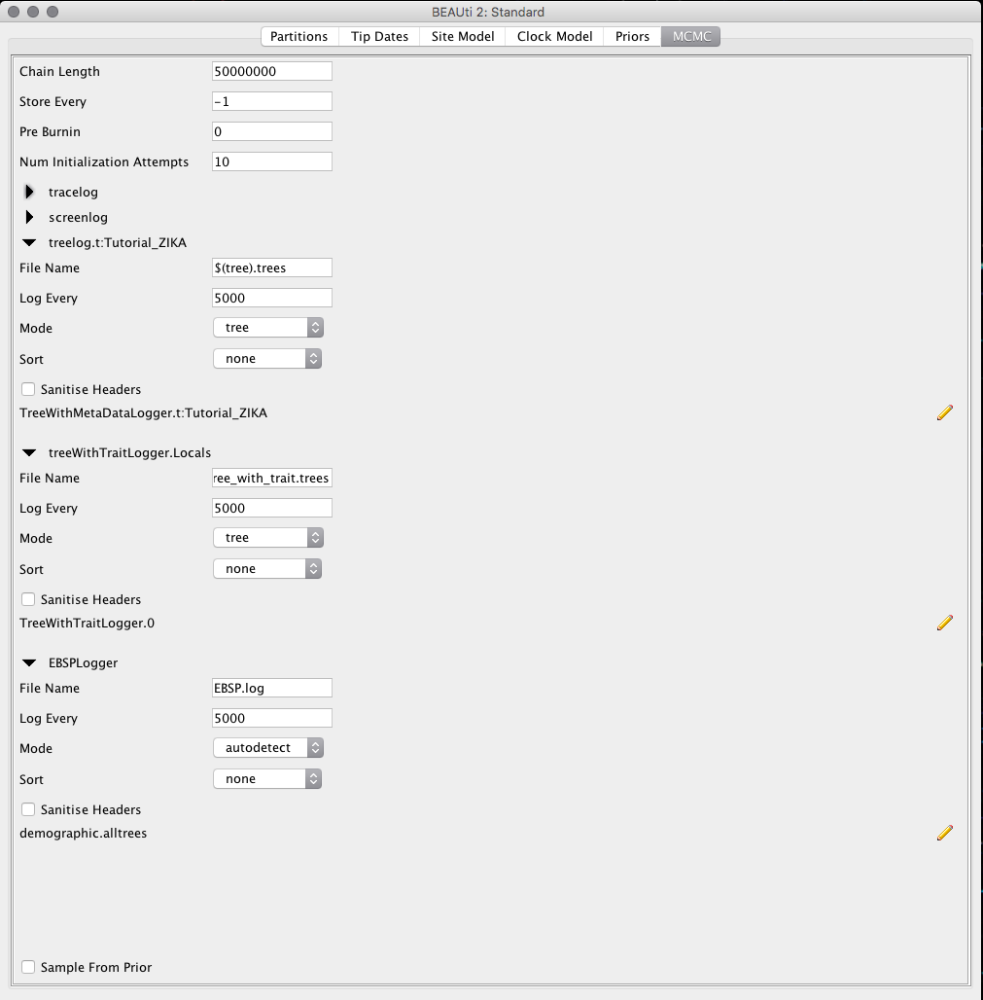 

## BEAST

> *Before running BEAST2, we have to install some additional extensions to perform these analyses. We will discuss these steps in a synchronous meeting.*

In the BEAST window, in the **BEAST XML FILE** field, we will load the .xml file created by BEAUTi and click Run.

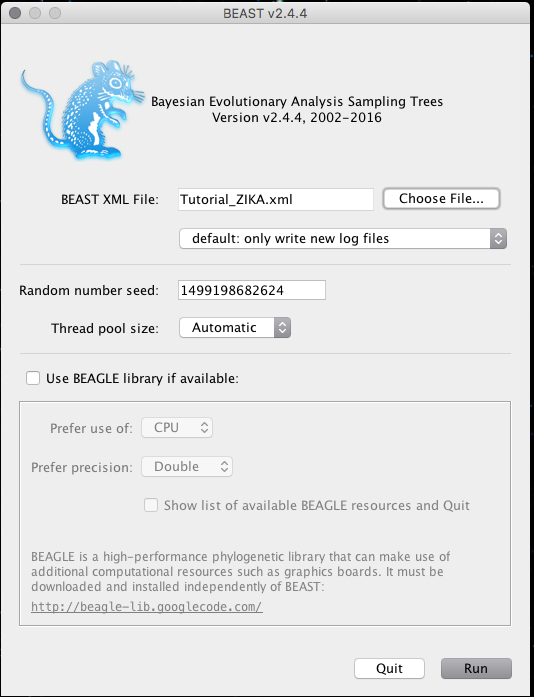  

## Tree Annotator

At this stage, we will discard the first trees generated by BEAST from the MCMC. In the **Burnin percentage** box, we will put for the program to remove 10% of the initial trees. In the **Node heights** option, we will select the **Median heights** option, and then we will load the BEAST output, the ```Locals_tree_with_trait.trees```, in the **Input Tree File** field, and define the name of the output file in the **Output File** option.

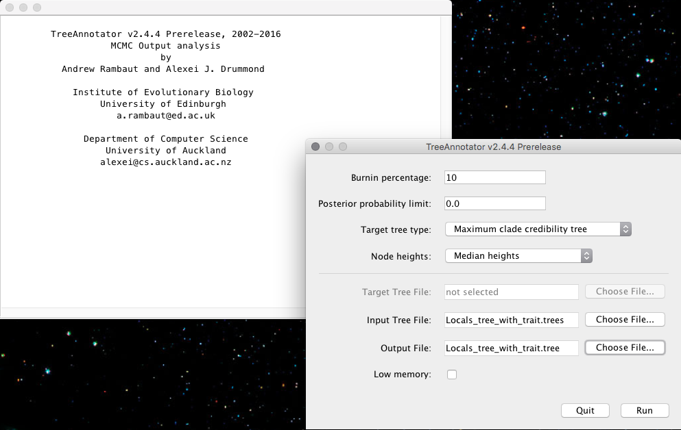 

## FigTree

In FigTree, load the file ```Local_tree_with_trait.tree```, then adjust the branches.

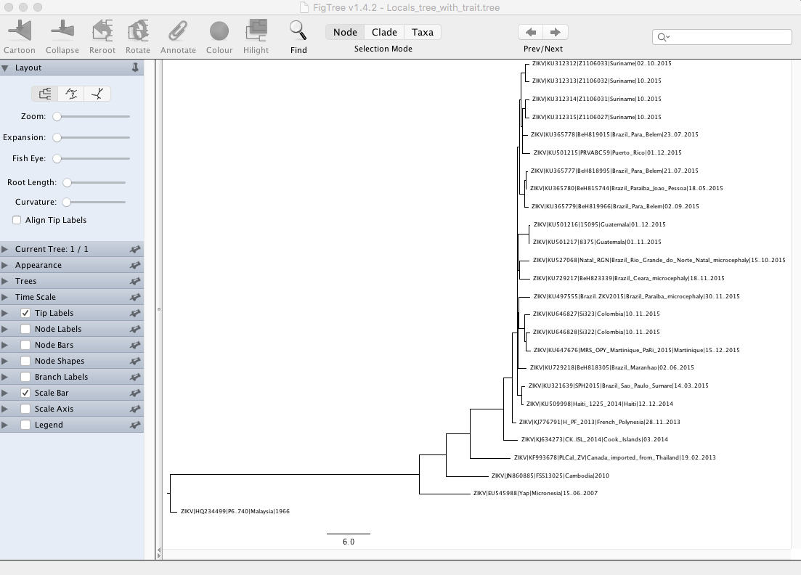  

## TRACER

In the Tracer program, we will load the BEAST log file to access some information from the analysis. Clicking on the ```+``` we will load the ```zika_tutorial.log``` file. Then, we will select, in the ```Traces``` tab, the variables **mrcatime(A)** and **mrcatime(B)**.


Observe the results.

## Constructing the EBSP Plot

Open RStudio (or other R environment) and enter the following code:

```
plotEBSP(“/File_Folder/EBSP.log", useHPD=FALSE, log="y", xlim=c(0,5))
```

Remember to switch the **File_Folder** to the location where you saved the ```EBSP.log``` file.

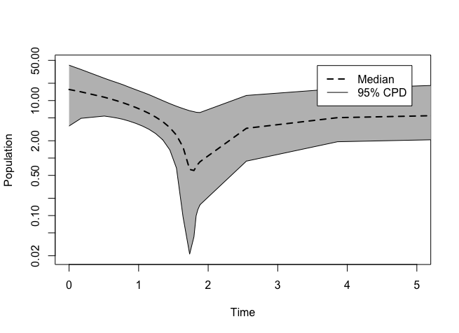

Compare the graph to the tree.

## Using the package EBSPAnalyser

The EBSPAnalyser package produces a log file with columns time, mean, median, 95% upper and lower, which you can import in a spreadsheet or to your favorite plot software and use to draw a graph.

To run in Linux/MacOS, open a terminal window and use the follow command:  

`java -cp $(dir)/beast.jar beast.app.tools.EBSPAnalyser`

where `$(dir)` points to the directory where `beast.jar` is located. A window pops up where you specify the `EBSP.log` file and some other settings.

> *Retrieved and adapted from [Beast2/EBSPAnalyzer](https://www.beast2.org/ebspanalyser/).*

## Files generated after the BEAST execution

The files generated from the above steps are available at the link below:

[Tutorial Zika Filogenia.zip](https://drive.google.com/uc?export=download&id=19xrCmUwQ94JglHMU5BMjoNEAXRuK_jl6)

## References

- Bouckaert, R. et al. BEAST 2: A Software Platform for Bayesian Evolutionary Analysis. PLoS Computational Biology, v. 10, n. 4, p. e1003537, 10 abr. 2014.

- Drummond, A. J. et al. Bayesian coalescent inference of past population dynamics from molecular sequences. Molecular Biology and Evolution, v. 22, p. 1185–1192, 2005.

- Faria, N. R. et al. Zika virus in the Americas: Early epidemiological and genetic findings. Science (New York, N.Y.), v. 5036, n. March, p. aaf5036, 2016.

- Ho, S. Y. W.; Shapiro, B. Skyline-plot methods for estimating demographic history from nucleotide sequences. Molecular Ecology Resources, v. 11, p. 423–434, 2011.