# Primeiros passos no BEAST

## Objetivos

### Geral

Aprender os primeiros passos para realizar uma análise com o pacote de análise filogenética BEAST.

### Específicos

- Importar um arquivo de alinhamento.
- Escolha do modelo
- Aprender como construir os arquivos XML de entrada usando o BEAUti.
- Executar o BEAST pela primeira vez.
- Primeiros passos na análise dos arquivos de saída do BEAST.

### Observações:

- Este tutorial foi adaptado para o **BEAST2** do [Primeiro tutorial](http://beast.community/first_tutorial) disponível na comunidade online do BEAST, **única e exclusivamente para fins educacionais.** <b style="color: red;">Para qualquer propósito, o tutorial original é o que deve ser citado ou referenciado.</b>
- Parte deste tutorial também pode ser executada com o BEAST1.x. As diferenças entre os recursos e aplicações do BEAST2 e do BEAST1.x podem ser encontradas [AQUI](http://www.beast2.org/beast-features/).
- Este tutorial requer um conhecimento básico dos conceitos de filogenia molecular e algumas terminologias usadas na área.
- Citação do Programa BEAST:
  - Bouckaert R, Heled J, Kühnert D, et al. BEAST 2: A Software Platform for Bayesian Evolutionary Analysis. Prlic A, ed. PLoS Comput Biol. 2014;10(4):e1003537-6. doi:10.1371/journal.pcbi.1003537.

>📌 *BEAST1.x e BEAST2 são agora projetos independentes. Leia atentamente o link listado acima com as diferenças nas funções/análises de ambos os programas.*

## Importando o alinhamento
O grupo de dados de trabalho inicial será um alinhamento de sequências de tRNA mitocondrial de 6 primatas (5 macacos e 1 gibão como outgroup), [apes.nex](https://drive.google.com/uc?export=download&id=1ChU5EcP_3-c78qUK6Y7VwiMe5bdtYKhm). 

O arquivo nexus é muito comum em filogenia e vários programas de alinhamento múltiplo de sequências têm a capacidade de exportar o alinhamento neste formato.
O arquivo nexus é representado abaixo (com linhas truncadas):
```
#NEXUS
BEGIN DATA;
    DIMENSIONS NTAX=6 NCHAR=768;
    FORMAT MISSING=? GAP=- DATATYPE=DNA;
    MATRIX
    human      AGAAATATGTCTGATAAAAGAGTTACTTTGATAGAGTAAATAATAGGAGC...
    chimp      AGAAATATGTCTGATAAAAGAATTACTTTGATAGAGTAAATAATAGGAGT...
    bonobo     AGAAATATGTCTGATAAAAGAATTACTTTGATAGAGTAAATAATAGGAGT...
    gorilla    AGAAATATGTCTGATAAAAGAGTTACTTTGATAGAGTAAATAATAGAGGT...
    orangutan  AGAAATATGTCTGACAAAAGAGTTACTTTGATAGAGTAAAAAATAGAGGT...
    siamang    AGAAATACGTCTGACGAAAGAGTTACTTTGATAGAGTAAATAACAGGGGT...
;END;

```
Para usar este alinhamento na análise com o BEAST, teremos que importá-lo com a ferramenta BEAUti. É uma aplicação gráfica interativa para delinear sua análise e gerar o arquivo de controle (um arquivo XML) usado pelo BEAST para realizar a análise.


Este é o ícone do BEAUti. Basta dar um duplo clique para executá-lo.

Uma vez que o BEAUti é executado, uma janela semelhante à de baixo deve aparecer:

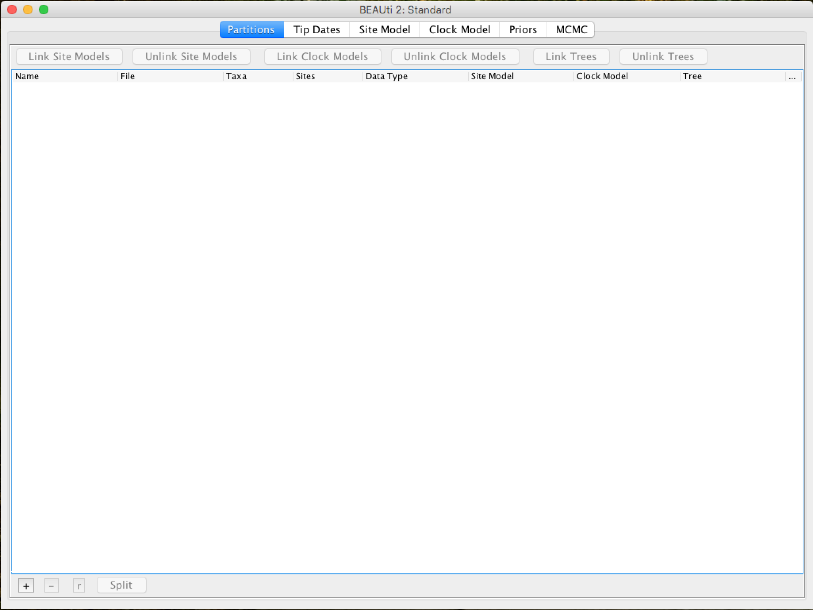

Para carregar o arquivo de alinhamento nexus, você tem duas opções:
* Clique em `File` e depois em `Import Alignment`.
* Clique no símbolo `+` no canto inferior esquerdo da tela.

O BEAUti também pode importar arquivos fasta (desde que as sequências estejam alinhadas) ou arquivos XML do BEAST. No entanto, neste último caso, apenas os dados serão importados, não os parâmetros e configurações da execução.

Uma vez carregado, o alinhamento será exibido em formato de tabela na janela principal:

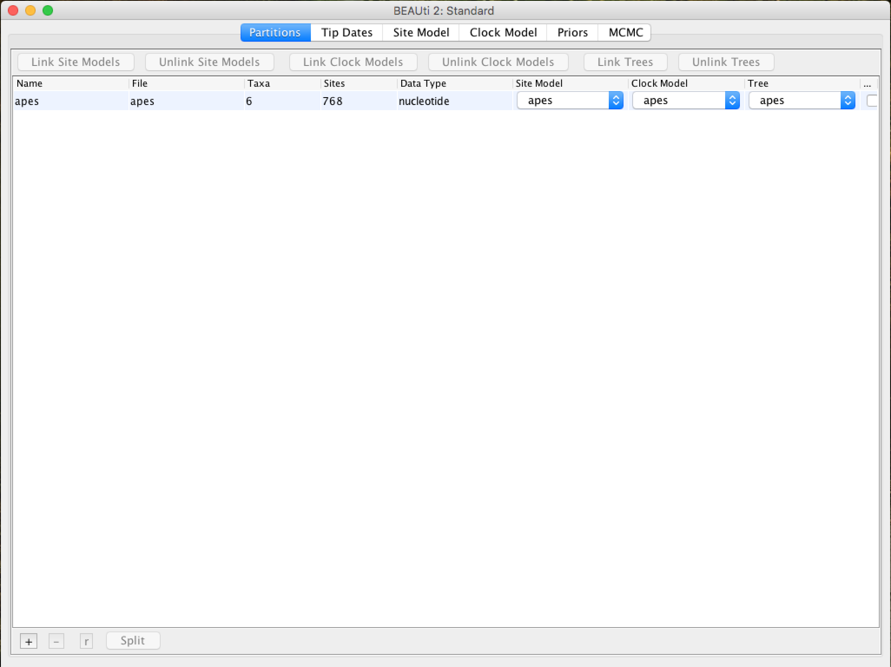

Ao clicar duas vezes na linha da tabela, o alinhamento pode ser visualizado (embora não seja bom):

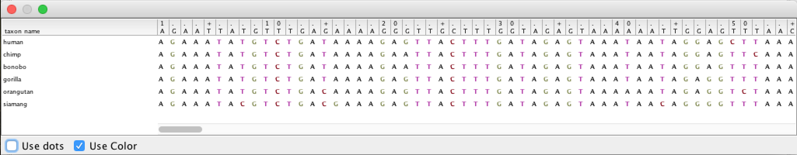

No topo da janela principal, uma série de abas pode ser observada:


Cada uma dessas abas possui configurações e opções. Em geral, você deve sempre trabalhar com elas da esquerda para a direita. No entanto, nem todos os guias serão relevantes para todas as análises. Após a aba Partitions, você pode ir para a aba chamada Tip Dates.

## Definindo as Tip Dates (quando aplicável)
A aba `Tip Dates` é usada para colocar datas para cada uma das taxas em sua análise. Nela, você verá uma tabela com todos os grupos taxonômicos que está analisando. As datas dos táxons (Tip dates) são importantes apenas em alguns casos, por exemplo, quando você está trabalhando com vírus de evolução rápida ou DNA de amostras antigas ou fósseis. No caso desta análise de primatas que estamos realizando neste tutorial, a árvore representa milhões de anos de evolução, então as datas podem ser assumidas como zero. Este é o padrão - todas as taxas têm data zero, e o uso da aba *Tip Dates* não está selecionado.

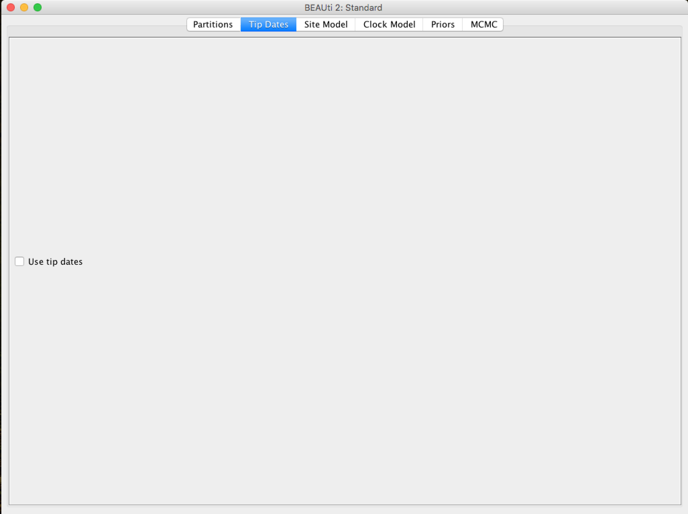

## Configurando o modelo evolutivo
Na aba `Site Model`, você pode ajustar o modelo de evolução molecular (modelo de substituição de nucleotídeos e aminoácidos) aos dados de sequência que você carregou (apes.nex). As opções exatas aparecerão dependendo do tipo de dado que você carregou (nucleotídeos, aminoácidos ou outra forma de dados). As opções que aparecerão após o carregamento dos dados de alinhamento `apes.nex` são as seguintes:

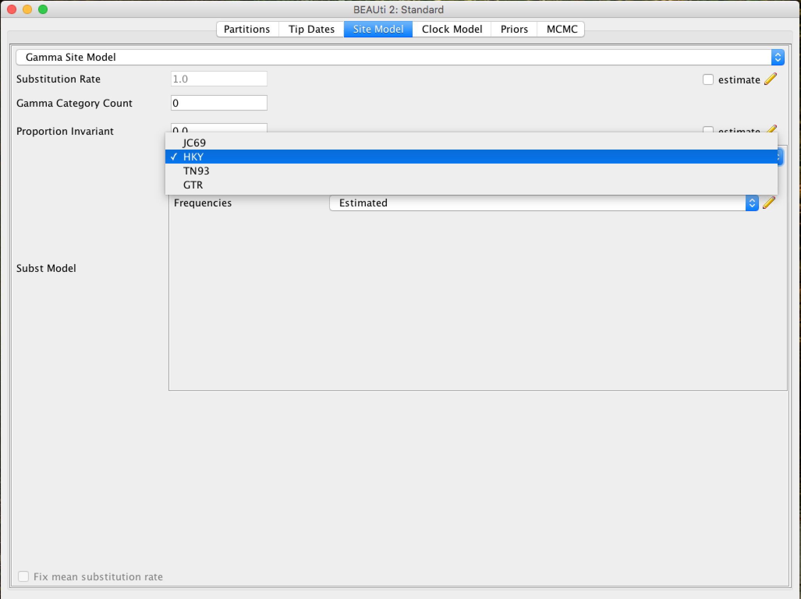

Este tutorial assume que você leu ou estudou os diferentes modelos evolutivos disponíveis. Nesta análise, usaremos o modelo [HKY](https://www.ncbi.nlm.nih.gov/pubmed/3934395).

>*Em versões anteriores do BEAST (1.7 ou 1.8) é mais fácil escolher as posições dos códons para executar a análise (é necessário um alinhamento baseado em códons). Se você precisar de análise de partição, terá que usar essas versões. No entanto, esses dados são de tRNAs mitocondriais, então essa opção não se aplicaria.*

## Configurando o Modelo de Relógio Molecular (*Molecular Clock*)
Na próxima aba, `Clock Model`, determinaremos o modelo de relógio molecular que será usado na análise. Ao contrário de muitos outros programas de análise filogenética, o BEAST usa exclusivamente modelos de relógio molecular para que as árvores tenham uma escala de tempo (uma raiz inferida e uma direção no tempo). O modelo mais simples é o *"Strict clock"* ou padrão de relógio restrito. Tal modelo assume que todos os ramos na árvore têm a mesma taxa de evolução. Outros modelos de relógio molecular relaxam essas suposições de várias maneiras, e outros tutoriais avançados podem ser usados para verificar sua aplicação.


Selecione *Strict Clock* e mude para a aba `Priors`.

## Definindo os *priors* (as priores)

É neste painel que os priors da análise Bayesiana serão determinados. Na primeira caixa de seleção, você pode colocar o modelo que fornecerá um `a priori` na árvore para a execução do MCMC.

A priori da árvore (*Tree Prior*) tem muitas possibilidades, geralmente divididas em modelos coalescentes (*Coalescent*), que geralmente são adequados para populações, e modelos de especiação (*Speciation*), que como o nome sugere são direcionados para dados em nível de espécie. 

Como o alinhamento que temos é de várias espécies, selecionaremos o modelo de [Yule](http://rstb.royalsocietypublishing.org/content/213/402-410/21), que é o modelo de especiação mais simples, onde se assume que cada linhagem apresentou especiação a uma taxa fixa.

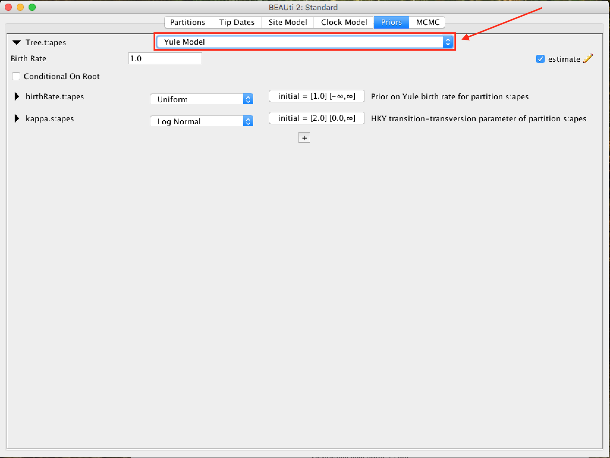

Para cada modelo a priori da árvore, os seguintes parâmetros específicos aparecem na janela. Cada parâmetro no modelo possui operadores, que especificam como os parâmetros mudam à medida que o MCMC gira. Para o modelo de Yule, apenas dois parâmetros são necessários: `kappa` - que significa a tendência de transições-transversões no modelo HKY; e a taxa de nascimento de novas espécies - `birthRate`.

O BEAST mantém razoavelmente os valores padrão para os priors de cada modelo. Selecionar os priors é um aspecto da análise BEAST que deve ser levado mais a sério. Somente modifique esses parâmetros se tiver certeza do que está fazendo, com conhecimento específico de cada um. No restante deste tutorial, usaremos esses valores padrão, então deixe-os como estão e vá para a aba `MCMC`.

## Definindo as Opções de Execução do MCMC

Nesta aba, teremos as configurações para executar a análise Bayesiana pelo BEAST.

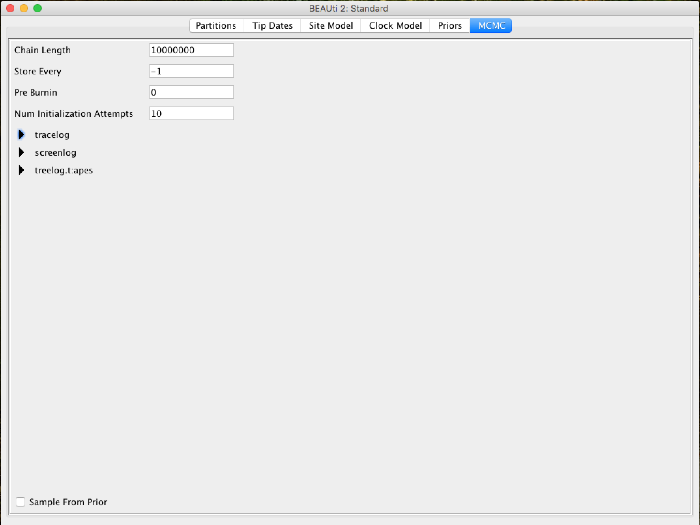

Primeiro temos o comprimento da cadeia (*ou referido como o número de gerações*). Este é o número de passos que o MCMC fará na cadeia antes de finalizar o processo. Quão longo deve ser depende do tamanho do conjunto de dados, da complexidade do modelo e da qualidade da resposta exigida. Neste caso, o valor padrão é totalmente arbitrário e deve ser ajustado de acordo com o tamanho do conjunto de dados que será analisado. Para verificar se o tamanho da cadeia é adequado, o arquivo de log resultante (*arquivo log*) pode ser analisado usando o programa **Tracer** (verificaremos isso mais tarde). O objetivo de selecionar um tamanho de cadeia adequado é alcançar um tamanho de amostra efetivo razoável (*ESS - Effective Sample Size*).

> 📌 *Maneiras de alcançar um ESS adequado podem ser verificadas em outros tutoriais da [comunidade BEAST](beast.community).*

As opções seguintes especificam o quanto tais parâmetros devem ser registrados no arquivo de log `tracelog` e mostrados na tela `screenlog`.

Para o `tracelog`, o valor deve ser relativo ao valor total do tamanho da cadeia. Realizar uma amostragem muito frequente (registro de valor) resultará em arquivos enormes com pouco benefício extra em termos de precisão. Por outro lado, amostrar com pouca frequência resultará em um arquivo de log sem informações suficientes sobre as distribuições dos parâmetros. Normalmente, 10.000 amostragens é um número adequado, e para armazenar isso, basta colocar um número que seja o tamanho da cadeia / 10.000. As outras opções podem ser deixadas com os valores padrão (ressaltando novamente que no BEAST, os padrões são razoáveis).

Para este conjunto de dados (que é bastante pequeno), iniciaremos a análise com um tamanho de cadeia de 1.000.000, pois este valor será executado muito rapidamente na maioria dos computadores atuais. Portanto, coloque o registro de frequência (amostragem) no arquivo de log para 100.


A saída da tela é simplesmente para monitorar o progresso da execução do BEAST, então qualquer valor pode ser colocado (no entanto, se você escolher um valor muito pequeno, a quantidade de informação que aparecerá na tela pode tornar o terminal do programa lento).

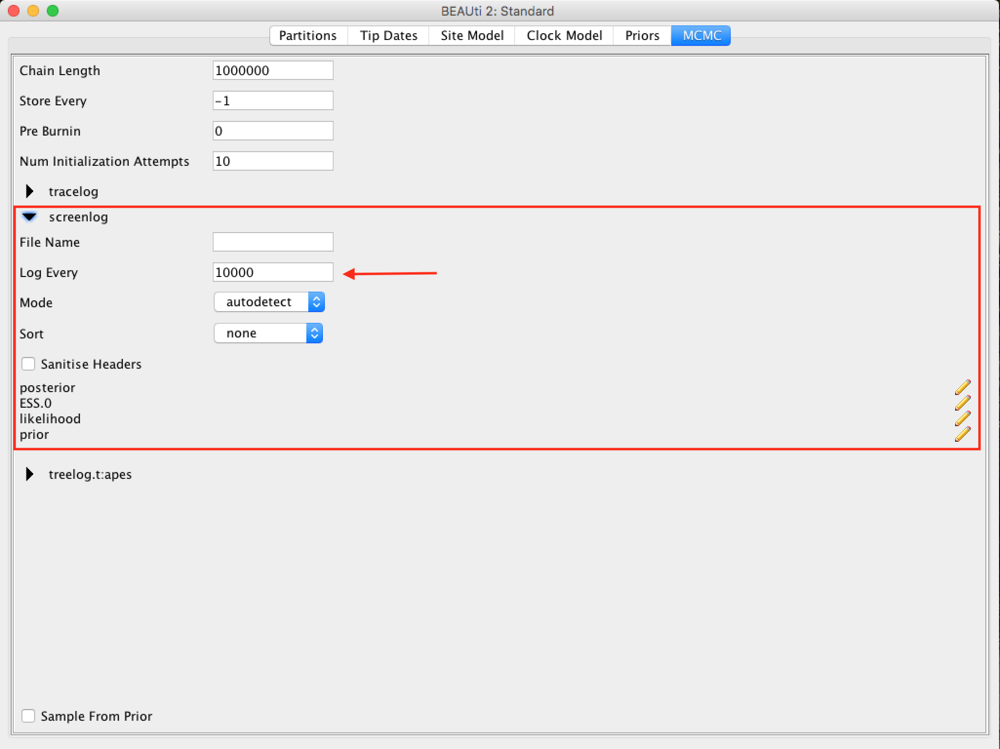

>📌 *A frequência de amostragem do log de tela e do log de rastreamento pode ser diferente. Neste caso, nossa análise será executada muito rapidamente, então amostrar o log de tela a cada 100 passos causará um movimento rápido na tela devido a uma grande quantidade de informação.*

Para a opção `treelog`, deixe o mesmo número de amostragem em `tracelog`.


## Salvando e carregando os arquivos BEAUti

Ao selecionar `Save` no menu `File`, um arquivo no formato BEAUti será salvo. Note que este não é o formato que o BEAST "entende" - o BEAUti apenas o reabrirá. Desta forma, as configurações e os dados podem ser salvos e carregados posteriormente. Salve os arquivos BEAUti com a extensão `.beauti`.

>*Como os arquivos BEAUti não podem ser lidos e "entendidos" pelo BEAST, você não pode abrir os arquivos XML do BEAST diretamente no BEAUti. Se necessário, eles podem ser importados da mesma forma que arquivos FASTA ou NEXUS. Os dados da sequência, as `Tip Dates` e outras informações serão importados.*

## Gerando o arquivo XML do BEAST

O arquivo XML do BEAST pode agora ser criado. Selecione `Save as...` no menu `File` e salve-o com um nome apropriado. Não se esqueça de adicionar a extensão `.xml`, ao salvar. Em Computadores Agora o arquivo está pronto para ser executado com o BEAST.

## Executando o BEAST

Execute o BEAST2 clicando no seguinte ícone:


A seguinte janela aparecerá:

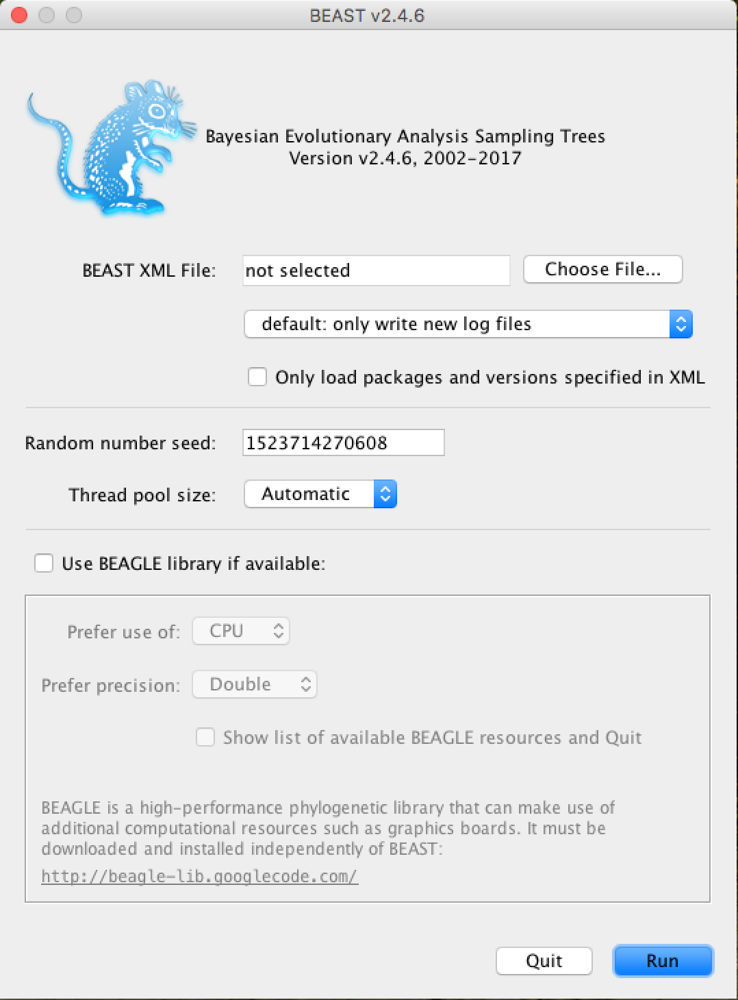

A partir de agora, tudo o que você precisa fazer é clicar em `Choose File...`, selecionar o arquivo XML que você salvou nos passos anteriores e pressionar `Run`.

------

**Usando GPU**

*Para acelerar a análise com conjuntos de dados maiores e/ou tamanhos de cadeia MCMC maiores, a instalação da biblioteca BEAGLE é fortemente recomendada, especialmente se você tiver uma placa de vídeo com suporte CUDA (GPU). No BEAST1.x, a biblioteca BEAGLE pode ser executada diretamente desta janela. Na versão 2, recomenda-se instalar o JAVA JDK e executar o BEAST2 a partir da linha de comando do terminal (em computadores com sistemas baseados em Unix). A configuração da instrução beagle_SSE também acelera drasticamente a análise de computadores com processadores mais recentes. Um exemplo de um comando geral para executar o BEAST2 a partir de um terminal é:*

```
/bin/beast -beagle_CPU -beagle_SSE -threads 4 -instances 4 -overwrite nome_do_arquivo.xml
```
*A janela para execução nas versões BEAST1.x é muito semelhante.*

----

Ao executar, o BEAST (em qualquer versão) carregará o arquivo XML, configurará a análise e a executará sem interação adicional. Começa com o título e os créditos do software. Você verá a tela de saída, com várias informações, semelhante à de baixo:

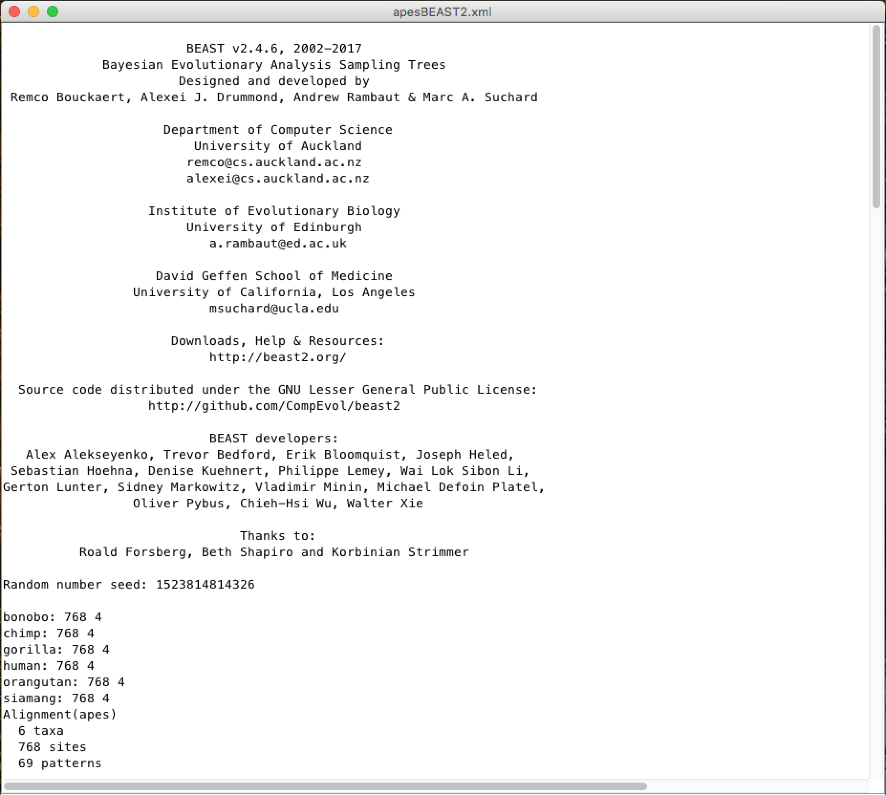

Um pouco mais abaixo, nesta mesma janela, você poderá ver as citações dos modelos usados e o log de tela da cadeia MCMC, com uma estimativa do tempo da análise (unidade de tempo / Milhões de amostras):

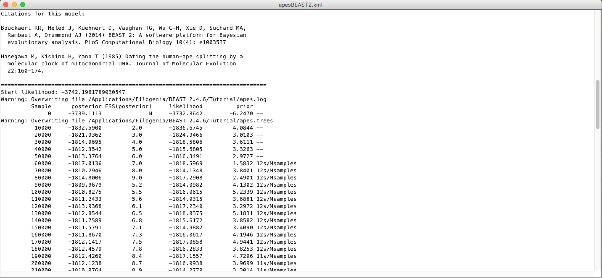

E no final, um diagnóstico da adequação dos parâmetros da análise ao grupo de dados:

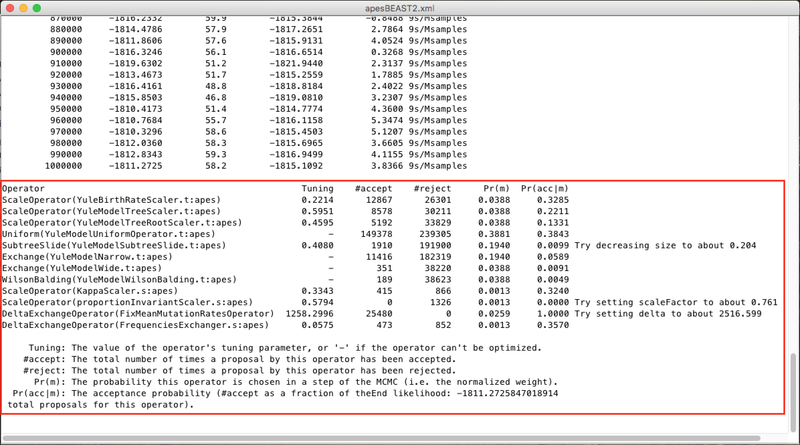

>*Para saber mais sobre as alterações nesses parâmetros, procure a documentação do BEAST. Somente os altere com absoluta certeza do que está fazendo.*

Após a execução, o BEAST gera os seguintes arquivos que você usará posteriormente:

- Arquivo `.log` (com o log da análise Bayesiana MCMC).
- Arquivo `.trees` (com todas as árvores geradas e registradas).

## Analisando o arquivo de log com o TRACER

[Tracer]((http://tree.bio.ed.ac.uk/software/tracer/) é um programa para analisar os arquivos gerados pelas execuções Bayesianas MCMC (ou seja, os valores contínuos dos parâmetros amostrados da cadeia). A análise com o **Tracer** é muito detalhada. Para fins de simplicidade neste tutorial, comentaremos apenas sobre os parâmetros reais do tamanho da amostra para verificar se há uma maior necessidade de amostragem ou tamanho de cadeia maior.

>*O **Tracer** é um download separado dos pacotes do BEAST.*

Execute o **TRACER** clicando no ícone:


Quando aberto, o **Tracer** mostrará a seguinte janela:

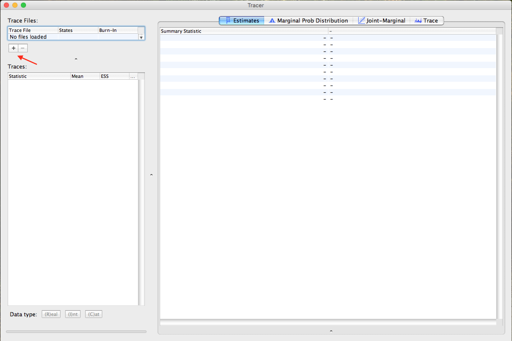

Para abrir o arquivo de log de rastreamento MCMC (arquivo `.log`), clique no símbolo `+` logo abaixo de `Trace Files` (indicado pela seta na figura acima). Após este passo, uma janela como esta deve ser exibida:

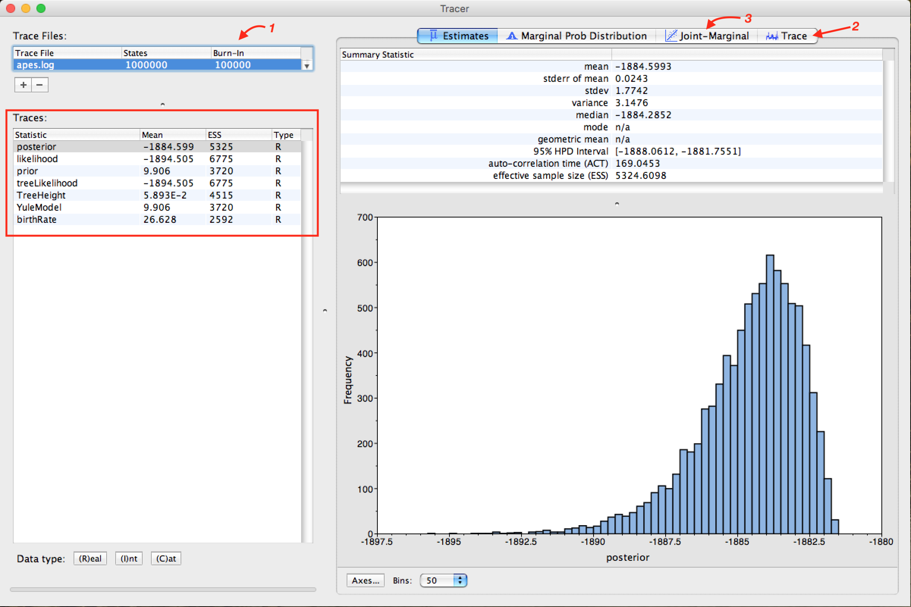

Note que a <span style="color:red">***Seta 1***</span> mostrada na figura acima está indicando que o Tracer atribui 10% para ***Burn-In***. Este é o número de passos no início da cadeia que é descartado da análise, que tende a apresentar uma maior variação nos parâmetros.

>*O descarte ou burn-in de 10% do tamanho total da cadeia é o recomendado. No entanto, isso pode ser alterado. Este valor pode ser aumentado em execuções com tamanhos de cadeia MCMC maiores. docs/MEGAX_ENG.md*

Observe os parâmetros destacados pela moldura vermelha. Em todos, os valores na coluna **ESS** (*Effective Sample Size*) devem estar em preto. Isso demonstra que os valores são adequados para análise. Quando não estão, são marcados nas cores <span style="color:orange">laranja</span>, que indica que estão parcialmente adequados, ou <span style="color:red">vermelho</span>, que indica que não estão adequados. Os parâmetros que devem ser analisados inicialmente são posterior, *likelihood* e os parâmetros estatísticos do modelo como *prior ou YuleModel.*

Para corresponder às estatísticas dos parâmetros que o ESS está marcado em vermelho, você pode aumentar o tamanho da cadeia e, dependendo do parâmetro, alterações nos priors no arquivo XML com BEAUti devem ser realizadas. A análise desses parâmetros e as indicações de diagnóstico do BEAST ao final de cada execução são fortemente recomendadas.

Clique na <span style="color:red">***Seta 2***</span> e o ***Trace*** da execução pode ser observado. A parte cinza no Trace demonstra exatamente o ***Burn-In*** empregado na análise, como pode ser visto na figura abaixo:

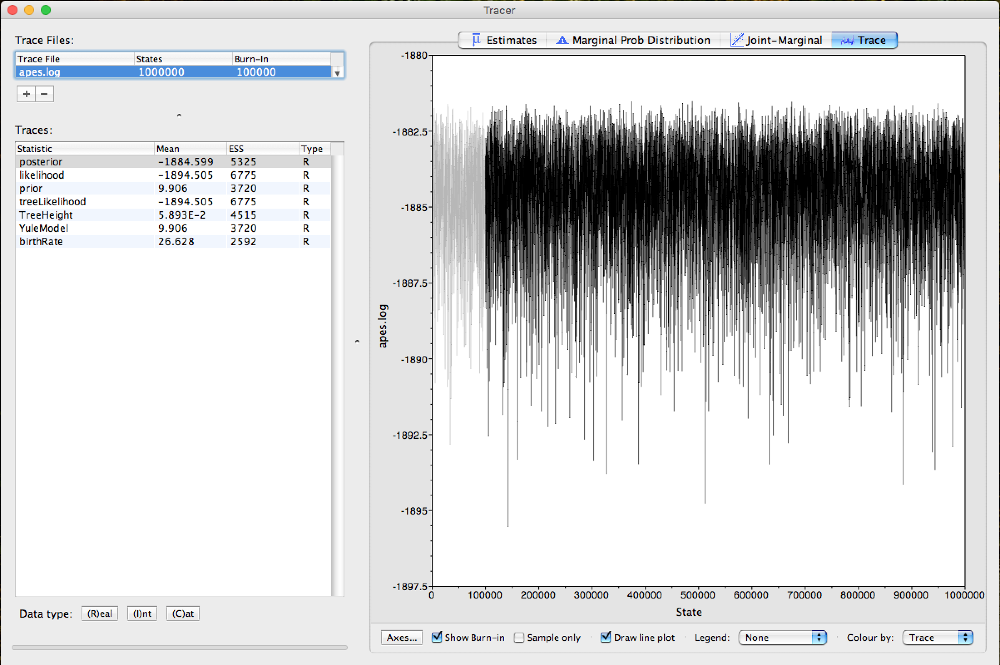

>*Este mesmo burn-in também será usado ao resumir as árvores da análise Bayesiana.*

Finalmente, selecione as estatísticas dos parâmetros posterior e likelihood (usando a tecla `ctrl` no seu teclado) e clique no local indicado pela <span style="color:red">***Seta***</span>. O **Tracer** retornará um gráfico da distribuição de pontos dos 2 parâmetros, semelhante à figura abaixo:

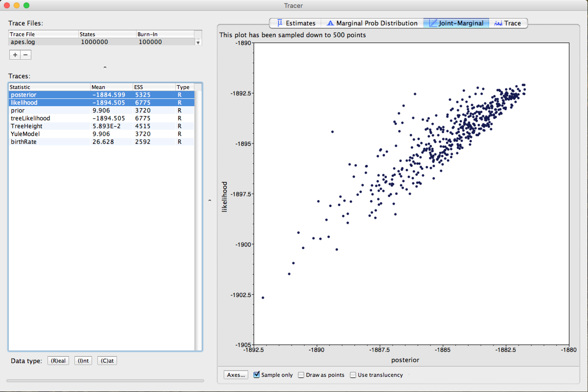

Para maiores detalhes sobre a análise com o **Tracer** e suas outras funções, leituras aprofundadas sobre Inferência Bayesiana, o manual/*readme* do **Tracer** e a comunidade BEAST são recomendadas.

## Resumo e Visualização das Árvores Geradas

Agora vamos trabalhar com o arquivo `.trees`, gerado pelo BEAST. Como descrito anteriormente, este arquivo possui cada árvore gerada e registrada pela análise MCMC. Como tivemos um tamanho de cadeia de 1.000.000 e pedimos para fazer registros a cada 100 (o mesmo que o `trace log`), teremos um arquivo com 10.000 árvores.

Temos que resumir todas essas árvores, em uma, com os valores de probabilidades *a posteriori* (PP) em cada nó da árvore. Para isso, usaremos um programa fornecido com o BEAST, chamado **TreeAnnotator**. Para executá-lo, clique em seu respectivo ícone:


Uma janela semelhante à de baixo aparecerá:

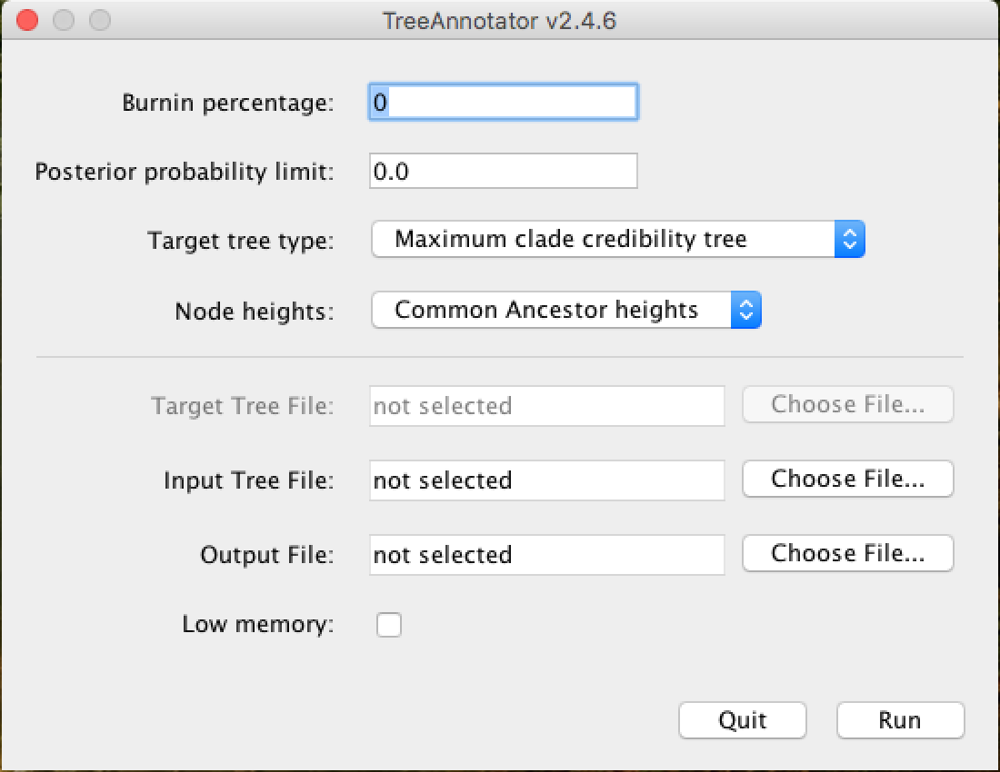

Na caixa ***Burnin percentage***, você colocará a porcentagem de *burn-in* desta análise, ou seja, as primeiras árvores geradas que serão descartadas da análise por estarem no início da cadeia.

A opção ***Posterior probability*** limit serve para evitar a resolução de nós da árvore abaixo do limite de PP inserido neste campo. Por exemplo, se você colocar o limite de 50, nós com menos de 50 PP não serão resolvidos.

Nas opções ***Target tree type*** e ***Node heights*** escolha as opções demonstradas na figura acima, de ***Maximum clade credibility tree*** e ***Common Ancestor heights***, respectivamente.

No campo ***Input Tree File***, você clicará em Choose File... e adicionará o `.trees` gerado na análise. E no campo ***Output File***, você também clicará em `Choose File...`, neste caso, você nomeará o arquivo e o inserirá na pasta de sua escolha. Não se esqueça de colocar a extensão `.tree` no final do nome do arquivo para que os programas de visualização de árvores o reconheçam mais facilmente.

Um programa recomendado para visualização de árvores é o programa **FigTree**, que pode ser obtido [AQUI](http://tree.bio.ed.ac.uk/software/figtree/).

O arquivo `.trees` gerado também pode ser visualizado com o programa **DensiTree**. Este programa faz uma representação esquemática com todas as árvores, facilitando a análise de inconsistências. **DensiTree** pode ser executado pelo ícone:


