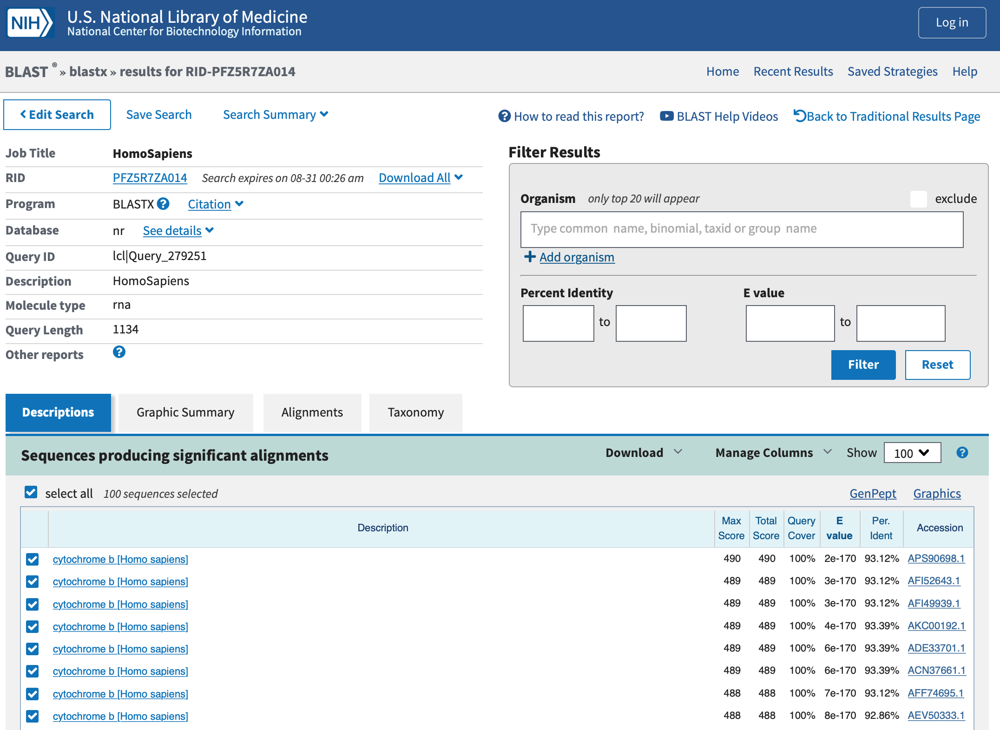
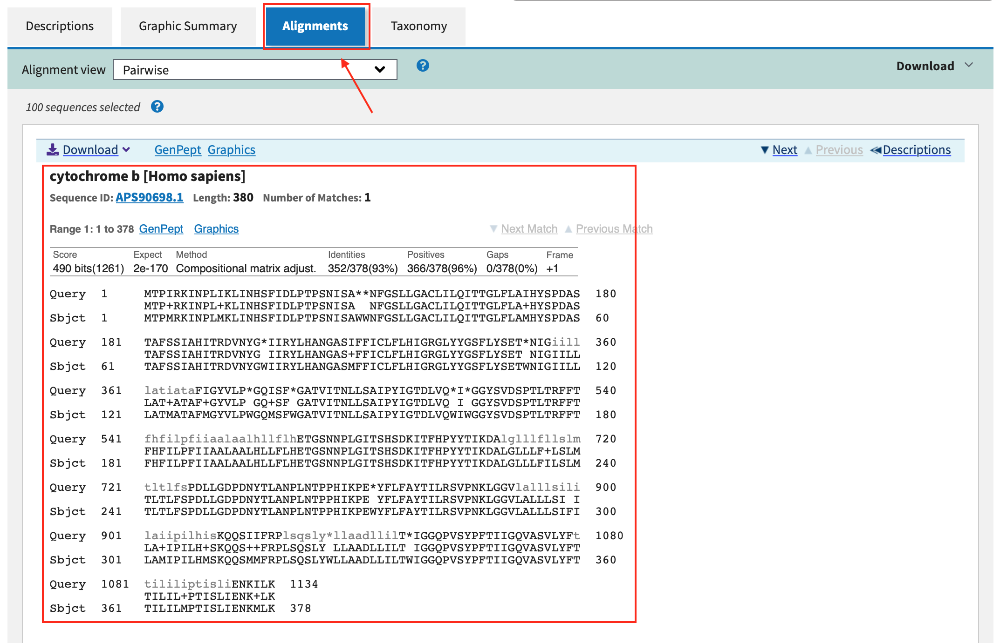
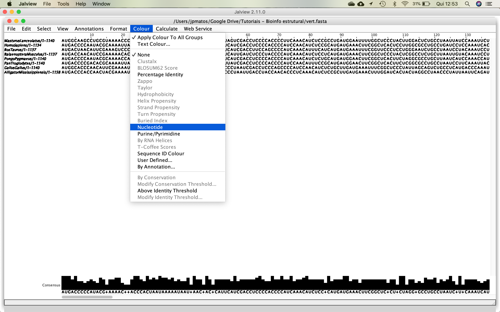
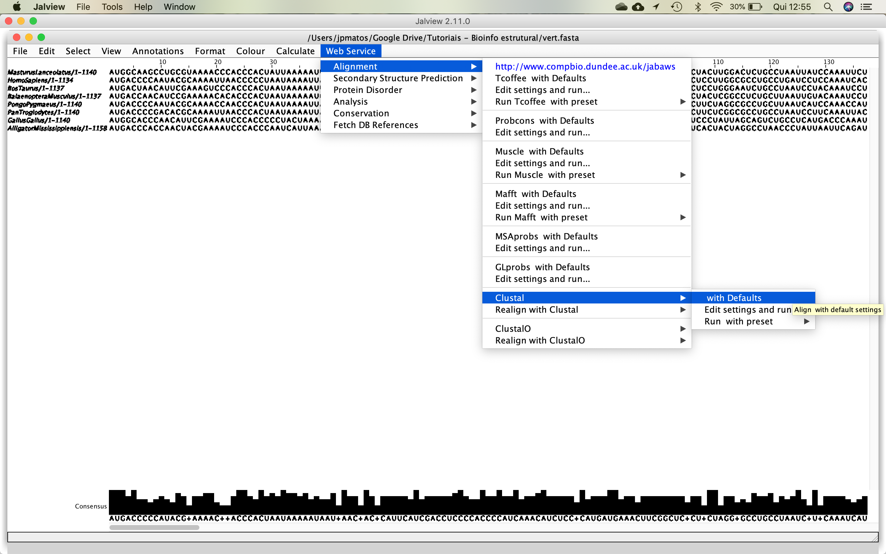
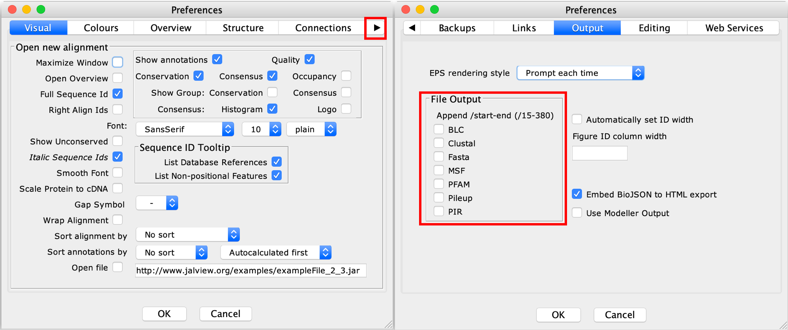

# First Tutorial

## 1st Part - Knowing your sequences

To execute a phylogenetic analysis, the first thing you're going to have to do is to find a suitable marker (nucleotide or protein sequence). Then, you will construct the dataset (i.e., a Multiple Sequence Alignment - MSA) to use in the subsequent phylogeny pipeline.

In this example, you're going to start from sequences below, using the .fasta file.

The first thing to do is to identify this sequence using BLAST searches. For this, you can use BLASTn or BLASTx.

```
>HomoSapiens
AUGACCCCAAUACGCAAAAUUAACCCCCUAAUAAAAUUAAUUAACCACUCAUUCAUCGAC
CUCCCCACCCCAUCCAACAUCUCCGCAUGAUGAAACUUCGGCUCACUCCUUGGCGCCUGC
CUGAUCCUCCAAAUCACCACAGGACUAUUCCUAGCCAUACACUACUCACCAGACGCCUCA
ACCGCCUUUUCAUCAAUCGCCCACAUCACUCGAGACGUAAAUUAUGGCUGAAUCAUCCGC
UACCUUCACGCCAAUGGCGCCUCAAUAUUCUUUAUCUGCCUCUUCCUACACAUCGGGCGA
GGCCUAUAUUACGGAUCAUUUCUCUACUCAGAAACCUGAAACAUCGGCAUUAUCCUCCUG
CUUGCAACUAUAGCAACAGCCUUCAUAGGCUAUGUCCUCCCGUGAGGCCAAAUAUCAUUC
UGAGGGGCCACAGUAAUUACAAACUUACUAUCCGCCAUCCCAUACAUUGGGACAGACCUA
GUUCAAUGAAUCUGAGGAGGCUACUCAGUAGACAGUCCCACCCUCACACGAUUCUUUACC
UUUCACUUCAUCUUACCCUUCAUUAUUGCAGCCCUAGCAGCACUCCACCUCCUAUUCUUG
CACGAAACGGGAUCAAACAACCCCCUAGGAAUCACCUCCCAUUCCGAUAAAAUCACCUUC
CACCCUUACUACACAAUCAAAGACGCCCUCGGCUUACUUCUCUUCCUUCUCUCCUUAAUG
ACAUUAACACUAUUCUCACCAGACCUCCUAGGCGACCCAGACAAUUAUACCCUAGCCAAC
CCCUUAAACACCCCUCCCCACAUCAAGCCCGAAUGAUAUUUCCUAUUCGCCUACACAAUU
CUCCGAUCCGUCCCUAACAAACUAGGAGGCGUCCUUGCCCUAUUACUAUCCAUCCUCAUC
CUAGCAAUAAUCCCCAUCCUCCAUAUAUCCAAACAACAAAGCAUAAUAUUUCGCCCACUA
AGCCAAUCACUUUAUUGACUCCUAGCCGCAGACCUCCUCAUUCUAACCUGAAUCGGAGGA
CAACCAGUAAGCUACCCUUUUACCAUCAUUGGACAAGUAGCAUCCGUACUAUACUUCACA
ACAAUCCUAAUCCUAAUACCAACUAUCUCCCUAAUUGAAAACAAAAUACUCAAA
```

Often the target sequence is obtained by DNA sequencing (in genome or transcriptome designs), as these methods are usually more accessible than methods of obtaining amino acid sequences. To search for similarity from the nucleotide coding sequence, you have two options:

- Translate the nucleotide sequence into the 3 frames (open reading frames - ORFs) and to use the resulting sequences as input in BLASTp similarity searches. This translation can be done using tools from [EXPASY](https://web.expasy.org/cgi-bin/translate/dna2aa.cgi) or [EBI](https://www.ebi.ac.uk/Tools/st/).
- Use [BLASTx](https://blast.ncbi.nlm.nih.gov/Blast.cgi?PROGRAM=blastx&PAGE_TYPE=BlastSearch&BLAST_SPEC=&LINK_LOC=blasttab&LAST_PAGE=blastn&QUERY=AB823629.1). This variation of BLAST translates the input nucleotide sequence (Query) and compares it to protein banks.

To be more straightforward, you could use [BLASTx](https://blast.ncbi.nlm.nih.gov/Blast.cgi?PROGRAM=blastx&PAGE_TYPE=BlastSearch&BLAST_SPEC=&LINK_LOC=blasttab&LAST_PAGE=blastn&QUERY=AB29).

**Steps:**

- Open the [NCBI-BLAST](https://blast.ncbi.nlm.nih.gov/Blast.cgi) site.


- Click in blastx. The following page will open. Paste your sequence in the indicated field and choose the nr database. Then you can click ```BLAST``` button.


- After a few moments, the BLAST search result will appear, as below:



- Click in Alignments and analyze the results.



> You can also translate the sequence using the frame +1 and perform a BLASTp search with the resulting amino acid sequence.

### Questions

1- Which do protein this sequence codes?
2- What is the function of this protein?

## 2nd Part - Sequence Alignment

Let us suppose that you want to infer phylogeny, using the above sequence. And using BLAST searches, you retrieved homologous sequences from other vertebrate species. All you have to do is to find homologous sequences using BLAST searches. However, sometimes it is better to restrict the search database, excluding the species *Homo sapiens*, using the option ```Organism``` from the initial BLAST page.

> *We're going to give you these sequences, to save you time from getting them.*

So, for example, you've got the following sequences:

```
>Masturus_lanceolatus
AUGGCAAGCCUGCGUAAAACCCACCCACUAUUAAAAAUUGCAAACGACGCACUAGUCGAC
CUCCCCACCCCUUCAAACAUCUCCGCCUGAUGGAAUUUUGGCUCCCUACUUGGACUCUGC
CUAAUUAUCCAAAUUCUUACUGGACUAUUCCUCGCAAUACAUUACACCUCCGAUAUCGCU
ACUGCAUUCUCAUCCGUGGCACAUAUUUGCCGAGAUGUAAACUACGGCUGACUCAUCCGC
AACCUGCAUGCUAACGGAGCAUCUUUCUUCUUUAUUUGUAUUUAUAUGCACAUCGCCCGA
GGCCUAUACUAUGGCUCCUACCUCUAUAAAGAAACCUGAAACGUCGGAGUAGUCCUAUUA
CUCUUGGUCAUGGCGACCGCUUUCGUAGGCUACGUACUUCCCUGAGGACAAAUAUCUUUC
UGGGGCGCUACUGUUAUUACUAACCUCUUCUCCGCCGUCCCCUAUGUGGGCGAUGCCCUC
GUACAAUGGAUCUGAGGAGGAUUCUCAGUUGACAACGCCACAUUAACACGAUUCUUUGCC
UUCCAUUUCCUCCUCCCCUUCAUCGUUACAGCAGUCACCCUAAUCCAUUUACUAUUCCUC
CACGAAACAGGCUCAAAUAACCCCCUGGGGCUAAGUUCAAACACGGACAAAAUCUCUUUC
CACCCUUACUUCUCCUACAAAGAUCUCUUAGGCUUCACAAUCAUGCUUAUUGCCCUCACA
UCCCUAGCACUCUUCUCCCCCAACCUCCUGGGAGACCCUGACAACUUCACCCCCGCCAAC
CCCCUUGUCACCCCACCCCACAUCAAGCCCGAGUGAUACUUCCUGUUCGCUUACGCCAUU
CUUCGCUCCAUCCCAAAUAAAUUAGGAGGAGUCCUUGCCUUGCUGGCCUCCAUCCUAGUC
CUAAUAGUCGUACCGCUUCUCCACACAUCCAAACAGCGAGGCCUCACGUUCCGCCCCCUU
ACCCAAUUCCUAUUUUGAACCUUAAUUGCCAACAUUAUUAUUCUAACAUGAAUUGGAGGA
AUACCCGUAGAACACCCAUUCGUGAUCAUCGGCCAAAUCGCCUCCGUCCUUUACUUCUCC
CUAUUCCUAGUCUUCAUCCCCCUCACAGGCUGACUAGAAAACAAAGCCCUUGAAUGGUCC
>Homo_sapiens
AUGACCCCAAUACGCAAAAUUAACCCCCUAAUAAAAUUAAUUAACCACUCAUUCAUCGAC
CUCCCCACCCCAUCCAACAUCUCCGCAUGAUGAAACUUCGGCUCACUCCUUGGCGCCUGC
CUGAUCCUCCAAAUCACCACAGGACUAUUCCUAGCCAUACACUACUCACCAGACGCCUCA
ACCGCCUUUUCAUCAAUCGCCCACAUCACUCGAGACGUAAAUUAUGGCUGAAUCAUCCGC
UACCUUCACGCCAAUGGCGCCUCAAUAUUCUUUAUCUGCCUCUUCCUACACAUCGGGCGA
GGCCUAUAUUACGGAUCAUUUCUCUACUCAGAAACCUGAAACAUCGGCAUUAUCCUCCUG
CUUGCAACUAUAGCAACAGCCUUCAUAGGCUAUGUCCUCCCGUGAGGCCAAAUAUCAUUC
UGAGGGGCCACAGUAAUUACAAACUUACUAUCCGCCAUCCCAUACAUUGGGACAGACCUA
GUUCAAUGAAUCUGAGGAGGCUACUCAGUAGACAGUCCCACCCUCACACGAUUCUUUACC
UUUCACUUCAUCUUACCCUUCAUUAUUGCAGCCCUAGCAGCACUCCACCUCCUAUUCUUG
CACGAAACGGGAUCAAACAACCCCCUAGGAAUCACCUCCCAUUCCGAUAAAAUCACCUUC
CACCCUUACUACACAAUCAAAGACGCCCUCGGCUUACUUCUCUUCCUUCUCUCCUUAAUG
ACAUUAACACUAUUCUCACCAGACCUCCUAGGCGACCCAGACAAUUAUACCCUAGCCAAC
CCCUUAAACACCCCUCCCCACAUCAAGCCCGAAUGAUAUUUCCUAUUCGCCUACACAAUU
CUCCGAUCCGUCCCUAACAAACUAGGAGGCGUCCUUGCCCUAUUACUAUCCAUCCUCAUC
CUAGCAAUAAUCCCCAUCCUCCAUAUAUCCAAACAACAAAGCAUAAUAUUUCGCCCACUA
AGCCAAUCACUUUAUUGACUCCUAGCCGCAGACCUCCUCAUUCUAACCUGAAUCGGAGGA
CAACCAGUAAGCUACCCUUUUACCAUCAUUGGACAAGUAGCAUCCGUACUAUACUUCACA
ACAAUCCUAAUCCUAAUACCAACUAUCUCCCUAAUUGAAAACAAAAUACUCAAA
>Bos_taurus
AUGACUAACAUUCGAAAGUCCCACCCACUAAUAAAAAUUGUAAACAAUGCAUUCAUCGAC
CUUCCAGCCCCAUCAAACAUUUCAUCAUGAUGAAAUUUCGGUUCCCUCCUGGGAAUCUGC
CUAAUCCUACAAAUCCUCACAGGCCUAUUCCUAGCAAUACACUACACAUCCGACACAACA
ACAGCAUUCUCCUCUGUUACCCAUAUCUGCCGAGACGUGAACUACGGCUGAAUCAUCCGA
UACAUACACGCAAACGGAGCUUCAAUGUUUUUUAUCUGCUUAUAUAUGCACGUAGGACGA
GGCUUAUAUUACGGGUCUUACACUUUUCUAGAAACAUGAAAUAUUGGAGUAAUCCUUCUG
CUCACAGUAAUAGCCACAGCAUUUAUAGGAUACGUCCUACCAUGAGGACAAAUAUCAUUC
UGAGGAGCAACAGUCAUCACCAACCUCUUAUCAGCAAUCCCAUACAUCGGCACAAAUUUA
GUCGAAUGAAUCUGAGGCGGAUUCUCAGUAGACAAAGCAACCCUUACCCGAUUCUUCGCU
UUCCAUUUUAUCCUUCCAUUUAUCAUCAUAGCAAUUGCCAUAGUCCACCUACUAUUCCUC
CACGAAACAGGCUCCAACAACCCAACAGGAAUUUCCUCAGACGUAGACAAAAUCCCAUUC
CACCCCUACUAUACCAUUAAGGACAUCUUAGGGGCCCUCUUACUAAUUCUAGCUCUAAUA
CUACUAGUACUAUUCGCACCCGACCUCCUCGGAGACCCAGAUAACUACACCCCAGCCAAU
CCACUCAACACACCCCCUCACAUCAAACCCGAGUGAUACUUCUUAUUUGCAUACGCAAUC
UUACGAUCAAUCCCCAACAAACUAGGAGGAGUACUAGCCCUAGCCUUCUCUAUCCUAAUU
CUUGCUCUAAUCCCCCUACUACACACCUCCAAACAACGAAGCAUAAUAUUCCGACCACUC
AGCCAAUGCCUAUUCUGAGCCCUAGUAGCAGACCUACUGACACUCACAUGAAUUGGAGGA
CAACCAGUCGAACACCCAUAUAUCACCAUCGGACAACUAGCAUCUGUCCUAUACUUUCUC
CUCAUCCUAGUGCUAAUACCAACGGCCGGCACAAUCGAAAACAAAUUACUAAAAUGA
>Balaenoptera_musculus
AUGACCAACAUCCGAAAAACACACCCACUAAUAAAAAUCAUCAACGAUGCAUUCAUUGAU
CUCCCUACCCCAUCAAACAUCUCCUCAUGAUGAAACUUCGGCUCCCUACUCGGCCUCUGC
UUAAUUGUACAAAUCCUAACAGGCCUAUUCCUAGCAAUACACUAUACACCAGACACAAUA
ACCGCCUUCUCAUCAGUCACACAUAUUUGCCGAGACGUAAACUAUGGCUGAGUUAUUCGG
UACUUACAUGCAAACGGAGCCUCCAUAUUCUUCAUCUGCCUCUACGCCCACAUGGGACGA
GGUCUAUACUACGGCUCCCACGCUUUUCGAGAAACAUGAAAUAUUGGAGUUAUUCUACUA
UUCACGGUCAUAGCCACUGCAUUCGUAGGCUACGUCCUGCCCUGAGGACAAAUAUCAUUC
UGAGGCGCAACCGUCAUCACCAACCUCCUAUCAGCAAUCCCAUACAUUGGUACUACCCUA
GUCGAAUGAAUCUGAGGCGGUUUUUCUGUGGAUAAAGCAACACUAACACGCUUCUUUGCC
UUCCACUUCAUUCUCCCCUUCAUCAUUAUAGCAUUAGCAAUCGUCCACCUCAUCUUCCUU
CACGAAACAGGAUCCAACAACCCCACAGGUAUCCCAUCUGACAUAGAUAAAAUUCCAUUC
CACCCCUACUACACAAUUAAAGACAUUCUAGGCGCCCUACUACUAAUCCUAACCCUACUA
AUAUUAACUCUAUUUGCACCCGACUUACUCGGAGACCCAGACAACUACACCCCAGCAAAC
CCACUCAGUACCCCAGCACACAUUAAACCAGAGUGAUAUUUCCUAUUUGCAUAUGCAAUC
CUACGAUCAAUCCCCAACAAAUUAGGCGGAGUCUUAGCCCUACUACUCUCAAUCCUAGUC
CUAGCUCUAAUCCCAAUACUCCACACAUCCAAACAACGAAGCAUAAUAUUCCGACCCUUU
AGCCAAUUCCUGUUUUGAGUACUGGUCGCAGACCUACUCACCCUAACGUGGAUCGGCGGC
CAACCCGUAGAACACCCCUAUGUAAUUGUAGGCCAACUCGCAUCCAUCCUCUACUUCCUC
UUAAUUCUAGUGUUAAUACCAGUAACUAGUCUUAUCGAAAAUAAACUUAUAAAAUGA
>Pongo_pygmaeus
AUGACCCCAAUACGCAAAACCAACCCACUAAUAAAAUUAAUUAACCACUCACUCAUCGAC
CUCCCCACCCCAUCAAACAUCUCUGCAUGAUGGAACUUCGGCUCACUUCUAGGCGCCUGC
UUAAUCAUCCAAACCAUCACUGGACUAUUCCUAGCCAUACAUUACUCACCAGACGCCACU
ACCGCCUUUUCAUCAAUCGCCCAUAUUACUCGAGAUGUAAACUACGGCUGAAUAAUCCGC
CACCUUCACGCUAACGGCGCCUCAAUGCUCUUUAUCUGCCUCUUCCUACACAUUGGCCGA
GGCUUAUACUAUGGCUCAUUCACCCACUUAGAAACCUGAAACAUUGGUAUUAUCCUACUG
UUUAUAACCAUAAUAACAGCCUUCAUAGGCUACGUCCUCCCAUGAGGCCAAAUAUCCUUC
UGAGGAGCCACAGUAAUUACAAACCUAUUAUCCGCCGUCCCAUACAUUGGAACAGACCUA
GUCCAAUGGGUCUGAGGGGGCUACUCAGUAAAUAGCCCCACUCUAACACGAUUCUUUACC
CUUCACUUCAUACUACCUUUCAUCAUUACAGCUCUAACAACCCUUCACCUCCUAUUCCUU
CACGAAACAGGAUCAAAUAACCCCCUGGGAAUCCCCUCCCACUCCGAUAAAAUCACUUUC
CACCCCUACUAUACAAUUAAAGACAUCCUAGGCCUACUCCUUUUUCUCCUCGCCCUAAUA
ACAUUAACACUACUCUCACCAGACCUCCUAAGCGACCCAGACAACUACACCUUAGCUAAC
CCCCUAAGCACCCCACCCCACAUUAAGCCCGAAUGAUACUUCCUAUUCGCCUACGCAAUC
CUACGAUCCGUCCCCAACAAACUAGGAGGUGUAAUAGCCCUCAUGCUAUCUAUCCUAAUC
CUAACAACAAUCCCCGCUCUCCACACAUCCAAGCAACAGAGCAUAACAUUCCGCCCAUUA
AGCCAAUUCCUAUACUGACUCUUAAUCACCGACCUCCUAGUUCUCACCUGAAUUGGAGGA
CAACCAGUAAGCUACCCCUUUAUUACUAUUGGCCAAGUAGCAUCCGUACUAUACUUUACC
ACUAUCCUACUCCUUAUACCAACCUCUUCCCUGAUCGAAAACUACAUACUCAAAUGAACC
>Pan_troglodytes
AUGACCCCGACACGCAAAAUUAACCCACUAAUAAAAUUAAUUAAUCACUCAUUUAUCGAC
CUCCCCACCCCAUCCAACAUUUCCGCAUGAUGGAACUUCGGCUCACUUCUCGGCGCCUGC
CUAAUCCUUCAAAUUACCACAGGAUUAUUCCUAGCUAUACACUACUCACCAGACGCCUCA
ACCGCCUUCUCGUCGAUCGCCCACAUCACCCGAGACGUAAACUAUGGUUGGAUCAUCCGC
UACCUCCACGCUAACGGCGCCUCAAUAUUUUUUAUCUGCCUCUUCCUACACAUCGGCCGA
GGUCUAUAUUACGGCUCAUUUCUCUACCUAGAAACCUGAAACAUUGGCAUUAUCCUCUUG
CUCACAACCAUAGCAACAGCCUUUAUGGGCUAUGUCCUCCCAUGAGGCCAAAUAUCCUUC
UGAGGAGCCACAGUAAUUACAAACCUACUGUCCGCUAUCCCAUACAUCGGAACAGACCUG
GUCCAGUGAGUCUGAGGAGGCUACUCAGUAGACAGCCCUACCCUUACACGAUUCUUCACC
UUCCACUUUAUCUUACCCUUCAUCAUCACAGCCCUAACAACACUUCAUCUCCUAUUCUUA
CACGAAACAGGAUCAAAUAACCCCCUAGGAAUCACCUCCCACUCCGACAAAAUUACCUUC
CACCCCUACUACACAAUCAAAGAUAUCCUUGGCUUAUUCCUUUUCCUCCUUAUCCUAAUG
ACAUUAACACUAUUCUCACCAGGCCUCCUAGGCGAUCCAGACAACUAUACCCUAGCUAAC
CCCCUAAACACCCCACCCCACAUUAAACCCGAGUGAUACUUUCUAUUUGCCUACACAAUC
CUCCGAUCCAUCCCCAACAAACUAGGAGGCGUCCUCGCCCUACUACUAUCUAUCCUAAUC
CUAACAGCAAUCCCUGUCCUCCACACAUCCAAACAACAAAGCAUAAUAUUUCGCCCACUA
AGCCAACUGCUUUACUGACUCCUAGCCACAGACCUCCUCAUCCUAACCUGAAUCGGAGGA
CAACCAGUAAGCUACCCCUUCAUCACCAUCGGACAAAUAGCAUCCGUAUUAUACUUCACA
ACAAUCCUAAUCCUAAUACCAAUCGCCUCUCUAAUCGAAAACAAAAUACUUGAAUGAACC
>Gallus_gallus
AUGGCACCCAACAUUCGAAAAUCCCACCCCCUACUAAAAAUAAUUAACAACUCCCUAAUC
GACCUCCCAGCCCCAUCCAACAUCUCUGCUUGAUGAAAUUUCGGCUCCCUAUUAGCAGUC
UGCCUCAUGACCCAAAUCCUCACCGGCCUACUACUAGCCAUGCACUACACAGCAGACACA
UCCCUAGCCUUCUCCUCCGUAGCCCACACUUGCCGGAACGUACAAUACGGCUGACUCAUC
CGGAAUCUCCACGCAAACGGCGCCUCAUUCUUCUUCAUCUGUAUCUUCCUUCACAUCGGA
CGAGGCCUAUACUACGGCUCCUACCUCUACAAGGAAACCUGAAACACAGGAGUAAUCCUC
CUCCUCACACUCAUAGCCACCGCCUUUGUGGGCUAUGUUCUCCCAUGGGGCCAAAUAUCA
UUCUGAGGGGCCACCGUUAUCACAAACCUAUUCUCAGCAAUUCCCUACAUUGGACACACC
CUAGUAGAGUGAGCCUGAGGGGGAUUCUCAGUCGACAACCCAACCCUUACCCGAUUCUUC
GCCUUACACUUCCUCCUCCCCUUUGCAAUCGCAGGUAUUACUAUCAUCCACCUCACCUUC
CUACACGAAUCAGGCUCAAACAACCCCCUAGGCAUCUCAUCCGACUCUGACAAAAUUCCA
UUUCACCCAUACUACUCCUUCAAAGACAUUCUGGGCUUAACUCUCAUACUCACCCCAUUC
CUAACACUAGCCCUAUUCUCCCCCAACCUCCUAGGAGACCCAGAAAACUUCACCCCAGCA
AACCCACUAGUAACCCCCCCACAUAUCAAACCAGAAUGAUAUUUUCUAUUCGCCUAUGCC
AUCCUACGCUCCAUCCCCAACAAACUUGGAGGUGUACUAGCCCUAGCAGCCUCAGUCCUC
AUCCUCUUCCUAAUCCCCUUCCUCCACAAAUCUAAACAACGAACAAUAACCUUCCGACCA
CUCUCCCAAACCUUAUUCUGACUUCUAGUAGCCAACCUUCUUAUCCUAACCUGAAUCGGA
AGCCAACCAGUAGAACACCCCUUCAUCAUCAUUGGCCAAAUAGCAUCCCUCUCUUACUUC
ACCAUCCUACUUAUCCUCUUCCCCACAAUCGGAACACUAGAAAACAAAAUACUCAACUAC
>Alligator_mississippiensis
AUGACCCACCAACUACGAAAAUCCCACCCAAUCAUUAAACUCAUCAACCGCUCCCUAAUU
GACCUACCAACACCCUCAAACAUCUCCGCUUGAUGAAACUUUGGAUCACUACUAGGCCUA
ACCCUAUUAAUUCAGAUUCUAACAGGAUUCUUCUUAAUAAUGCACUUUUCAUCAAGCGAU
ACUCUAGCAUUUUCAUCUGUAUCCUACACCUCCCGCGAAGUCUGAUUUGGAUGACUCAUC
CGCAACCUCCACACAAAUGGGGCCUCCCUGUUCUUUAUAUUUAUCUUUCUUCACAUCGGA
CGAGGCCUAUACUACACAUCAUAUCUUCACGAAAGCACAUGAAAUAUUGGAGUAAUCAUA
CUUCUACUCCUAAUAGCCACAGCAUUUAUAGGCUAUGUUCUCCCAUGAGGACAAAUAUCA
UUCUGAGGAGCAACCGUAAUCACGAAUCUACUUUCUGCCACACCCUACGUUGGAAGCACU
GUCGUGCCAUGAAUUUGAGGCGGCCCCUCUGUUGACAACGCAACACUUACACGCUUCACU
GCCCUACACUUCCUCCUUCCAUUCGCCCUAUUGGCUUCACUCAUCACCCACCUGAUCUUC
CUCCAUGAACGAGGAUCAUUUAACCCCCUAGGAAUUAGCCCAAAUGCUGACAAAAUCCCA
UUCCACCCCUACUUCACCAUAAAAGACGCCCUAGGAGCAGCACUAGCUGCCUCCUCACUA
CUCAUCUUAGCUCUCUACCUACCAGCCCUAUUAGGGGACCCUGAAAACUUCACCCCAGCA
AAUUCCAUAAUUACCCCAACACACAUCAAACCCGAAUGGUACUUCCUAUUUGCUUAUGCC
AUUCUACGAUCUAUUCCAAAUAAGUUAGGAGGAGUACUAGCAAUAUUCUCAUCCAUUUUA
GUCCUAUUCCUAAUACCCGCCCUACACACAGCAAAACAACAACCAAUAUCAAUACGCCCU
AUAUCUCAGCUUCUAUUUUGAGCCCUUACCCUGGACUUCCUCUUACUCACAUGAAUCGGA
GGCCAACCAGUAAACCCCCCAUAUAUUUUAAUUGGCCAAACUGCCUCCCUAUUCUACUUC
AUCAUCAUCCUAAUCCUCAUACCAAUAGCAGGCCUCUUAGAGAACAAAAUAGUUGAACCC
ACCUAUGUUACCCCUAAG
```

You can also download this multifasta file [HERE](https://drive.google.com/uc?export=download&id=1F4dGdNna7oQQuOF4t1FaSyjuMk_Pc3g0).

The ``tsv`` file with the NCBI taxonomy ID (TxID) can be obtained [HERE](https://drive.google.com/uc?export=download&id=1Rxj5WVgWXKGUVjYmVVMVGsOm_FdqOqKy).

> *Later, we are going to use this file to annotate the tree using [TaxOnTree](http://bioinfo.icb.ufmg.br/taxontree/#x). This step is very useful, especially if you are not familiar with the complete taxonomic classification of the OTUs you are currently working.* 

The next step on this tutorial is to align these sequences to get our dataset ready. Since these sequences are not difficult to align, we can use the Clustal program. You can use either the installed programs [Jalview](http://www.jalview.org/) or MEGAX. In this example, we'll show the alignment steps using Jalview.

> *MEGAX also aligns nucleotides and proteins sequences, using the programs Clustal or Muscle. If you want to use MEGA for the alignment, I recommend you to use Clustal program.*

**Steps:**

- Open Jalview. Close all example windows.
- Open the multifasta file, following the menu, shown in the figure below:


- Then, put some color in the alignment, using the following options:



- After that, you can start the alignment process, using Clustal, as demonstrated in the figure below:



- The aligned sequences will appear right after the job is done. Again, put some color and inspect the alignment.
- Now we're going to save this alignment. However, first, we have to change some options in Jalview. In Jalview main window, go to the menu ```Tools``` and after that, press ```Preferences```. The following window will appear:



- Press the right arrow until you find the ```Output``` options. Make sure the options are the same as the above figure. Press ```OK```.
- After that, you can save your alignment, following the menu File > Save as...
- Save your alignment in fasta format.

> *If you want the exported alignment to show the start-end sites for each sequence, you do not need to execute the above steps. However, keep in mind that this information can (and in most cases, will) bring incompatibilities with some programs and tools.*