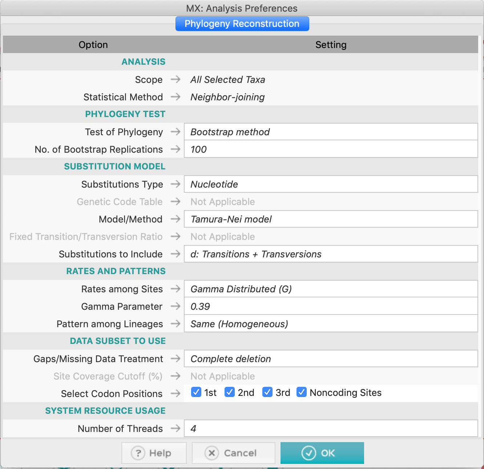
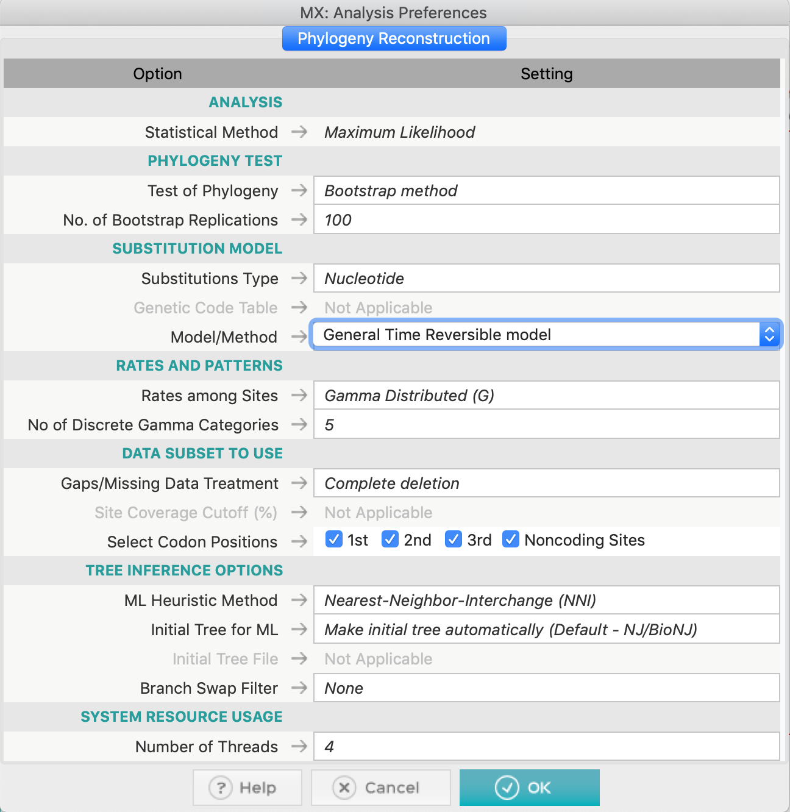
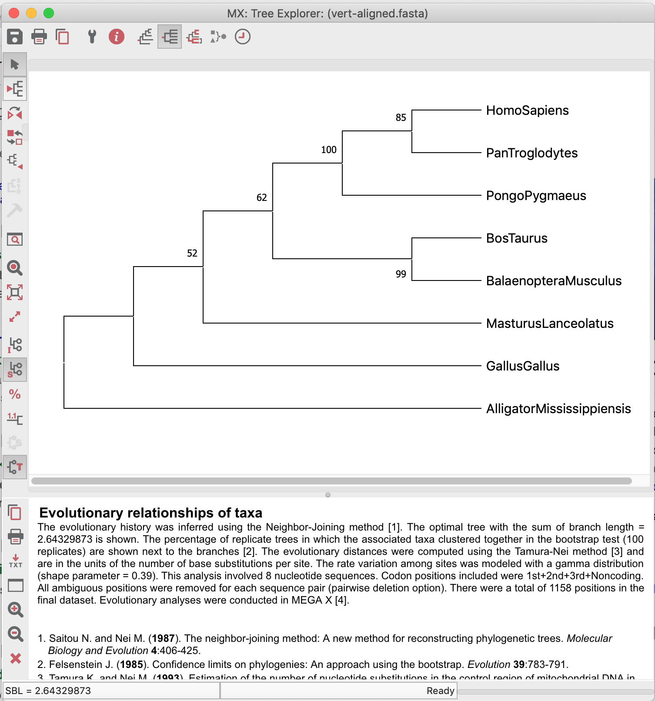

# Inferring Phylogenies using MEGAX

A *crash course*.

Now we're going to use [this dataset](https://drive.google.com/uc?export=download&id=13bsRE3MGmkKOL0mjT-DigvzerH0BDau6) to construct the phylogenetic trees. For this we will use MEGAX.

- Open the alignment. In the next window, click in `Analyze` as DAMBE (protein coding nucleotide sequences and the genetic code).

- Test of the nucleotide substitution model.

> *The test of nucleotide substitution model sometimes gives as result models which are not present in MEGA options. In these cases, you have to choose a model that has the necessary parameters suitable to represent your sequence alignment. Although highly recommended, especially for beginners in phylogenetic analyses, this test is not critical.*

- Examine the alignment statistics. Click in the TA icon on the right, to launch the Data Explorer.

- Construct a Neighbor-joining Phylogenetic tree, with a bootstrap test. Use *Complete deletion* on this dataset. You can use Tamura-Nei 93, since GTR model does not exist for the Neighbor-Joining method. Don't forget to examine the gamma-shape parameter for the TN93 model and the proportion of invariant sites (if needed).

- Construct a phylogenetic tree using Parsimony and also Maximum Likelihood. For the later, you can use the GTR model (General Time-reversible), selected by the test of the nucleotide substitution model. Also use *Complete deletion* on both methods.

> *In the ML method, you don't need to adjust a specific gamma-shape parameter, you just have to set to use Gamma* 

- Do not forget to root the trees when necessary and to save the trees.

> *The tree demonstrated below is not rooted with the most plausible outgroup!*

### Exercise:

- Which species do you choose to be the outgroup of the above dataset? Explain.

- Compare the obtained trees and explain the phylogeny, always looking for supporting (or not) bootstrap values.