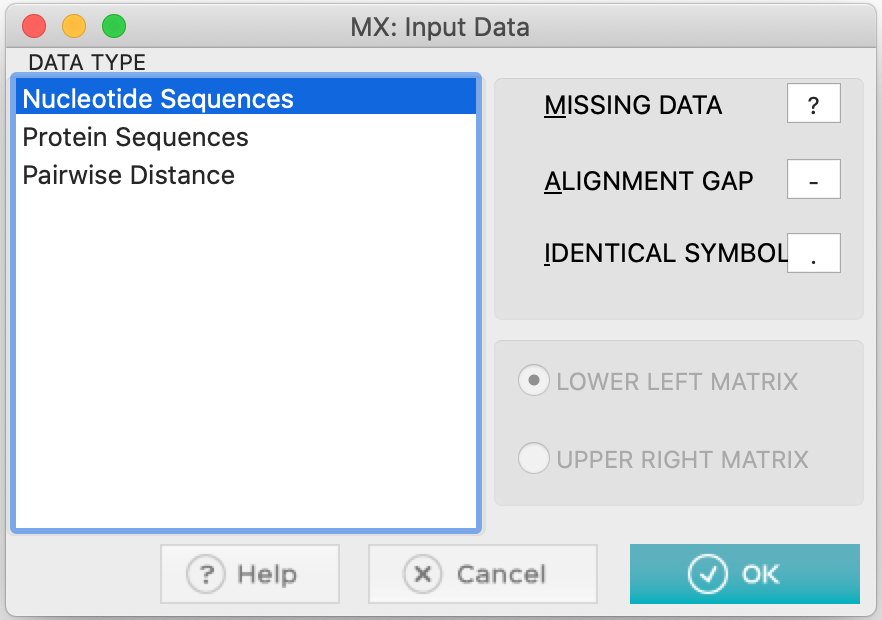
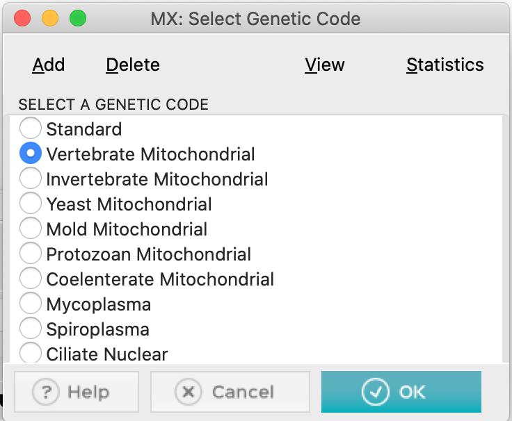
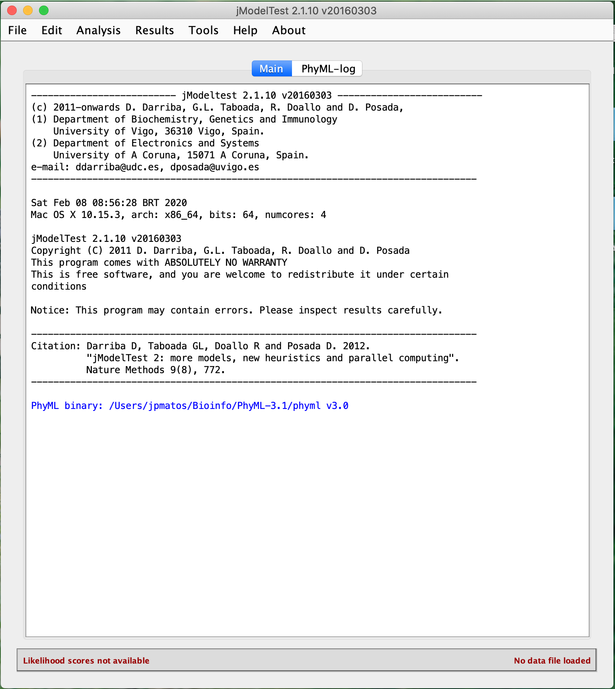
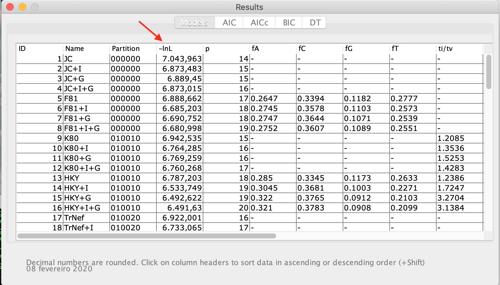
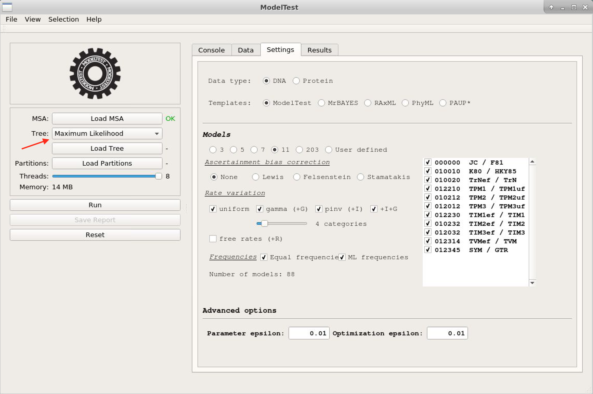

# Choosing an appropriate substitution Model

## Introduction

The objective of this tutorial is to show the different ways to evaluate and estimate a nucleotide (and amino acid) replacement model suitable for your *dataset* for later phylogenetic analysis.

As highlighted during the course, the step of estimating a replacement model is not necessarily mandatory in any phylogenetic analysis. When the working sequences and the characteristics of the obtained alignment are well known, the researcher can directly choose a single mathematical model. However, as there are numerous models available, such a choice can be challenging for beginners. In the worst case, ignorance can lead to the choice of a model that underestimates important alignment characteristics, leading to less accurate estimates. On the other hand, including many parameters increases the variance and consequently the accuracy of the analyses (and, sometimes, can also increase computational power requirements).

Most tools use the statistical principle of likelihood (*L*). To do this, they calculate *L* for all available models and then make a hierarchical classification (using or not information criteria). These calculations are computationally intensive even for many current PCs.

## Using MEGA X

In its first version, the program [MEGA](www.megasoftware.net) did not have a routine for testing the substitution model. Even so, it was one of the first phylogenetic programs to include this functionality natively. The algorithm is fast. However, it tests more models than are available in the tool itself.

- We will use the multiple alignment file [vert-aligned.fasta](https://drive.google.com/uc?export=download&id=1CKutTUK4aAH-yGyZ1fhVfzz07SVVo3dD):
- Run the MEGAX program.
- Open the alignment by clicking on the ``TA`` button and then on *Open a File/Session...*, according to the picture below:


- In the next pop-up window, click on *Analyze* (these sequences are already aligned):


- MEGA will ask you the following questions: whether they are nucleotide sequences. Click Ok.



- They are protein-coding sequences. Answer *Yes*.


- When answering, you will need to select the specific genetic code. Click *Vertebrate Mitochondrial*:



- With the file open, click on ``Models``,


- And select the first item, *Find Best DNA/Protein Models (ML)...*:


- Answer yes in the dialog box that appears right after, to use the open dataset:


- After confirmation, the following box will appear:


- Let us look at the options (as shown in the figure above):
  - We will use an automatic *Neighbor-Joining* tree as the initial hypothesis for this data.
  - Since the sequences of this alignment are nucleotides, we will use the appropriate type of substitutions.
  - In the data subgroups options, we will use all sites, all codon positions, and we will not use filters for branch exchange (*Branch-swap filter*).
  - Leave the number of *Threads* in the pattern that appeared on the computer you are using.
  - Finally, click Ok. The process will take a while, depending on the available computing resources. The results will appear as the table below:


The results appear in a list of the best model to the least suitable for the data used. In MEGA X the information criterion used is Bayesian (BIC). By it, we can verify that the GTR model (*General Time-reversible*) plus gamma correction (+G) was the model chosen by the Bayesian criterion. However, it is not the model with the least likelihood (*lnL*). The rest of the information in this table will be discussed during the remote meeting.

> *Do not forget to save this table in one of the formats that MEGA X provides, from the icons present in the upper left corner of the screen.*

> *MEGA X also has the function to calculate the best amino acid substitution model. To do this, just start the analyses with an amino acid alignment and in the dialog box choose the correct option.**

## Using jModelTest

The jModelTest program ([Darriba et al. 2012](https://www.ncbi.nlm.nih.gov/pubmed/?term=Darriba+D%2C+Taboada+GL%2C+Doallo+R%2C+Posada+D.+2012.+jModelTest+2%3A+more+models%2C+new+heuristics+and+parallel+computing.+Nature+Methods+9(8)%2C+772.)) is an extended version of the popular ModelTest program (which was a routine run within the PAUP* program.) The program is now standalone and much faster after the inclusion of the ``PHYML``, ``ReadSeq`` and ``Consense`` tools from the old [PHYLIP](http://evolution.genetics.washington.edu/phylip.html) package. Additionally, jModelTest allows the optimization of base trees for each model, model selection according to a new theoretical decision criterion, and average model phylogenies. Recently, a new improved and faster version, which serves both DNA and protein sequences, ModelTest-NG ([Darriba et al. 2019](https://academic.oup.com/mbe/article/37/1/291/5552155)) has been released.

**Observation:**

- Some information on the steps below has been adapted from that described in [http://evomics.org/learning/phylogenetics/jmodeltest/](http://evomics.org/learning/phylogenetics/jmodeltest/), ***for teaching purposes only***. <span style="color:red">***Reproduction for any other purpose is not allowed or consented to by the course professor.*** </span>

### Steps

Download version [2.1.10](https://drive.google.com/drive/u/0/folders/0ByrkKOPtF_n_OUs3d0dNcnJPYXM) of jModelTest. The program is a java application and executes in distinct two ways: command line and GUI (*Graphical User Interface*). The program depends on the installation of a JDK (*Java Development Kit*), be it the official [Oracle](https://www.oracle.com/technetwork/pt/java/javase/downloads/jdk8-downloads-2133151.html) or [OpenJDK](https://openjdk.java.net). The JDK installation steps depend on the operating system and therefore, will not be detailed here in this tutorial.

> *Do not confuse JDK with JRE (Java Runtime Environment), which is usually present on most computers.*

- We will use the same file used previously:  [vert-aligned.fasta](https://drive.google.com/uc?export=download&id=12-vfD16vil2cTmNM2VOMfuj48LGo9iT2).

- Go to the directory where you saved the jModelTest application and double click ```jModelTest.jar``` to open it. Using Linux, you may have to open a terminal, browse to the folder where this file is located and type the command below to open the program:

```
$ java -jar jModelTest
```

- The window below will appear:



- Click *File > Load DNA alignment* and open the data set vert-aligned.fasta file.
- Click *Analysis > Compute likelihood scores* to start the analysis.
- A dialog box will appear that allows you to specify the number of probability settings, including the number of models to be tested. The other settings are different base frequencies (+F); the proportion of invariable sites (+I), and gamma distribution (+G) (variation in rate across sites). In this dialog box, leave the options as in the figure below.


- Click on ``Compute Likelihoods`` and wait (or go for a coffee, because depending on the *dataset* this step will take longer than the one performed on MEGA X). For the alignment used here and with these options, this step will take between 1 and 4 min.

> *Sometimes, depending on the operating system, you will have to locate the PhyML program executable again. In the main window, just go to Edit > Preferences and find the correct executable again for the computer operating system.*

- Before proceeding, check the data that appeared in the jModelTest console. They will also be discussed in the room, but are similar to those found in testing the model using MEGA X.
- Now click again on the *Analysis* menu. You will see that the AIC, BIC, and DT calculations are now available, while the hLRT calculations are grayed out (because in the previous step, we chose to have optimized tree topologies).
- Now click on *Results > Show results table*. A window will appear, showing the calculated probabilities for each model.



- Now click on the top of the "LnL" column. This action will sort the models according to likelihood. The table will then look like this:


- It can show the partition schemes, the number of parameters included the observed base frequencies, and the transition and transversion rates. Note that the tables for AIC, AICc, BIC, and DT results are in grey. For that, the table can be closed, and from the *Analysis* menu click on *Do BIC calculations...* and on *Do DT calculations...*, confirming each dialog box that will appear later, as can be verified in the figure below:


> *Make sure that the options Calculate parameter imports and Do model averaging are always selected*

- Then, we will go to *Analysis* > *Do AIC calculations...*. In the backbox, check the option *Use AICc correction*, as shown in the figure below:


> *You can also do the Akaike calculation without the correction for comparison purposes. Just do not select the above option*

- Now click again on *Results > Show results table*. A window will appear showing the calculated probabilities for each model, with the information criteria. The chosen models for each criterion will be marked in red.

> *To avoid repeating the analyses (which wastes computational time), screeshot the table with the final results and save the whole console content from the menu Edit > Save console.* 

From the results obtained, you will observe that the results converge, although with some discrepancies. The GTR+G+I model is the best for Akaike's criterion, but not the best for Bayesian criterion. Which one to choose, then? Let us discuss.

## Using ProtTest

The program [ProtTest](https://github.com/ddarriba/prottest3) ([Darriba et al. 2011](https://www.ncbi.nlm.nih.gov/pubmed/21335321)) is a very similar program to jModelTest, however specific for the choice of the best substitution models for protein sequence alignments.

Prottest 3 can be obtained [HERE](https://github.com/ddarriba/prottest3/releases) and run in the same way as jModelTest (it is also a Java application).

> *MEGA X also has the function to calculate the best amino acid substitution model. To do this, just start the analyses with an amino acid alignment and in the dialog box choose the correct option.*

To demonstrate ProtTest's operation, we will use the amino acid alignment [COX2_PF0016](https://drive.google.com/uc?export=download&id=1d1KpZNgn7atWSkc8_PQOh4zKJuu45rhY), one of the examples provided with the program itself.


- Click on *File > Load alignment* and open the downloaded [COX2_PF0016](https://drive.google.com/uc?export=download&id=1d1KpZNgn7atWSkc8_PQOh4zKJuu45rhY) file above. See the information that appeared in the application console.
- Then go to *Analysis > Compute likelihood scores* to start the analysis. A dialog will appear that allows you to specify the number and models to be tested in addition to some other settings.
- In *Starting Topology* choose *Maximum likelihood tree* or leave the default (*Fixed BioNJ JTT*).


- Click *Compute* and wait for the calculations to finish.

> *Now you should have a coffee time. The likelihood calculation for amino acid replacement models is considerably more intensive, mainly due to the more significant possible number of changes and the number of characters involved (20 amino acids).*

- When finished, just click the *Selection* menu and click *Results*. The results table will appear.


A notable difference between ProtTest and jModelTest is that the calculations of the information criteria are within the results table. Analyze the table. More information will be given in the classroom.

### Comparing resultados

Compare the results obtained for the COX2_PF0016 alignment in both ProtTest and MEGA X. To use this alignment on MEGA, use [this file](https://drive.google.com/uc?export=download&id=1UDI0QtUgUxnmTpvd3ulvWZ1Mz01M2sU1). Below is a table with the results.


## ModelTest-NG

ModelTest-NG is a new improved and faster version of jModelTest, which serves both DNA and protein sequences ([Darriba et al. 2019](https://academic.oup.com/mbe/article/37/1/291/5552155)). Its performance for larger *datasets* is much better, and its calculations are more optimized. However, its installation on Windows and macOS systems is not yet accessible, especially for beginners. On Linux, the installation is relatively fast. For this reason, we will see just a quick demonstration. 

For this we will use the same file used previously: [vert-aligned.fasta](https://drive.google.com/uc?export=download&id=12-vfD16vil2cTmNM2VOMfuj48LGo9iT2).

- Run ModelTest-NG:


- Click on ``Load MSA`` and choose the file above. The alignment characteristics will appear.
- Click the "Settings" tab, and you will see the test options, similar to previous programs.



- Do not forget to change the initial tree to one of *Maximum likelihood*. Once you have done that, you can click on ``Run``.

> *Notice how ModelTest-NG is faster than its previous versions.*

- The results are almost the same as in jModelTest.


- We will now click on Reset and repeat the previous steps for the alignment [COX2_PF0016](https://drive.google.com/uc?export=download&id=1d1KpZNgn7atWSkc8_PQOh4zKJuu45rhY). Since this alignment is of amino acid sequences, do not forget to mark in the *Settings* tab the option *Protein*, because in our tests ModelTest-NG does not always correctly identify the type of sequence. Below is a preview of the result:


## Final remarks

***What criteria do I use to choose the replacement model?***

That is not a trivial question. For Bayesian inferences, the BIC criterion tends to be more appropriate. AICc is more suitable for small *datasets* than AIC (no correction), however, the two tend to converge on more massive *datasets*, so we always recommend using AICc. The DT criterion (*decision theory*) should be used with caution, as the jModelTest manual itself recommends. Thus, AICc and BIC are the most reliable criteria. When they converge (and this often happens), the problem is solved. Even without convergence, you will be safe if you do phylogenetic analysis with both the model chosen by AICc and the one chosen by BIC.

***The chosen model does not exist in the tool I will use***

It is not the end of the world. There are many models, but there are also many overlaps between them. Hence the importance of knowing the characteristics of alignment and the differences in parameters between the different models. Often the models selected by these tools have small differences. Just look for the equivalent model or the one closest in terms of parameters. The execution of jModelTest presents another significant advantage: the console gives a summary of the parameters evaluated in each of the models tested for you to make a more appropriate choice. Even so, nothing will replace understanding the models and their parameters. That is why some phylogeneticists do not consider testing the model an indispensable step.

***Average phylogeny of all models***

Average phylogeny of all models is a function that only ModelTest and its variants have. This function calculates the models' average phylogenies, which are consensus trees of all optimized basal trees. However, it currently depends on the [PHYLIP](http://evolution.genetics.washington.edu/phylip.html) package for this function. It may not work if the taxon names are longer than 10 characters (anyone who has used PHYLIP ever knows how unbearable this limitation is). 

To get this, from the *Analysis* menu, click on *Model-averaged Phylogeny*. A window with the settings will open, in which you will leave all the settings in the default and click on ``Run``. The output will list some configurations, the models, and the average phylogeny of these models. This is a great guide, however, it should be used with great caution.