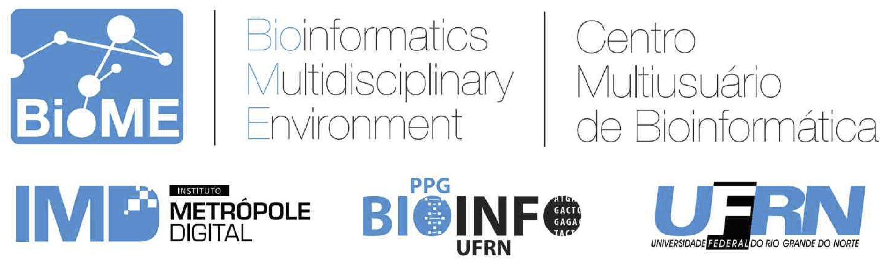

# Presentation

This site is part of the course "Comparative Genomics, Molecular Phylogeny and Evolutionary Sequence Analysis," conducted by Prof. João Paulo M S Lima, from the Bioinformatics Multidisciplinary Environment - BioME of the Federal University of Rio Grande do Norte.

Here is the material needed to follow the course and the practical tutorials and examples.

## Objectives

- Provide indispensable knowledge on the application of molecular phylogeny analysis and the first necessary steps for its proper use.
- Discuss the methods involved in the evolutionary analysis of biological sequences.
- Guide the use of computational tools used in molecular phylogeny analysis.

## Nature of the course

Theoretical-practical course. The theory will be approached from remote meetings using Zoom. We are going to focus on the basic concepts of the area, contextualizing the use of models and methods more appropriate for specific data and analysis types. The practices will be the guided execution of programs and pipelines of analysis, based on example data sets.

## Program/Contents

### First day:

- Basic Concepts of Evolution of Biological Sequences.
- Choosing markers and assembly of datasets.
  - Using Metadata.
- Multiple Sequence Alignment.
  - Best Practices for Phylogeny.
  - Tutorial 1.
  - *Cleaning* and trimming multiple sequence alignments.
    - Trimal demonstration.
- Getting information about sequences features from multiple alignments:
  - Estimating sequence substitution saturation
    - Tutorial 2.
  - Codon usage, nucleotide frequency and other useful sequence features.
    - Demonstration - MEGAX and DAMBE.

### Second day:

- Testing of substitutions models (Best-fit substitution models).
  - Tutorial 3 - jModelTest "*Family of programs*".
- Phylogenetic Inferences - A Brief Theory: 
  - Distance Methods.
    - Usage demonstration. 
  - Maximum Parsimony.
    - Usage demonstration.
  - Maximum Likelihood.
    - Demonstration 4.
  - Tutorial 4 - Using MEGA.
- Exploratory comparative genomics: 
  - Using [TaxOnTree](http://bioinfo.icb.ufmg.br/taxontree/).

### Third day:

- Phylogenetic Inferences - A Brief Theory:
  - Bayesian Inference.
    - Tutorial 5 - Using BEAST.
- Principles of Phylodynamics:
  - Tutorial 6 - BEAST+EBSP with Zika Virus' data.
- Additional Analysis:
  - Test of Selection using MEGA.
  - Gene Recombination Inference.
    - Using [DataMonkey](https://www.datamonkey.org/) tools
  - Gene Inactivation Inference.

### Other activities

- Using [Pseudochecker]([PseudoChecker](http://pseudochecker.ciimar.up.pt/pseudochecker/index.html)).
- Using [IQ-Tree](http://www.iqtree.org/doc/Tutorial).
