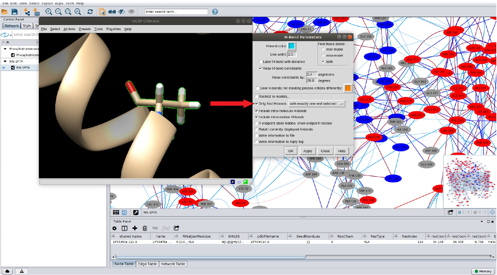

# Construção e análise de Redes de Interação de Resíduos (RINs)

O objetivo deste tutorial é construir e visualizar os níveis uma rede de interação de resíduos utilizando o programa Cytoscape.

## Instalação do Cytoscape

### Linux

Para instalar será necessário baixar o programa em: [https://cytoscape.org/download.html](https://cytoscape.org/download.html)

> *Lembrando que para instalar o Cytoscape, é necessário possuir o Java instalado na sua máquina.*

Após baixar, vá ao terminal e vá até a pasta onde o arquivo de instalação foi baixado
(normalmente a pasta Downloads).

```
cd Downloads
chmod u+x Cytoescape_X_X_X_unix.sh 
```

> *Lembre-se de trocar os Xs pela versão correta do Cytoscape baixada.*

Agora execute o *script* em *shell* para instalar o programa:

```
sudo ./Cytoescape_X_X_X_unix.sh
```

Durante a execução do *script* de instalação algumas perguntas aparecerão. Basta pressionar `Enter`.

### Ambiente Windows ou MacOS

Instaladores para ambos os sistemas estão disponíveis na página de Download do Cytoscape. Após o download, dê um duplo clique e siga as instruções de instalação.

## Instalação dos *Plugins*

Para a construção das RINs é necessária a instalação dos *plugins* *structureviz2* e *rinalyser*. Para isso siga as etapas abaixo:

- Abra o Cytoscape.

- Ao abrir o programa, uma tela semelhante a abaixo deverá aparecer:


Iremos inicialmente instalar via Cytoscape o plugin *structureviz2*. Para isso siga os passos abaixo:

- No menu da janela, vá em *Apps > App Manager*.

- Ao clicar nestas opções uma tela semelhante a abaixo deverá aparecer:


- No campo destacado digite *structureviz2*.

- Selecione o pacote e clique em *Install*.

- Repita as instruções acima, mas desta vez, no campo destacado, digite o nome do outro plugin RINalyser.

## Como construir RINs?

Existem várias ferramentas e programas disponíveis para construir e analisar RINs a partir da estrutura/modelo de uma proteína. O arquivo de entrada para cálculo da RIN de uma proteína é um arquivo .pdb ou mmCIF. Portanto, é necessário que o seu ponto de partida seja seja uma estrutura resolvida experimentalmente ou um modelo calculado computacionalmente por técnicas de modelagem molecular. A ferramenta que recomendamos para a construção da RIN é o programa [RING 3.0](https://ring.biocomputingup.it/submit), do laboratório [BioComputing UP](https://biocomputingup.it/), da Universidade de Pádua, Itália. Para comparar entre diferentes RINs de uma mesma proteína ou de conformações diferentes, recomendamos utilizar a ferramenta [CoRINs](https://github.com/LasisUFRN/CoRINs)) do nosso grupo de pesquisa<sup>1</sup>.

> *O CoRINs está passando por um processo de atualização*.

Seguem abaixo alguns outros links de ferramentas para cálculo/análise de RINs:

- [RING 3.0](https://ring.biocomputingup.it/submit).

- [CoRINs](https://www.biorxiv.org/content/10.1101/2020.06.29.178541v1.full).

- [ProSNEx](https://academic.oup.com/nar/article/47/W1/W471/5494742).

- [PSNtools for standalone and web-based structure network analyses of conformational ensembles - PubMed](https://pubmed.ncbi.nlm.nih.gov/35140884/).

- [SenseNet, a tool for analysis of protein structure networks obtained from molecular dynamics simulations - PubMed](https://pubmed.ncbi.nlm.nih.gov/35298511/).

- [gRINN: a tool for calculation of residue interaction energies and protein energy network analysis of molecular dynamics simulations - PubMed](https://pubmed.ncbi.nlm.nih.gov/29800260/).

- [RIP-MD](https://peerj.com/articles/5998/).

## Construindo uma RIN via Cytoscape/UCSF Chimera

Para construir o exemple da RIN que iremos utilizar, é necessário baixar [este arquivo .xml](https://drive.google.com/uc?export=download&id=16KaGLIZ_fbarhiSg-R4uY7M7SM6-1mBc).

Com a tela inicial do Cytoescape aberta, vamos importar o arquivo para iniciar a construção da RIN.
Para isso, siga os passos abaixo:

- Vá no menu e clique em: *File > Import > Network > File*.

Ao clicar nestas opções uma tela semelhante a abaixo deverá aparecer:


O arquivo `pte.xgmml.xml` deve ser selecionado. Clique em abrir. A visualização abaixo aparecerá:


### Conexão com o UCSF Chimera

Agora vamos conectar o Cytoscape com o USCF Chimera, para que
possamos visualizar as interações entre os resíduos em paralelo ao visualização do arquivo PDB. Para isso, siga os passos abaixo:

- No menu do Cytoscape, clique em: *Apps > structureviz > Settings*.


Todas as opções *Select All* devem ser selecionadas como na figura. No local em destaque, indique o caminho onde está instalado o UCSF Chimera em seu computador.

> *Em computadores com Linux, normalmente o UCSF Chimera está na pasta /usr/bin. No entanto, isso depende como fizeste a instalação do programa.*

Clique em ok. Em seguida, clique novamente em: *App > structureviz > Open structure for node(s).* Ao clicar nas opções acima a seguinte tela aparecerá:


Na opção *Open structures*, destacada na figura, escolha uma proteína e depois clique em Ok. Aparecerão duas telas: uma com a estrutura da proteína no UCSF Chimera e outra tela do próprio Cytoscape:


A tela com a seta em destaque deve ser selecionada para que haja a interação UCSF Chimera –Cytoscape.

### Construindo a RIN:

Siga as etapas abaixo: 

- Vá no menu da janela do Cytoscape e clique em: *App > RINalyzer > Create RIN from Chimera*.

Ao clicar nestas opções uma tela semelhante a abaixo deverá aparecer:


- Na opção em destaque, clique em *Add hydrogens*. Depois, clique em Ok. A RIN estará pronta.


É possível visualizar, via UCSF Chimera, algumas ligações entre os resíduos da proteína.
Para isso, siga os passos abaixo:

- Inicialmente, clique em um resíduo (aminoácido) na RIN.

- Nesse momento, o UCSF Chimera já está em execução em seu computador. Clique na aba do Chimera, local em destaque na figura.

- No Chimera, vá no menu e clique em: *Actions > Focus*. Você observará:


O resíduo no qual você clicou anteriormente aparece em destaque na tela do UCSF Chimera, como demonstrado na figura acima.

### Visualizar as interações no resíduo no PDB

Agora iremos visualizar as ligações de hidrogênio existente para este resíduo.
Para isso, siga as etapas abaixo:

- No UCSF Chimera:
  ◦ Vá em: *Actions > Atoms/Bonds > Show*.
  ◦ Depois em: *Actions > Ribbon > hide*.
  ◦ E agora em: *Tools > Surface/Binding Analysis > Find Bonds*.



Na janela de opções `H-Bond Parameters` do UCSF Chimera, marque a caixa de seleção em destaque *Only find H-bonds*, com a opção *with exactly one end selected*, da forma como demonstrado abaixo:


Ao fazer isso, uma tela semelhante a abaixo deverá aparecer:


Aqui são visualizadas as ligações de hidrogênio entre o resíduo escolhido na RIN e os outros resíduos na proteína, como demonstrado pela RIN.
