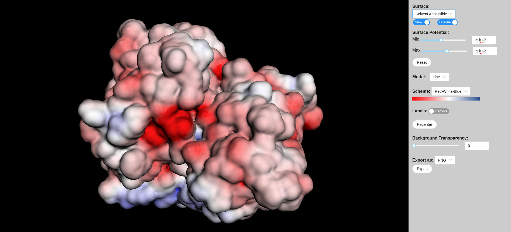
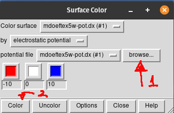
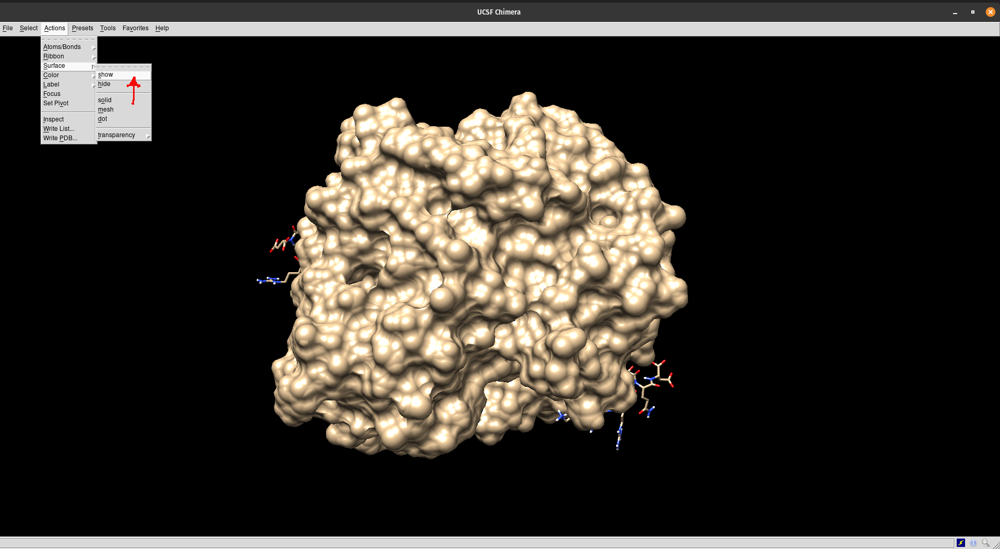
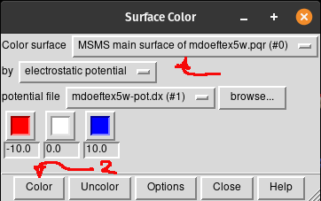
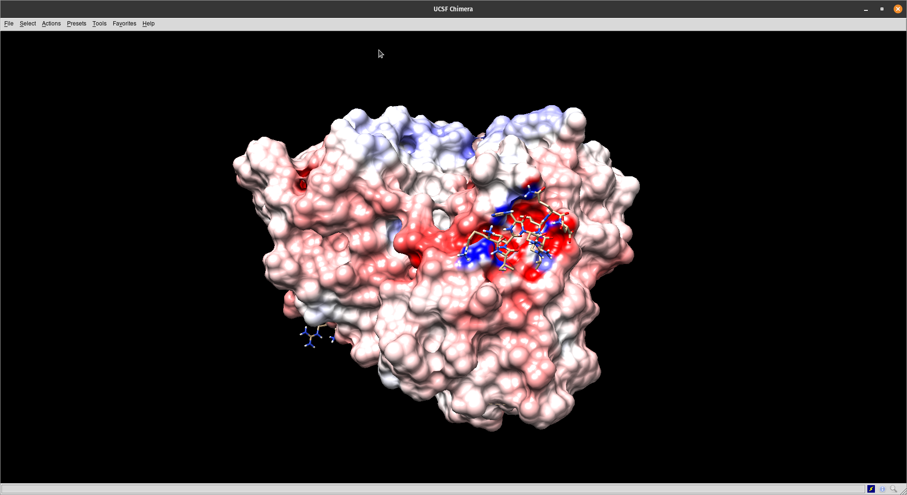

# Análise da Superfície Eletrostática por APBS

## Por que analisar a superfície eletrostática e a solvatação de uma molécula?

*Uma compreensão das interações eletrostáticas é essencial para o estudo dos processos biomoleculares. A integração desta informação em modelos físicos para a descoberta de fármacos ou outras aplicações requer a capacidade de avaliar as interações energéticas dentro e entre os biopolímeros. Entre os vários componentes da energia molecular, as propriedades de solvatação e as interações eletrostáticas são de especial importância devido ao longo alcance destas interações e às cargas substanciais dos componentes típicos dos biopolímeros.*

> Traduzido e adaptado de: [https://www.poissonboltzmann.org/](https://www.poissonboltzmann.org/)

Adicionalmente, tais alterações podem explicar mudanças na superfície a partir de modificações na sequência de aminoácidos. Por exemplo: uma modificação em um sítio que não seja o sítio de ligação. Muitos programas de *docking* molecular continuarão a prever a ligação com o ligante, alguns sem prejuízo na função de pontuação energética. No entanto, tal modificação pode exercer consequências na superfície eletrostática que podem alterar a afinidade de ligação, mesmo o sítio estando intacto espacial e geometricamente. Uma análise da eletrostática pode revelar tais mudanças e dar sustentação a resultados encontrados *in vitro* ou *in vivo*.

### Breve teoria

O solvente desempenha um papel crucial na mediação de processos bioquímicos como a interação entre proteínas e entre proteínas e ligantes. Esses eventos ocorrem frequentemente em um ambiente composto por água e íons. Para modelar proteínas em um ambiente tão complexo, moléculas de água e íons podem ser tratados de forma explícita ou implícita (*continuum*). A primeira permite uma simulação mais precisa, mas é mais "cara" do ponto de vista computacional. Por outro lado, os métodos de solventes implícitos são afetados pelos inconvenientes relacionados à menor precisão, mas são mais rápidos e mais adequados ([Vascon et al. 2020](https://pubmed.ncbi.nlm.nih.gov/32695270/)).

As propriedades eletrostáticas dependem da distribuição total ou parcial das cargas na superfície 3D de uma proteína. A [Lei de Coulomb](https://pt.wikipedia.org/wiki/Lei_de_Coulomb), normalmente utilizada para descrever o potencial eletrostático, não é adequada para descrever a eletrostática em proteínas, pois descrevem o sistema como um meio dielétrico único.  No entanto, as proteínas são um núcleo hidrofóbico envolvido por um solvente. Para este caso, a [equação de Poisson-Boltzmann (PBE)](https://en.wikipedia.org/wiki/Poisson-Boltzmann_equation) é mais adequada para calcular a eletrostática de uma proteína, tratando o solvente de forma implícita e, assim, os efeitos dinâmicos da água não são diretamente internalizados, levando a um melhor entendimento da eletrostática da superfície da proteína.

### Como fazer isso?

Existem algumas aplicações simples em programas de visualização de estruturas moleculares que podem fazer essa predição. No entanto, a literatura cita bastante a utilização da ferramenta [**APBS**](https://server.poissonboltzmann.org/) (*Adaptive Poisson-Boltzmann Solver*). A aplicação resolve as equações de eletrostática contínua para predição de interações biomoleculares.

O APBS requer dados estruturais precisos e completos, como parâmetros de campo de força, como cargas atômicas e raios e, principalmente, a adição de coordenadas atômicas ausentes em estruturas ```.pdb```. Do mesmo grupo do APBS, temos uma aplicação chamada **PDB2PQR**, que automatiza muitas das tarefas comuns de preparação de estruturas para cálculos de solvatação contínua. Tais tarefas incluem:

- Acrescentar quando necessário átomos pesados (não-hidrogênicos) em falta às estruturas. 

- Estimar os estados de titulação e protonar biomoléculas de forma consistente e favorável à formação de ligações de hidrogênio. 

- Atribuição de parâmetros de carga e raio a partir de uma variedade de campos de força.

O **PDB2PQR** gera um arquivo de saída ```.pqr``` que pode ser utilizado em vários programas de bioinformática estrutural. 

## Usando o APBS

Este serviço destina-se a facilitar a configuração e execução de cálculos eletrostáticos tanto para especialistas quanto para não especialistas e, assim, ampliar a acessibilidade da solvatação biomolecular e análises eletrostáticas à comunidade biomédica. Usaremos o exemplo (outros exemplos em [documentação do APBS](https://apbs.readthedocs.io/en/latest/using/examples/visualization-unitymol.html)) do receptor de estrógeno do organismo *Homo sapiens*. Vamos primeiramente utilizar a ferramenta presente no servidor *web* ([**APBS**](https://server.poissonboltzmann.org/)), para depois visualizar os resultados no programa UCSF Chimera. Nesse servidor os programas PDB2PQR e APBS já estão interligados entre si.

### Passos

- Abra a página do PDB2PQR no [APBS server](https://server.poissonboltzmann.org/pdb2pqr).

- No campo ```PDB ID``` coloque o código [5E15](https://www.rcsb.org/structure/5E15) e preencha as opções de acordo com a figura abaixo.


- Clique em ```Start Job```.

- Na página seguinte faça o download do arquivo .pqr. Depois clique em ```Use results with APBS```, em azul, no canto superior direito da página.


- Na próxima página, salve os arquivos terminados em ``.dx`` e em ``.mc``. Eles serão necessários para a visualização posterior com os programas. 

- Você pode visualizar no próprio navegador, clicando em ```View in 3DMol```e ir para a página de visualização



Os arquivos `.dx` e ```.pqr``` estão disponibilizados abaixo (para evitar você ter de carregar o servidor toda vez que for executar esse tutorial):

- [PQR](https://drive.google.com/uc?export=download&id=1c5otw8brcbSTLhf4G5-VJUJuS2PvV4o1). 

- [DX](https://drive.google.com/uc?export=download&id=1vRfexYNBlx3IP65SmIR19pjRTKgXNXtV) - *Arquivo com aproximadamente 66 mb*. 

- [MC](https://drive.google.com/uc?export=download&id=1lJyBw1hxeuIbtLTwkLQpVcabF-YR2Y9F).

## Entendendo a visualização

A visualização padrão (como na figura acima) demonstra inicialmente a acessibilidade por solvente e uma escala do potencial eletrostático de superfície. A cada ponto é atribuído um potencial (em kT/e), ou seja, um valor de 1,0 significa que a energia para uma carga unitária neste ponto é de 1 kT (0,591 kcal/mol). k é a constante de Boltzmann (1.380649×10<sup>−23</sup> J⋅K<sup>−1</sup>) e T é a temperatura absoluta em Kelvin. Valores negativos e positivos são normalmente representados em uma escala que vai do vermelho ao azul, respectivamente. Você pode alterar a visualização para valores maiores ou menores de <math>|kT/e|</math>.

Os potenciais dentro da molécula a partir deste mapa eletrostático calculado não são particularmente interessantes porque são dominados pelas cargas atômicas. Fora da molécula, no entanto, os potenciais assumem o caráter do campo rastreado pelo solvente.

No seletor ```Surface``` você pode ainda escolher entre:

- *van der Waals* - mostra o potencial eletrostático relativo as interações de mesmo nome.

- *Solvent excluded* - mostra o potencial eletrostático de superfície sem considerar o solvente.

No seletor ```Model``` você escolhe a forma de visualização da estrutura proteica. As outras opções são a transparência (para verificar a estrutura por trás da superfície eletrostática) e exportar a visualização para um arquivo de figura.

## Visualizando no UCSF Chimera

A visualização no [UCSF Chimera](https://www.cgl.ucsf.edu/chimera/) é bem simples. Anteriormente, o programa tinha uma ligação com um servidor que calculava o APBS. No entanto, tal opção foi desativada. Dessa forma, obrigatoriamente você tem de realizar os cálculos de eletrostática em ferramentas externas e abrir os arquivos dentro do programa. 

Vamos aos passos:

- Abra o programa UCSF Chimera.

- Vá em *File > Open* e selecione o arquivo ```.pqr```. A visualização da estrutura da proteína deverá aparecer.

- Agora vá em *Tools > Surface/Binding Analysis > Electrostatic Surface Coloring*, como mostrado na figura abaixo.


- Ao fazer isso a janela *pop-up* abaixo irá aparecer:



- Clique em ```Browse...``` (1) e selecione o arquivo ```.dx``` . Verifique se na caixa de seleção ao lado de *Color surface* está o nome do arquivo ```.dx``` selecionado. Deixe a janela acima aberta.

- Agora precisamos mostrar a superfície da molécula. Vá em *Actions > Surface > Show...*, de acordo com o mostrado na figura abaixo:



- Agora volte na janela *pop-up Surface Color* e na caixa de seleção ao lado de *Color surface*, selecione *MS MS main surface... .pqr*  e clique em ```Color``` (2). Pode demorar um pouco.



- A visualização final ficará como a figura abaixo:



- Na mesma janela acima você pode alterar você pode alterar a visualização para valores maiores ou menores de <math>|kT/e|</math>. Outras opções podem ser modificadas clicando no botão ```Options``` da janela *Surface Color*.
- Note o encaixe de um dos ligantes (no caso um ligante proteico o [coativador transcricional nuclear 2](https://www.uniprot.org/uniprot/Q15596)) no seu sítio na proteína. Veja a complementariedade entre as duas em termos de potenciais negativos e positivos.