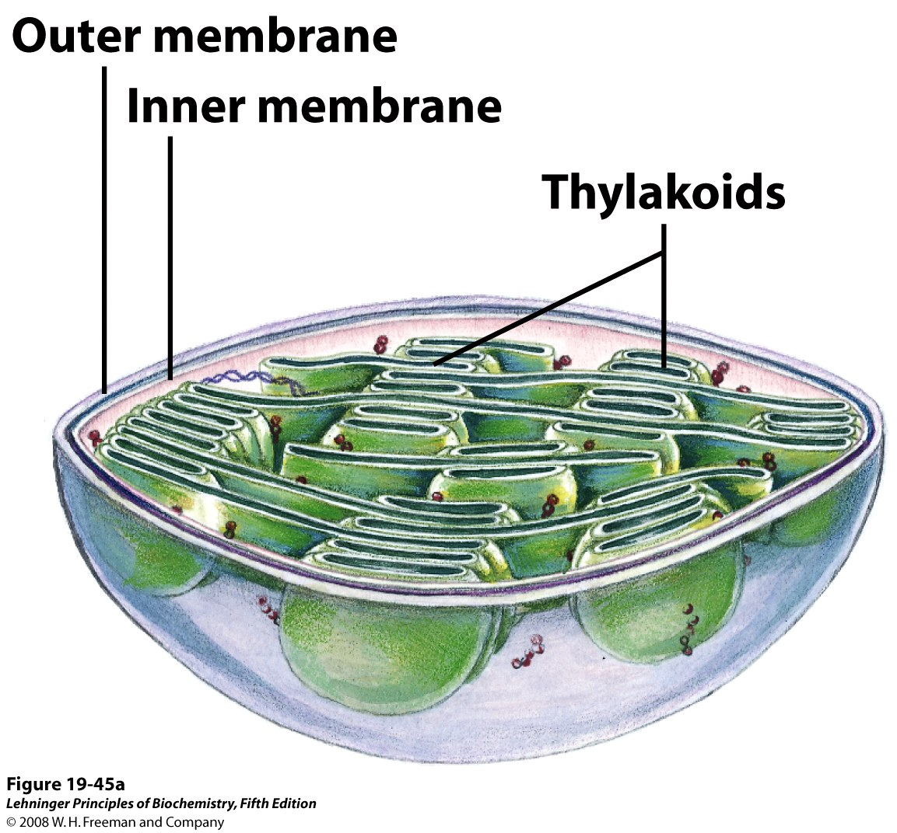

# Obtenção de modelos de membranas biológicas para simulações *In silico*.

O estudo e a caracterização da membrana de uma célula é de extrema importância para o entendimento de sua função. Adicionalmente, a composição da membrana é absolutamente necessária para a compreensão da estrutura e da função de proteínas integrais da membrana, como canais e transportadores. Este trabalho pode ser facilitado por meio de simulações computacionais da interação destas proteínas. No entanto, para isto modelos *In silico* de membranas biológicas precisam ser construídos. Baseado nas informações acima, iremos fazer o roteiro abaixo.

## Diferenciando proteínas integrais e proteínas periféricas da membrana.

- Usando o Chimera, abra o arquivo pdb de código [3RKO](https://www.rcsb.org/structure/3RKO) e responda:
	- Busque em banco de dados, caracterizando e descrevendo a função desta proteína.
	- Esta é uma proteína integral ou periférica?
	- Identifique visualmente as regiões estruturais e os resíduos de aminoácidos que estão em contato com a bicamada lipídica.

## Construindo uma membrana básica de procariontes.

- Abra a home page do [CHARMM](http://www.charmm-gui.org).
- No menu esquerdo, vá em ```Input Generator```.
- Na nova página, no menu esquerdo, vá em ***Membrane Builder > Bilayer Builder***.
- Mais embaixo, selecione e clique em ```Membrane Only System```.
- Siga com os parâmetros pré-selecionados e na caixa ```Length of X and Y```, coloque um número entre 50 a 100.
- Mais abaixo, vá na opção ```Bacterial Lipids``` e preencha com as seguintes proporções:
	-  Lipídeos com caudas **16:0**: 34%.
	-  Lipídeos com caudas **16:1**: 30%.
	-  Lipídeos com caudas **18:1**: 36%.
- Selecione proporções diferentes entre as duas camadas únicas. 
- Clique em ```Show System Info``` e verifique se há avisos. Se não existirem, passe para o próximo passo. Se existirem, mude a proporção ou tipo dos lipídeos selecionados.
- Clique no canto inferior direito em ```Select Model/Chain```.
- Na nova página, baixe o arquivo pdb criado e visualize-o com o Chimera.
- Ainda na nova página, na parte ```Component Building Options```, inclua íons e coloque 0.30 M de concentração de cloreto de potássio (KCl). Clique em ```Calculate number of ions``` e verifique se o número de íons positivos e negativos estão com valores > 0. 
- Clique no canto inferior direito em ```Build components```.
- Na nova página, baixe o arquivo pdb criado e visualize-o com o Chimera. Verifique a membrana e cada um dos seus constituintes, com as opções de menu do Chimera.

## Criando uma membrana para a proteína 3RKO

- Repita os 3 primeiros passos do item acima.
- Mais embaixo, selecione e clique em ```Protein/Membrane System```. Coloque na caixa o código do pdb 3RKO e em ```Download Source```, selecione **OPM** ([Orientations of Proteins in Membranes database](http://opm.phar.umich.edu)).
- Clique no canto inferior direito em ```Select Model/Chain```.
- Na nova página deixe tudo padrão e siga para o próximo passo ```Manipulate PDB``` (Canto inferior direito).
- Clique no canto inferior direito em ```Generate PDB and Orient Molecule```.
- Na nova página, nas opções de orientação, clique em ```Use PDB Orientation```. Para fins de simplificação, não marque as outras opções. Siga para o próximo passo ```Calculate Cross-Sectional Area``` (Canto inferior direito).
- Siga a partir dos passos 5 e 6 (do item anterior), usando o ```Length of X and Y``` de 250. Clique em ```Determine the System Size``` (Canto inferior direito). 

>*Aviso: Esta etapa demora alguns minutos.*

- Na nova página, na parte ```Component Building Options```, coloque uma concentração de cloreto de potássio (KCl) suficiente para manter o número de íons positivos e negativos em valores > 0. Clique em ```Calculate number of ions```.
- Clique no canto inferior direito em ```Build components```. 

> *Aviso: Esta etapa demora alguns minutos.*

- Na nova página, baixe o arquivo pdb criado e visualize-o com o Chimera.
- Verifique a membrana e cada um dos seus constituintes, com as opções de menu do Chimera.

## Construindo uma membrana para a tAPX de *Spinacia oleracea*

Nos tutoriais anteriores fizemos o modelo das duas isoformas do cloroplasto da enzima APX de *Spinacia oleracea*: a sAPX, que era a isoforma presente no estroma do cloroplasto; e a tAPX, que era a isoforma ligada a membrana do tilacóide. Esta última possui uma região C-terminal estendida, responsável pela *âncoragem*  desta proteína na membrana do tilacóide.

Iremos agora, produzir uma membrana para incluir no modelo da tAPX obtido nas aulas anteriores, utilizando a interface web do CHARMM-GUI. No entanto, precisamos ter ideia da composicão de lipídeos da membrana do tilacóide, estruturas internas do cloroplasto (vide figura abaixo)



A membrana do tilacóide possui uma composição especial de lipídeos, quando comparada a membrana plasmática da célula vegetal. Os galactolipídeos estão entre as principais tipos de lipídeos polares constituintes dessa membrana, altamente especializada, devido aos seguintes fatores:

- Nela estão vários pigmentos fotossintetizantes, tanto aqueles com função de antenas, como os que estão ligados aos Fotossistemas e aos LHCs (*Light Harvesting Complexes*). É nesta membrana que ocorre a fase fotoquímica da fotossíntese em [Viridiplantae](https://pt.wikipedia.org/wiki/Viridiplantae). É nessta fase que há transformação da energia luminosa em energia química, quebra da molécula de água e consequente liberação do O<sub>2</sub>. A energia luminosa é então conservada na forma de um gradiente de H<sup>+</sup> que promove uma força motriz de prótons para a produção de ATP (que será posteriormente utilizado na fase bioquímica).
- Durante a presença de luz, ao longo desta membrana há uma enorme diferença de gradiente eletroquímico, portanto, ela deve ter uma estrutura resistente para tal fim (da mesma forma que a membrana interna da mitocôndria).

Iremos tirar a composição geral de lipídeos dessa membrana do artigo publicado por [Eerden *et al.*, 2015](https://www.ncbi.nlm.nih.gov/pubmed/25749153), o qual apresenta a seguinte tabela:


### Outras ferramentas

- [LipidWrapper](http://rocce-vm0.ucsd.edu/data/sw/hosted/lipidwrapper/). [Artigo original](https://journals.plos.org/ploscompbiol/article?id=10.1371/journal.pcbi.1003720). [Git](https://git.durrantlab.pitt.edu/jdurrant/lipidwrapper).
- [Memoir](http://opig.stats.ox.ac.uk/webapps/memoir/php/index.php). [Artigo](https://www.ncbi.nlm.nih.gov/pubmed/23640332).
- [LipidBuilder](http://lipidbuilder.epfl.ch/home) - *Plugin do programa [VMD](https://www.ks.uiuc.edu/Research/vmd/)*.