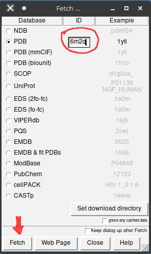
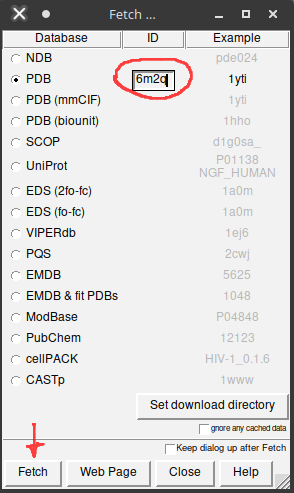
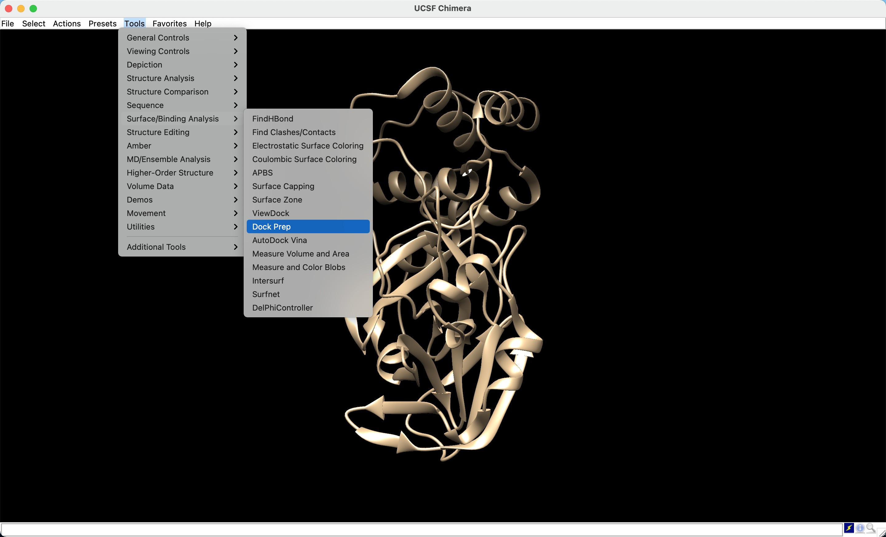
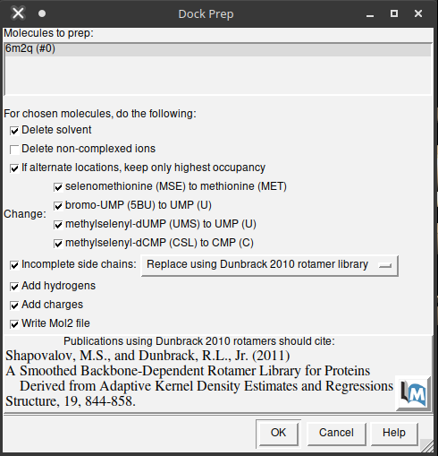
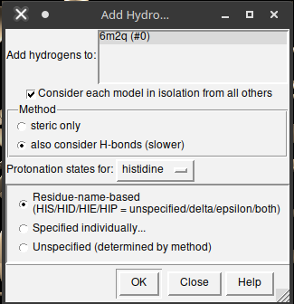
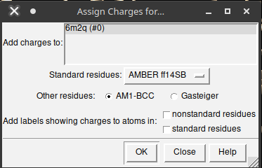
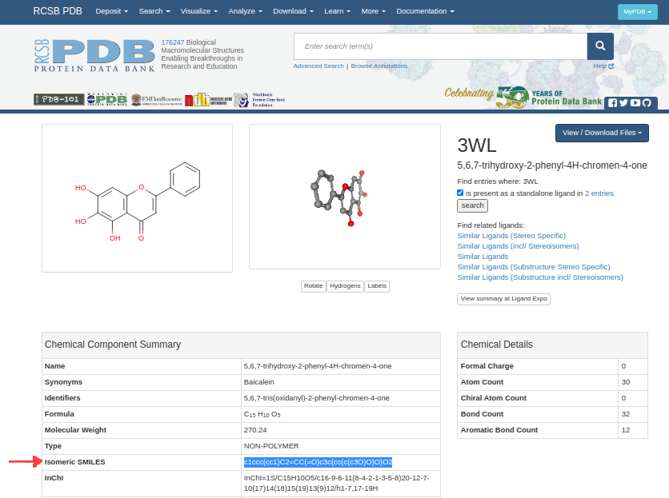
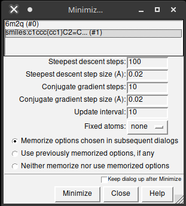
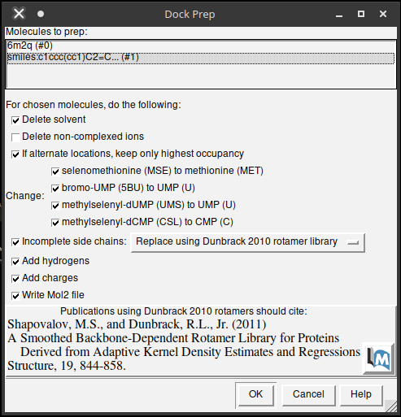
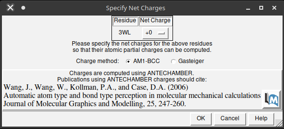

# Atracamento Molecular (*Molecular Docking*)

***Observações:***

- Este tutorial foi construído pela Dra. Jéssika Viana (na época como discente de doutorado em Estágio em Docência) e revisado pelo Prof. João Paulo MS Lima (PPg-Bioinfo/BioME). Este tutorial foi construído ***apenas para fins didáticos***. <span style="color:red">**A reprodução dele para qualquer outro fim não é permitida e nem consentida.**</span> 

## *Docking* com o AutoDock Vina

### Introdução

Neste tutorial iremos aprender a realizar a análise de atracamento molecular (*molecular docking*). Iremos utilizar o Autodock Vina [[1](https://www.ncbi.nlm.nih.gov/pmc/articles/PMC3041641/)], um programa de código aberto que realiza o *docking* molecular. Ele foi projetado e implementado pelo Dr. Oleg Trott no Laboratório de Gráficos Moleculares do *The Scripps Research Institute*. Este programa pode ser utilizado dentro do [UCSF Chimera](https://www.cgl.ucsf.edu/chimera/) [[2](https://pubmed.ncbi.nlm.nih.gov/15264254/)] ou por linha de comando em *shell*, sendo disponível nos sistemas operacionais (S.O.) Windows, Linux e Mac.

Para sua instalação, siga o padrão solicitado pelo programa, disponível no [site do desenvolvedor](http://vina.scripps.edu/manual.html#installation). A instalação será regida pelo S.O. utilizado em seu computador. 

Iremos dividir este tutorial em 4 partes: preparação do receptor, preparação do ligante, preparação e execução do atracamento, e analisando os resultados. Os 4 passos a seguir serão realizados utilizando o programa [UCSF Chimera](https://www.cgl.ucsf.edu/chimera/). Vamos lá?

### 1. Preparação do receptor

No programa UCSF Chimera clique em ```Fetch```. 



Na nova aba selecione pdb e escreva o código ```6M2Q``` e clique novamente em ```Fetch```. Em seguida a estrutura será aberta e visualizada. 



Agora que a proteína foi localizada com sua estrutura tridimensional, seguiremos para a preparação da proteína para o *docking*. Esta etapa consiste em remover solventes (como moléculas de água), adicionar hidrogênios à estrutura, minimizar a estrutura e adicionar cargas. Inicialmente vá ao menu  presente na barra superior do Chimera até a seleção *Tools* e siga os passos: 

- Vá em *Tools > Surface/Binding Analysis > Dock Prep*.



- Na janela aberta escolha as opções abaixo (veja a figura abaixo): 
  - *Delete solvent*;
  - *If alternate locations, keep only highest occupancy*;
  - No submenu *Change*, marque todas as seleções;
  - *Incomplete side chains*;
  - *Add Hydrogens*;
  - *Add Charges*;
  - *Write Mol2 file*.



- Após isto, pressione ```Ok```.

Em seguida uma janela será aberta sobre a adição de hidrogênios na proteína. Nas alternativas, deixe as opções padrão (***also consider H—bonds; histidine e Residue-name-based***). Após marcação, pressione ```Ok```.



Após isto, uma terceira aba será aberta, denominada ***Assign charges for Dock Prep***. Deixe a opção de cargas ***AMBER ff14SB*** e ***AM1-BCC*** (um campo de força baseado em mecânica quântica, semi-empírico).



> *Em estruturas que possuem outros ligantes (que não seja o que estás utilizando) após pressionar ```Ok``` uma nova janela será aberta para especificarmos as cargas líquidas destas moléculas químicas, sendo denominada de ***Specify Net Charges***. Nesta nova janela escolha o método ***AM1-BCC*** e pressione ```Ok```.* *Esta opção não irá aparecer com o pdb 6MQ2.*

Uma nova caixa de diálogo será aberta para que o arquivo da proteína preparada seja salvo em formato .mol2. Salve o arquivo com o nome ```recep.mol2```.

### 2. Preparando o ligante

Iremos trabalhar com um inibidor relatado em literatura para esta enzima: o inibidor ***Baicalein***. Ele é um composto natural pertencente a classe das flavonas, um tipo específico de flavonoide. Estudos de Su e colaboradores (2020) [[3](https://pubmed.ncbi.nlm.nih.gov/32737471/)] identificaram a inibição de forma dose-dependente a proteína 3CLpro de SARS-CoV-2, bem como a replicação do SARS-CoV-2 em células Vero E6.

O ligante está disponível no PDB sob o código [3WL](https://www.rcsb.org/ligand/3WL). O arquivo do ligante pode ser construído e salvo por meio do software UCSF Chimera usando o código SMILES (*Simplified-Molecular Input-Entry System*) que está disponível no site PDB. 



Após copiar o código SMILES, siga as instruções abaixo no Chimera:

- Vá em *Tools > Structure Editing > Build Structure*.
- Na nova caixa de diálogo selecione a opção “*Smile string*” e na caixa de texto cole o código. Depois, dê um nome ao seu ligante (em *residue name*) de 3WL e clique em ```Apply```.

> *Os passos para construir uma molécula no UCSF Chimera a partir do seu SMILES podem ser vistos nos tutoriais anteriores.*

Após realizado, o ligante aparecerá na área de trabalho do Chimera. Selecionaremos apenas o ligante para realizar a minimização de energia sob o método **AM1**. Para isso, siga os seguintes passos:


- *Select > residue > 3WL*;

- Tools > Structure editing > Minimize structure;

- Na nova janela, clique em ```Minimize```; 



- Teremos novamente a janela de Dock Prep. Pode seguir da mesma forma como na preparação da proteína acima.



- Na próxima janela escolha *AM1-BCC* e clique em `Ok`.
- Na janela ***Assign Charges*** (que agora aparece), você deixa o ligante como não carregado.



A minimização irá iniciar para os compostos estudados.

### 3. Preparação e execução do atracamento

Após preparar o ligante e o receptor, vamos realizar o *docking* das duas moléculas pelo programa AutoDock Vina. No Chimera siga os passos abaixo: 

- *Tools > Surface/Binding Analysis > AutoDock Vina*.

Uma nova janela será aberta e nela haverá várias opções para preenchermos. 

Na opção ***Output file*** iremos indicar o diretório e o nome dos arquivos que serão gerados. Clique em *Browse* e escolha a pasta e o nome do arquivo a ser salvo (insira *dock*). Não se esqueça de marcar a opção: ***Add .pdbqt suffix if none given***. Após isto, pressione ***Set Output Location***.

- Na opção ***Receptor*** escolha a proteína ```6M2Q```. 
- Na opção ***Ligand*** escolha o ligante ```c1ccc(cc1)C2=CC(=O)c3c(cc(c(c3O)O)O)O2```.

As seguintes opções referem-se as coordenadas do sítio ativo e o tamanho da caixa que delimitará a busca por interações. 

> *Neste tutorial iremos dar as coordenadas, no entanto, para outras proteínas você deverá procurar na literatura e nas estruturas resolvidas a região a qual pretendes realizar o dock. O UCSF Chimera também permite a utilização do mouse para escolha manual da região.*

- Insira as coordenadas abaixo e perceba que aparecerá uma caixa na coloração verde em sua tela:
  - Na opção ***Center*** insira: 116.777 -15.5687 67.3585.
  - Na opção ***Size*** insira: 18.2199 18.7237 17.4398.

Para este tutorial, você pode deixar as demais opções de *Receptor options* e *Ligand options*, nas opções padrão. Em *Advanced options* escolha: 

- *Number of binding modes* = 9; 
- *exhaustiveness of search* = 8; 
- *maximum energy difference (Kcal/mol)* = 3.

Na opção “*Executable location*” escolha Local para que o *docking* seja processado na sua máquina local. O PATH de instalação seguirá o caminho do diretório até o arquivo **vina.exe** .Vá em *Browse* e procure esse caminho até encontrar o arquivo vina.exe e selecione-o. 

> *Observação: o site autodock vina destaca que, se seguido o tutorial de instruções do programa corretamente, o arquivo vina.exe estará no seguinte caminho: 
> C:\Program Files (x86)\The Scripps Research Institute\Vina\vina.exe*

Ao final clique em ```OK``` e o *docking* iniciará. Acompanhe o processamento pela barra de comandos no canto inferior do Chimera.

### 4. Avaliando os resultados

Após terminar o processo o Chimera será aberto uma caixa de diálogo chamada de ***View Dock***. Nesta janela aparecerá os valores de pontuação de acordo com as conformações de maior interação (valores menores - mais negativos) aos de menor interação (valores maiores - menos negativos ou positivos). Também identifique a forma que o ligante se posicionou no sítio ativo.

Também podemos verificar as ligações de hidrogênio existentes entre o ligante 3WL e a proteína. Na mesma janela de diálogo vá em:

- *HBonds > Add counter to entire receptor*.
- Na nova janela aberta selecione as opções:  
  - *Inter-model*. 
  - *Relax H-bond constraints*.
  - *Color H bonds not meeting precise criteria differently* 
  - *If endpoint atom hidden, show endpoint residue*.

Ao final, pressione ```OK``` e observe as ligações de hidrogênio existentes entre o ligante e a proteína do nosso estudo.

## *Docking* com o SwissDock

### Introdução

Além deste programa, o [SwissDock]((http://www.swissdock.ch/)) [[4](https://pubmed.ncbi.nlm.nih.gov/21624888/#:~:text=This%20article%20presents%20SwissDock%2C%20a,and%20the%20ligand%20input%20files.)] é uma plataforma onde é possível realizar o docking molecular via Web.

O docking realizado no SwissDock também se baseia em 4 etapas. As duas primeiras etapas, as de Preparação do ligante e do receptor, serão realizados da mesma forma que aplicamos para o tutorial do AutoDock Vina, é só repetir as etapas 1 e 2 acima descritas. Portanto, iremos iniciar já nas etapas 3 e 4, descritas abaixo.

### Submissão do atracamento na plataforma *web*:

O SwissDock é bem intuitivo para submissão de um processo de *docking*. Siga as etapas abaixo:

- Na página do [SwissDock](http://www.swissdock.ch/) vá na aba ***Submit Docking***. 
- No campo ***Target selection*** insira a proteína 6M2Q em formato .pdb. 
- No campo ***Ligand selection*** insira o ligante 3WL em formato .mol2. 

No campo ***Description*** insira o nome do seu trabalho a ser submetido (Vamos chamar de DockSwiss) e o seu endereço de e-mail. 

Na opção “***Show extra parameters***” é possível definir o tipo de *docking* e a região do sítio ativo da proteína. Em “D*ocking type*” escolha *Accurate* e na definição do sítio escreva:

- Na opção ***Center*** insira: 116.777 -15.5687 67.3585.
- Na opção ***Size*** insira: 18.2199 18.7237 17.4398.

Em seguida pressione ```Start Docking```. 

---------

> *Atenção: os formatos MOL2 e PDB podem ser convertidos no próprio UCSF Chimera. Veja as etapas opcionais abaixo.*

#### Salvando os formatos no UCSF Chimera (etapas opcionais)

- Abra o arquivo desejado e em *File* salve o arquivo de acordo com o formato desejado. 

- Lembre-se: se houver uma proteína e um ligante na área de trabalho do Chimera:
  
  - primeiro salve apenas o ligante:
    - *select > residue > 3WL*.
    - *File > save mol2 >*.
    - Na nova janela, insira o nome do ligante em ***File name*** (inserir ligante) e na opção *save models* marque o nome do ligante. Ao final, chique em ```Save```.

- Depois, salve apenas a proteína. 
  
  - *select > chain > A*.
  - *File > save PDB >*.
  - Na nova janela, insira o nome da proteína em **File name** (inserir receptor) e na opção *save models* marque o nome da proteina. Ao final, chique em ```Save```.

----------

### Análise dos resultados

O servidor avisará por e-mail quando o resultado do processamento finalizar. Neste e-mail você será redirecionado ao site do SwissDock e poderá baixar os resultados e visualizar no Chimera. 

Para isso, no Chimera abra o arquivo **target.pdb** (o SwissDock altera o nome **receptor.pdb** para **target.pdb**). Siga os passos abaixo:

- *File > Open > target.pdb*

Em seguida, vá na aba **Tools** para abrirmos o resultado do **docking**:

- *Tools > Surface/Binding Analysis > View Dock*. 

Quando uma janela for aberta, selecione o arquivo **clusters.dock4.pdb** e abra-o.

Uma nova janela será aberta, intitulada ***Type Selection***. Nesta janela escolha a opção:

- *Dock 4, 5, or 6* e pressione OK. 

Uma nova janela será aberta, desta vez contendo os resultados do *docking* realizado no SwissDock. A visualização é similar ao vina, porém observe que os valores da pontuação do Swiss não ficam visíveis nas colunas dos confôrmeros e sim nas anotações da janela, na linha ***REMARK  deltaG: "Valor X”***.

Podemos observar que o SwissDock calcula muitos confôrmeros, abrangendo um maior número de posicionamentos no sítio ativo. Compare o posicionamento do composto de melhor interação do Autodock Vina com o composto de melhor interação do SwissDock.

## Exercício

Compare os melhores posicionamentos de *docking* alcançados com o AutoDock Vina e com o SwissDock com o posicionamento do pdb ```6M2N```.

## Referências

1. TROTT, Oleg; OLSON, Arthur J. AutoDock Vina: improving the speed and accuracy of docking with a new scoring function, efficient optimization, and multithreading. Journal of computational chemistry, v. 31, n. 2, p. 455-461, 2010. [[Pubmed](https://www.ncbi.nlm.nih.gov/pmc/articles/PMC3041641/))]
2. PETTERSEN, Eric F. et al. UCSF Chimera—a visualization system for exploratory research and analysis. Journal of computational chemistry, v. 25, n. 13, p. 1605-1612, 2004. [[Pubmed](https://pubmed.ncbi.nlm.nih.gov/15264254/))]
3. SU, Hai-xia et al. Anti-SARS-CoV-2 activities in vitro of Shuanghuanglian preparations and bioactive ingredients. Acta Pharmacologica Sinica, v. 41, n. 9, p. 1167-1177, 2020. [[Pubmed](https://pubmed.ncbi.nlm.nih.gov/32737471/)]
4. GROSDIDIER, Aurelien; ZOETE, Vincent; MICHIELIN, Olivier. SwissDock, a protein-small molecule docking web service based on EADock DSS. Nucleic acids research, v. 39, n. suppl_2, p. W270-W277, 2011. [[Pubmed](https://pubmed.ncbi.nlm.nih.gov/21624888/#:~:text=This%20article%20presents%20SwissDock%2C%20a,and%20the%20ligand%20input%20files.)]