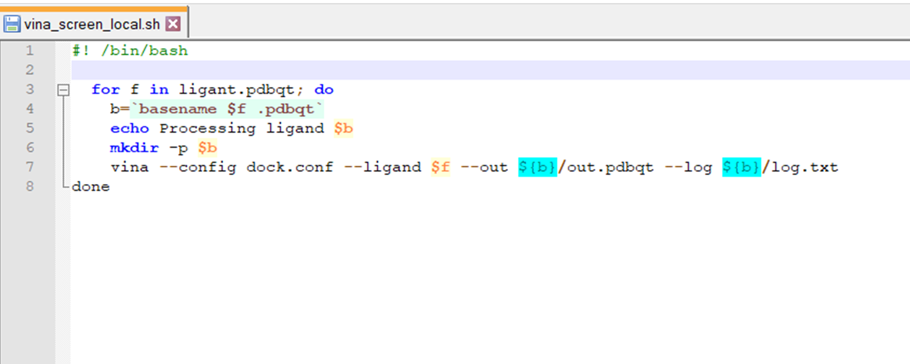

# Triagem Molecular Virtual (SBVS)

***Observações:***

- Este tutorial foi construído pela Dra. Jéssika Viana (na época como discente de doutorado em Estágio em Docência) e revisado pelo Prof. João Paulo MS Lima (PPg-Bioinfo/BioME). Este tutorial foi construído ***apenas para fins didáticos***. <span style="color:red">**A reprodução dele para qualquer outro fim não é permitida e nem consentida.**</span> 

## Acoplamento de inúmeros ligantes em um alvo biológico

### Introdução

Neste tutorial iremos utilizar o software [AutoDock Vina](http://vina.scripps.edu/), também visto no tutorial passado ([Atracamento Molecular](https://drive.google.com/uc?export=download&id=1Oij9-vr5W0rw2yhA2i5oXJsyCo-zuCc0)) sobre atracamento molecular. Também iremos utilizar o Shell (linha de comando) e a triagem virtual baseada na estrutura do receptor. O objetivo do estudo é avaliar se ligantes com características químicas similares ao inibidor [3WL](https://www.rcsb.org/ligand/3wl) (total de 100 ligantes) apresentam interação similar, maior ou menor com a proteína 3CLpro do SARS-CoV-2, código PDB [6M2Q](https://www.rcsb.org/structure/6m2q).

Este tutorial será dividido em seis partes:

- Otimização do receptor e geração do formato ```pdbqt```.
- Geração da estrutura 3D dos ligantes.
- Criação de um arquivo de configurações.
- Criação de um script em shell (sh) e o seu arquivo executor.
- Realização do VS baseado em *docking*.
- Análise dos resultados.

### Instalação dos Programas

#### Linux e Windows (via WSL):

Instalando os programas OpenBabel e AutoDock Vina no Linux (ou WSL no Windows) via terminal:

```shell
sudo apt install openbabel autodock-vina
```

Para instalar o Subsistema Linux no Windows, siga os passos presentes [AQUI](https://docs.microsoft.com/pt-br/windows/wsl/install-win10).

>*Os executáveis do AutoDock Vina também estão disponíveis para Windows, mas será um pouco mais complicado você fazer a automação sem uma *shell*.*

#### No MacOS:

Vá na página dos desenvolvedores, faça o download dos programas e coloque os executáveis em um diretório de sua preferência. Tanto o AutoDock-Vina como o OpenBabel podem ser instalados via [Homebrew](https://brew.sh/index_pt-br). 

### Otimização do receptor e geração do formato pdbqt

Primeiramente, crie uma pasta/diretório para que todos os dados e resultados da triagem sejam alocados nela. Dentro deste novo diretório insira apenas a estrutura do receptor no formato ```pdbqt``` (você gerou este arquivo automaticamente no tutorial passado sobre docking no AutoDock Vina, como visto na figura abaixo). Nesta nova pasta o arquivo deve ser chamado de: ```dock.receptor.pdbqt```.


### Criação do arquivo de configurações

A seguir criaremos o arquivo de configurações em um editor de texto simples (bloco de notas, Notepad++ ou gedit). Este arquivo, que deverá ser chamado de ```dock.conf``` e conterá as seguintes informações: 

```
receptor = dock.receptor.pdbqt

center_x = 116.00
center_y = -15.00
center_z = 67.00

size_x = 18.00

size_y = 18.00

size_z = 18.00

energy_range = 3

exhaustiveness = 8

num_modes = 9
```

A linha 1 contém a descrição *receptor*, que indica o arquivo do receptor em formato ```.pdbqt```. As linhas 2 a 7 trazem as coordenadas do sítio ativo, sendo estas marcadas pelo *center* (posição da caixa em x, y e z) e pelo *size* (tamanho da caixa em x, y e z). A linha 8, chamada de *num_modes*, identifica o número de poses/conformações existentes para cada molécula. 


### Geração da estrutura 3D dos ligantes

Faça o download da lista de códigos SMILE disponível neste link do drive: 
[ligantes.smi - Google Drive](https://drive.google.com/uc?export=download&id=1n_4uWEOQhuA4-R4lsYoHbCoqPjEYFI4V). Salve este arquivo como ```moleculas.smi```.

Veja abaixo que este arquivo contém, em cada linha, o formato SMILE (1D) da estrutura de uma molécula. É com este código que iremos criar as estruturas tridimensionais das moléculas.

```
CC1=CC2=C(C(O)=C1)C(=O)C1=C(O)C(Cl)=C(O)C=C1C2
CN1CCN(CC1)C(=O)c1ccc(cc1)c1cc(=O)c2ccccc2o1
CC(C)Cc1c2oc(C)c(c(=O)c2c(O)c(O)c1O)c1ccc(cc1)c1c(C)oc2c(CC(C)C)c(O)c(O)c(O)c2c1=O
OC1=CC(O)=C(C=C1)C(=O)\C=C\C1=CC=CC(O)=C1O
Oc1ccc(cc1)c1cc2cc(O)cc(C#N)c2o1
Oc1c2c(=O)cc(oc2cc(OCc2cnc(Cl)cc2)c1)c1ccc(OCc2ccc(Cl)nc2)cc1
OC1=CC(O)=C(C=C1)C(=O)\C=C\C1=CC=C(O)C=C1O
OC1=CC(O)=C(C=C1)C(=O)\C=C\C1=CC(O)=CC=C1O
OC1=CC(C=C)=C2OC(=NC2=C1)C1=C(F)C(F)=C(O)C=C1
...
```


Em seguida, no terminal siga até o caminho de encontro a sua pasta/diretório. Nele, que já contém o arquivo ```dock.receptor.pdbqt```, você irá inserir as estruturas das moléculas 3D. Para isso, no terminal, execute os seguintes comandos:

```
obabel -ismi moleculas.smi -omol2 -0ant*.mol2 --gen3D
obabel ant*.mol2 -O lig*.pdbqt
```

Utilizando o comando ls veja que foram criados os ligantes com o nome ligant1, ligant2... em formato PDBQT. Basicamente o que o comando realizou foi converter as estruturas que estavam em formato smi (SMILE) em estruturas em formato 3D no formato mol2. No segundo comando convertemos do formato mol2 3D para em formato PDBQT. Este último formato é essencial para a realização do docking no Autodock Vina sob linha de comando.


### Criação de um script em shell (sh) e o seu arquivo executor

Em seguida, crie em um editor de texto um arquivo chamado ```vina_screen_local.sh```, que será o nosso *script* para execução do *docking*. Para isso, baixe o arquivo deste link [Manual Virtual Screening](http://vina.scripps.edu/vina_screen_local.sh) na página do AutoDock Vina. 

Note que o Script do AutoDock Vina contém uma nomeação diferente para alguns arquivos. Desta forma, altere a 3ª linha de ligand para **ligant** e a 7ª linha altere o conf.txt por **dock.conf**, como demonstrado na seguinte imagem:



Neste script é possível observar uma série de comandos que culminará no cálculo da interação de cada ligante com receptor selecionado. Na 6ª linha é possível observar a execução do programa Vina, que chamará os arquivos de configuração do sítio ativo (que contém também a referência do receptor) e os ligantes em ```pdbqt```. Como dados de saída são gerados dois arquivos, que veremos no tópico seguinte.

A partir deste ponto você deverá ter em seu diretório: o arquivo de coordenadas do sítio ativo (**dock.conf**), o arquivo do receptor (**dock.receptor.pdbqt**), os arquivos de cada ligante (**ligant1, ligant2...**) e o arquivo executor (**vina_screen_local.sh**). Neste caso executarei o VS do docking para os dois primeiros ligantes, mas faça para todos os ligantes em pdbqt!

> *Não se esqueça de verificar antes!*


> *Veja algumas opções adicionais no final deste tutorial.*

### Realização do VS baseado em *docking*

No terminal do Linux, vá para seu diretório e digite o comando de execução do script abaixo:

```shell
chmod +x vina_screen_local.sh
./vina_screen_local.sh
```

No terminal será executado o processamento do *docking* para cada ligante. Pode demorar um pouco, e vai variar pela quantidade de ligantes utilizados. Em nosso caso pode-se demorar cerca de 30 minutos.


Observe que é gerado na tela do terminal um pequeno resumo do *docking* em cada ligante, contendo o valor de energia para cada conformação do ligante analisado. 

Ao final de todo o processamento, verifique seu diretório. Observe que foram criadas pastas para cada ligante do estudo. Em cada pasta conterá um arquivo ```log.txt``` e um arquivo ```out.pdbqt```.

O arquivo ```log.txt``` conterá as informações de energia (afinidade de ligação) e o RMSD de cada conformação com relação ao composto de melhor energia. O arquivo ```out.pdbqt``` conterá os valores de energia e as coordenadas X, Y e Z de cada conformação gerada no *docking*. É com ele que veremos nossos resultados dentro do UCSF Chimera.

### Análise dos resultados

Após finalizado o VS baseado em *docking*, criaremos um arquivo chamado de ```vina_screen_get_top.py```.
O script do seguinte arquivo está apresentado [nesta página](http://vina.scripps.edu/vina_screen_get_top.py). Copie os dados, cole em um bloco de notas (ou notepad++) e salve com o nome: ```vina_screen_get_top.py```


Em seguida, no terminal, execute o seguinte comando:

```shell
python2 vina_screen_get_top.py 10
```

Note que ao final do comando digitamos o valor 10. Esse valor, chamado de argumento, demonstra que o script deve selecionar os 10 ligantes de melhor interação (ou seja, os 10 ligantes que apresentaram os menores valores de energia - mais negativos). Na tela ele mostrará o número de arquivos encontrados, a pasta referente ao ligante e o arquivo que contém o valor de energia (```out.pdbqt```). Ao fazer isso, vá em cada pasta do ligante selecionado e verifique o valor de energia (por meio do arquivo ```log.txt``` ou do out.pdbqt).


Para visualizar o resultado no UCSF Chimera, siga o caminho de menus abaixo:

- *Tools > Surface/Binding Analysis > View Dock > arquivo out.pdbqt*

## Atividade

Agora observe seus resultados da triagem virtual e responda as seguintes indagações: 

1. Quais ligantes apresentaram os 10 melhores valores de interação com a enzima 3CLpro? E quais os valores de energia desses ligantes? Descreva-os criando uma tabela. 
2. Qual o flavonoide que apresentou a pior interação com a enzima 3CLpro? 
3. No Chimera, observe as diferenças das ligações de hidrogênio (veja o tutorial passado de *docking*). Quantas ligações de hidrogênio foram identificadas no composto de maior energia? 
4. Observe as poses (as várias conformações de cada ligante) para cada ligante. Quais diferenças você pode notar sobre a estrutura dos flavonoides? Em qual fragmento molecular é possível identificar maior movimentação na estrutura?

## Apêndice

Você pode também automatizar todos os processos com um único script em shell. Isto, além de facilitar sua vida, é mais adequado para inclusão em *pipelines* para o estudo de diversas moléculas. O exemplo abaixo demonstra um script em shell que já integra os comandos do OpenBabel e do Vina.

> *O "n" é para o número de linhas (moléculas) do seu arquivo.*

```shell
#!/bin/bash

for i in `seq 1 n` ; do

START=$(date +%s)

babel -ismi moleculas.smi -omol2 ${i}.mol2 --gen3D -f ${i} -l ${i}
obabel ${i}.mol2 -O ${i}.pdbqt
vina --config dock.conf --receptor dock.receptor.pdbqt --ligand  ${i}.pdbqt --out ${i}_docked.pdbqt

END=$(date +%s)

ENERGIA=$(sed 2p ${i}_docked.pdbqt  | awk '{ print $4 } ')
MOL=$i
TIME=$(($END-$START))
grep "$MOL    $ENERGIA" >> RESULTADOS.txt

echo "O tempo do docking da $MOL foi de $TIME segundos"

done
```