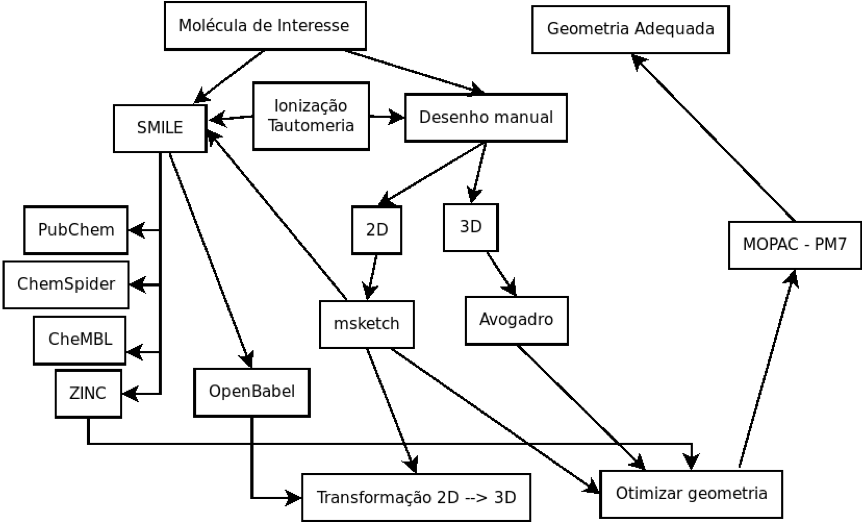
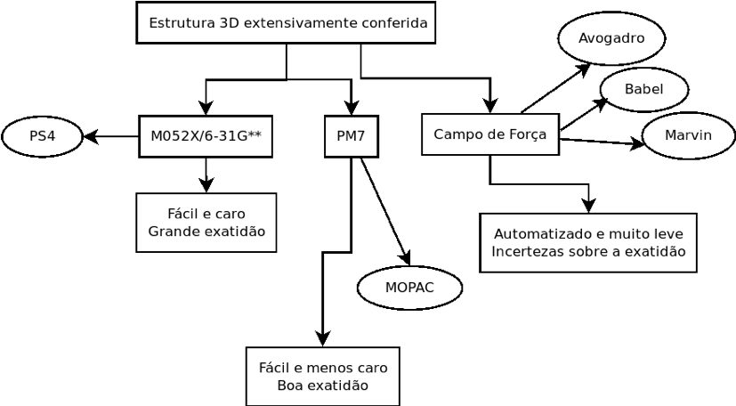

# Modelos computacionais de moléculas pequenas

Prof. Euzébio Guimarães – DFAR – BioME - UFRN

## Introdução

O presente tutorial terá como foco moléculas orgânicas mais comuns. Tais moléculas são constituídas principalmente de Carbono (_C_), Oxigênio (O), Nitrogênio (N) e Hidrogênio (H). Halogênios também são muito comuns, assim como a presença de átomos de Enxofre (S), dentre outros. Fármacos, pesticidas, substratos enzimáticos etc. são moléculas que possuem esta constituição. Não daremos atenção a compostos organometálicos.

Traremos primeiramente métodos para estudar tais moléculas conforme o fluxograma* abaixo partindo de uma molécula de interesse.



> _Construído com o programa DIA._

## Tutorial 1:

### Obtendo modelos moleculares para a Vitamina C.

Vamos supor que queiras trabalhar com a estrutura da Vitamina C. Para isso, precisamos criar modelos 3D para tal molécula. Temos duas opções:

- Obter a estrutura de servidores especializados  
- Desenhar manualmente o composto.

#### Obtenção da estrutura em Servidores especializados.

Os servidores mais comuns para se obter a estrutura de uma molécula de interesse são:

- [PubChem](https://pubchem.ncbi.nlm.nih.gov/search/#collection=compounds)
- [ChemSpider](http://www.chemspider.com/)
- [ZINC](http://zinc.docking.org/)
- [ChEMBL](https://www.ebi.ac.uk/chembl/)

Para nosso primeiro tutorial usaremos o servidor ZINC.


Basta buscar **_ascorbic acid_** na barra de busca rápida.

Como mostrado na figura baixo você conseguirá o código SMILES para a Vitamina C. Com a linha de SMILES você pode desenhar com facilidade este composto utilizando programas como o Marvin.


Mas podemos baixar as estruturas já em formato 3D: `MOL2` ou `SDF`.

A dinâmica é muito similar com os outros servidores.

#### Desenhar manualmente o composto.

Esse caso é bem útil se vemos desenhado o composto de interesse em papers ou materiais impressos. Para isso lançamos mão do programa Marvin. É muito simples.

Recomendo assistir este vídeo:

[Video do Youtube](https://www.youtube.com/watch?v=N-idU05G9YA)

<iframe width="560" height="315" src="https://www.youtube.com/embed/N-idU05G9YA" frameborder="0" allow="autoplay; encrypted-media" allowfullscreen></iframe>

<iframe width="560" height="315" src="https://www.youtube.com/embed/N-idU05G9YA" frameborder="0" allow="autoplay; encrypted-media" allowfullscreen></iframe>

<iframe width="560" height="315" src="https://www.youtube.com/embed/N-idU05G9YA" frameborder="0" allow="autoplay; encrypted-media" allowfullscreen></iframe>

Contudo, uma vez que você já possui o código SMILE basta copiar e colar diretamente no Marvin:


## Tutorial 2

### Criando uma estrutura 3D para a Vitamina C

Para realizar simulações mais complexas, as estruturas 2D são insuficientes. É necessária a obtenção de modelos 3D. Existem 4 maneiras para se conseguir tais modelos:

- Baixar estruturas 3D prontas de servidores.
- Converter formatos SMILES 2D em 3D.
- Desenhar a molécula diretamente em 3D.
- Converter moléculas utilizando linha de comando (Ideal para automatização em _pipelines_).

#### Baixar estruturas 3D prontas de servidores

Você pode encontrar as estruturas prontas em servidores como já foi demostrado. Para baixar, por exemplo, a estrutura da vitamina C do PubChem proceda como se segue:


Abaixo está um trecho do arquivo SDF, muito utilizado para representar as coordenadas dos átomos moleculares.

```none
54670067
  -OEChem-06301813333D

 20 20  0     1  0  0  0  0  0999 V2000
    0.0932   -1.1066    0.6445 O   0  0  0  0  0  0  0  0  0  0  0  0
   -1.3436    0.0892   -1.3863 O   0  0  0  0  0  0  0  0  0  0  0  0
    0.8392    2.3901    0.2844 O   0  0  0  0  0  0  0  0  0  0  0  0
   -3.8929   -0.2040   -0.3326 O   0  0  0  0  0  0  0  0  0  0  0  0
    3.0220    0.5695   -0.6056 O   0  0  0  0  0  0  0  0  0  0  0  0
    1.9915   -2.1560   -0.1376 O   0  0  0  0  0  0  0  0  0  0  0  0
   -0.3397    0.2618    0.7853 C   0  0  2  0  0  0  0  0  0  0  0  0
   -1.6059    0.4585   -0.0330 C   0  0  2  0  0  0  0  0  0  0  0  0
    0.8212    1.0265    0.2887 C   0  0  0  0  0  0  0  0  0  0  0  0
   -2.7464   -0.4082    0.4863 C   0  0  0  0  0  0  0  0  0  0  0  0
    1.8077    0.2273   -0.1049 C   0  0  0  0  0  0  0  0  0  0  0  0
    1.3536   -1.1481    0.1108 C   0  0  0  0  0  0  0  0  0  0  0  0
   -0.5154    0.4609    1.8484 H   0  0  0  0  0  0  0  0  0  0  0  0
```

Podemos observar as coordenadas _x, y e z_, assim o tipo de átomo neste pequeno trecho do arquivo. Este arquivo tem qualidade bastante alta e possivelmente já está pronto para as próximas etapas deste tutorial.

#### Converter formatos SMILES 2D em 3D

Para proceder com uma transformação podemos desenhar o composto no msketch e converter para um formato de 3D.


Vá em: **_Calculation > Conformation > Conformers_** Selecione a opção: `Return only the lowest energy conformer found`.

Basta agora salvar como `.sdf` ou qualquer outro formato.

Um procedimento para obtenção da estrutura 3D pode ser feito com o UCSF Chimera apenas com o código SMILE da estrutura.

> _Sempre use a opção Isomeric SMILES quando disponível, pois é conservada a informação de esteroquímica._

Para isso, siga os menus no UCSF Chimera: **_Tools > Structure Editing > Build Structure_**


Basta colar o SMILES no local indicado e clicar em `Apply`, assim sua estrutura 2D será convertida para 3D.

#### Desenhar a molécula diretamente em 3D

Como o uso do programa Avogadro, você vai poder desenhar a molécula diretamente em 3D. Contudo fique bem atento, pois o erro humano é um fator preponderante quando você escolher criar seus modelos assim.

O vídeo abaixo mostra como desenhar uma molécula em 3D no Avogadro (Basta clicar).

#### Converter moléculas utilizando linha de comando (Ideal para automatização)

Podemos converter uma linha SMILE para uma conformação 3D utilizando programas como o OpenBabel e o [Balloon](http://users.abo.fi/mivainio/balloon/download.php). Programas sem interface gráfica são muito úteis para automatização. Imagine se estivesse trabalhando com 300 moléculas. Criar um _loop_ (_shell scripting_) para converter todas para 3D é bem mais produtivo que converter uma por uma com os métodos mostrados anteriormente.

Vamos tentar:

- Salve os SMILES que você possui em um arquivo de texto único. No nosso caso temos uma molécula apenas.


> _Aqui vai uma dica importante: Nunca use, ao nomear seus arquivos, caracteres especiais ou espaços._
> 
> _Exemplo: Evite: Vitamina C.smi ou Ácido Ascóbico.smi, ao invés use vitC.smi ou AC.smi._

Vamos salvar como `vitC.smi` e converter para formato 3D, utilizando a seguinte linha de comando em terminal:

```none
obabel vitC.smi -O vitC.sdf –gen3d
```

Daí, o arquivo `vitC.sdf` já está pronto para as próximas etapas.

## Tutorial 3

### Ionização e Tautomeria nunca podem ser ignorados

Dois fatores frequentemente e erroneamente ignorados em muitos estudos de modelagem molecular são as modificações decorrentes do equilíbrio químico com o solvente. A água pode agir como um ácido protonando sua molécula de interesse ou agir como uma base, a tornando um ânion. Este fator é decisivo quando se faz a previsão da interação com alvos biológicos. Não se pode ignorar estes fatores. Carboxilas muito provavelmente estão na forma de ânion e aminas geralmente estão protonadas. O programa mksketch pode prever se sua estrutura de interesse está ionizada com grande facilidade.

> _IMPORTANTE: Sempre simule sua molécula como se ela estivesse no pH de um possível teste biológico ou ensaio._

Exemplo da ciprofloxacina:


Para estimar todos os estados de protonação e suas respectivas populações:


A tautomeria é a mais ignorada de todos estes fatores. Em anexo a esta apostila está um paper bastante intrigante sobre tal fenômeno: [J Comput Aided Mol Des (2009) 23:693–704. Let’s not forget tautomers de Yvonne Connolly Martin.](https://www.ncbi.nlm.nih.gov/pubmed/19842045). O trecho abaixo foi retirado dele:

> _“Tautomerization equilibria present a continuing challenge to computer-aided molecular design, affecting everything from library design to SAR to docking and scoring protein-ligand interactions. The absence of experimental data and validated computational methods make tautomerization easy to ignore but overwhelming to consider.”_

No msketch você pode levar em conta o tautomerismo (pode ser que nada mude) quando estiver calculando os estados de protonação.

> _Jamais ignore os estados de protonação e o tautomerismo._

---

##### _Dica_:

Para levar em conta a protonação de sua molécula você pode usar o OpenBabel também, com o seguinte comando:

```none
obabel vitC.smi -O vitC.sdf –gen3d -p 7.4
```

> _Nesse exemplo utilizamos o pH 7,40_

Os resultados do babel são muito inferiores aos do Marvin:


## Tutorial 4

### Considerações sobre otimização de geometria



A estrutura 3D que você obteve passou por otimizações com campos de força, os quais trataremos mais adiante no curso. Os campos de força hoje em dia já foram muito bem refinados e automatizados. Anteriormente, eles eram muito difíceis de implementar corretamente para fornecerem resultados exatos. Os melhores resultados de otimização de geometria para moléculas orgânicas vêm de cálculos com mecânica quântica _ab initio_ ou _funcional da densidade_. Recomendo os funcionais de densidade M052X com as funções de base 6-31G** implementados no programa [PSI4](http://psicode.org/) para moléculas orgânicas. Contudo estes cálculos são bastante caros computacionalmente (Demoram muito tempo para o cálculo da geometria 3D otimizadas). Uma versão de mecânica quântica semi-empírica é o PM7 implementado no programa MOPAC (já instalado em sua máquina). O PM7 é muito bem parameterizado e garante geometrias para moléculas orgânicas de boa qualidade.

Vamos ver como otimizar sua molécula. Utilize o programa GABEDIT para criar os _inputs_:


Ao visualizar a molécula, feche a janela e clique no botão para criar o input para o MOPAC2016.


Coloque a carga da molécula (pode estar ionizada). _Spin_ quase sempre vai aparecer 1. Caso apareça 2, você fez algo errado. Nas outras opções, coloque:

- `Job Type` - _Equilibrium structure search_.
- `Hamiltonian` - _PM7_.
- `Solvent` - _Water [H2O]_.

Salve a molécula como vitC.mop e execute o seguinte comando em um terminal:

```none
mopac vitC.mop
```

> _Deve ser muito rápido._

Ao terminar digite:

```none
gabedit vitC.mop
```

Desenhe a molécula otimizada em `Draw` e salve como `vitC_opt.mol` na janela subsequente.


Veja abaixo a comparação da molécula feita com campos de força e a otimizada. Neste caso não houve uma grande modificação, mas algumas vezes a mudança é substancial.

> _Sempre otimize suas moléculas pelo menos com um método semi-empírico (Sugestão PM7)._

