# Análise conformacional

Prof. Euzébio Guimarães – DFAR – BioME - UFRN

## Introdução

Análise conformacional é a busca por todas as posições energeticamente acessíveis para uma determinada molécula. Nos anos 70, 80 e 90 eram muito comuns publicações contendo estudos minuciosos sobre conformações de moléculas. Atualmente, este tipo de estudo é feito, mas não é o alvo principal abordado em uma pesquisa. Contudo, é uma fase vital para adquirir uma conformação realística.

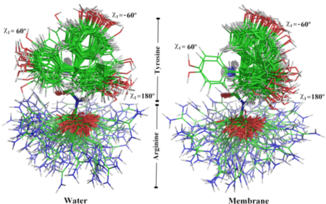

Em todo estudo que fizeres, principalmente se a molécula de interesse tiver várias ligações que giram, é essencial realizar uma extensiva análise conformacional. Além disso, a conformação de energia mínima no solvente pode ser diferente da encontrada dentro de um receptor, então é importante encontrar o maior número de conformações possível e obter a energia relativa de cada uma. Com o método PM7 que já usamos podemos obter esse dado com grande facilidade. O difícil na verdade é amostrar as conformações.

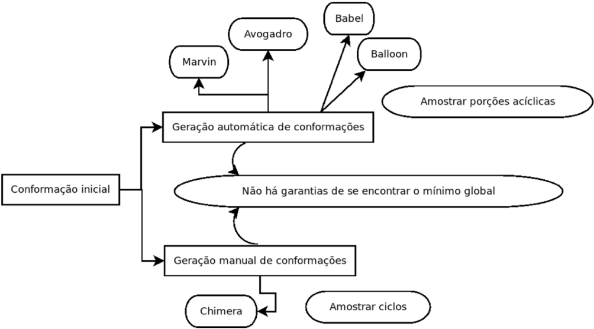

A melhor maneira de se criar conformações para sua molécula é a forma automática. Pode ser feito com os programas Marvin ou Avogadro, mas interfaces gráficas apenas tornam o processo mais demorado.

## Tutorial 5

### Gerando conformações com Balloon

Vamos utilizar agora uma molécula maior que a Vitamina C para que o resultado seja mais interessante. A quiotorfina é mais interessante neste caso. Vamos obter várias conformações 3D a partir do SMILES do PubChem

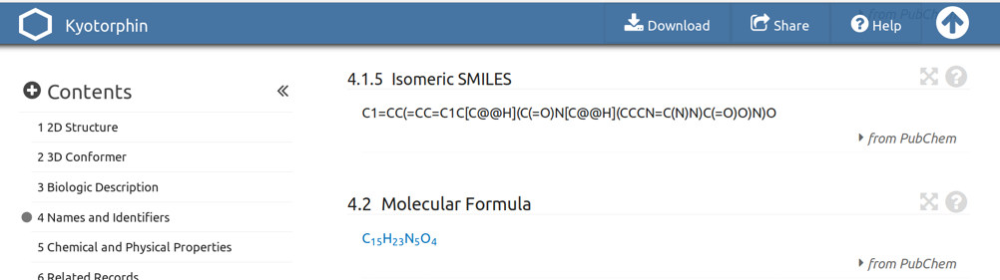

Salvar um arquivo `kyo.smi` como feito anteriormente.

```none
gedit kyo.smi
```

Use o programa Marvin para gerar a protonação correta para a molécula. Repare que é bastante complexa a população de microespécies. Mas a conformação 5 (no caso da figura abaixo) foi a mais predominante no pH 7,00.

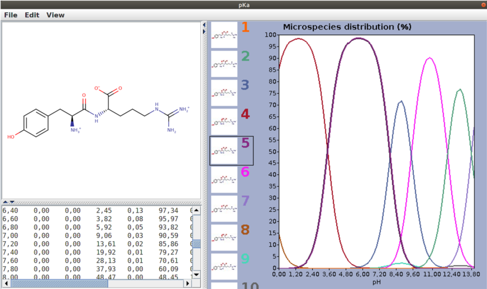

Agora você pode gerar várias conformações no próprio **Marvin**, mas iremos criar apenas uma e depois utilizar o **Balloon** para gerar outras.

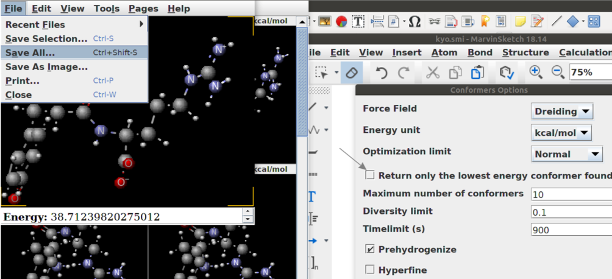

Salve como `kyo_3D.mol` (MDL molfile) e gere as conformações para o composto de maneira automática com o **Balloon**.

Digite:

```shell
export BALLOON_FORCEFIELD=/home/...
```

> _Lugar onde está o arquivo MMFF94.mff que veio com o Balloon._

e em seguida:

```shell
balloon --nconfs 20 --nGenerations 300 --rebuildGeometry kyo_3D.mol kyo_conformers.sdf
```

Com o comando acima serão geradas no mínimo 20 conformações utilizando uma busca via algoritmo genético. Repare na figura abaixo que são geradas diversas conformações para uma estrutura 3D única. Basta agora realizar uma otimização de geometria para cada uma utilizando PM7. Para isso seus conhecimentos de _shell script_ serão necessários. Ao obter a energia para cada conformação pondere-as por uma distribuição de Boltzman para obter a porcentagem de existência de cada conformação em uma determinada temperatura.

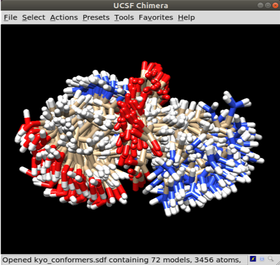

## Tutorial 6

### Gerando conformações de forma manual

Quando a molécula tem ciclos muito grandes (7 átomos ou mais) os algoritmos de geração de conformações não conseguem amostrar bem estas porções. Tomamos como exemplo a molécula abaixo. Podemos gerar no mínimo 3 confomações de baixa energia.

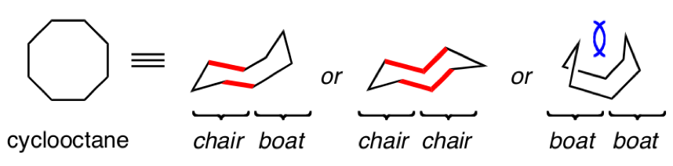

O SMILE do ciclooctano é `C1CCCCCCC1`. Vamos gerar a estrutura 3D no UCSF Chimera e tentar criar tais conformações manualmente.

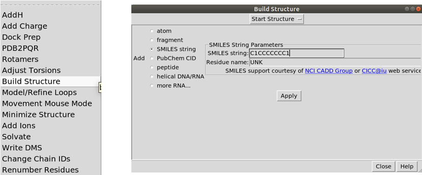

Será criada automaticamente uma conformação aleatória.

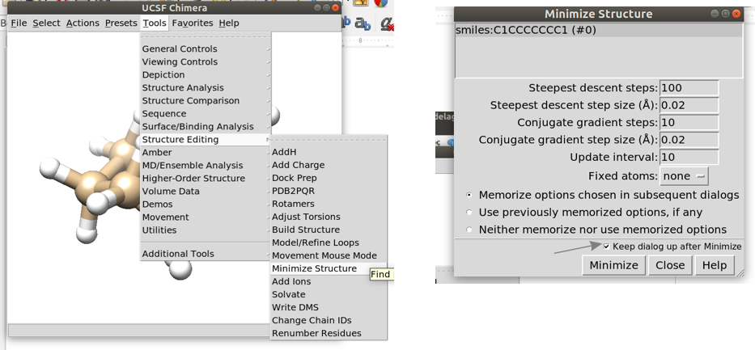

Agora utilize o UCSF Chimera para otimizar a molécula com o campo de força implementado no próprio software. Otimizações sucessivas juntamente com a movimentação de átomos selecionados gera uma nova conformação.

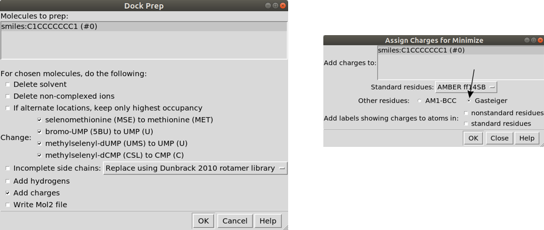

Vamos usar a ferramenta de **_mouse movement_** para mover os átomos indicados na figura abaixo.

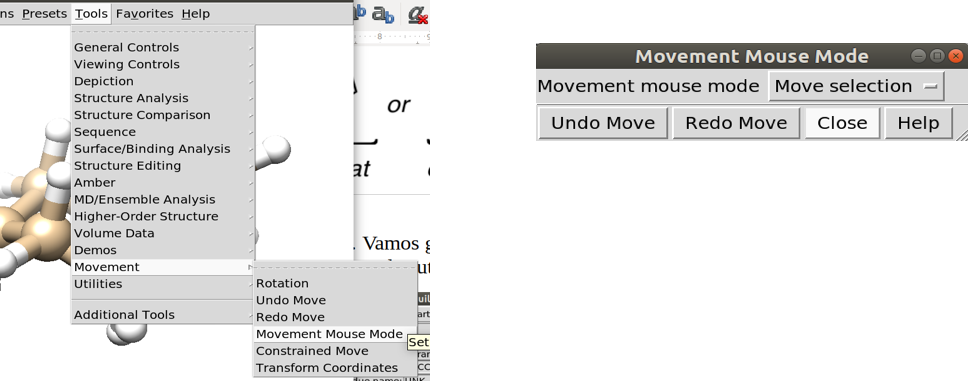

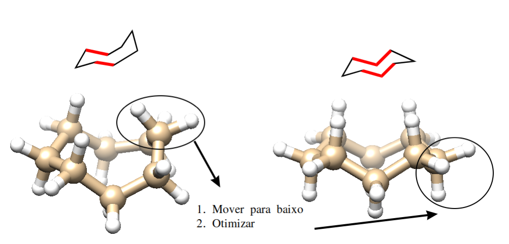

Agora você precisa ser habilidoso para mover os átomos apontados otimizar a molécula para uma nova conformação. Segure a tecla `Ctrl` e selecione um átomo, depois segure `Shift` juntamente com `Ctrl` e selecione outros átomos. Com o botão do _thumbwheel_ (aquele do entre os dois botões do mouse) mova os átomos até a posição desejada. Otimize novamente. Com este método você será capaz de conseguir diversas conformações para os ciclos e otimizar com PM7 para saber a energia relativa.

> *Não se preocupe se esta parte ficou meio obscura, tutoriais futuros faremos os procedimentos de docking manual onde este procedimento é mostrado novamente.*