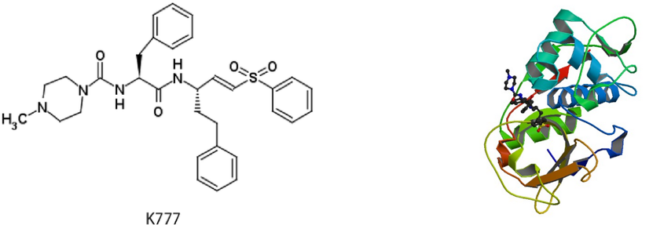
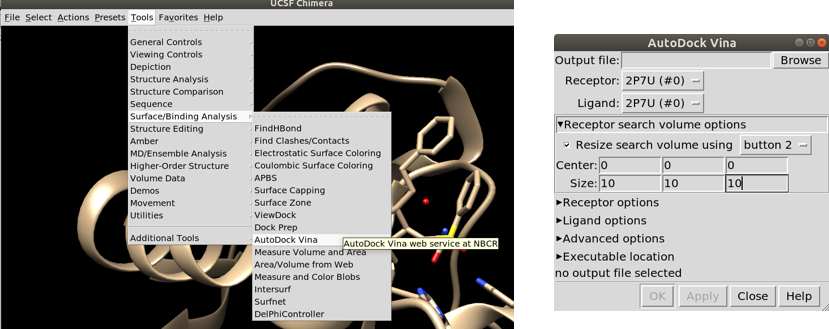

# *Docking* molecular automático

Prof. Euzébio G. Barbosa (DFAR/UFRN/BioME)

> **Observação:** *O Tutorial abaixo está sendo reproduzido com o consetimento do professor, apenas para fins didáticos.*

*Docking* molecular, atracamento molecular ou ancoramento molecular é uma técnica para obter um complexo de interação para duas ou mais moléculas. Mais comumente temos a interação entre uma macromolécula (proteína) em sítio desejado com uma molécula pequena. A estrutura da proteína geralmente é mantida fixa e a estrutura do ligante pode mudar de conformação (os ciclos não mudam de conformação). Podemos ter o acoplamento entre duas proteínas (*Protein-protein docking*) ou entre duas moléculas pequenas também. Neste curso iremos trabalhar com o *docking* proteína-ligante e *docking* proteína-proteína.

Existem diversos programas pagos (e caros) que realizam docking de uma maneira bastante exata e eficaz. O [Auto-dock Vina](http://vina.scripps.edu/) é um dos pacotes livres mais utilizados. Além dele, uma opção *on-line* fácil de utilizar e com resultados excelentes é o [SwissDock](http://www.swissdock.ch/).

Para *docking* Proteína-Proteína existem várias opções. Este *link* enumera diversas ferramentas para esse fim: [https://omictools.com/protein-protein-docking-category](https://omictools.com/protein-protein-docking-category). Também podem ser citados o programa [HADDOCK](http://www.bonvinlab.org/software/haddock2.2/), que funciona bem e é bastante fácil de utilizar. Existem também diversos servidores, como: [ZDOCK](http://zdock.umassmed.edu/) ou [ClusPro](https://cluspro.bu.edu/login.php) entre diversos outros.

## Parte 1 
### *Docking* ligante proteína com UCSF Chimera e Autodock-Vina

Eu gravei um tutorial bem simples (Sem narração) sobre como fazer docking com o autodock-vina acoplado no UCSF Chimera:

[Playlist - Vídeos Docking](https://www.youtube.com/watch?v=KwdxdfzJiws&list=PLRLpdK3kOpA_LwOjXrHiz5dhO5Stk9Fsh) 

A *playlist* acima cobre todas as etapas necessárias para conseguir sua conformação ancorada no sítio. Contudo esta maneira de realizar *docking* não é a mais eficiente. A melhor estilo de se fazer um ancoramento é utilizando o mínimo possível de interfaces gráficas. Quando tratarmos de triagem virtual estes detalhes serão elucidados. Um outro tutorial utilizando o Autodock-Vina pode também ser encontrado nessa mesma página.

## Parte 2

### *Docking* ligante proteína com servidor SwissDock

Para este tutorial utilizaremos os dados da estrutura [2P7U](https://www.rcsb.org/structure/2P7U), (*The crystal structure of rhodesain, the major cysteine protease of T. brucei rhodesiense, bound to inhibitor K777*). A molécula K777 (mostrada abaixo) é capaz de se ligar a proteína Rodesaína do *T. brucei*. A estrutura [2P7U](https://www.rcsb.org/structure/2P7U) já contém o mesmo ligante. O que faremos estão é um Redock, um procedimento onde o mesmo ligante é colocado no seu próprio sítio. Se a estrutura experimental for parecida com a estrutura simulada podemos atestar a qualidade do algoritmo utilizado para o *docking*.

>*Esta é também uma excelente estratégia para você treinar suas habilidades em docking.*



Baixe a estrutura PDB da [2P7U](http://www.rcsb.org/structure/2P7U) e, com o auxílio do programa UCSF Chimera, remova o ligante. Salvando a proteína como ```recep.pdb```. Em seguida, baixe a estrutura do [K777](https://pubchem.ncbi.nlm.nih.gov/compound/9851116#section=2D-Structure) do PubChem em 3D. Salve esta estrutura como K777.sdf ou qualquer outro formato de arquivo 3D.


Você precisará obrigatoriamente de um formato ```MOL2```. Se não for o caso basta converter, usando o seguinte comando em um terminal:

```shell
obabel K777.sdf -O K777.mol2
```

Faremos agora o upload dos dois arquivos no servidor SwissDock.

A figura abaixo mostra como fica se tudo estiver correto. Dê um nome para o *Job* e pronto. Basta esperar para ver o resultado. Vai demorar bastante. Muito mesmo.


O SwissDock dá diversas estruturas e é possível baixar todas no site e visualizar os resultados no UCSF Chimera:


## Parte 3 
### *Docking* ligante proteína com servidor Autodock-Vina

Realizar *docking* por linha de comando ao invés de utilizar um servidor ou uma interface gráfica é a possibilidade de automatização das etapas. O arquivo principal para realizar um docking por linha de comando é a criação de um arquivo de configuração que tem um formato muito parecido com o seguinte (```Arguivo config.cfg```):

```text
receptor = recep.pdbqt
ligand = K777.pdbqt
center_x =
center_y =
center_z =
size_x =
size_y =
size_z =
```

Basta copiar e colar no gedit e salvar como ```config.cfg```.


 
As informações são necessárias para o centro do sítio ativo e também o tamanho de uma caixa que englobe todo o sitio. Iremos usar o UCSF Chimera pera obter esses valores. Para isso é só abrir o Arquivo ```2P7U.pdb``` e definir uma caixa ao redor do ligante.


Coloque valor para o *Center* e *Size* como na figura, com a opção ```Resize search volume options``. Reposicione a caixa até envolver o ligante como um todo. Não crie uma caixa muito grande, pois o ligante pode parar fora do local desejado. Não crie uma caixa muito pequena, ou ligante é vai ficar espremido no sítio de ligação.

Anote os valores e complete o arquivo de configuração:

```
receptor = recep.pdbqt
ligand = K777.pdbqt
center_x = -7.47275
center_y = 2.47648
center_z = 9.35775
size_x = 16.9096
size_y = 21.9832
size_z = 17.5384
```

Agora basta converter os arquivos para ```.pdbqt```:

```
obabel K777.mol2 -O K777.pdbqt python /opt/UCSF/Chimera64-1.13rc/lib/python2.7/site-packages/AutoDockTools/Utilities24/prepare_receptor4.py -r recep.pdb -o recep.pdbqt
```

Agora vamos realizar o procedimento do *docking*, com o seguinte comando:

```
vina --config config.cfg --out docked.pdbqt
```

Para ver o resultado, vamos abrir o arquivo ```2P7U.pdb``` e utilizar a ferramenta **ViewDock** no UCSF Chimera. Pela figura ao lado vemos que o procedimento de *redocking* foi muito ruim. Esse é um dos grandes problemas do *docking*, certamente em alguns casos será coincidente, mas a metodologia tem muitas falhas (Melhor ficar ciente). O Resultado do SwissDock foi bem melhor que do Autodock-Vina. Revelando a fragilidade do Vina neste sistema em particular.


# Posicionamento manual do ligante

## *Docking manual*

Muitas vezes, as energias da função de avaliação do *docking* não são o objetivo principal do seu estudo, e sim obter uma conformação inicial para realizar por uma dinâmica molecular. Eu gravei um procedimento para docking manual no YouTube:

[Posicionamento manual do ligante - Ver no YouTube](https://www.youtube.com/watch?v=15trTt7Svbg&index=8&list=PLRLpdK3kOpA_LwOjXrHiz5dhO5Stk9Fsh)

O procedimento é muito similar ao tutorial de modificação de conformação de ciclos realizado anteriormente.