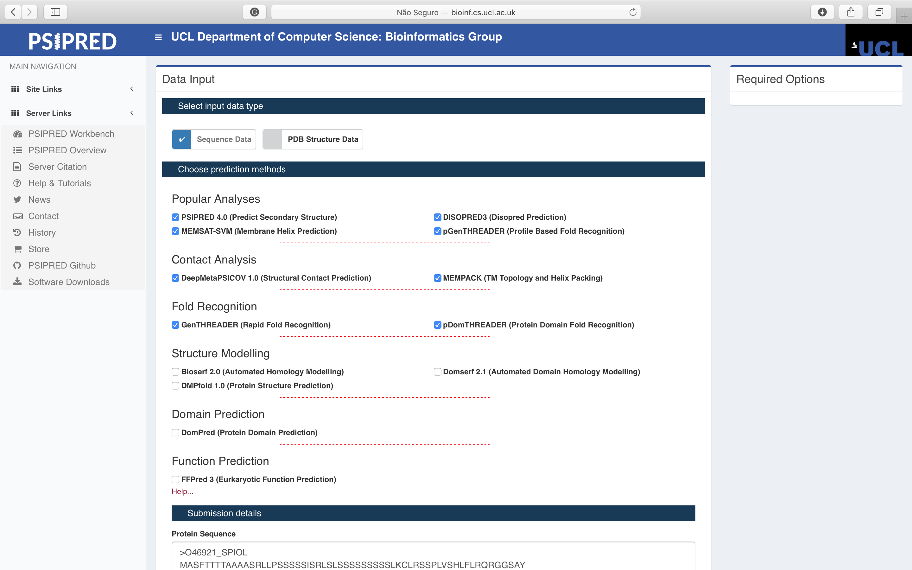

# Obtendo informações a partir da sequência

## Objetivos

- Obter o máximo de informação utilizando apenas a estrutura primária da proteína (sequência de aminoácidos) como entrada.
- Identificar e anotar as estruturas secundárias a partir da sequência.
- Verificar possíveis regiões transmembranas, regiões desordenadas, *folds* e domínios proteicos.
- Realizar predição de regiões clivadas da proteína final (Ex.: peptídeo sinal, regiões de pré ou pró proteínas, etc.), que não devem ser utilizadas para modelagem.

## Primeiros passos

Obtenha o máximo de informações sobre as sequências abaixo. Elas codificam para proteínas diferentes. Utilize o BLAST ou alguma de suas versões para verificar quais diferenças elas apresentam entre si?

```
>tSPIOL
AAAAAACGCGTGGTTGGCGCACTTCTTCCTGTAATCCTTCAAAACCAGTAGTGTCAGGAGAGAGAAAAAC
CACCCAATCTCACTCACTTTCTCTCTCTATATTTTCAAACCACCACCCCGCAACCAATGACTGATCGTCT
AGCAATGGCATCCTTCACTACCACCACCGCCGCCGCTGCATCTCGTCTGCTTCCTTCTTCTTCCTCCTCC
ATCTCTCGACTTTCTCTCTCCTCTTCTTCCTCCTCCTCCTCCTCACTCAAATGTCTCCGATCATCTCCAC
TCGTCTCTCACCTCTTCCTTCGACAGAGAGGAGGTTCAGCTTATGTGACGAAGACGAGGTTTAGCACGAA
ATGCTACGCTTCTGATCCTGCGCAGCTGAAGAATGCTAGGGAAGATATTAAAGAGCTTCTTCAATCTAAG
TTCTGTCATCCTATTATGGTTCGCTTAGGTTGGCACGATGCCGGTACTTATAATAAGGACATTAAAGAAT
GGCCACAAAGAGGTGGAGCCAATGGCAGTCTGAGGTTTGATGTTGAGCTCAAGCATGGAGCTAATGCAGG
TCTTGTTAATGCCCTGAAACTTCTACAGCCCATAAAAGACAAGTACTCTGGAGTTACATATGCAGATCTA
TTCCAGCTGGCTAGTGCTACTGCAATAGAGGAGGCTGGTGGTCCAACAATACCCATGAAGTATGGAAGAG
TGGATGCCACAGGGCCGGAGCAGTGCCCAGAAGAAGGAAGGCTTCCTGATGCTGGACCTCCTTCACCTGC
TCAACATCTACGTGATGTTTTCTACAGAATGGGTCTTGATGATAAGGATATAGTAGCATTATCTGGAGCA
CATACGTTGGGAAGGTCTAGACCTGAACGCAGTGGTTGGGGCAAGCCAGAGACTAAATACACGAAAGATG
GACCTGGAGCTCCAGGAGGGCAGTCATGGACTGCGGAGTGGTTGAAGTTTGATAATTCCTATTTCAAGGA
CATCAAAGAAAAGAGAGATGCAGATTTGCTTGTTTTGCCAACTGATGCTGCTCTTTTCGAAGATCCGTCT
TTCAAGGTATATGCAGAGAAATATGCAGCTGACCAAGAAGCATTTTTCAAGGATTACGCTGAAGCCCATG
CCAAACTCAGCAACCAAGGAGCCAAATTTGACCCTGCTGAGGGTATCACTCTTAATGGAACCCCTGCCGG
AGCAGCTCCAGAGAAGTTTGTAGCAGCCAAGTACTCATCTAACAAGAGATCAGAGCTTTCGGATTCTATG
AAGGAAAAGATTCGCGCTGAATATGAAGGTTTTGGAGGTAGCCCTAATAAGCCTCTACCAACAAACTACT
TCCTAAACATTATGATTGTGATTGGAGTTTTGGCAGTTCTATCATATCTTGCGGGAAATTGATTTGTGGT
TTGATGAGTTTTTTTCCATTTATAAATATAACGGCAGTTGATTATATGAAATTTCTTCTTGAAAATCGTC
CATTCA

>sSPIOL
AAAAAACGCGTGGTTGGCGCACTTCTTCCTGTAATCCTTCAAAACCAGTAGTGTCAGGAGAGAGAAAAAC
CACCCAATCTCACTCACTTTCTCTCTCTATATTTTCAAACCACCACCCCGCAACCAATGACTGATCGTCT
AGCAATGGCATCCTTCACTACCACCACCGCCGCCGCTGCATCTCGTCTGCTTCCTTCTTCTTCCTCCTCC
ATCTCTCGACTTTCTCTCTCCTCTTCTTCCTCCTCCTCCTCCTCACTCAAATGTCTCCGATCATCTCCAC
TCGTCTCTCACCTCTTCCTTCGACAGAGAGGAGGTTCAGCTTATGTGACGAAGACGAGGTTTAGCACGAA
ATGCTACGCTTCTGATCCTGCGCAGCTGAAGAATGCTAGGGAAGATATTAAAGAGCTTCTTCAATCTAAG
TTCTGTCATCCTATTATGGTTCGCTTAGGTTGGCACGATGCCGGTACTTATAATAAGGACATTAAAGAAT
GGCCACAAAGAGGTGGAGCCAATGGCAGTCTGAGGTTTGATGTTGAGCTCAAGCATGGAGCTAATGCAGG
TCTTGTTAATGCCCTGAAACTTCTACAGCCCATAAAAGACAAGTACTCTGGAGTTACATATGCAGATCTA
TTCCAGCTGGCTAGTGCTACTGCAATAGAGGAGGCTGGTGGTCCAACAATACCCATGAAGTATGGAAGAG
TGGATGCCACAGGGCCGGAGCAGTGCCCAGAAGAAGGAAGGCTTCCTGATGCTGGACCTCCTTCACCTGC
TCAACATCTACGTGATGTTTTCTACAGAATGGGTCTTGATGATAAGGATATAGTAGCATTATCTGGAGCA
CATACGTTGGGAAGGTCTAGACCTGAACGCAGTGGTTGGGGCAAGCCAGAGACTAAATACACGAAAGATG
GACCTGGAGCTCCAGGAGGGCAGTCATGGACTGCGGAGTGGTTGAAGTTTGATAATTCCTATTTCAAGGA
CATCAAAGAAAAGAGAGATGCAGATTTGCTTGTTTTGCCAACTGATGCTGCTCTTTTCGAAGATCCGTCT
TTCAAGGTATATGCAGAGAAATATGCAGCTGACCAAGAAGCATTTTTCAAGGATTACGCTGAAGCCCATG
CCAAACTCAGCAACCAAGGAGCCAAATTTGACCCTGCTGAGGGTATCACTCTTAATGGAACCCCTGCCGG
AGCAGCTCCAGAGAAGTTTGTAGCAGCCAAGTACTCATCTAACAAGGATTAAAGAAAAAAAGAAAACTCA
AAAGAATCATGTTTTCATGTGACTTTTGTCTTTTTTTTAATAAGCAAGATGAAGCTATTTTCTTGTGTAG
TCAGTCACATCTAAAACATGGTGGAGAAGAATAAAATTCAAACGAGTGTGTTGTGTTGCTTATTTGAATT
TGCAGAGATCAGAGCTTTCGGATTC
```

## Obtendo informações a partir da sequência

Um problema bastante comum em modelagem de proteínas é se deparar com sequências de aminoácidos que apresentam baixa similaridade com sequências depositadas em bancos de dados biológicos. Embora os métodos de modelagem comparativa, como por exemplo a modelagem por homologia, ainda consigam produzir bons resultados em níveis de identidade da sequência de aminoácidos em torno de 25%, é importante que predições adicionais sejam realizadas a partir da sequência de aminoácidos. Tais predições são:

- Predição de estrutura secundária.
- Predição de regiões desordenadas ou naturalmente desordenadas.
- Predição de *folds* e de domínios proteicos.
- Predição de regiões clivadas da proteína final (Ex.: peptídeo sinal, regiões de pré ou pró proteínas, etc.).
- Predição de regiões transmembrana.

A realização de tais predições é extremamente recomendável. Em proteínas com alta similaridade com proteínas presentes em bancos de dados, estas informações podem ser facilmente obtidas a partir dos bancos discutidos no tutorial de **Bancos de dados de informação proteica** e podem ser repassadas a sequência alvo. Quanto menor a similaridade, mais dependente serás de métodos que detectem o que chamamos de *"homologia distante"*, como por exemplo métodos de perfis proteicos, matrizes posição-específica e HMMs (também discutidos antes).

Nos passos que seguem, você verá ferramentas capazes de lhe ajudar na tarefa de:

- Obter informações sobre as prováveis regiões de estrutura secundária de uma sequência de aminoácidos.
- Verificar regiões não estruturadas, domínios de ligação a outras moléculas (Ex. regiões de reconhecimento de anticorpo) e domínios transmembrana.
- Reconhecer *folds* e domínios a partir da sequência com base em buscas com o PSI-BLAST e HMMs.
- Reconhecer regiões clivadas ou de sinalização de endereçamento da proteína.

Os exemplos abaixo estão guiados a partir da comparação de duas proteínas muito similares, mas com diferenças fundamentais em relação a sua localização subcelular e função.

### PSIPRED

O grupo de Bioinformática do Departamento de Ciências Computacionais da *University College London* (UCL) mantem um servidor que unifica várias ferramentas de predição de estrutura, chamado [PSIPRED](http://bioinf.cs.ucl.ac.uk/psipred/). Nele qualquer usuário pode submeter uma sequência de aminoácidos e obter diversas informações estruturais. Estas são retornadas na forma de um relatório bem detalhado. O servidor *online* tem limitações no tamanho da sequência de entrada, não aceitando sequências maiores que 1500 resíduos.

A principais ferramentas do servidor são:

- **PSIPRED:** Predição de estrutura secundária utilizando estratégia de redes neurais em resultados de buscas de similaridade utilizando o PSI-BLAST.
- **MEMSAT3 e MEMSATSVM:** Predição de topologia e de hélices transmembrana.
- **pGenTHREADER:** Ferramenta para reconhecimento de *folds* e identificação de *homólogos distantes*.
- **pDomTHREADER:** Ferramenta para reconhecimento de domínios. Ela faz uma classificação baseada em discriminação de superfamílias, combinando informações tanto de sequência como de estruturas, para produzir alinhamentos de domínios.
- **DISOPRED3:** Ferramenta para predição de regiões proteicas intrinsicamente desordenadas.

A descrição completa das ferramentas do PSIPRED podem ser encontradas [AQUI](http://bioinf.cs.ucl.ac.uk/index.php?id=779).

#### Iniciando a predição

Iremos utilizar a sequência abaixo:

```
>O46921_SPIOL
MASFTTTTAAAASRLLPSSSSSISRLSLSSSSSSSSSLKCLRSSPLVSHLFLRQRGGSAY
VTKTRFSTKCYASDPAQLKNAREDIKELLQSKFCHPIMVRLGWHDAGTYNKDIKEWPQRG
GANGSLSFDVELRHGANAGLVNALKLLQPIKDKYSGVTYADLFQLASATAIEEAGGPTIP
MKYGRVDATGPEQCPEEGRLPDAGPPSPAQHLRDVFYRMGLDDKDIVALSGAHTLGRSRP
ERSGWGKPETKYTKDGPGAPGGQSWTAEWLKFDNSYFKDIKEKRDADLLVLPTDAALFED
PSFKVYAEKYAADQEAFFKDYAEAHAKLSNQGAKFDPAEGITLNGTPAGAAPEKFVAAKY
SSNKRSELSDSMKEKIRAEYEGFGGSPNKPLPTNYFLNIMIVIGVLAVLSYLAGN
```

**Etapas:**

- Abra a página do [PSIPRED](http://bioinf.cs.ucl.ac.uk/psipred/). Cole a sequência no espaço indicado.
- Cole a sequência, escolha as ferramentas, insira o seu email (não há necessidade de ser um email institucional) e edite se precisar o nome do trabalho (*Job name* - o cabeçalho fasta é automaticamente importado).



- Clique em ```Predict``` e espere os resultados.

> *O tempo de obtenção dos resultados varia de acordo com tamanho da sequência e a quantidade de ferramentas escolhidas, mas normalmente eles demoram mais de 30 minutos.*

#### Analisando os resultados

Logo após o seu término, o link da página com os resultados do PSIPRED são enviados ao email cadastrado (se você tiver incluído). A página contém uma série de "caixas", cada uma relativa aos resultados encontrados por cada uma das ferramentas selecionadas.

Os resultados também podem ser acompanhados por este *link*:

[Resultados PSIPRED - O46921_SPIOL](http://bioinf.cs.ucl.ac.uk/psipred/&uuid=5b12e0da-d485-11e9-aaf5-00163e100d53)

Os arquivos da predição podem ser baixados [AQUI](https://drive.google.com/uc?export=download&id=1YNQHX1XVZJ09WMqoBEvJ-R90FMxIVp_n), caso o *link* expire.

> *O link expira em 5 dias, por isso o recomendável é fazer logo o download dos resultados. O link para download fica na coluna direita, chamada Downloads.*

A primeira parte dos resultados retorna um diagrama da sequência (o mapa), com todos os resíduos e as atribuições encontradas para cada um deles.

Acima deste mapa, três botões aparecem, com os seguintes resultados:

- ```Show psipred``` - Mostra os resultados da predição de estrutura secundária.


Pela análise da figura acima, pode-se perceber que o início da sequência possui uma grande região desordenada (<span style="color:blue">quadrados azuis</span>), até o resíduo 66 (Phe). É provável que existam regiões clivadas neste início, o que será confirmado depois.

Ainda pela análise da figura acima, percebe-se que a proteína O46921_SPIOL possui um grande número de alfa-hélices e apenas algumas poucas regiões de fitas beta.

- ```Show memsat``` - Mostra os resultados da predição de regiões transmembranas.


Uma nova cor aparecerá na grande parte da sequência, mostrando a parte que "*seria extracelular*". Isso indica que há pelo menos uma hélice transmembrana nesta sequência, a qual pode ser identificada pela cor cinza, na porção C-terminal da proteína. Veremos depois em mais detalhes o posicionamento desta hélice.

> *Esta é uma proteína do cloroplasto. Ela está ancorada por esta hélice C-terminal na membrana do tilacóide, e toda a porção extracelular está na verdade no estroma do cloroplasto. O programa reconhece a hélice e sua orientação em uma membrana, mas não chega a predizer que é a membrana do tilacóide. Este é seu papel durante a revisão bibliográfica ou busca de informações em bancos de dados de proteínas*

- ```Show aatypes``` - Mostra o tipo de aminoácidos, de acordo com a característica química da cadeia lateral.


##### PSIPRED Cartoon

Clique em ```+``` na próxima caixa abaixo e você verá a seguinte figura:


Este é o diagrama da estrutura secundária em toda a extensão da sequência. 

> *Esse é o diagrama retornado quando se executa a versão local do PSIPRED.*

##### pGenTHREADER Table e pDomTHREADER Results

O resumo dos resultados da predição de domínios (pDomThreader) e de *folds* (pGemThreader) ficam nas "caixas" abaixo. Nestas tabelas, cada linha corresponde a um modelo pdb, que possui *fold* ou domínio semelhante a proteína que foi utilizada na consulta.

- Resultados do pDomThreader:


- Resultados do pGemThreader:


Você selecionar tanto os domínios, como os *folds* ao lado direito de cada linha e construir um modelo, clicando em ```Build Model```.

> *Faremos a construção dos modelos em um outro tutorial mais a frente.*

Em ambas tabelas de resultados, você poderá verificar:

- As regiões alinhadas e seus respectivos *matches* e escores de alinhamento.
- Um *link* para o alinhamento ***proteína alvo-match***.
- *Links* para os registros do bancos [SCOP](http://scop2.mrc-lmb.cam.ac.uk) e [CATH](http://www.cathdb.info).

> *Estes são os principais bancos de classificação estrutural de proteínas.*

##### MEMSAT-SVM

Agora, clique na caixa ```MEMSAT-SVM```. Você terá um resultado parecido com o abaixo:


Nota-se nos resultados que aquela grande região desordenada inicial possui uma sequência de peptídeo-sinal entre os resíduos 1-40. Esta sequência é clivada e não entra na protéina final. Portanto, ela deve ser retirada em uma eventual modelagem por homologia. Note que a grande maioria dos PDBs retornados nas buscas do pGEM e do pDOMThreader não possuem cobertura em toda esta região.

> *Discutiremos ainda neste tutorial como prever estas sequências.*

##### DISOPRED

De fato, ao clicarmos na aba ```DISOPRED```, teremos o seguinte resultado:


No gráfico acima, temos no eixo X a posição na sequência de aminoácidos e no eixo Y o escore de confidência em relação a desordem daquela região (ou sítio). Vemos na região inicial um sinal alto que representa o de estado desordenado. Como era de se esperar, o estado desordenado é baixo nas regiões que apresentam estrutura secundária. A predição de uma região de ligação ou de reconhecimento por proteínas pode estar relacionada ao peptídeo sinal, já que este deve ser reconhecido pela proteína SRP (partícula de reconhecimento do sinal).

Veja na lateral direita (ou nos arquivos baixados) os resultados do DISOPRED, no formato de texto.

### Exercício

Compare os resultados obtidos do PSIPRED para a proteína [O46921_SPIOL](https://www.uniprot.org/uniprot/O46921) com o da proteína abaixo:

```
>Q7GDV4_SPIOL
MASFTTTTAAAASRLLPSSSSSISRLSLSSSSSSSSSLKCLRSSPLVSHLFLRQRGGSAY
VTKTRFSTKCYASDPAQLKNAREDIKELLQSKFCHPIMVRLGWHDAGTYNKDIKEWPQRG
GANGSLSFDVELRHGANAGLVNALKLLQPIKDKYSGVTYADLFQLASATAIEEAGGPTIP
MKYGRVDATGPEQCPEEGRLPDAGPPSPAQHLRDVFYRMGLDDKDIVALSGAHTLGRSRP
ERSGWGKPETKYTKDGPGAPGGQSWTAEWLKFDNSYFKDIKEKRDADLLVLPTDAALFED
PSFKVYAEKYAADQEAFFKDYAEAHAKLSNQGAKFDPAEGITLNGTPAGAAPEKFVAAKY
SSNKD
```

- Você consegue ligar os resultados do PSIPRED a outras informações biológicas sobre as proteínas [O46921_SPIOL](https://www.uniprot.org/uniprot/O46921) e [Q7GDV4_SPIOL](https://www.uniprot.org/uniprot/Q7GDV4)?

Resultados do PSIPRED para a proteína Q7GDV4_SPIOL:
Os arquivos da predição podem ser baixados [AQUI](https://drive.google.com/uc?export=download&id=1pgHYxfdevx7Am0fy05oWqWeCQgzOsjcH), caso o *link* expire.

### SignalP

É muito comum iniciantes na área de modelagem de proteínas obterem modelos que apresentam grandes regiões desordenadas, comumente na região N-terminal. Estas regiões não apresentam alinhamento com a sequência da proteína molde (*template*), porque modelos obtidos experimentalmente são normalmente obtidos com a proteína madura. Por isso é importante verificar se estas não são regiões de peptídeo sinal, que é a parte N-terminal de uma proteína que é direcionada para a via secretória. Estas regiões geralmente estão presentes em muitas sequências de bancos de dados proteicos, principalmente aquelas que são traduzidas a partir de registro de mRNAs ou de sequenciamento genômico.

O servidor [SignalP](http://www.cbs.dtu.dk/services/SignalP/) é uma ferramenta para predição presença e a localização dos sítios de clivagem do peptídeo sinal nas sequências de aminoácidos de diferentes organismos: procariontes (Gram-positivos e Gram-negativos) e eucariontes. O método incorpora uma previsão de locais de clivagem e uma predição com base numa combinação de várias redes neurais artificiais.

Iremos realizar um exemplo com a *Endoplasmic reticulum resident protein 44* (Uniprot: [Q9BS26](https://www.uniprot.org/uniprot/Q9BS26)). Esta proteína segue a via secretória e possui um conhecido peptídeo sinal.

```
>ERP44_HUMAN
MHPAVFLSLPDLRCSLLLLVTWVFTPVTTEITSLDTENIDEILNNADVALVNFYADWCRF
SQMLHPIFEEASDVIKEEFPNENQVVFARVDCDQHSDIAQRYRISKYPTLKLFRNGMMMK
REYRGQRSVKALADYIRQQKSDPIQEIRDLAEITTLDRSKRNIIGYFEQKDSDNYRVFER
VANILHDDCAFLSAFGDVSKPERYSGDNIIYKPPGHSAPDMVYLGAMTNFDVTYNWIQDK
CVPLVREITFENGEELTEEGLPFLILFHMKEDTESLEIFQNEVARQLISEKGTINFLHAD
CDKFRHPLLHIQKTPADCPVIAIDSFRHMYVFGDFKDVLIPGKLKQFVFDLHSGKLHREF
HHGPDPTDTAPGEQAQDVASSPPESSFQKLAPSEYRYTLLRDRDEL
```

- Abra a página do [SignalP](http://www.cbs.dtu.dk/services/SignalP/).


- Cole a sequência no local indicado.
- Marque o correto grupo de organismos. Neste caso, como a proteína é humana, marque ```Eukarya```. Esta opção é bem importante e não pode ser deixada no valor padrão.

#### Interpretando os resultados:

Segue abaixo a página de resultados do SignaP:


A figura acima mostra o resultado do SignalP para a proteína ERP44. Os escores indicam que há um provável sítio de clivagem entre as posições 29 e 30.

O resultado do SignalP é gráfico e extremamente objetivo, com um gráfico e uma tabela. Nesta, logo acima do gráfico, apenas a notação de maior probabilidade é atribuída. A proteína pode ter uma das opções abaixo:

- Peptídeo sinal Sec (Sec/SPI).
- Peptídeo sinal de lipoproteína (Sec/SPII).
- Peptídeo sinal Tat (Tat/SPI).
- Nenhum peptídeo sinal nenhum (Outros - Other).

Três probabilidades são relatadas no gráfico:

- A linha vermelha representa a probabilidade do peptídeo sinal (ou seja, SP (Sec/SPI)/LIPO (Sec/SPII)/TAT (Tat/SPI), dependendo do tipo de peptídeo sinal previsto).
- A linha verde tracejada, CS, corresponde ao sítio de clivagem (o que deve ser utilizado).
- E a linha amarela, que representa a probabilidade de que a sequência não possua nenhum tipo de peptídeo sinal, OTHER.

Portanto, a partir do resultado evidencia-se que existe um peptídeo sinal do tipo Sec/SPI (secretório), com probabilidade 0.8645 e com sítio de clivagem entre as posições 29 e 30, com probabilidade de 0.6938.

> *Nem toda proteína que possui peptídeo-sinal é secretada. Esta é um exemplo disso.*

A região de peptídeo-sinal, por ser clivada, deve ser retirada da sequência antes do alinhamento para a modelagem. **Você deve retirá-la manualmente** antes de seguir qualquer etapa de modelagem.

O exemplo mostrado acima é um resultado de peptídeo-sinal típico. No entanto, há variações nestes resultados. Alguns não são tão *straightforward* e necessitam de interpretações mais detalhadas e aprofundadas. Para um exemplo mais complicado, faça a predição com o SignalP com a sequência da proteína [O46921_SPIOL](https://www.uniprot.org/uniprot/O46921), abaixo:

```
>O46921_SPIOL
MASFTTTTAAAASRLLPSSSSSISRLSLSSSSSSSSSLKCLRSSPLVSHLFLRQRGGSAY
VTKTRFSTKCYASDPAQLKNAREDIKELLQSKFCHPIMVRLGWHDAGTYNKDIKEWPQRG
GANGSLSFDVELRHGANAGLVNALKLLQPIKDKYSGVTYADLFQLASATAIEEAGGPTIP
MKYGRVDATGPEQCPEEGRLPDAGPPSPAQHLRDVFYRMGLDDKDIVALSGAHTLGRSRP
ERSGWGKPETKYTKDGPGAPGGQSWTAEWLKFDNSYFKDIKEKRDADLLVLPTDAALFED
PSFKVYAEKYAADQEAFFKDYAEAHAKLSNQGAKFDPAEGITLNGTPAGAAPEKFVAAKY
SSNKRSELSDSMKEKIRAEYEGFGGSPNKPLPTNYFLNIMIVIGVLAVLSYLAGN
```

### Buscando peptídeos de trânsito ou outras sequências de endereçamento

Use as duas sequências acima no servidor [TargetP](https://services.healthtech.dtu.dk/service.php?TargetP-2.0) e veja se as cAPXs possuem e anotem as regiões de peptídeo de trânsito para o cloroplasto.

### Confirmando regiões de membrana

Alguns programas podem dar resultados contrastantes em relação predição de regiões de membrana em proteínas. Por isso é sempre recomendável a utilização de mais de um algoritmo de predição para estas regiões.

O servidor TMHMM é um dos melhores, pois utiliza abordagem de modelos escondidos de Markov (*Hidden Markov Models*). A sua utilização é simples e seus resultados fáceis de serem interpretados.

Neste exemplo, vamos também utilizar as proteínas [O46921_SPIOL](https://www.uniprot.org/uniprot/O46921) e [Q7GDV4_SPIOL](https://www.uniprot.org/uniprot/Q7GDV4).

- Abra a página do [TMHMM server](http://www.cbs.dtu.dk/services/TMHMM/).


- Cole as duas sequências no formato fasta no local indicado.
- Mantenha a opção ```Extensive, with graphics``` selecionada.
- Clique no botão ```Submit```.

Os resultados serão os seguintes:


Você pode verificar que a proteína [Q7GDV4_SPIOL](https://www.uniprot.org/uniprot/Q7GDV4), que é do estroma do cloroplasto não apresenta região transmembrana, enquanto a proteína [O46921_SPIOL](https://www.uniprot.org/uniprot/O46921) apresenta uma hélice transmembrana, responsável por sua ancoragem a membrana do tilacóide.