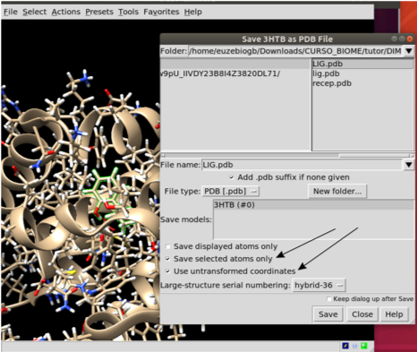
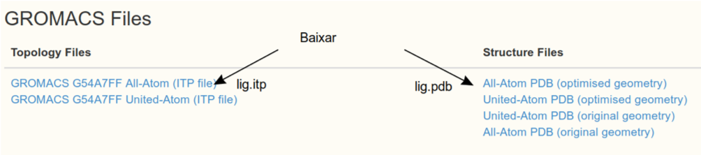
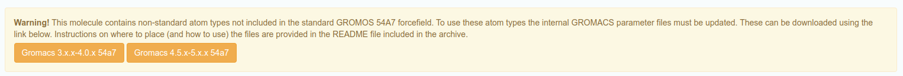
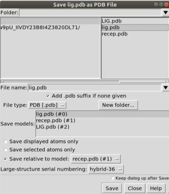
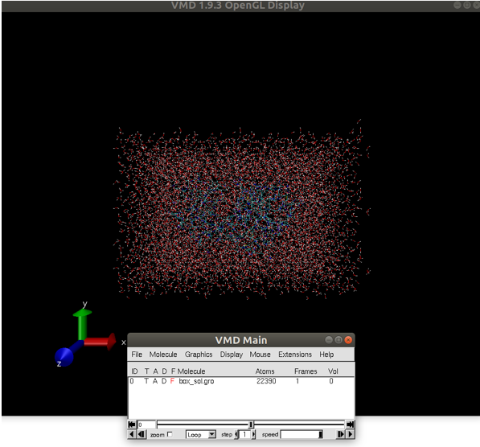
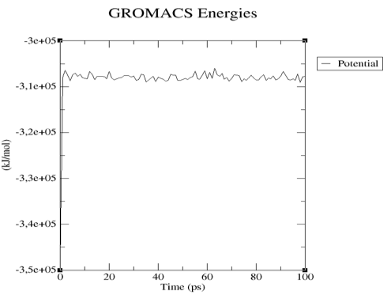
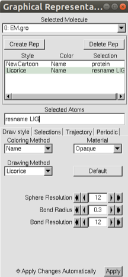
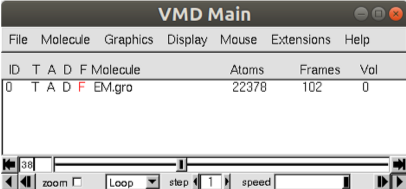
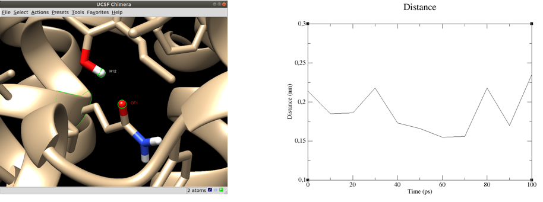

# Otimização da ligação ligante receptor com dinâmica molecular

Prof. Euzébio Guimarães – DFAR – BioME - UFRN

Esse tutorial é baseado neste: [http://www.mdtutorials.com/gmx/complex/index.html](http://www.mdtutorials.com/gmx/complex/index.html)

## Primeiros Passos

Este exemplo guiará um novo usuário através do processo de configuração de um sistema de simulação contendo uma proteína em complexo com um ligante. Este tutorial se concentra especificamente em questões relacionadas ao lidar com o ligante, supondo que o usuário esteja familiarizado com as operações básicas do GROMACS e o conteúdo de uma topologia. Se este não for o caso, por favor, consulte um tutorial mais básico antes de tentar este. Este tutorial requer uma versão do GROMACS na série 2018.1 já instalada se você o tutorial de instalação passado durante o curso.

Temos que baixar o arquivo de estrutura da proteína com o qual estaremos trabalhando. Para este tutorial, utilizaremos a lisozima L99A / M102Q de T4 (código PDB [3HTB](http://www.rcsb.org/structure/3HTB)). Vá para o site da RCSB e baixe o arquivo PDB para essa estrutura. Temos que isolar as estruturas do ligante em um arquivo `recep.pdb` e do ligante num arquivo `lig_free.pdb`. Temos que remover também o **PO4** e **BME**.

Importante que a estrutura do receptor esteja sempre sem erros. Quais erros?

1. Remover artefatos da cristalografia (PO4 e BME, neste caso).
2. Completar tudo que falta na proteína (Pelo menos _loops_ faltantes).
3. Modificações pós-traducionais que podem provocar problemas a sua análise. (Procure outros tutoriais).

Utilize também a ferramenta DockPrep para remover defeitos automaticamente.



Apague o ligante após salva-lo. Agora salve o receptor com `recep.pdb` e converta para os arquivos necessários para o **Gromacs**, com o seguinte comando:

```shell
gmx pdb2gmx -f recep.pdb -ignh
```
>*Verifique a saída do comando acima. A carga da proteína estará especificada.*

Quando perguntado, você vai ter que escolher o campo de força.

- Vamos escolher a opção 14: **GROMOS96 54a7 force field** ([Schmid et al. Eur. Biophys. J. (2011), 40, 843-856](https://www.ncbi.nlm.nih.gov/pubmed/21533652).  

- Em: **Select the Water Model**, escolha 1: **SPC simple point charge, recommended**.

Serão criados vários arquivos: `posre.itp` (Restrições de Posições) `conf.gro` (Coordenadas da proteína) e `topol.top` (Topologia do campo de força).

A topologia do ligante será criada no servidor [Automated Topology Builder (ATB) and Repository](https://atb.uq.edu.au/). A qualidade da topologia é muito alta. Basta submeter aos cálculos. Demora cerca de um dia. Se você quiser utilizar um método diferente basta verificar o [meu Canal no YouTube](https://www.youtube.com/watch?v=PCn5jMiJP3M&list=PLRLpdK3kOpA-6cijGtyNnFFesPcPj0P2o)

Esse arquivo já existe: [https://atb.uq.edu.au/molecule.py?molid=268633#panel-md](https://atb.uq.edu.au/molecule.py?molid=268633#panel-md)



Edite estes arquivos trocando o nome dos átomos do que aparecer para **LIG**.

**Importante**
Verifique se na página do ATB possui uma mensagem como a abaixo:



Caso possua tal aviso para o campo de força que irás utilizar, você precisa baixar esses arquivos para a versão do Gromacs da sua máquina. Descompacte o arquivo e coloque a pasta original dentro da pasta do Gromacs, usualmente `/usr/share/gromacs/top/`. Depois você terá de modificar seu arquivo de topologia (veremos isso mais adiante).

Confira se o `lig.pdb` está posicionado no sítio receptor assim como o ligante cristalografado. Neste caso não está, então faça um _docking_ manual, pois o que interessa é apenas a conformação inicial e não a avaliação pela função de escore.



Após mudar a posição salve com `lig2.pdb` novamente e não se esqueça de escolher a opção `Save relative to model`: Escolha o `recep.pdb`. Feito isso basta converter para o formato `.gro` com o comando:

```shell
gmx editconf -f lig2.pdb -o lig2.gro
```

Agora vamos combinar os dois arquivos `conf.gro` e `lig2.gro`. Mova os _atoms_ (apenas os átomos) do `lig2.gro` para o `recep.gro`. Mude a segunda linha do arquivo `recep.gro` para o número de atomos total formado pela junção dos dos arquivos. Feito isso confira se o `conf.gro` agora tem o ligante.

```shell
chimera conf.gro
```

Agora edite o arquivo `topol.top` adicionado o seguinte trecho e salve o `topol.top`:

```text
; Include forcefield parameters
#include "gromos54a7.ff/forcefield.itp"
#include "lig.itp"
```

No final do arquivo.

```text
[ molecules ]
; Compound        #mols
Protein_chain_A     1
LIG                         1
```
>*Algumas linhas acima estão repetidas, basta adicionar o que está diferente.*

Neste ponto, o fluxo de trabalho vamos definir a célula unitária e preenchê-la com água:

```shell
gmx editconf -f conf.gro -o box.gro -bt triclinic -d 1.0 -princ
```

Escolha **1 - Protein**:

```shell
gmx solvate -cp box.gro -cs spc216.gro -p topol.top -o box_sol.gro
```

Vamos usar o programa VMD para vizualizar a caixa `box_sol.gro`:

```shell
vmd box_sol.gro
```



Agora temos um sistema solvatado. A saída do comando `pdb2gmx` nos disse que a proteína tem uma carga líquida de +6 (com base na composição de aminoácidos). Se você perdeu esta informação na saída pdb2gmx. Desta forma, devemos acrescentar íons ao nosso sistema.

Use grompp para criar um arquivo `.tpr`, usando qualquer arquivo `.mdp`. Baixe o arquivo necessário [AQUI](https://drive.google.com/uc?export=download&id=1xbKUJ_CTKvM9Ry3iMQolytnbJ7cBErug)

```shell
gmx grompp -f ions.mdp -c box_sol.gro -p topol.top -o ions.tpr
```

Vai resultar no seguinte erro:

```shell
ERROR 1 [file lig.itp, line 78]:
  Atomtype HS14 not found
```

Basta editar o arquivo `lig.itp` e trocar os termos HS14 por H simplesmente. Rode novamente.

```shell
gmx grompp -f ions.mdp -c box_sol.gro -p topol.top -o ions.tpr
```

Observe que o sistema não tem carga zero:

```shell
NOTE 2 [file topol.top, line 11009]:
  System has non-zero total charge: 6.000000
  Total charge should normally be an integer. See
```

```shell
gmx genion -s ions.tpr -o box_sol_ion.gro -p topol.top -pname NA -nname CL -neutral
```

Selecione a opção `[SOL]` para remover moléculas de água e trocar pelos ions.

Veja o arquivo `topol.top` no sua diretiva `[molecules]` agora deve se parecer algo assim:

```text
[ molecules ]
; Compound        #mols
Protein_chain_A     1
LIG                 1
SOL         6885
CL               6
```

Agora que o sistema está montado, crie a entrada binária usando o grompp usando este arquivo de parâmetro de entrada. Mas antes baixe [esse arquivo](https://drive.google.com/uc?export=download&id=1goHOyLDcKRttBanH8DixBiIH7Xoc9MH0) para seu diretório de simulação.

```shell
gmx grompp -f em.mdp -c box_sol_ion.gro -p topol.top -o EM.tpr
```

Certifique-se de ter atualizado seu arquivo `topol.top` ao rodar o genbox e o genion, senão você receberá muitas mensagens de erro desagradáveis (_“number of coordinates in coordinate file does not match topology”_, etc.).

Agora estamos prontos para rodar o `mdrun` para realizar uma minimização de energia:

```shell
gmx mdrun -v -deffnm EM
```

Serão criados diversos arquivos com o nome base `EM`, por exemplo: `EM.trr` (trajetória, _frames_ da simulação, pode ser `EM.xtc`), `EM.log` (log), `EM.edr` (Arquivos de energia) e `EM.gro` (O arquivo de coordenadas final com a coformação do complexo otimizado.

Para visualizar o que aconteceu na otimização basta dar o comando para o UCSF Chimera:

```shell
chimera EM.gro
```

Próxima etapa será a equilibração dos parâmetros termodinâmicos do sistema. Equilibrar nosso complexo de proteína-ligante será como equilibrar qualquer outro sistema que contenha uma proteína em água. Existem algumas considerações especiais, neste caso aplicar restrições ao ligante.

Para restringir o ligante, precisaremos gerar uma topologia de restrição de posição para isso. Primeiro, crie um grupo de índice para LIG que contenha apenas seus átomos não-hidrogênio:

```shell
gmx make_ndx -f lig2.gro -o index_lig.ndx
```

Digite:

```shell
 > 0 & ! a H*
 > q
```

Em seguida, execute o módulo genrestr e selecione esse grupo de índices recém-criado (que será o grupo 3 no arquivo `index_lig.ndx`):

```shell
gmx genrestr -f lig2.gro -n index_lig.ndx -o posre_lig.itp -fc 1000 1000 1000
```

Selecione o grupo 3 (`'System_&_!H*'`)

Agora, precisamos incluir essas informações no `topol.top`. Podemos fazer isso de várias maneiras, dependendo das condições que desejamos usar. Se simplesmente quisermos restringir o ligante sempre que a proteína também estiver restrita, adicione as seguintes linhas ao `lig.itp` no final do arquivo:

```text
; Include Position restraint file
#ifdef POSRES
#include "posre_lig.itp"
#endif
```

Agora baixe [AQUI](https://drive.google.com/uc?export=download&id=1WpiRPxSp0jxZkPUIw8wNocYxS-plrbC5) o arquivo de equilibração que contém o conjunto conânico nVT, onde número de partículas, volume e temperatura serão mantidos constantes (`nvt.mdp`).

Agora execute:

```shell
gmx grompp -f nvt.mdp -c EM.gro -r EM.gro -p topol.top -o NVT.tpr
gmx mdrun -v -deffnm NVT
```

Vamos verificar se a energia potencial do sistema estabiliza utilizando o programa GRACE:

```shell
gmx energy -f NVT.edr
```

Selecione a opção Pontetial dê ENTER duas vezes. Agora plote o resultado com xmgrace:

```shell
xmgrance -nxy energy.xvg
```



Observe que a energia potencia se estabiliza muito bem logo após o inicio da simulação.

Vamos agora vizualizar a simulação com o programa VMD:

```shell
vmd EM.gro NVT.xtc
```

Vá no menu *_Graphics > Representations…_

Em `Selected atoms` escreva **_protein_**, depois Clique em `Create Rep` e digite **_resname LIG_**. Mude o `Drawing Method` para cada seleção como mostrado na figura.



Na outra janela clique em _Play_:



Na próxima etapa varemos a equilibração da pressão do sistema variando o volume da caixa. Quando a simulação do NVT estiver concluída, prossiga para o NPT com este arquivo [npt.mdp](https://drive.google.com/uc?export=download&id=1P9DWiMpxyAVmtwX-wT9tjiT35qn9zSGx).

```shell
gmx grompp -f npt.mdp -c NVT.gro -t NVT.cpt -r NVT.gro -p topol.top -o NPT.tpr
gmx mdrun -deffnm NPT
```

Após a conclusão das duas fases de equilibração, o sistema está agora bem equilibrado à temperatura e pressão desejadas. Agora estamos prontos para liberar as restrições de posição e executar o MD de produção para coleta de dados. O processo é exatamente como vimos anteriormente, pois usaremos o arquivo de ponto de verificação para fazer o grompp. Vamos executar uma simulação MD de 10 ns, cujo script pode ser encontrado [AQUI](https://drive.google.com/uc?export=download&id=1ilgeSnjglY1tkWE3MHr7NuOcED2_DXOK).

```shell
gmx grompp -f md.mdp -c NPT.gro -t NPT.cpt -p topol.top -o MD.tpr
gmx mdrun -v -deffnm MD
```

Esta simulação poderá demorar 24 horas. Aguarde.

> _Vamos rodar 50000 passos para esse tutorial, mas não faça isso. Rode o tempo todo recomendado._

Para corrigir a movimentação da proteína dentro da caixa:

```shell
gmx trjconv -s MD.tpr -f MD.xtc -o MD_center.xtc -center -pbc mol -ur compact
```

Escolha _“Protein”_ para centralizar e _“System”_ para saída. Observe que os complexos de centralização (proteína-ligante, proteína-proteína) podem ser difíceis para simulações mais longas, envolvendo muitos saltos através dos limites periódicos. Nesses casos (particularmente em complexos proteína-proteína), pode ser necessário criar um grupo de índices personalizado para usar para centrar, correspondendo ao sítio ativo de uma proteína ou aos resíduos interfaciais de um monômero em um complexo.

Opcionalmente execute o comando abaixo para tornar ainda mais sua a visualização dos resultados.

```shell
gmx trjconv -s MD.tpr -f MD_center.xtc -o MD_fit.xtc -fit rot+trans
```

Escolha _“Backbone”_ para realizar ajustes de mínimos quadrados no _backbone_ da proteína e _“System”_ para saída.

Você pode usar o próprio UCSF Chimera para visualizar os resultados também. Utilize a ferramenta `MD Movie`. Selecione gromacs. Abra o `MD.tpr` e o `MD_center.xtc`.

## Analisando as Interações Ligantes de Proteína e Dinâmica de Ligantes

Este tutorial não pode cobrir todos os métodos de análise que você deseja realizar. Algumas operações básicas serão ilustradas aqui.

O módulo GROMACS hbond pode ser facilmente empregado para calcular o número de ligações de hidrogênio entre qualquer grupo de átomos, mas no nosso caso, os únicos valores serão 1 ou 0. Para uma visão mais detalhada de como o ligante está interagindo com Gln102, calcule a distância entre o grupo hidroxila do LIG e a carbonila da Gln102. Para que uma ligação de hidrogênio seja formada, o critério típico é que os átomos doadores e aceitadores serão separados por uma distância ≤3,5 Å (0,35 nm). Use o módulo de distância para calcular a distância ao longo da trajetória, usando a sintaxe de seleção da linha de comando (consulte seleções de ajuda do gmx para exemplos e mais sintaxe).



```shell
gmx distance -s MD.tpr -f MD_center.xtc -select 'resname "LIG" and name H12 plus resid 102 and name OE1' -oall
```

A distância média foi 0.19±0.028 do Hidrogênio da hidroxila do ligante até o carbono da carbonila do resíduo Gln102.

Podemos também estimar a energia de interação entre o ligante e a vizinhança para ter noção sobre a afinidade de ligação. No arquivo `.mdp` da simulação foram criadas as energias de interação entre o ligante e a vizinhança, Proteína, Solvente e Íons. Para isso executamos o seguinte comando:

```shell
gmx energy -f MD.edr
```

Vamos selecionar as opções relacionadas às interações de curta distância do ligante.

```shell
Energy                      Average   Err.Est.       RMSD  Tot-Drift
-------------------------------------------------------------------------------
Coul-SR:Protein-LIG        -35.8895        2.4    9.45151    2.71042  (kJ/mol)
LJ-SR:Protein-LIG           -71.099        2.5    7.08961    8.78349  (kJ/mol)
Coul-SR:LIG-SOL            -21.7505        3.4    11.7535   -15.2064  (kJ/mol)
LJ-SR:LIG-SOL              -2.73363        2.2    6.52593    5.11542  (kJ/mol)
Coul-SR:LIG-CL                    0          0          0          0  (kJ/mol)
LJ-SR:LIG-CL                      0          0          0          0  (kJ/mol)
```

Pela soma das energias temos: -131.46±5.33 kJ/mol ou -31.40±1.27 kcal/mol.