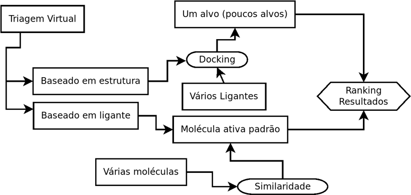
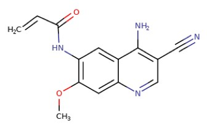
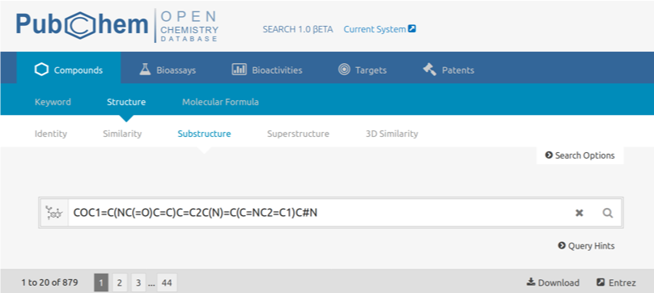
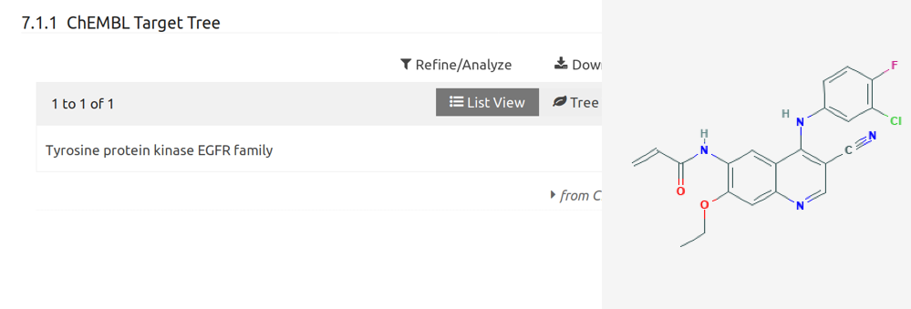
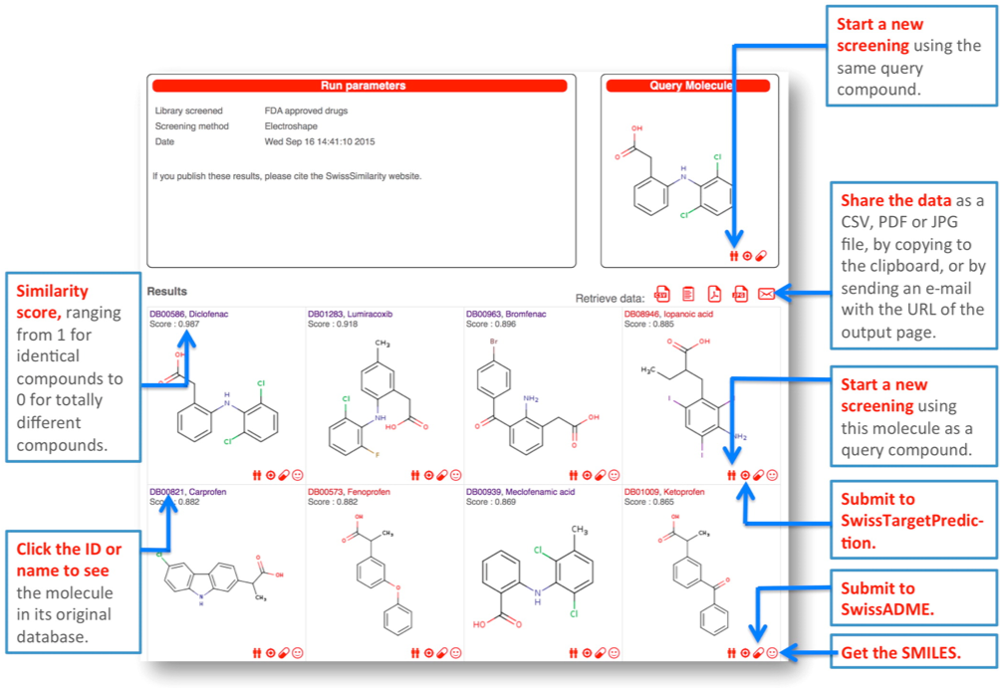
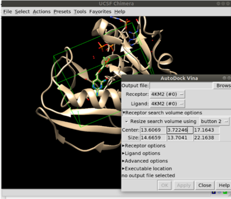

# Triagem Virtual

Prof. Euzébio Guimarães – DFAR – BioME - UFRN

## Introdução

A triagem virtual usa métodos baseados em computador para descobrir novos ligantes na base de estruturas biológicas. A triagem virtual é dividida em triagem baseada na estrutura (_docking_) e triagem usando compostos ativos como moldes (Triagem virtual baseada em ligantes). As técnicas de rastreio baseadas em ligantes concentram-se principalmente na comparação de análises de similaridade molecular de compostos com partes conhecidas e desconhecidas, independentemente dos métodos do algoritmo utilizado. _Docking_, como já dito, é utilizada para prever geometrias de interação de ligantes de proteínas e afinidades de ligação. O fluxograma abaixo define as etapas abordadas nesta apostila.



## Tutorial 9

### Triagem virtual baseada em ligantes

Moléculas similares geralmente têm atividades biológicas similares. Esse é o princípio da triagem virtual baseada em ligantes. Vamos supor que você tenha uma molécula extraída de uma fonte natural e deseja saber qual seria a possível atividade desta molécula. A maneira mais simples é buscar em servidores como o PubChem moléculas similares. Vamos usar para isso a molécula abaixo:

```none
COC1=C(NC(=O)C=C)C=C2C(N)=C(C=NC2=C1)C#N
```



Vamos buscar por moléculas com contenham esse núcleo base no [PubChem](https://pubchem.ncbi.nlm.nih.gov/):



Encontramos uma possibilidade de interação com este alvo para um composto bastante similar.



O servidor utilizou sua molécula com a molécula padrão e fez uma busca contra todo o banco de dados de moléculas já ativas (ou não).

Outro servidor interessante é o [SwissSimilarity](http://www.swisssimilarity.ch/) ([Zoete et al. 2016](https://pubs.acs.org/doi/10.1021/acs.jcim.6b00174)). Você fornece o SMILES da estrutura e escolhe qual banco de dados quer confrontar. Vamos escolher o PDB (Ligands from the PDB), pois teremos na resposta final alvos já elucidados.

## Tutorial 10

### Triagem virtual baseada na estrutura

Imagine agora que você deseja encontrar uma molécula para se ligar a um alvo específico do seu interesse. Por exemplo DHFR do _Mycobacterium tuberculosis_. Sua intenção é descobrir um possível inibidor. Para isso precisamos de dois dados:

1. Dado do alvo de interesse, neste caso optamos pela estrutura [4KM2](http://www.rcsb.org/structure/4KM2).
2. Um banco de dados de ligantes disponíveis para a compra.

No caso de 2 pode ser um banco de moléculas qualquer: Moléculas disponíveis no seu laboratório, análogos virtuais da trimetoprima, etc. Quanto maior seu banco de moléculas mais caro será o procedimento.

Um servidor web que faz esse trabalho é o [iDOCK](http://istar.cse.cuhk.edu.hk/idock/). Basta dar o _upload_ na estrutura e criar uma caixa de busca e pronto. Você poderá filtrar os resultados para reduzir o número de compostos a serem buscados. O número total de compostos é de 8 milhões. Não é uma tarefa fácil.

Vamos fazer o teste localmente com um banco de moléculas pré-selecionadas por mim. Este banco foi criado apenas como critério didático e é composto por moléculas que se ligam a DHFR. Estas informações foram retiradas do BindingDB com 1086 moléculas.



Antes de fazer o procedimento de triagem, vamos primeiramente tratar a proteína para a triagem virtual:

1. Excluir umas das cadeias presentes.
2. Determinar o size e o center da caixa para criar o arquivo de configuração.
3. Usar a ferramenta DockPrep para corrigir problemas da estrutura.
4. Salvar e converter para o formato `.pdbqt` (`recep.pdb`).

```none
python /opt/UCSF/Chimera64-1.13rc/lib/python2.7/site-packages/AutoDockTools/Utilities24/prepare_receptor4.py -r recep.pdb -o recep.pdbqt
```



Agora temos todos os dados para o receptor e a caixa onde será realizada a busca.

Vamos agora criar um script em _shell_ que fará o seguinte trabalho:

1. Converter a estrutura de sdf em 2D para 3D (oBabel e Balloon).
2. Criar um arquivo `pdbqt` para o ligante (oBabel).
3. Realizar o _docking_ da molécula no sítio da DHFR.
4. Colocar os resultados do _docking_ em um arquivo de _Score_ para depois fazer o ranqueamento.

O _script_ ficaria assim:

```shell
#!/bin/bash
echo "MOL_ID  NAME ENERGIA" > TRIAGEM_log.txt
for i in `seq 1  1086` # loop até a molécula 1086
do
obabel 680A1AECE14635831BD5B5AC7D8BADC6ki.sdf -f 1 -l 1 -O ${i}.smi #converter cada molécula
balloon -f /home/euzebiogb/Downloads/CURSO_BIOME/PROGRAMAS/Linux_64bit-Balloon/MMFF94.mff --nconfs 1 --noGA ${i}.smi ${i}.sdf # Criar uma conformação em 3D rapidamente
obabel ${i}.sdf -O ${i}.pdbqt  # converter para a entrada do autodock-vina
vina --ligand 1.pdbqt --config config.cfg --out ${i}_d.pdbqt # fazer o docking
ENER=`head -2 ${i}_d.pdbqt | tail -1 |  awk '{ print $4 }'` # Extrair o score do vina
ENER=$(bc <<< "scale=2;$ENER*-1") # tornar o valor positivo
MOL=awk '{ print $2 }' ${i}.smi # Atribuir a uma variável
echo "${i}  $MOL $ENER" >> TRIAGEM_log.txt # Criar o log.
rm ${i}* # remover os arquivos desnecessários
done
```
Os cálculos vão demorar bastante, provavelmente 32 horas. Quando terminar basta ranquear os resultados e visualizar no UCSF chimera as moléculas melhor ranqueadas.