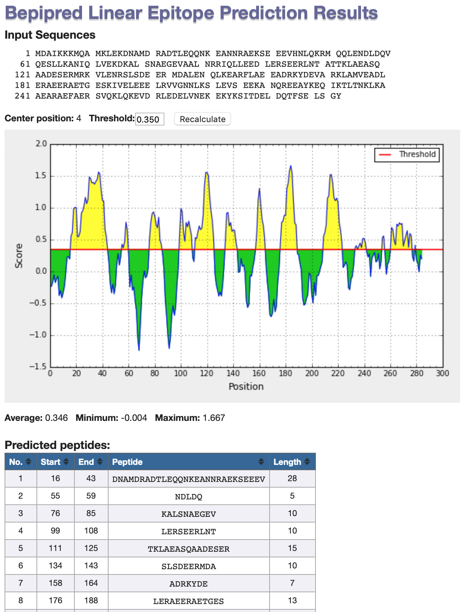

# Predição de Epitopos para células do tipo B e T

A partir da identificação de proteínas de superfície de patógenos e utilizando buscas de similaridades pode-se inferir epitopos de células B e T para qualquer sequência. Para isso, a *knowledge database* (Banco de conhecimentos) do *Immune Epitope Database and Analysis Resource* ([IEDB](http://www.iedb.org)) é uma ferramenta essencial para estudos de antigenicidade e imunogenicidade.


Neste exemplo, utilizaremos uma sequência de tropomiosina camarão *Litopenaeus vannamei*:

```
>Lit v 1 tropomyosin [Litopenaeus vannamei]
MDAIKKKMQAMKLEKDNAMDRADTLEQQNKEANNRAEKSEEEVHNLQKRMQQLENDLDQVQESLLKANIQ
LVEKDKALSNAEGEVAALNRRIQLLEEDLERSEERLNTATTKLAEASQAADESERMRKVLENRSLSDEER
MDALENQLKEARFLAEEADRKYDEVARKLAMVEADLERAEERAETGESKIVELEEELRVVGNNLKSLEVS
EEKANQREEAYKEQIKTLTNKLKAAEARAEFAERSVQKLQKEVDRLEDELVNEKEKYKSITDELDQTFSE
LSGY
```

## Epítopos de células T

Vamos primeiro verificar quais regiões desta proteína podem ser possíveis epitopos de células T (No quadro mais a esquerda ***Epitope Analysis Resource***).

### MHCI

- Clique em ***MHC I Binding***.
- Na página seguinte, copie e cole a sequência acima.
- Deixe a opção recomendada para o método de predição (*Prediction Method*).
- Para fins de simplificação, analisaremos apenas o alelo humano **HLA-A-01:01**. Na caixa ao lado, colocar *All lengths* (Para todos os tamanhos de epitopos).
- Observe a tabela resultante, que deverá ser similar a abaixo:


Na tabela acima, ele demonstra o Alelo, a posição na sequência, o tamanho e a sequência do peptídeo, e na última coluna o *Percentile Rank*. Segundo o método, quanto menor for este percentil, melhor será a ligação com o MHCI. Selecione a caixa ```Check to expand the result```. A tabela será expandida com os seguintes resultados:


Um outro resultado importante é relatado: IC<sub>50</sub> (nM). É concentração em nanomolar necessária para ligar a metade das moléculas. 

*Portanto, um número menor indica maior afinidade. Como diretriz aproximada, peptídeos com valores de IC<sub>50</sub><50 nM são considerados alta afinidade, IC<sub>50</sub><500 nM de afinidade intermediária e IC<sub>50</sub><5000 nM de baixa afinidade. Os epítopos mais conhecidos têm afinidade alta ou intermediária. Alguns epítopos têm baixa afinidade, mas nenhum epítopo de célula T conhecido tem um valor de IC<sub>50</sub> maior que 5000* (Retirado e traduzido do [MHC-I help](http://tools.iedb.org/mhci/help/) do IEDB).

### MHCII

- Clique em ***MHC II Binding***.
- Na página seguinte, copie e cole a sequência acima.
- - Para fins de simplificação, analisaremos apenas o alelo humano **DRB1*01:01**.
- Observe a tabela resultante (figura abaixo), que será de similar interpretação a tabela obtida para o MHC-I.


> *A escolha do(s) alelo(s) é de extrema importância neste tipo de análise. Neste tutorial apenas um alelo foi utilizado para fins de simplificação, mas quando se trabalha com **imunoinformática**, recomenda-se uma pesquisa bem aprofundada sobre o conjunto de alelos que será utilizado.*

## Epítopos de células B

Agora vamos verificar quais regiões desta proteína podem ser possíveis epitopos de células B. 

Volte a página inicial do IEDB. Procure o quadro mais a esquerda, as opções: ***Epitope Analysis Resource***, clicar em *Antigen Sequence Properties*, abaixo de ***B Cell Epitope Prediction***).


Na página seguinte, siga os passos:

- Cole a sequência no campo maior. Retire o cabeçalho fasta (como na figura baixo).
- Deixe a opção marcada por padrão (***Bepipred Linear Epitope Prediction***).
- Clique em ***Submit***.
- Observe os resultados.


No gráfico apresentado como resultados, as regiões em amarelo representam regiões da sequência submetida com alta possibilidade de serem epitopos de células B. Verifique as sequências destas regiões.



## Vamos a um primeiro teste?

Verifique se regiões da proteína abaixo, de Zika vírus, podem ser utilizadas para uma possível vacina. Para isso, realize a busca por epitopos de células B e T da forma como apresentado acima.

```
>Proteina Zika
GKAFEATVRGAKRMAVLGDTAWDFGSVGGALNSLGKGIHQIFGAAFKSLFGGMSWFSQILIGTLLMWLGLNTKNGSISLMCLALGGVLIFLSTAVSA
```

## Procurando pela doença

Na página inicial do IEDB você também pode procurar por epítopos já conhecidos (por predição, validados experimentalmente ou utilizados em kits disponíveis) a partir do nome da doença (Ex. Covid-19), como mostrado na figura abaixo:


Clique em ```Search``` e analise os resultados.

Todos os epítopos e antígenos já catalogados para as proteínas do agente causador estarão listadas na tabela resultante. Nela você também tem acesso a várias informações associadas a cada sequência de epítopo. Essa ferramenta é muito útil para você verificar se determinado epítopo não foi identificado antes.

## Predição de Alergenicidade

Proteínas alergênicas são aquelas que tem potencial de provocar alergias em seres humanos. A verificação da alergenicidade é um dos primeiros passos para se avaliar o potencial biotecnológico de uma determinada proteína. Por exemplo, regiões desta proteína podem ser utilizadas como vacinas, mas se provocarem alergias, o potencial de aplicação diminui consideravelmente. A predição de alergenicidade é também estritamente necessária no caso da implantação comercial de produtos transgênicos, sejam para fins alimentícios ou cosméticos.

Para predição do potencial alergênico de uma determinada proteína, também utilizaremos a sequência acima de tropomiosina camarão. Existem vários bancos de dados que podem ser utilizados para encontrar similaridades com proteínas já comprovadamente alergênicas, como:

- [AllergenOnline](http://www.allergenonline.org)
- [SDAP - Structural Database of Allergenic Proteins](https://fermi.utmb.edu)
- [AllerMatch](http://www.allermatch.org)

> *Sempre verifique se os bancos que você está utilizando estão sendo atualizados. Isto é fundamental importância, pois uma nova proteína alergênica pode ter sido identificada mais recentemente. Por exemplo, o AllerMatch não recebe atualizações há um tempo.* 

Utilizaremos o banco [AllergenOnline](http://www.allergenonline.org), mantido pela Universidade de Nebraska. Nele você pode procurar pelo nome, código e também pela sequência. Vamos fazer a consulta pela sequência:


- Abra a página do [AllergenOnline](http://www.allergenonline.org).
- Na lateral esquerda, clique na opção ***Sequence Search Allergen Database***.
- Cole a sequência na caixa ***Sequence Entry***.
- No método de procura, existem 3 opções:
  - *Full fasta*: para verificar similaridade inteira da proteína *query*. Usamos este caso para verificar similaridade geral.
  -  *Sliding 80mer Window*: faz a procura em "janelas" a cada 80 aminoácidos, com sobreposição. Neste caso é para verificar se a proteína *query* possui regiões internas similares com proteínas alergênicas conhecidas.
  - *8mer Exact Match*: faz procurar de regiões de 8 aminoácidos exata. Usamos para saber se a proteína tem regiões menores exatas que possam ser alergênicas.
- Clique em *Sliding 80mer Window*, e depois em ***Submit*** para iniciar a procura.
- Verifique os resultados.

Vamos repetir a análise com o SDAP:

- Abra a página do [SDAP](https://fermi.utmb.edu).
- Na lateral esquerda, clique em ***FASTA Search in SDAP***.
- Na nova página, cole a sequência da tropomiosina de camarão e clique em ***Search***
- Verifique os resultados.

O [IEDB](http://www.iedb.org) tem também uma ferramenta para verificar conservação de antígenos, o que é bem válido para verificar potencial de alergenicidade também.

- Abra a página do [IEDB](http://www.iedb.org).
- Na caixa ***Epitope Analysis Tools***, clique na opção ***Conservation Across Antigens***
- Na nova página, coloque no primeiro quadro (***Step 1. Epitope Sequence(s)***) umas das sequências obtidas na busca por epitopos de células B (no item anterior), por exemplo a sequência curta abaixo (uma das que é encontrada na busca):

```
QQLENDLDQV
```

- Na segunda caixa (***Step 2. Protein Sequence(s)***), cole a sequência abaixo:

```
>AIO08865.1 Der f 10 allergen, partial [Dermatophagoides farinae]
MEAIKKKMQAMKLEKDNAIDRAEIAEQKARDANLRAEKSEEEVRALQKKIQQIENELDQVQEQLSAANTK
LEEKEKALQTAEGDVAALNRRIQLIEEDLERSEERLKIATAKLEEASQSADESERMRKMLEHRSITDEER
MDGLENQLKEARMMAEDADRKYDEVARKLAMVEADLERAEERAETGESKIVELEEELRVVGNNLKSLEVS
EEKAQQREEAYEQQIRIMTAKLKEAEARAEFAERSVQKLQKEVDRLEDELVHEKEKYKSISDELDQTFAE
LTG
```

- Em ***Sequence identity threshold:***, marque a opção de 60%, para procurarmos sequência com no mínimo 60% de similaridade.
- Deixe o resto das opções na forma padrão e clique em ***Submit***.
- Na tabela resultante, veja o resultado e clique em ***Go***.

A sequência de *Dermatophagoides farinae* (ácaro comum) apresenta um epítopo conservado em relação a do camarão. Portanto, é provável que ela também é alergênica.

## Perguntas

Verifique se a sequência abaixo é alergênica:

```
>Der f 1
RPASIKTFEEFKKAFNKNYATVEEEEVARKNFLESLKYVEANKGAINHLSDLSLDEFKNR
YLMSAEAFEQLKTQFDLNAETSACRINSVNVPSELDLRSLRTVTPIRMQGGCGSCWAFSG
VAATESAYLAYRNTSLDLSEQELVDCASQHGCHGDTIPRGIEYIQQNGVVEERSYPYVAR
EQQCRRPNSQHYGISNYCQIYPPDVKQIREALTQTHTAIAVIIGIKDLRAFQHYDGRTII
QRDNGYQPNYHAVNIVGYGSTQGVDYWIVRNSWDTT
```
