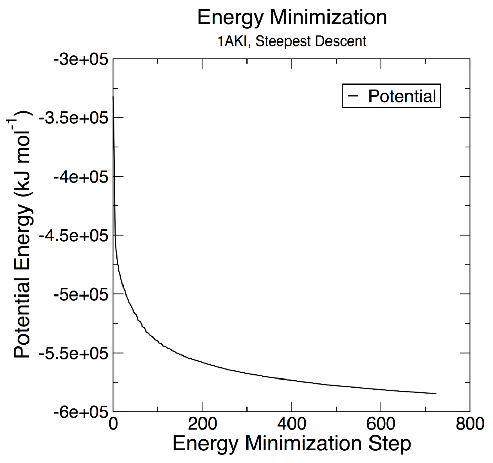
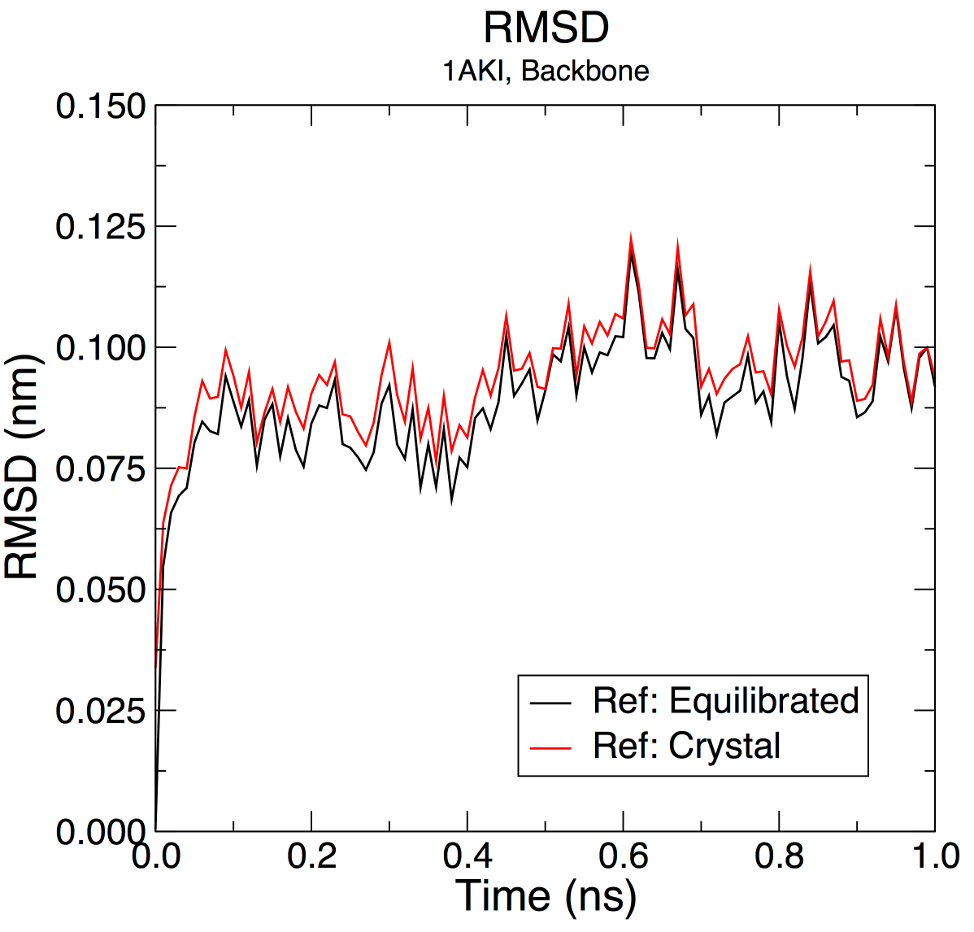

# Introdução a Dinâmica Molecular

- Observações:
  
*Este tutorial foi traduzido com pequenas modificações a partir dos tutoriais do Gromacs desenvolvidos por **Justin A. Lemkul** (Ph.D. - *Virginia Tech Department of Biochemistry*), *que podem ser obtidos no seu idioma original em [GROMACS Tutorials](http://www.mdtutorials.com/gmx/). A tradução foi realizada apenas para **fins didáticos**. *Qualquer citação deverá ser realizada a página e ao autor original.*

## Primeira Parte: Lisozima em solução aquosa.

Este exemplo guiará um(a) iniciante no processo de criação de um sistema de simulação molecular contendo uma proteína (lisozima) em uma caixa de água, com íons. Cada etapa conterá uma explicação dos arquivos de entrada e saída, utilizando configurações padrões, para uso geral. Este tutorial assume que você está usando uma versão GROMACS na série 2018.x ou superior.

### Instalação do Gromacs

Você precisará de um computador ou servidor com acesso a um terminal Linux. Isso pode ser realizado diretamente utilizando máquinas com sistemas operacionais (OS) Linux ou MacOS. Para usuários de OS Windows, recomendamos fortemente a utilização (e instalação, se necessário) do Subsistema Windows para Linux, WSL.

No terminal Linux/Unix, digite as seguintes linhas:

```shell
sudo apt update && sudo apt upgrade -y
sudo apt install gromacs gromacs-data libgromacs7
```

> *Você precisará da senha de administrador/root para esta instalação. A versão da libgromacs pode ser diferente. Em distribuições 22.04 LTS, a versão é a libgromacs6.*

Com o lançamento da versão 5.0 do GROMACS, todas as ferramentas são essencialmente módulos de um binário chamado "gmx". Este é um desvio das versões anteriores, onde cada uma das ferramentas era invocada como seu próprio comando. No 5.0, isto ainda funciona através de links simbólicos, mas eles irão embora em versões futuras, portanto é melhor se acostumar à nova maneira de fazer as coisas. Para obter informações de ajuda sobre qualquer módulo GROMACS, você pode invocar qualquer um dos seguintes comandos:

```shell
gmx help (module)
```

ou

```shell
gmx (module) -h
```

Lembre-se que (module) deve ser substituído pelo nome real do comando que você está tentando usar. As informações serão retornadas no terminal, incluindo os algoritmos disponíveis, opções, formatos de arquivo necessários, bugs e limitações conhecidas, etc. Para novos usuários do GROMACS, consultar a informação de ajuda para comandos comuns é uma ótima maneira de aprender sobre o que cada comando pode fazer. Para apenas verificar se o GROMACS foi instalado, apenas execute:

```shell
gmx
```

Nada será executado, apenas uma saída padrão será mostrada na tela.

### Trabalhando com a estrutura alvo

Devemos baixar o arquivo da estrutura-alvo que iremos trabalhar. Para este tutorial, utilizaremos a lisozima da clara de ovo de galinha (código PDB [1AKI](www.rcsb.org/structure/1AKI)). Acesse o banco [PDB](www.rcsb.org) e faça o download do arquivo pdb para a estrutura cristalizada dessa proteína. Se você estiver numa interface de linha de comando (CLI) você também utilizar os comandos linux `curl` ou `wget`:

```shell
curl https://files.rcsb.org/download/1AKI.pdb > 1AKI.pdb
```

ou

```shell
wget https://files.rcsb.org/download/1AKI.pdb
```

> *Ao usar o wget não é necessário colocar a saída para o arquivo ( > 1AKI.pdb, como observado no comando curl.*

Uma vez baixada a estrutura, você pode visualizar a estrutura usando um programa de visualização como VMD, UCSF uimera, PyMOL, etc. Uma vez que você tenha dado uma olhada na molécula, você vai querer tirar as moléculas de águas que foram cristalizadas. Para apagar as moléculas de água (resíduo "HOH" no arquivo PDB), use um editor de texto simples como vi, nano, emacs (Linux/Mac), ou Notepad (Windows). Alternativamente, você pode usar o grep para apagar estas linhas muito facilmente:

```shell
grep -v HOH 1AKI.pdb > 1AKI_clean.pdb
```

> *Não use software de processamento de texto!*

Observe que tal procedimento não é universalmente apropriado (por exemplo, o caso de uma molécula de água de local ativo firmemente ligada ou de outra forma funcional). Para nossas intenções aqui, não precisamos dessas moléculas de água cristalizadas.

Verifique sempre seu arquivo `.pdb` para as entradas listadas sob o comentário `MISSING`, pois estas entradas indicam átomos ou resíduos inteiros que não estão presentes na estrutura cristalizada. Regiões terminais podem estar ausentes, e podem não apresentar problemas de dinâmica. Sequências internas incompletas ou quaisquer resíduos de aminoácidos que tenham átomos ausentes causarão a falha do módulo `pdb2gmx`. Esses átomos/resíduos ausentes devem ser modelados usando outros pacotes de software. Observe também que o módulo `pdb2gmx` não é um mágico. Ele não pode gerar topologias para moléculas arbitrárias, apenas os resíduos definidos pelo campo de força (nos arquivos `*.rtp` - geralmente proteínas, ácidos nucléicos e uma quantidade muito finita de cofatores, como NAD(H) e ATP).

Agora que as moléculas águas cristalizadas foram retiradas e verificamos que todos os átomos necessários estão presentes, o arquivo PDB deve conter apenas átomos de proteínas e assim está pronto para ser introduzido no primeiro módulo GROMACS, `pdb2gmx`. O objetivo do `pdb2gmx` é gerar três arquivos:

1. A topologia para a molécula.

2. Um arquivo de restrição de posição.

3. Um arquivo de estrutura pós-processado.

A topologia (`topol.top` por padrão) contém todas as informações necessárias para definir a molécula dentro de uma simulação. Esta informação inclui parâmetros não ligados (tipos de átomos e cargas), bem como parâmetros ligados (ligações, ângulos e diedrais). Analisaremos mais detalhadamente a topologia, uma vez que ela tenha sido gerada.

Agora, executar o módulo `pdb2gmx` com o seguinte comando:

```shell
gmx pdb2gmx -f 1AKI_clean.pdb -o 1AKI_processed.gro -water spce
```

A estrutura será processada pelo módulo `pdb2gmx`, e você será solicitado a escolher um campo de força. Abaixo está representada a tela para esta escolha:

```shell
Select the Force Field:
From '/usr/local/gromacs/share/gromacs/top':
 1: AMBER03 protein, nucleic AMBER94 (Duan et al., J. Comp. Chem. 24, 1999-2012, 2003)
 2: AMBER94 force field (Cornell et al., JACS 117, 5179-5197, 1995)
 3: AMBER96 protein, nucleic AMBER94 (Kollman et al., Acc. Chem. Res. 29, 461-469, 1996)
 4: AMBER99 protein, nucleic AMBER94 (Wang et al., J. Comp. Chem. 21, 1049-1074, 2000)
 5: AMBER99SB protein, nucleic AMBER94 (Hornak et al., Proteins 65, 712-725, 2006)
 6: AMBER99SB-ILDN protein, nucleic AMBER94 (Lindorff-Larsen et al., Proteins 78, 1950-58, 2010)
 7: AMBERGS force field (Garcia & Sanbonmatsu, PNAS 99, 2782-2787, 2002)
 8: CHARMM27 all-atom force field (CHARM22 plus CMAP for proteins)
 9: GROMOS96 43a1 force field
10: GROMOS96 43a2 force field (improved alkane dihedrals)
11: GROMOS96 45a3 force field (Schuler JCC 2001 22 1205)
12: GROMOS96 53a5 force field (JCC 2004 vol 25 pag 1656)
13: GROMOS96 53a6 force field (JCC 2004 vol 25 pag 1656)
14: GROMOS96 54a7 force field (Eur. Biophys. J. (2011), 40,, 843-856, DOI: 10.1007/s00249-011-0700-9)
15: OPLS-AA/L all-atom force field (2001 aminoacid dihedrals)
```

O campo de força conterá as informações que serão escritas para a topologia. Esta é uma escolha muito importante! Você deve sempre ler atentamente sobre cada campo de força e decidir qual é o mais aplicável à sua situação. Para este tutorial, usaremos o campo de força ***OPLS all-atom***, portanto digite `15` no prompt de comando, seguido de `Enter`. A mensagem abaixo irá aparecer:

```shell
--------- PLEASE NOTE ------------

You have successfully generated a topology from: 1AKI_clean.pdb.

The Oplsaa force field and the spce water model are used.

--------- ETON ESAELP ------------
```

Há muitas outras opções que podem ser passadas para pdb2gmx. Algumas das opções mais usadas estão listadas aqui:

- `-ignh`: Ignore os átomos H no arquivo PDB; especialmente útil para estruturas NMR. Caso contrário, se os átomos H estiverem presentes, eles devem estar no nome exatamente como os campos de força no GROMACS esperam que estejam.

> *Existem diferentes convenções, portanto, lidar com os átomos H pode ocasionalmente ser uma dor de cabeça! Se você precisa preservar as coordenadas H iniciais, mas é necessário renomear, então o comando sed Linux é seu amigo.*

- `-ter`: Atribua interativamente estados de carga para o N- e o C-terminal.

- `-inter`: Atribua interativamente estados de carga para Glu, Asp, Lys, Arg, e His; escolha quais Cys estão envolvidos em ligações de dissulfeto.

Agora você gerou três novos arquivos: `1AKI_processed.gro`, `topol.top`, e `posre.itp`. `1AKI_processed.gro` é um arquivo de estrutura com formato GROMACS que contém todos os átomos definidos dentro do campo de força (ou seja, átomos H foram adicionados aos aminoácidos da proteína). O arquivo `topol.top` é a topologia do sistema. O arquivo `posre.itp` contém informações usadas para restringir as posições de átomos pesados (mais sobre isso nos próximos tópicos).

> ***Uma nota final:*** *muitos usuários assumem que um arquivo .gro é obrigatório. Isto não é verdade. O GROMACS pode lidar com muitos formatos diferentes de arquivo, sendo o .gro simplesmente o padrão para comandos que escrevem arquivos de coordenadas. É um formato muito compacto, mas tem precisão limitada. Se você preferir usar, por exemplo, o formato PDB, tudo que você precisa fazer é especificar um nome de arquivo apropriado com extensão .pdb como sua saída. A finalidade do pdb2gmx é produzir uma topologia compatível com o campo de força; a estrutura de saída é em grande parte um efeito colateral desta finalidade e é destinada à conveniência do usuário. O formato pode ser praticamente tudo que você desejar (veja o manual do GROMACS para diferentes formatos).*

### Gerando a topologia

Vejamos o que está na topologia de saída (`topol.top`). Novamente, usando um editor de texto simples, inspecione seu conteúdo. Após várias linhas de comentário (precedidas por `;`), você deverá encontrar o seguinte:

```shell
#include "oplsaa.ff/forcefield.itp"
```

Esta linha chama os parâmetros dentro do campo de força OPLS-AA. Ela está no início do arquivo, indicando que todos os parâmetros subsequentes são derivados deste campo de força. A próxima linha importante é [ `moleculetype` ], abaixo da qual você encontrará:

```shell
; Name       nrexcl
Protein_A    3
```

O nome **"Protein_A"** define o nome da molécula, com base no fato de que a proteína foi rotulada como cadeia A no arquivo PDB. Há 3 exclusões para os vizinhos colados. Mais informações sobre exclusões podem ser encontradas no manual do GROMACS.

A próxima seção define os [`atoms`] na proteína. As informações são apresentadas como colunas:

```shell
[ atoms ]
;   nr       type  resnr residue  atom   cgnr     charge       mass  typeB    chargeB      massB
; residue   1 LYS rtp LYSH q +2.0
     1   opls_287      1   LYS       N      1       -0.3    14.0067   ; qtot -0.3
     2   opls_290      1   LYS      H1      1       0.33      1.008   ; qtot 0.03
     3   opls_290      1   LYS      H2      1       0.33      1.008   ; qtot 0.36
     4   opls_290      1   LYS      H3      1       0.33      1.008   ; qtot 0.69
     5  opls_293B      1   LYS      CA      1       0.25     12.011   ; qtot 0.94
     6   opls_140      1   LYS      HA      1       0.06      1.008   ; qtot 1
```

A interpretação destas informações é a seguinte:

- **nr**: Número do átomo.

- **type**: Tipo de átomo.

- **resnr**: Número de resíduos de aminoácidos.

- **residues**: O nome do resíduo de aminoácido.
  *Observe que este resíduo era "LYS" no arquivo PDB; o uso da entrada .rtp "LYSH" indica que o resíduo é protonado (o estado predominante em pH neutro).*

- **atom**: Nome do átomo.

- **cgnr**: Número do grupo de carga.
  *Os grupos de carga definem unidades de carga inteira; eles ajudam a acelerar os cálculos*.

- **charge**: Auto-explicativo.
  *O descritor "qtot" é um total corrente da carga sobre a molécula*.

- **mass**: Também auto-explicativa.

- **typeB, chargeB, massB**: Usado para perturbação de energia livre (não discutido aqui).

As seções subseqüentes incluem [`bonds` ], [`pairs` ], [ `angles`], e [ `dihedrals` ].

O restante do arquivo envolve a definição de algumas outras topologias úteis/necessárias, começando com as restrições de posição. O arquivo "posre.itp" foi gerado pelo pdb2gmx; ele define uma constante de força usada para manter os átomos no lugar durante o equilíbrio (mais sobre isso mais adiante).

```shell
; Include Position restraint file
#ifdef POSRES
#include "posre.itp"
#endif
```

Isto termina a definição do tipo de molécula "Proteína_A". O restante do arquivo de topologia é dedicado à definição de outras moléculas e ao fornecimento de descrições em nível de sistema. O próximo tipo de molécula (por padrão) é o solvente, neste caso, SPC/E água. Outras escolhas típicas para água incluem SPC, TIP3P, e TIP4P. Escolhemos isto passando "- water spce" para pdb2gmx.

```shell
; Include water topology
#include "oplsaa.ff/spce.itp"

#ifdef POSRES_WATER
; Position restraint for each water oxygen
[ position_restraints ]
;  i funct       fcx        fcy        fcz
   1    1       1000       1000       1000
#endif
```

Como você pode ver, a água também pode ser contida na posição, usando uma constante de força (kpr) de 1000 kJ mol<sup>-1</sup> nm<sup>-2</sup>.

Os parâmetros de íons estão incluídos a seguir:

```shell
; Include generic topology for ions
#include "oplsaa.ff/ions.itp"
```

Finalmente vêm as definições em nível de sistema. A diretiva `[ system ]` dá o nome do sistema que será escrito nos arquivos de saída durante a simulação. A diretriz `[ molecules ]` lista todas as moléculas do sistema.

```shell
[ system ]
; Name
LYSOZYME

[ molecules ]
; Compound        #mols
Protein_A           1
```

Algumas observações sobre a diretriz `[ molecules ]`:

1. A ordem das moléculas listadas deve corresponder exatamente à ordem das moléculas no arquivo de coordenadas (neste caso, .gro).

2. Os nomes listados devem corresponder ao nome `[moleculetype]` para cada espécie, não nomes de resíduos ou qualquer outra coisa.

Se você não conseguir satisfazer estes requisitos concretos a qualquer momento, você receberá erros fatais do grompp (discutido mais tarde) sobre nomes inadequados, moléculas não encontradas, ou um número de outras.

Agora que examinamos o conteúdo de um arquivo de topologia, podemos continuar construindo o sistema.

### Solvatação

Agora que você está familiarizado com o conteúdo da topologia do GROMACS, é hora de continuar construindo o sistema. Neste exemplo, estaremos simulando um sistema aquoso simples. É possível simular proteínas e outras moléculas em diferentes solventes, desde que bons parâmetros estejam disponíveis para todas as espécies envolvidas.

Há duas etapas para definir a caixa e preenchê-la com solvente:

1. Definir as dimensões da caixa usando o módulo `editconf`.

2. Encher a caixa com água usando o módulo `solvate` (anteriormente chamado `genbox`).
   

Agora você tem a escolha de como tratar a célula da unidade. Para este tutorial inicial, usaremos uma caixa cúbica simples como a célula da unidade. A medida que você se torna mais confortável com condições de contorno periódicas e tipos de caixa, recomenda-se o dodecaedro rômbico, pois seu volume é ~71% da caixa cúbica da mesma distância periódica, economizando assim no número de moléculas de água que precisam ser adicionadas para solvatar a proteína.

Vamos definir a caixa usando `editconf`:

```shell
gmx editconf -f 1AKI_processed.gro -o 1AKI_newbox.gro -c -d 1.0 -bt cubic
```

O comando acima centra a proteína na caixa (-c), e a coloca a pelo menos 1,0 nm da borda da caixa (-d 1,0). O tipo de caixa é definido como um cubo (-bt cubic). A distância até a borda da caixa é um parâmetro importante. Como utilizaremos condições de contorno periódicas, devemos satisfazer a convenção mínima de imagem. Ou seja, uma proteína nunca deve ver sua imagem periódica, caso contrário, as forças calculadas serão inexpressivas. Especificar uma distância de 1,0 nm da caixa de soluto significará que há pelo menos 2,0 nm entre quaisquer duas imagens periódicas de uma proteína. Esta distância será suficiente para praticamente qualquer esquema de corte comumente usado em simulações.

Agora que já definimos uma caixa, podemos preenchê-la com solvente (água). A solvatação é realizada usando `solvate`:

```shell
gmx solvate -cp 1AKI_newbox.gro -cs spc216.gro -o 1AKI_solv.gro -p topol.top
```

A configuração da proteína (-cp) está contida na saída da etapa `editconf` anterior, e a configuração do solvente (-cs) faz parte da instalação padrão do GROMACS. Estamos utilizando `spc216.gro`, que é um modelo genérico equilibrado de solvente de 3 pontos. Você pode usar `spc216.gro` como configuração de solvente para SPC, SPC/E, ou TIP3P água, já que todos eles são modelos de três pontos de água. A saída é chamada `1AKI_solv.gro`, e direcionamos o comando solvate ao nome do arquivo de topologia (`topol.top`) para que ele possa ser modificado. Observe as mudanças na diretiva `[molecules]` do arquivo `topol.top`:

```shell
[ molecules ]
; Compound  #mols
Protein_A       1 
SOL         10832
```

O que o `solvate` fez foi manter um registro de quantas moléculas de água acrescentou e depois escreve para sua topologia para refletir as mudanças que foram feitas. Note que se você usar qualquer outro solvente (não aquoso), o solvate não fará essas mudanças em sua topologia! Sua compatibilidade com a atualização de moléculas de água é codificada de forma rígida.

### Adicionando íons

Agora temos um sistema solvado que contém uma proteína carregada. A saída de `pdb2gmx` nos descreve que a proteína tem uma carga líquida de +8e (com base em sua composição de aminoácidos). Se você perdeu esta informação na saída de pdb2gmx, veja a última linha de sua diretiva `[ atoms ]` em `topol.top`; ela deve ler (em parte) "qtot 8". Como a vida não existe em uma carga líquida, devemos acrescentar íons ao nosso sistema.

A ferramenta para adicionar íons dentro do GROMACS é chamada de `genion`. O que `genion` faz é ler a topologia e substituir as moléculas de água pelos íons que o usuário especifica. A entrada é chamada de arquivo `run input`, que tem uma extensão de `.tpr`; este arquivo é produzido pelo módulo GROMACS `grompp` (pré-processador GROMACS), que também será usado mais tarde quando executarmos nossa primeira simulação. O que o `grompp` faz é processar o arquivo de coordenadas e a topologia (que descreve as moléculas) para gerar uma entrada de nível atômico (`.tpr`). O arquivo `.tpr` contém todos os parâmetros para todos os átomos do sistema.

Para produzir um arquivo `.tpr` com o `grompp`, precisaremos de um arquivo de entrada adicional, com a extensão `.mdp` (arquivo de parâmetros de dinâmica molecular); o `grompp` montará os parâmetros especificados no arquivo `.mdp` com as coordenadas e informações de topologia para gerar um arquivo `.tpr`.

Um arquivo `.mdp` é normalmente usado para executar uma minimização de energia ou uma simulação MD, mas neste caso é simplesmente usado para gerar uma descrição atômica do sistema. Um exemplo de arquivo `.mdp` (aquele que vamos usar) pode ser baixado [aqui](http://www.mdtutorials.com/gmx/lysozyme/Files/ions.mdp). Se estiver em uma CLI, pode usar diretamente o comando abaixo:

```shell
wget http://www.mdtutorials.com/gmx/lysozyme/Files/ions.mdp
```

Na realidade, o arquivo `.mdp` usado nesta etapa pode conter qualquer combinação legítima de parâmetros. Normalmente usamos um script de minimização de energia, porque eles são muito básicos e não envolvem nenhuma combinação complicada de parâmetros. 

> *Observe que os arquivos fornecidos com este tutorial são destinados apenas para uso com o campo de força OPLS-AA. As configurações, particularmente as configurações de interação sem vínculos, serão diferentes para outros campos de força.*

Monte seu arquivo `.tpr` com o seguinte comando:

```shell
gmx grompp -f ions.mdp -c 1AKI_solv.gro -p topol.top -o ions.tpr
```

Agora temos uma descrição a nível atômico do sistema no arquivo binário `ions.tpr`. Vamos passar este arquivo para o módulo `genion`:

```shell
gmx genion -s ions.tpr -o 1AKI_solv_ions.gro -p topol.top -pname NA -nname CL -neutral
```

Quando solicitado, escolha o grupo 13 "SOL" para a incorporação de íons. Você não quer substituir partes de sua proteína por íons.

No comando `genion`, fornecemos o arquivo estrutura/estado (-s) como entrada, geramos um arquivo `.gro` como saída (-o), processamos a topologia (-p) para refletir a remoção de moléculas de água e adição de íons, definimos nomes de íons positivos e negativos (-pnome e -nome, respectivamente) e dizemos ao `genion` para adicionar apenas os íons necessários para neutralizar a carga líquida sobre a proteína adicionando o número correto de íons negativos (-neutro, que neste caso adicionará 8 íons Cl<sup>-</sup> para compensar a carga de +8 na proteína). Você também pode usar `genion` para adicionar uma concentração específica de íons além de simplesmente neutralizar o sistema especificando as opções -neutro e -conc em conjunto. Digite `genion man` para obter informações sobre como usar estas opções.

Os nomes dos íons especificados com -pnome e -nome eram específicos do campo de força nas versões anteriores do GROMACS, mas foram padronizados na versão 4.5. Os nomes dos íons especificados são sempre o símbolo elementar em todas as letras maiúsculas, que é o nome [ moleculetype ] que é então escrito para a topologia. Os nomes de resíduo ou átomo podem ou não anexar o sinal da carga (+/-), dependendo do campo de força. Não utilize nomes de átomos ou resíduos no comando `genion`, ou você encontrará erros nas etapas subseqüentes.

Sua diretriz `[molecules]` deve estar agora parecida com a descrição abaixo:

```shell
[ molecules ]
; Compound      #mols
Protein_A         1
SOL           10636
CL                8
```


### Minimização de energia

O sistema solvatado e eletroneutro está agora montado. Antes de iniciar a dinâmica, devemos assegurar que o sistema não tenha choques estéreos ou geometria inadequada. A estrutura é relaxada por meio de um processo chamado minimização de energia (EM).

O processo para o EM é muito parecido com a adição de íons. Vamos mais uma vez usar o `grompp` para montar a estrutura, topologia e parâmetros de simulação em um arquivo binário de entrada (`.tpr`), mas desta vez, em vez de passar o `.tpr` para o `genion`, vamos executar a minimização de energia por meio do algorítmo de dinâmica molecular do GROMACS, `mdrun`.

Monte a entrada binária usando o `grompp`, usando [este arquivo](http://www.mdtutorials.com/gmx/lysozyme/Files/minim.mdp) de parâmetros de entrada. Numa CLI baixe o arquivo:

```shell
wget http://www.mdtutorials.com/gmx/lysozyme/Files/minim.mdp
```

e depois execute o `gmx grompp`:

```shell
gmx grompp -f minim.mdp -c 1AKI_solv_ions.gro -p topol.top -o em.tpr
```

Certifique-se de ter atualizado seu arquivo `topol.top` ao executar o `genbox` e o `genion`, ou então você receberá muitas mensagens de erro desagradáveis (*number of coordinates in coordinate file does not match topology, etc.*).

Estamos agora prontos para usar o `mdrun` para executar a EM:

```shell
gmx mdrun -v -deffnm em
```

O argumento **-v** é para os impacientes: ela roda o `mdrun` no modo *verbose*, mostrando o seu progresso em cada passo. O argumento **-deffnm** irá definir os nomes dos arquivos de entrada e saída. Portanto, se você não nomeou sua saída `grompp` `em.tpr`, você terá que especificar explicitamente seu nome com a bandeira `mdrun -s`. No caso desse tutorial, obteremos os seguintes arquivos:

- `em.log`: arquivo de log `em.tpr` ASCII do processo de EM.

- `em.edr`: Arquivo binário de energia.

- `em.trr`: Trajetória binária de precisão total.

- `em.gro`: Estrutura minimizada.

Há dois fatores muito importantes a serem avaliados para determinar se a EM foi bem sucedida. O primeiro é a energia potencial (impressa no final do processo do EM, mesmo sem -v). A *E<sub>pot</sub>* deve ser negativa, e (para uma simples proteína na água) na ordem de 10<sup>5</sup>-10<sup>6</sup>, dependendo do tamanho do sistema e do número de moléculas de água. 

A segunda característica importante é a força máxima, *F<sub>max</sub>*, cuja meta foi definida em `minim.mdp - "emtol = 1000.0"` - indicando uma meta *Fmax* não superior a 1000 kJ mol<sup>-1</sup> nm<sup>-1</sup>. É possível chegar a uma *Epot* razoável com ***F<sub>max</sub> > emtol***. Se isto acontecer, seu sistema pode não estar suficientemente estável para a simulação. Avalie porque isso está acontecendo e talvez mude seus parâmetros de minimização (integrador, `emstep`, etc.).

Vamos fazer um pouco de análise. O arquivo `em.edr` contém todos os termos de energia que o GROMACS coleta durante a EM. Você pode analisar qualquer arquivo `.edr` usando o módulo *energy* do GROMACS:

```shell
gmx energy -f em.edr -o potential.xvg
```

No prompt, digite "10 0" para selecionar Potencial (10); zero (0) encerra a entrada. Será mostrada a média do *E<sub>pot</sub>*, e um arquivo chamado `potencial.xvg` será escrito. Para plotar estes dados, você precisará da ferramenta tipo ***Xmgrace*** ou ***ggplot2*** do R. O gráfico resultante deverá ser parecido com o abaixo, demonstrando a convergência constante da *E<sub>pot</sub>*:



Agora que nosso sistema está *minimizado*, podemos iniciar uma verdadeira dinâmica.

### *Equilibração*

A EM garante uma estrutura de partida razoável, em termos de geometria e orientação de solvente. Para iniciar uma dinâmica real, devemos equilibrar o solvente e os íons em torno da proteína. Se tentarmos uma dinâmica desenfreada neste ponto, o sistema pode entrar em colapso. A razão é que o solvente é em sua maioria otimizado dentro de si mesmo, e não necessariamente com o soluto. Ele precisa ser levado à temperatura que desejamos simular e estabelecer a orientação adequada sobre o soluto (a proteína). Após chegarmos à temperatura correta (baseada em energias cinéticas), aplicaremos pressão no sistema até que ele atinja a densidade adequada.

Lembra-se daquele arquivo `posre.itp` que o módulo do GROMACS `pdb2gmx` gerou há muito tempo? Vamos usá-lo agora. O objetivo do `posre.itp` é aplicar uma força de contenção de posição nos átomos pesados da proteína (qualquer coisa que não seja um hidrogênio). O movimento é permitido, mas somente após a superação de uma penalidade energética substancial. A utilidade das restrições de posição é que elas nos permitem equilibrar nosso solvente em torno de nossa proteína, sem a variável adicional de mudanças estruturais na proteína. A origem das restrições de posição (as coordenadas nas quais o potencial de restrição é zero) é fornecida por meio de um arquivo de coordenadas passado para a opção -r do `grompp`.

A *equilibração* é freqüentemente conduzida em duas fases. A primeira fase é conduzida sob um conjunto NVT (número constante de partículas, volume e temperatura). Este conjunto também é referido como "isotérmico-isócórico" ou "canônico". O prazo para tal procedimento depende do conteúdo do sistema, mas em NVT, a temperatura do sistema deve atingir um patamar no valor desejado. Se a temperatura ainda não tiver estabilizado, será necessário um tempo adicional. Tipicamente, 50-100 ps devem ser suficientes, e para este exercício realizaremos um equilíbrio de 100 ps do NVT. Dependendo de sua máquina, isto pode demorar um pouco (pouco menos de uma hora se funcionar em paralelo em 16 núcleos ou mais). Obtenha o arquivo .`mdp` [aqui](http://www.mdtutorials.com/gmx/lysozyme/Files/nvt.mdp) ou pelo wget:

```shell
wget http://www.mdtutorials.com/gmx/lysozyme/Files/nvt.mdp
```

Execute `grompp` e `mdrun` exatamente como na etapa de EM:

```shell
gmx grompp -f nvt.mdp -c em.gro -r em.gro -p topol.top -o nvt.tpr

gmx mdrun -deffnm nvt
```

Uma explicação completa dos parâmetros utilizados pode ser encontrada no manual do GROMACS, além dos comentários fornecidos. Anote alguns parâmetros no arquivo `.mdp`:

- *gen_vel = yes*: Inicia a geração de velocidade. O uso de diferentes sementes aleatórias (gen_seed) dá diferentes velocidades iniciais, e assim múltiplas (diferentes) simulações podem ser conduzidas a partir da mesma estrutura inicial.

- tcoupl = V-rescale: O termostato de redimensionamento de velocidade é uma melhoria em relação ao método de acoplamento fraco de Berendsen, que não reproduziu um conjunto cinético correto.

- *pcoupl = no*: O acoplamento por pressão não é aplicado.
  

Vamos analisar a progressão da temperatura, novamente usando energia:

```shell
gmx energy -f nvt.edr -o temperature.xvg
```

Digite "16 0" no *prompt* para selecionar a temperatura do sistema e sair. O gráfico resultante deve ser parecido com o abaixo:


A partir do gráfico, fica claro que a temperatura do sistema atinge rapidamente o valor alvo (300 K), e permanece estável durante o restante do equilíbrio. Para este sistema, um período de equilíbrio mais curto (na ordem de 50 ps) pode ser adequado.

A etapa anterior, o equilíbrio da NVT, estabilizou a temperatura do sistema. Antes da coleta de dados, devemos também estabilizar a pressão (e, portanto, também a densidade) do sistema. A *equilibração *da pressão é realizada sob um conjunto NPT, no qual o Número de partículas, Pressão e Temperatura são todos constantes. O conjunto também é chamado de conjunto "isotérmico-isobárico", e mais se assemelha às condições experimentais.

O arquivo `.mdp` usado para um equilíbrio de 100 ps NPT pode ser encontrado [aqui](http://www.mdtutorials.com/gmx/lysozyme/Files/npt.mdp). Ele não é drasticamente diferente do arquivo de parâmetros usado para o equilíbrio do NVT. Observe a adição da seção de acoplamento de pressão, usando o barostato Parrinello-Rahman.

Algumas outras mudanças:

- *continuation = yes*: Continuamos a simulação a partir da fase de equilíbrio do NVT.

- *gen_vel = no*: As velocidades são lidas a partir da trajetória (ver abaixo)
  

Chamaremos `grompp` e `mdrun` exatamente como fizemos para o equilíbrio da NVT. Note que agora estamos incluindo o argumento -t para incluir o arquivo do ponto de verificação do equilíbrio NVT; este arquivo contém todas as variáveis de estado necessárias para continuar nossa simulação. Para conservar as velocidades produzidas durante a NVT, devemos incluir este arquivo. O arquivo de coordenadas (-c) é a saída final da simulação do NVT.

```shell
gmx grompp -f npt.mdp -c nvt.gro -r nvt.gro -t nvt.cpt -p topol.top -o npt.tpr

gmx mdrun -deffnm npt
```

Vamos analisar a progressão da pressão, novamente em função da energia:

```shell
gmx energy -f npt.edr -o pressure.xvg
```

Digite "18 0" no prompt para selecionar a pressão do sistema e sair. O gráfico resultante deve ser parecido com o abaixo:


O valor da pressão flutua muito ao longo da fase de equilíbrio de 100 ps, mas este comportamento não é inesperado. A média de funcionamento destes dados está plotada como a linha vermelha no gráfico. Durante o curso do equilíbrio, o valor médio da pressão é de 7,5 ± 160,5 bar. Note que a pressão de referência foi ajustada para 1 bar, então este resultado é aceitável? A pressão é uma quantidade que flutua amplamente durante o curso de uma simulação MD, como está claro a partir da grande flutuação do desvio padrão (160,5 bar). Portanto, estatisticamente falando, não se pode distinguir uma diferença entre a média obtida (7,5 ± 160,5 bar) e o valor alvo/referência (1 bar).

Vamos dar uma olhada também na densidade, desta vez usando energia e digitando "24 0" no prompt.

```shell
gmx energy -f npt.edr -o density.xvg
```


Assim como com a pressão, a média da densidade também está plotada em vermelho. O valor médio ao longo de 100 ps é 1019±3 kg . m<sup>-3</sup>, próximo ao valor experimental de 1000 kg . m<sup>-3</sup> e à densidade esperada do modelo SPC/E de 1008 kg . m<sup>-3</sup>. Os parâmetros para o modelo SPC/E da água reproduzem de perto os valores experimentais para a água. Os valores de densidade são muito estáveis ao longo do tempo, indicando que o sistema está bem calibrado agora em relação à pressão e densidade.

> *Por favor, observe: é comum ter dúvidas sobre por que os valores de densidade obtidos não correspondem aos resultados. Os termos relacionados à pressão são lentos para convergir e, portanto, você pode ter que executar o equilíbrio do NPT em um tempo mais longo do que o especificado aqui.*

### Executando a dinâmica

Após a conclusão das duas fases de equilíbrio, o sistema está agora bem calibrado na temperatura e pressão desejadas. Estamos agora prontos para liberar as restrições de posição e executar a MD para a coleta de dados. O processo é exatamente como já vimos antes, pois faremos uso do arquivo do ponto de controle (que neste caso agora contém informações sobre o acoplamento de pressão preservada) para o módulo `grompp`. Executaremos uma simulação MD de 1 ns, cujo *script* pode ser encontrado [aqui](http://www.mdtutorials.com/gmx/lysozyme/Files/md.mdp).

```shell
gmx grompp -f md.mdp -c npt.gro -t npt.cpt -p topol.top -o md_0_1.tpr
```

O `grompp`retornará uma estimativa para a carga PME, que ditará quantos processadores devem ser dedicados ao cálculo PME, e quantos para os cálculos PP. Consulte a publicação GROMACS 4 e o manual para obter detalhes.

```shell
Estimate for the relative computational load of the PME mesh part: 0.22
```

Para uma caixa cúbica, a configuração ideal terá uma carga PME de 0,25 (3:1 PP:PME - estamos muito próximos do ideal!); para uma caixa dodecahedral, a carga PME ideal é de 0,33 (2:1 PP:PME). Ao executar o `mdrun`, o programa deve determinar automaticamente o melhor número de processadores a serem designados para os cálculos de PP e PME. Assim, certifique-se de indicar um número apropriado de *threads*/núcleos para o cálculo (o valor de -nt X), para que você possa obter o melhor desempenho.

Agora, execute o `mdrun`:

```shell
gmx mdrun -deffnm md_0_1
```

#### Usando GPUs

A partir da versão 4.6, o GROMACS suporta o uso de GPUs para executar simulações MD. Com o lançamento da versão 2018, as interações não ligadas e PMEs são calculadas na GPU, com apenas forças ligadas calculadas nos núcleos da CPU. Ao construir o GROMACS (ver www.gromacs.org para instruções de instalação), o hardware da GPU será automaticamente detectado, se presente. Os requisitos mínimos para usar a aceleração da GPU são as bibliotecas CUDA e SDK, e uma GPU com uma capacidade de computação de >= 2,0. Uma boa lista de algumas das GPUs mais comuns e suas especificações pode ser encontrada aqui.

Supondo que você tenha uma GPU disponível, o comando `mdrun` para fazer uso dela é tão simples quanto:

```shell
gmx mdrun -deffnm md_0_1 -nb gpu
```

> *Se você tiver mais de uma GPU disponível, ou precisar de personalização de como o trabalho é dividido através do esquema de paralelização híbrido disponível no GROMACS, consulte o manual e a página do GROMACS. Tais detalhes técnicos estão além do escopo deste tutorial.*

### Análise dos resultados da MD

Agora que simulamos a proteína, devemos fazer algumas análises sobre o sistema. Que tipos de dados são importantes? Esta é uma pergunta importante a ser feita antes de executar a simulação, portanto você deve ter algumas idéias sobre os tipos de dados que você vai querer coletar em seus próprios sistemas. Para este tutorial, algumas ferramentas básicas serão introduzidas.

A primeira é o trjconv, que é usado como uma ferramenta de pós-processamento para retirar coordenadas, corrigir a periodicidade ou alterar manualmente a trajetória (unidades de tempo, freqüência de quadros, etc.). Para este exercício, usaremos o trjconv para contabilizar qualquer periodicidade no sistema. A proteína se difundirá através da célula da unidade, e pode parecer "quebrada" ou pode "pular" para o outro lado da caixa. Para contabilizar tais comportamentos, emita o seguinte:

```shell
gmx trjconv -s md_0_1.tpr -f md_0_1.xtc -o md_0_1_noPBC.xtc -pbc mol -center
```

Selecione 1 ("Proteína") como o grupo a ser centralizado e 0 ("Sistema") para a saída. Conduziremos todas as nossas análises sobre esta trajetória "corrigida". Vamos analisar primeiro a estabilidade estrutural. O GROMACS tem um utilitário incorporado para cálculos RMSD chamado `rms`. Para usar o `rms`, emita este comando:

```shell
gmx rms -s md_0_1.tpr -f md_0_1_noPBC.xtc -o rmsd.xvg -tu ns
```

Escolha 4 ("*Backbone*") tanto para o ajuste dos mínimos quadrados quanto para o grupo de cálculo RMSD. O argumento ***-tu*** produzirá os resultados em termos de ns, mesmo que a trajetória tenha sido escrita em ps. Isto é feito para clareza da saída (especialmente se você tiver uma simulação longa - 1e+05 ps não parece tão agradável quanto 100 ns). O gráfico de saída mostrará o RMSD em relação à estrutura presente no sistema minimizado e equilibrado:

Se quisermos calcular o RMSD em relação à estrutura de cristal, podemos emitir o seguinte:

```shell
gmx rms -s em.tpr -f md_0_1_noPBC.xtc -o rmsd_xtal.xvg -tu ns
```

Plotados juntos, os resultados serão parecidos com:



Ambas as séries temporais mostram os níveis de RMSD em ~0,1 nm (1 Å), indicando que a estrutura é muito estável. As diferenças sutis entre os gráficos indicam que a estrutura em t = 0 ns é ligeiramente diferente desta estrutura de cristal. Isto é de se esperar, já que foi minimizado em termos energéticos e porque as restrições de posição não são 100% perfeitas, como discutido anteriormente.

O raio de giro de uma proteína é uma medida de sua compactação. Se uma proteína for dobrada de forma estável, ela provavelmente manterá um valor relativamente estável de Rg. Se uma proteína se desdobrar, seu Rg irá mudar com o tempo. Vamos analisar o raio de giro da lisozima em nossa simulação:

```shell
gmx gyrate -s md_0_1.tpr -f md_0_1_noPBC.xtc -o gyrate.xvg
```

Escolha o grupo 1 (Proteína) para análise.


Podemos ver pelos valores de Rg razoavelmente invariantes que a proteína permanece muito estável, em sua forma compacta (dobrada) ao longo de 1 ns a 300 K. Este resultado não é inesperado, mas ilustra uma capacidade avançada de análise GROMACS que vem embutida.

### Conclusão

Agora você conduziu uma simulação de dinâmica molecular com o GROMACS, e analisou alguns dos resultados. Este tutorial não deve ser visto como abrangente. Há muito mais tipos de simulações que se pode conduzir com o GROMACS (cálculos de energia livre, MD não-equilibrio, e análise de modos normais, só para citar alguns). Você também deve rever a literatura e o manual do GROMACS para ajustes nos arquivos `.mdp` fornecidos aqui para fins de eficiência e precisão.
