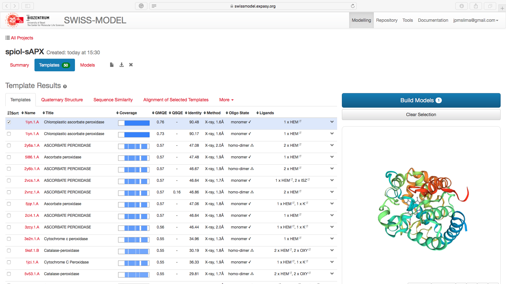

# Modelagem Comparativa de Proteínas 1

## Objetivos

***Geral***

Entender os princípios e etapas necessárias para a modelagem comparativa básica de uma proteína.

***Específicos***

- Obter informações sobre uma proteína a partir da sequência.
- Identificar a partir de buscas de similaridade contra o banco *pdb* possíveis *templates* (moldes) para serem utilizados para uma modelagem comparativa.
- Realizar uma modelagem comparativa utilizando o programa Modeller (1), a partir de uma interface com o UCSF Chimera (2).
- Fazer uma primeira inspeção dos modelos obtidos e avaliar a sua qualidade.

### Indicações

Este tutorial é indicado para a modelagem básica de uma proteína, levando em conta as seguintes considerações:

- Utilize equências-alvo com mais de 60% de similaridade com proteínas molde (*templates*) retiradas do banco PDB.
- Proteínas abaixo do limiar de similaridade, desde que tenham um único domínio conservado.
- Proteínas que não apresentem baixa similaridade com os possíveis *templates* em suas regiões N ou C-terminal.

**Observações:**

- Este tutorial foi construído ***apenas para fins didáticos***. <span style="color:red">**A reprodução dele para qualquer outro fim não é permitida e nem consentida.**</span>
- Este tutorial pode ser realizando tanto com o Modeller instalado, quanto via *Web service*, onde não necessidade de instalação do Modeller (Indicado para quem utilizar sistemas Windows).

## PARTE 1: Obtendo informações da Sequência Alvo (*Target Sequence*)

Iremos modelar uma das proteínas que trabalhamos anteriormente, a 
[Q7GDV4_SPIOL](https://www.uniprot.org/uniprot/Q7GDV4), cuja sequência segue abaixo:

```
>Q7GDV4_SPIOL
MASFTTTTAAAASRLLPSSSSSISRLSLSSSSSSSSSLKCLRSSPLVSHLFLRQRGGSAY
VTKTRFSTKCYASDPAQLKNAREDIKELLQSKFCHPIMVRLGWHDAGTYNKDIKEWPQRG
GANGSLSFDVELRHGANAGLVNALKLLQPIKDKYSGVTYADLFQLASATAIEEAGGPTIP
MKYGRVDATGPEQCPEEGRLPDAGPPSPAQHLRDVFYRMGLDDKDIVALSGAHTLGRSRP
ERSGWGKPETKYTKDGPGAPGGQSWTAEWLKFDNSYFKDIKEKRDADLLVLPTDAALFED
PSFKVYAEKYAADQEAFFKDYAEAHAKLSNQGAKFDPAEGITLNGTPAGAAPEKFVAAKY
SSNKD
```
>*Salve esta sequência em um arquivo de texto puro, com a terminação .fasta., pois ele será necessário depois.*

Lembre-se de que já realizamos uma predição com o servidor PSIPRED para esta proteína. Os resultados estão listados abaixo:

[Resultados PSIPRED - Q7GDV4_SPIOL](https://drive.google.com/uc?export=download&id=1t6X2Y61mgWtj9l1V-1eUk6RnBgU3-Gf6)

> *Os resultados contidos no arquivo zip acima foram obtidos ainda com a versão antiga do PSIPRED Workbench. Não há diferenças na interpretação dos resultados em relação a versão mais recente.*

Esta será a nossa proteína alvo (*Target*). Caso nenhuma informação *a priori* tivesse sido fornecida para esta proteína, os passos vistos anteriormente deverão ser realizados:

- Busca de similaridade.
- Bancos de Informação Proteica.
- Informações a partir da sequência (PSIPRED)

Evite modelar uma proteína sem ter informações adicionais. As informações abaixo são essenciais para a modelagem de uma proteína:

- Qual o organismo fonte?
- Qual a função desta proteína?
- Como ela desempenha sua função? (Ex.: a atividade catalítica no caso de enzimas).
- Como sua função é regulada?
- Qual a Via Metabólica?
- Quais os sítios importantes e os seus ligantes?
- Qual a localização subcelular?
- Ela interage com outras proteínas?
- Obtenção das informações sobre as proteínas:
	- Predição de Estrutura Secundária (análises do PSIPRED Workbench)
	- Regiões clivadas e transmembranas.
- Realizar um BLASTP contra o pdb para identificar os prováveis moldes (*templates*).
	- Categorizar os prováveis *templates* de acordo com os seguintes critérios: 
		- Identidade/similaridade entre a proteína alvo (a que você irá modelar) e a proteína molde (a proteína cuja estrutura já está resolvida, a que tem o arquivo pdb).
		- Cobertura da sequência.
		- Resolução da estrutura.

> *Observações:*
> 
> - *Preste bem atenção em regiões não-alinhadas entre a proteína alvo e o molde.  Elas podem ser indicativos de regiões clivadas ou de regiões transmembrana que não possuem moldes.*
> - *Lembre-se que modelos com menor número são os que possuem maior resolução. Por exemplo: uma proteína resolvida a 1.5 Å tem uma resolução maior do que uma resolvida com 2.5 Å. Portanto, estruturas de maior resolução são aquelas que preferencialmente têm resolução ≤ 2.5 Å. Na presença de mais de uma possibilidade de proteína molde para um determinado alvo, evite usar estruturas de resolução menor, ou seja, ≥ 2.8 Å.*
> - *Todas a informações acima foram demonstradas/requisitadas nas aulas anteriores.*
> - *A procura por moldes também pode ser realizada em muitos servidores de modelagem, como veremos abaixo.*

## PARTE 2: Procurando por moldes (*Templates*) e Modelando no Swiss-Model

Para obter informações sobre prováveis moldes para a proteína, temos de fazer uma busca de similaridade usando o BLAST, contra o banco de dados do pdb. A primeira pergunta a ser respondida é se existem proteínas com estruturas tridimensionais resolvidas experimentalmente (cristalografia, RMN, etc.) que apresentam similaridade suficiente para que a modelagem da ```Q7GDV4_SPIOL``` seja realizada.

> *Os passos abaixo nem sempre são necessários, principalmente se a tarefa de obtenção de informações foi realizada com sucesso.*

Siga os passos:

1. Abrir a Home Page do NCBI: [www.ncbi.nlm.nih.gov](www.ncbi.nlm.nih.gov)

2. Clicar no link **BLAST** (Na lateral direita ou ir diretamente em [www.ncbi.nlm.nih.gov/blast](www.ncbi.nlm.nih.gov/blast)).

3. Clicar em *protein BLAST* (BLASTP).

4. Copiar e colar a sequência alvo no campo *Query*.

5. Não esqueça de selecionar o banco pdb.

> *Se dúvidas surgirem durante a busca de similaridade, os tutoriais anteriores apresentam maiores detalhes.*

### Perguntas de direcionamento:

Na busca por moldes, as seguintes perguntas devem ser sempre respondidas (veja também as informações da PARTE 1):

a) Existem moldes (*templates*) para esta proteína? Observe sempre a similaridade e a cobertura da sequência.

b) Os moldes presentes são adequados para o processo de modelagem comparativa? Veja a resolução e o método experimental usado para resolver a estrutura do molde.

c) Quais dos possíveis moldes você utilizará? Ou seja, a partir das informações acima, qual(is) molde(s) você escolheria?

É comum também fazermos exaustivas buscas de informações sobre as proteínas molde que iremos utilizar.

>*Achou repetitivo? É proposital. O objetivo de tanta repetição e ênfase nesta parte é mostrar o quão importante é entender e ter informações sobre a proteína alvo.*

### Busca de moldes (*templates*) com homologia distante

Quando o alinhamento **proteína alvo-proteína molde** retorna valores acima de 40% de identidade e cobertura maior que 70% da proteína **alvot**, **moldes** adequados são encontrados em buscas simples com o BLASTp contra o banco PDB. Em valores distantes dos acima relatados, **moldes** para a modelagem só serão encontrados em buscas com o PSI-BLAST ou em buscas específicas por domínios ou *folds*.

> *É por isso que sempre recomendamos a utilização das ferramentas pGenThreader e PDomThreader na análise do PSIPRED Workbench. Eles usam PSI-BLAST e já dão um indicativo de moldes com homologia distante. Em muitos casos os resultados destas ferramentas pode até excluir a necessidade de realizar estas buscas adicionais.*

#### Criando uma conta no Swiss-Model

O [Swiss-Model](https://swissmodel.expasy.org) possui um módulo de busca por **moldes**, que pode ser utilizado para ajudar nesta tarefa. Iremos também utilizar o Swiss-Model para modelar e avaliar diferentes estruturas. Podemos fazer isto sem uma conta específica, mas recomendamos que você crie sua própria conta para ter registros dos seus trabalhos submetidos ao servidor. A conta é ***Free*** e não requer e-mail institucional.

- Vá ao site do [Swiss-Model](https://swissmodel.expasy.org) e clique em **Create Account** no canto superior direito.


- Insira seu e-mail, e depois verifique-o, pois a senha para entrada é enviada logo após o cadastro.

#### Buscando os moldes usando o Swiss-Model

Depois de sua conta criada, seguiremos a busca por moldes a partir da execução dos seguintes passos:

- Abra a página do [Swiss-Model](https://swissmodel.expasy.org).
- Clique em ```Log in``` no canto superior direito e entre com suas credenciais. (criadas na etapa acima).
- Você verá a seguinte página:


- Clique em ```Modelling``` e no menu que aparece, clique em ```myWorkspace```.
- Cole a sequência no espaço indicado, e ela deverá ser imediatamente reconhecida.


- Dê um nome ao seu projeto e clique em ```Search for Templates```.

A grande vantagem deste módulo do Swiss-Model é a quantidade de informações que ele retorna sobre os **moldes** possíveis. Como pode ser observado na figura abaixo:



Cada aba (logo abaixo de ***Template Results***) possui informações relevantes sobre sua busca.

**Condições para a escolha do *molde*:**

- Seja uma proteína que tenha função similar a da proteína alvo. Em alguns casos isso pode ser ignorado, principalmente se o *fold* de alguma região seja conhecido.
- Melhor identidade e similaridade.
- Maior cobertura possível.
- No caso de modelos obtidos a partir de cristalografia de raios-X, dê preferência a modelos com maior resolução (lembre-se, de preferência os que possuem resolução ≤2.5 Å).
- Se ligantes são importantes para o seu problema, escolha moldes que possuam ligantes.

Avaliando a lista de moldes, verificamos que o pdb [1iyn](https://www.rcsb.org/structure/1iyn) está dentro dos critérios acima. Caso você queira continuar com a modelagem no próprio Swiss-Model, basta selecionar aqueles ***templates*** que você acredita serem mais adequados e clicar em ```Build Models```, para iniciar uma modelagem por homologia, no próprio Swiss-Model.

> *Observe que na lista de templates, a parte inicial da Q7GDV4_SPIOL não apresenta similaridade com nenhuma estrutura conhecida. Esta região é clivada e possui um peptídeo sinal, como visto no tutorial anterior. A modelagem com o Swiss-Model tem esta desvantagem: ele não modelará qualquer região da proteína alvo que não esteja alinhada com a proteína molde ou que tenha molde, pois apenas usa a abordagem de homologia. Ele também irá ser menos efetivo em modelagem de loops e regiões de coil.*

Ao final da modelagem, você obterá uma tela como a seguinte:


Nesta página você verificar o alinhamento, os escores de avaliação, e gráficos da cobertura e da própria estrutura.

**Algumas observações sobre a modelagem no Swiss-Model:**

- Retorna modelos excelentes com proteínas *target* que apresentam alta identidade com proteínas no banco PDB.
- Caso sejam proteínas com múltipas cadeias, o Swiss-Model já pode retornar modelos simulando a estrutura quaternária da proteína *target*.
- Os modelos gerados já podem ser diretamente avaliados. Será a mesma avaliação que faremos com os modelos gerados por outras plataformas.
- Ele só modela regiões que apresentam similaridade com os *templates*. Não há etapas de refinamento de *loops* ou modelagem por *ab initio* de regiões desordenadas sem similaridade com estruturas conhecidas (Ver nota acima).

#### *Two more things*

##### Robetta

O servidor [Robetta](http://robetta.bakerlab.org) também possui um módulo bem completo de busca por **moldes**, utilizando o PSI-BLAST.


O Robetta é baseado na suite de programas para modelagem *ab initio* [Rosetta](https://www.rosettacommons.org/software). No entanto, devido a sua necessidade de conhecimentos mais avançados de programação, tal suite não será abordada nesta disciplina. Mesmo sua versão mais amigável, o [PyRosetta](http://www.pyrosetta.org) ainda requer conhecimentos computacionais acima do nível iniciante. A utilização do Robetta é livre para usuários acadêmicos, mas requer um e-mail institucional.

Fizemos um exemplo de modelagem utilizando o Robetta, com a proteína O46921_SPIOL (a APX ligada a membrana do tilacóide). Tais arquivos podem ser obtidos [AQUI](https://drive.google.com/uc?export=download&id=1Ud2shqUwajDz3zR7BA66IIe6PlrIZrM1).

##### MUSTER

O programa [MUSTER](https://zhanglab.ccmb.med.umich.edu/MUSTER/) também é uma ótima ferramenta para procura de moldes no banco pdb. Tal ferramenta é do mesmo grupo do i-TASSER (Zhang Lab da University of Michigan) e utiliza a abordagem de *Threading* para procurar moldes e ainda produz modelos rápidos utilizando em *background* o programa Modeller. 

O MUSTER (**MU**lti-**S**ource **T**hread**ER**) considera seis fontes diferentes de dados: (1) perfis derivados de sequência; (2) estruturas secundárias; (3) perfis derivados de estrutura; (4) acessibilidade do solvente; (5) ângulos de torção (ângulos psi e phi); (6) matriz de pontuação hidrofóbica. A **segmentação otimizada** (*optimized threading*) é encontrada utilizando programação dinâmica global.

Basta abrir a página, colar a sequência alvo, colocar um e-mail para receber os resultados.

## PARTE 3: Modelando por homologia uma proteína utilizando o Chimera/Modeller

Para a modelagem da ```Q7GDV4_SPIOL``` utilizaremos o programa MODELLER (2) a partir de uma interface com a suíte UCSF Chimera (2). É uma abordagem bem simples para obter um modelo proteico para trabalho inicial, mas que te dá mais liberdade de trabalho do que a interface completamente automatizada do Swiss-Model.

O programa MODELLER utiliza Pyhton pode ser obtido em [https://salilab.org/modeller/](https://salilab.org/modeller/). É um dos programas mais citados e utilizados para a modelagem por homologia de proteínas. É baseado em um método chamado *satisfação de restrições espaciais*. Para isso ele precisa de uma proteína molde (que você escolheu nos passos anteriores) resolvida experimentalmente, alinhada com a proteína alvo (que no nosso caso é ```Q7GDV4_SPIOL```). O programa é um *freeware* apenas para uso didático-acadêmico.

A suíte UCSF Chimera pode ser obtida em [https://www.cgl.ucsf.edu/chimera/](https://www.cgl.ucsf.edu/chimera/). É um excelente programa de visuzalização, edição e construção de moléculas *In silico*. Ele possui uma grande diversidade de funções, que permite trabalhar desde níveis atômicos até complexos supramoleculares. As fontes de informações e tutoriais para uso deste programa são vastos na internet e na própria literatura científica.

O primeiro passo é instalar o UCSF Chimera (que já foi realizado anteriormente).

- Salve a sequência fasta abaixo em um arquivo de texto puro.

```fasta
>Q7GDV4_SPIOL
YASDPAQLKNAREDIKELLQSKFCHPIMVRLGWHDAGTYNKDIKEWPQRGGANGSLSFDV
ELRHGANAGLVNALKLLQPIKDKYSGVTYADLFQLASATAIEEAGGPTIPMKYGRVDATG
PEQCPEEGRLPDAGPPSPAQHLRDVFYRMGLDDKDIVALSGAHTLGRSRPERSGWGKPET
KYTKDGPGAPGGQSWTAEWLKFDNSYFKDIKEKRDADLLVLPTDAALFEDPSFKVYAEKY
AADQEAFFKDYAEAHAKLSNQGAKFDPAEGITLNG
```
>*Na sequência acima, as regiões N e C-terminal não alinhadas (incluindo o peptídeo sinal foram retiradas apenas para facilitar o processo de modelagem.*

 - Ao abrir o Chimera, clicar em *Open* e abra o arquivo fasta da sequência alvo (Parte 1).
 - Uma janela adicional como a seguinte irá ser aberta:


- Nesta janela, ir em: Info > Blast Protein. 


- O seguinte diálogo irá aparecer:


- Clicar em Ok no diálogo.
- Revisar e confirmar os parâmetros na caixa *Blast Parameters*.


- Na janela *BLAST Query*, selecionar (pressionando control) até 3 *hits*, com *E values* adequados:


> *A similaridade não é mostrada nesta janela, então a escolha é baseada nos menores* *E-values* *e maiores* *scores*.

- Nesta janela, clicar em “Show in MAV”. O alinhamento múltiplo da proteína alvo, com os prováveis moldes será mostrado.


- Na janela do alinhamento múltiplo (MAV), ir em: *Structure > Modeller (Homology)*.


- Na caixa de diálogo aberta, estarão os parâmetros que serão utilizados como entrada para o programa Modeller:


- Selecione a primeira estrutura, [1IYN](https://www.rcsb.org/structure/1iyn) na listagem.
- Aqui temos duas opções:
	- **Opção 1 -** *Run Modeller via web service*:
		- Rodar o Modeller pela internet, para não termos que instalar em todos os computadores. Clique em *Run Modeller via web service*. 
		- Inserir a chave (será dada em sala de aula).
		- Recomendada para sistemas Windows.
	- **Opção 2 -** *Run Modeller locally*
		- Se você tiver uma instalação local do Modeller é a opção mais recomendada.
		- Na caixa ```Location of Modeller executable:``` insira o caminho do executável do programa Modeller. Se foi instalado de acordo com o tutorial do curso, ele estará em ```/usr/bin/mod9.20```. Digite este caminho na caixa e prossiga.
- Verificar as *Advanced Options*. Selecione a opção ```Include non-water HETATM residues from template```.
- Clicar em OK ou Apply.
- Esperar a construção dos Modelos. Quando estiverem prontos, uma nova janela com os escores de cada modelo gerado irá aparecer. 


- Cada modelo construído (aqui estão sendo mostrados 5, mas depende de quantos você instruiu para o programa construir) vem acompanhado de escores de avaliação. Antes de continuarmos na avaliação dos escores, faremos o cálculo de mais alguns escores de avaliação. Clicar em *Fetch Scores* > *zDOPE and estimated RMSD/Overlap*.


- Após o cálculo dos escores, você deverá ter uma janela como a seguinte:


> *Alguns escores poderão estar ligeiramente diferentes.*

Para avaliar os modelos obtidos com base nos escores retornados, é importante que o significado de cada escore seja entendido. Segue, um resumo dos escores obtidos (traduzido do *Help* do Chimera):

- **DOPE** - *Discrete Optimized Protein Energy*. É um potencial estatístico utilizado para avaliar modelos construídos por homologia. É baseado em um estado de referência que corresponde a átomos que não interagem em uma esfera homogênea, com o raio dependente de uma estrutura nativa de amostra. Portanto, é relativo a forma nativa e esférica das estruturas nativas. Escores menores são mais favoráveis. No Modeller-Chimera ou no ModEval é representado como um escore Z (z-DOPE). Escores positivos provavelmente representam modelos pobres, enquanto escores menores do que -1 estão relacionados a estruturas nativas.
- **RMSD** - *Root-mean-square deviation*. É a medida distância média entre os átomos de duas proteínas superpostas. Em relação as coordenadas atômicas do C-α ou em relação a todos os átomos (depende da forma como ele é computado).
- ***Predicted Native Overlap***: Fração dos átomos Cα que estão preditos a estar dentro de 3.5 Å das suas posições na estrutura nativa (ou do molde utilizado).
- **GA341**: Escore para a confiabilidade de um modelo, derivado de potenciais estatísticos. Um modelo é considerado confiável quando o escore de modelagem é maior que um valor de corte pré-especificado (0.7). Um modelo confiável tem a probabilidade de ter assumindo um *fold* correto maior do que 95%. Um fold é correto quando pelo menos 30% dos seus Cα estão sobrepostos dentro de 3.5 Å de suas posições corretas.

### Perguntas:

a) Dos modelos construídos, qual você considera melhor? Explique em termos dos escores obtidos, pois os modelos podem variar entre diferentes execuções do programa.

b) Houve alguma região dos modelos construídos que apresentou diferenças significativas em relação ao seu molde? Estas regiões estão associadas a diferenças na estrutura primária?

### Salvando os Modelos

Para salvar siga os passos abaixo:

- Vá em **Tools > General Controls > Model Panel.**
- Uma nova janela irá aparecer, chamada ***Model Panel***.
- Selecione as estruturas dos modelos que você deseja salvar (Não precisa salvar os *templates*.
- Clique em ```write PDB```. Na janela seguinte, dê um nome aos arquivos e salve os PDBs.

### Outros exemplos:

Siga os passos acima e modele as proteínas abaixo:

- Enzima [Cu/Zn Superóxido dismutase de *Drosophila melanogaster*](https://www.uniprot.org/uniprot/P61851):

```
>SODC_DROME
MVVKAVCVINGDAKGTVFFEQESSGTPVKVSGEVCGLAKGLHGFHVHEFGDNTNGCMSSG
PHFNPYGKEHGAPVDENRHLGDLGNIEATGDCPTKVNITDSKITLFGADSIIGRTVVVHA
DADDLGQGGHELSKSTGNAGARIGCGVIGIAKV
```
- Enzima O46921_SPIOL (esta ligada a membrana do tilacóide):

```
>O46921_SPIOL
YASDPAQLKNAREDIKELLQSKFCHPIMVRLGWHDAGTYNKDIKEWPQRGGANGSLSFDV
ELRHGANAGLVNALKLLQPIKDKYSGVTYADLFQLASATAIEEAGGPTIPMKYGRVDATG
PEQCPEEGRLPDAGPPSPAQHLRDVFYRMGLDDKDIVALSGAHTLGRSRPERSGWGKPET
KYTKDGPGAPGGQSWTAEWLKFDNSYFKDIKEKRDADLLVLPTDAALFEDPSFKVYAEKY
AADQEAFFKDYAEAHAKLSNQGAKFDPAEGITLNGTPAGAAPEKFVAAKYSSNKRSELSD
SMKEKIRAEYEGFGGSPNKPLPTNYFLNIMIVIGVLAVLSYLAGN
```

## Referências

(1) B. Webb, A. Sali. Comparative Protein Structure Modeling Using Modeller. Current Protocols in Bioinformatics, John Wiley & Sons, Inc., 5.6.1-5.6.32, 2014.

(2) Yang Z, Lasker K, Schneidman-Duhovny D, et al. UCSF Chimera, MODELLER, and IMP: An integrated modeling system. Journal of Structural Biology. 2012;179(3):269-278. doi:10.1016/j.jsb.2011.09.006.

**Vídeo-tutorial**:

[http://www.rbvi.ucsf.edu/chimera/videodoc/Modeller](http://www.rbvi.ucsf.edu/chimera/videodoc/Modeller)

