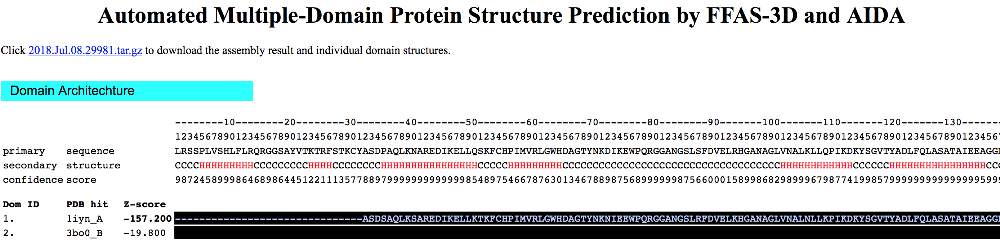

# Modelagem Comparativa de Proteínas 2

Utilizando outros servidores e ferramentas para a modelagem de proteínas.

### Objetivos

- Demonstrar outros servidores para obtenção de modelos 3D de proteínas, utilizando abordagens multifuncionais.

### Proteína Alvo

Usaremos nestes exemplos a proteína [O46921_SPIOL](https://www.uniprot.org/uniprot/O46921):

```
>O46921_SPIOL
LRSSPLVSHLFLRQRGGSAYVTKTRFSTKCYASDPAQLKNAREDIKELLQSKFCHPIMVR
LGWHDAGTYNKDIKEWPQRGGANGSLSFDVELRHGANAGLVNALKLLQPIKDKYSGVTYA
DLFQLASATAIEEAGGPTIPMKYGRVDATGPEQCPEEGRLPDAGPPSPAQHLRDVFYRMG
LDDKDIVALSGAHTLGRSRPERSGWGKPETKYTKDGPGAPGGQSWTAEWLKFDNSYFKDI
KEKRDADLLVLPTDAALFEDPSFKVYAEKYAADQEAFFKDYAEAHAKLSNQGAKFDPAEG
ITLNGTPAGAAPEKFVAAKYSSNKRSELSDSMKEKIRAEYEGFGGSPNKPLPTNYFLNIM
IVIGVLAVLSYLAGN
```

Escolhemos esta proteína para verificar se estas outras abordagens conseguem atribuir de forma não supervisionada alguma estrutura a porção C-terminal da tAPX.


## AIDA

O *Ab Initio Domain Assembly Server* - [AIDA](http://aida.godziklab.org) é um servidor para obtenção de modelos que se baseia no conhecimento do potencial *ab initio*. Ele procurar os melhores arranjos para os domínios, mantendo a conectividade das cadeias. As estruturas são mantidas rígidas durante a simulação de minimização de energia, tratando apenas as regiões de *link* como completamente flexíveis. A grande vantagem do servidor AIDA é a capacidade de trabalhar com proteínas contendo domínios descontínuos, fixando suas posições relativas. Adicionalmente, ele também procura por domínios de sequência e ao achá-los divide-os iterativamente para alinhar com o modelo de PDB encontrado pelo programa de reconhecimento de *folds* FFAS-3D (Retirado do próprio site do AIDA).

A sua utilização é simples, e os seus resultados saem de forma rápida. Note que ele não é um programa de *ab initio* puro, embora utilize esta abordagem como parte de sua estratégia de modelagem.

Faremos a utilização do AIDA da forma mais simples, seguindos os passos abaixo:

- Abra a página do AIDA:


- Cole a sequência acima no espaço indicado.
- Insira o seu email e clique em ```Submit```

### Resultados

Após algus minutos, o AIDA retornará os resultados. A página de resultados está dividida da seguinte forma:

**Primeira Parte:** Arquitetura dos domínios encontrados

- Funciona como um preditor de estrutura secundária. Nela um diagrama da sequência é descrito, com a posição de cada resíduo, o tipo de estrutura secundária e escore de confidência da predição.



> *Na figura acima os resultados não estão mostrados por inteiro.*

- Logo abaixo deste diagrama temos a lista dos domínios, com o PDB similar e o Z-score.
- Perceba que a predição encontrou um domínio para a região C-terminal da O46921_SPIOL (a qual está ligada a membrana do tilacóide), com similaridade a cadeia B da estrutura [3BO0](https://www.rcsb.org/structure/3BO0).

**Segunda Parte:** O modelo construído

- Uma figura interativa da estrutura predita, com *link* para download do arquivo.


**Terceira Parte:** As estruturas isoladas de cada domínio

- Figuras interativas da estrutura predita da região de cada domínio.


- Verifique no Domínio 2, a predição da estrutura da hélice transmembrana presente na região C-terminal da O46921_SPIOL.
- O arquivo PDB gerado pode ser baixado [AQUI](https://drive.google.com/uc?export=download&id=1gXHdmU0Mlq797q8yDUux4ykaKFYhMPiO).
- Abra o arquivo utilizando o UCSF Chimera e o inspecione.

>*Não esqueça de fazer o download e salvar os resultados do AIDA*.

## PHYRE2

O [Phyre2](http://www.sbg.bio.ic.ac.uk/phyre2/html/page.cgi?id=index) é um conjunto de ferramentas disponíveis na web para prever e analisar a estrutura das proteínas ([Kelley et al. 2015](https://www.nature.com/articles/nprot.2015.053)). Ele usa múltiplas abordagens (homologia, *threading* e refinamentos de *loops* via *ab initio*) para obter modelos de forma fácil e não supervisionada. As grandes vantagens do servidor Phyre2 são:

- Fácil de usar e rápido.
- Resultados confiáveis, principalmente com proteínas que possuam homologia com proteínas conhecidas.
- Autoexplicativo.
- Bons resultados quando buscas por homologia distante são necessárias.

O Phyre possui dois modos: normal e intensivo. Os mantenedores recomendam utilizar primeiro o modo normal, para depois passar para o intensivo.

### Passos para a submissão

- Abra a página do [Phyre2](http://www.sbg.bio.ic.ac.uk/phyre2/html/page.cgi?id=index).


- Cole a sequência fasta da ```O46921_SPIOL``` no local indicado.
- Coloque o email de destino dos resultados.
- Selecione o modo ```Normal```.
- Clique em ```Phyre search``` e espere os resultados (demoram cerca de 30 minutos a 2 horas).

### Resultados

Os resultados das análises com Phyre2 podem ser baixados ou ficam com um link disponível por 30 dias.

COs arquivos gerados para a modelagem da ```O46921_SPIOL```  podem ser diretamente baixados [AQUI](https://drive.google.com/uc?export=download&id=1rP5B6VoDER6hji9OrRAMeGjny6dsotjs).

Os resultados do Phyre2 são mostrados na forma de um relatório, contendo os seguintes elementos:

#### Sumário dos resultados 

- Nesta parte podem ser observados uma figura com o modelos, os *links* para *download* dos resultados, e outras informações sobre a modelagem. A parte que contem ***Confidence Summary*** é muito informativa, pois nela você saberá a confiança da modelagem ao longo da extensão da sequência.


- Logo abaixo, pode ser evidenciado a predição de estrutura secundária:


- E depois a predição de domínios e listagem dos *templates*:


- Sempre confira também a seção ***Multi-template and ab initio information***. Nela você terá a informação de quantos resíduos tiveram de ser modelados por *ab initio*.


#### Questionamentos

Compare os resultados do Phyre2, com os outros resultados obtidos até agora. Houve discrepância? Qual?

## I-TASSER

O [I-TASSER](https://zhanglab.ccmb.med.umich.edu/I-TASSER/) (*Iterative Threading ASSEmbly Refinement*) é uma abordagem hierárquica para a predição da estrutura de proteínas e previsão de suas respectivas funções. Ele também utiliza uma abordagem múltipla (comparativa utilizando homologia, *threading* e *ab initio*). Ele foi classificado como o melhor servidor para previsão de estrutura de proteínas em experimentos [CASP](http://predictioncenter.org/casp13/index.cgi) e sempre utiliza algoritmos de última geração. A estratégia completa do programa pode ser vista [AQUI](https://zhanglab.ccmb.med.umich.edu/I-TASSER/about.html).

Devido a qualidade dos seus resultados, podemos afirmar que ele é um dos melhores preditores automáticos de estrutura proteica, principalmente em níveis mais baixos de similaridade. Sua utilização é *Free* para usuários acadêmicos cadastrados (requer email institucional). Além do servidor, uma versão *stand-alone* (Linux apenas) pode ser baixada para rodar em suas próprias máquinas. No entanto, o tamanho do banco de dados é grande, além do custo computacional, o que pode ser impraticável para muitos computadores.

Para submeter uma predição no i-TASSER, siga os passos abaixo:

- Abra a [página de registro do i-TASSER](https://zhanglab.ccmb.med.umich.edu/I-TASSER/registration.html) e preencha o formulário com um email institucional.

>*Você não precisará fazer isto durante este tutorial, pois os resultados já foram obtidos para a proteína O46921_SPIOL.*

- Após receber a confirmação por email, vá até a página do [I-TASSER](https://zhanglab.ccmb.med.umich.edu/I-TASSER/).


- Cole a sequência no espaço indicado e preencha as informações de login.
- Clique em ```Run I-TASSER```.

Os resultados demoram cerca de 48 h e enquanto eles estiverem na fila ou sendo executados você não poderá enviar outro trabalho.

Para fins de exemplo, durante a predição da estrutura da O46921_SPIOL, algumas modificações foram realizadas e testadas. A opção III, de especificar a estrutura secundária para alguns resíduos foi ativada. Nela colocamos a predição de estrutura secundária apenas para a alfa-hélice transmembrana predita pelo PSIPRED. O formato do arquivo de especificação é simples, e ele está denotado abaixo na íntegra:

```
355 Y H
356 F H
357 L H
358 N H
359 I H
360 M H
361 I H
362 V H
363 I H
364 G H
365 V H
366 L H
367 A H
368 V H
369 L H
370 S H
371 Y H
372 L H
373 A H
```

> *Se você quiser repetir a análise, basta salvar o texto acima em um arquivo de texto puro e submeter na opção III do servidor do I-TASSER.*

Os resultados para esta predição podem ser evidenciados no *link* abaixo:

[AQUI](https://drive.google.com/uc?export=download&id=1HsSRsvrBomRCyBUNUD4rcpcVOYwk2IWy) 

## Quark

O [QUARK](https://zhanglab.ccmb.med.umich.edu/QUARK/) (que foi desenvolvido pelo mesmo grupo de pesquisa do i-TASSER) é um algoritmo de computador para previsão de estrutura de proteínas usando a abordagem *ab initio* e folding de peptídeos, visando construir um correto modelo 3D de proteína apenas a partir da sequência de aminoácidos. O uso do Quark é bem similar ao do i-TASSER, e uma conta criada a partir de um e-mail institucional é necessária.

> *Você pode fazer o pedido a partir de sua conta .edu.ufrn.br. Para a sequência abaixo você não irá precisar rodar o Quark, pois os arquivos de saída já estarão prontos. O pedido de conta para o i-TASSER e o QUARK são diferentes e separados.*

Para o Quark, iremos apenas modelar por *ab initio* a região de âncora a membrana, predita tanto pelo PSIPRED como pelo TMHMM (no tutorial de obtenção de informações a partir da sequência). Vamos aos passos:

- Abra a página inicial do [QUARK](https://zhanglab.ccmb.med.umich.edu/QUARK/):


- Cole a sequência abaixo no campo para a sequência:

```
>O46921_SPIOL-TM
PTNYFLNIMIVIGVLAVLSYLAG
```
> *Note que existem alguns aminoácidos a mais do que a sequência colocada como hélice no i-TASSER.*

- Coloque seus dados de Login e deixe o restante das opções como está.
- Depois de algumas horas, você receberá no e-mail cadastrado um link para a página com os resultados da predição. A página será similar a mostrada abaixo:


- Não esqueça de fazer o download dos arquivos, pois a página só fica no ar durante tempo limitado.
- Os resultados para esta modelagem poderão ser baixados [AQUI](https://drive.google.com/uc?export=download&id=1vCEJZsqkE-KCtlpd6zoZewo6w7ns50ak).

Observe nos resultados que o Quark modelou a hélice e categorizou os aminoácidos de acordo com a sua acessibilidade ao solvente:


Os resíduos com valores 0 (zero) estão completamente "enterrados" (não acessíveis ao solvente), pois estão dentro da membrana. Tais dados podem lhe ajudar a colocar a membrana nesta posição, posteriormente.

Colocaremos agora o Quark para rodar com toda a sequência não alinhada da O46921_SPIOL (tAPX) a sua isoforma Q7GDV4_SPIOL (sAPX), de acordo com a figura abaixo:


Portanto, a sequência que será realizada a modelagem agora será a descrita abaixo:

```
>O46921_SPIOL-TM
RSELSDSMKEKIRAEYEGFGGSPNKPLPTNYFLNIMIVIGVLAVLSYLAGN
```

A página com os resultados será parecida com a seguinte:


Verifique os resultados (que também podem ser obtidos [AQUI](https://drive.google.com/uc?export=download&id=1C2fclg7qdK01RVvZoWLE-tfvD4kXjxtK)


