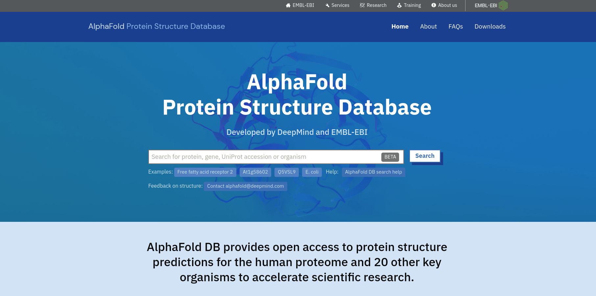
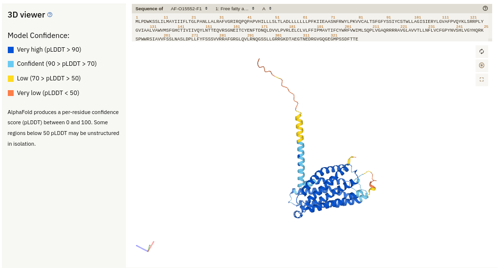
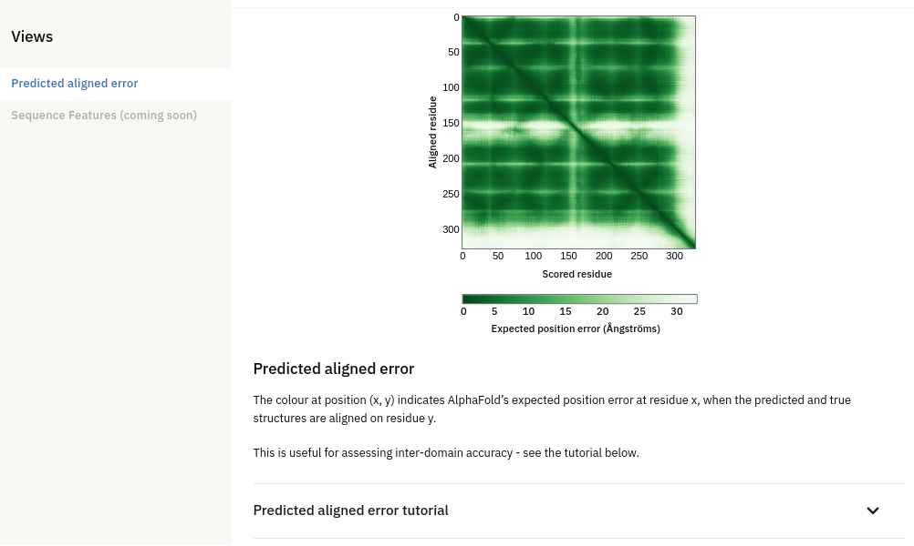
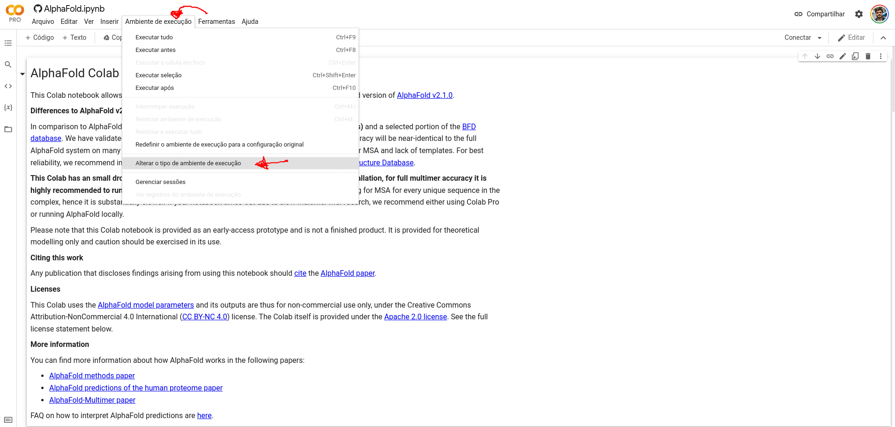
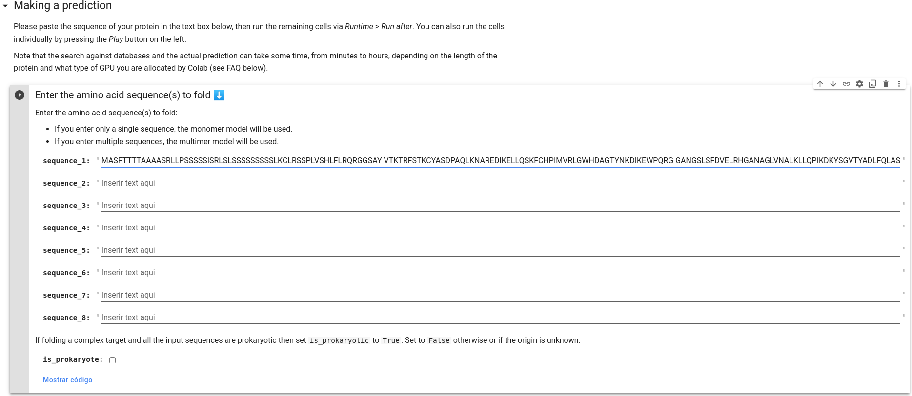
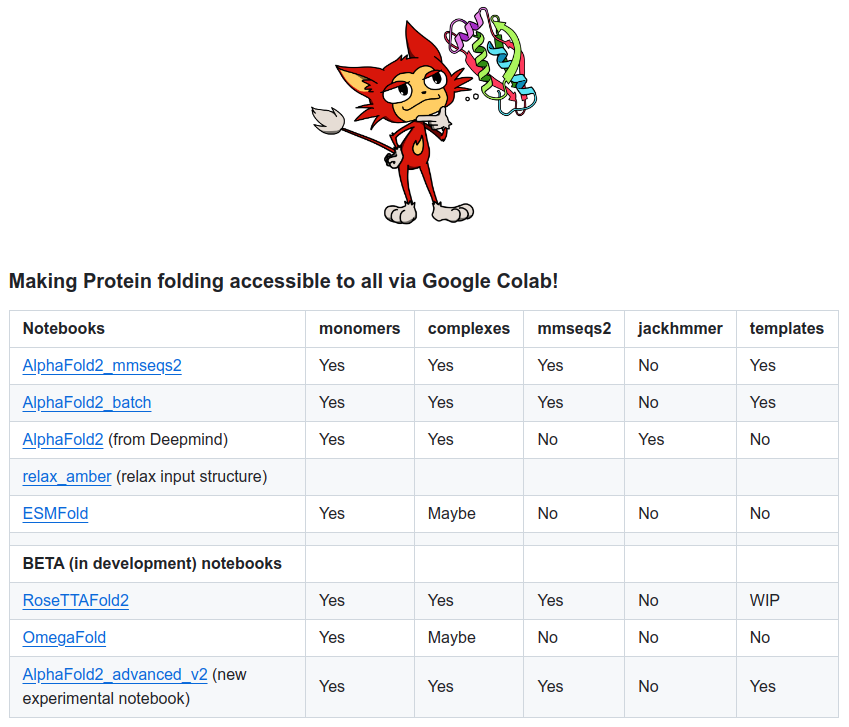

# Modelagem Computacional de Proteínas por Métodos usando Inteligência Artificial (AI)

## Introdução

Os recursos de aprendizado de máquina e inteligência artificial (*Artificial Inteligence* - AI)  já vêm sendo utilizados há um tempo para otimização de soluções automáticas e não-supervisionadas à área de Bioinformática. Mais recentemente, técnicas de aprendizado profundo (*Deep learning*) vêm apresentando uma notável performance em outras áreas científicas e aplicadas ([Tang *et al.* 2019](https://www.frontiersin.org/articles/10.3389/fgene.2019.00214/full)), o que intensificou a exploração do potencial dessas técnicas para uso na área de bioinformática estrutural por grupos acadêmicos.

Em 2020, o interesse e o massivo investimento de uma empresa não-acadêmica e com finalidades comerciais nessas duas áreas, *Deep Learning* e Biologia Estrutural, chamou a atenção da comunidade científica, ao vencer de maneira incontestável, um desafio bienal da área, o CASP ([*Critical Assessment of Structure Prediction*](https://predictioncenter.org/casp14/)), feito que normalmente era atingido por grupos acadêmicos. Tal empresa, a [*DeepMind*](https://deepmind.com/), uma ramificação de AI do Google/Alphabet, construiu uma rede que levou a um fenomenal avanço na predição da estrutura 3D de proteínas a partir de sua sequência de aminoácidos (Callaway, [2020](https://www.nature.com/articles/d41586-020-03348-4)), chamada de [**AlphaFold2**](https://github.com/deepmind/alphafold).

Após uma intensa espera por parte da comunidade científica, a publicação do artigo do AlphaFold2 ([Jumper *et al.* 2021](https://www.nature.com/articles/s41586-021-03819-2)) veio com uma grata surpresa: a liberação do código do programa e do modelo utilizado (este último sob a licença [CC BY-NC 4.0](https://creativecommons.org/licenses/by-nc/4.0/legalcode)). No entanto, os recursos computacionais necessários para instalação e execução da ferramenta de forma local não são tão acessíveis, principalmente a grupos acadêmicos e *startups* da área de bioinformática. Não demorou muito para que tal avanço fosse avaliado e melhorado pela comunidade acadêmica/científica da área, o que expandiu sua acessibilidade e trazendo uma verdadeira popularização da utilização do AlphaFold2 ([Callaway, 2021](https://www.nature.com/articles/d41586-021-01968-y)).

No presente tutorial iremos demonstrar como modelos 3D de proteínas podem ser obtidos de forma rápida a partir da sequência de aminoácidos pelas duas ferramentas melhor classificadas no CASP14 e que usam AI em suas abordagens: o AlphaFold2 ([Jumper *et al.* 2021](https://www.nature.com/articles/s41586-021-03819-2)) e o RoseTTAFold ([Baek *et al.* 2021](https://www.science.org/doi/10.1126/science.abj8754)). O objetivo aqui é como obter tais modelos, sejam de forma pronta, ou executar a modelagem a partir da sequência, utilizando os recursos do GoogleColab.

> **IMPORTANTE:** *Lembro-lhes que apenas obter computacionalmente um modelo ou a predição da estrutura de uma proteína não é necessariamente um problema científico por si. A obtenção da estrutura é normalmente uma etapa dentro de uma pergunta científica maior. Como sempre ressaltamos, o mais importante em qualquer problema de Bioinformática Estrutural é a pergunta científica que será respondida.*

## Obtendo modelos prontos do AlphaFold

Como ressaltado anteriormente, a comunidade científica e grandes grupos de Bioinformática do mundo começaram a utilizar o AlphaFold2 e a executar a predição em massa da estrutura 3D de proteínas de diversos organismos modelos. Portanto, o primeiro passo neste tutorial é responder a seguinte pergunta:

*"A proteína-alvo que estou interessado em fazer a predição estrutural já foi modelada pelo AlphaFold2?"*

A DeepMind, *European Molecular Biology Laboratory* ([EMBL](https://www.embl.org/)) e o *European Bioinformatics Institute* ([EBI](https://www.ebi.ac.uk/)) disponibilizaram em parceria um banco de dados para consultas de proteínas preditas do proteoma completo de diversas espécies-modelos. Tal banco é o [**AlphaFold Protein Structure Database**](https://alphafold.com/):



Ao clicar em [*Downloads*](https://alphafold.com/download) no canto superior direito você terá a lista das espécies-modelo que já tiveram o seu proteoma com predição estrutural completa. Vale a pena verificar se a sua proteína-alvo já está modelada. Assim você pode baixar o arquivo ```.pdb``` ou ```.cif``` e utilizar tal estrutura para prosseguir no seu estudo. Ressalta-se, no entanto, que como o método é automatizado, a sequência da proteína é modelada por completo e regiões clivadas (endereçamento ou de pré/pro-proteínas) ou rearranjos (tipo permutação circular em proteínas do tipo lectinas) podem não ser devidamente identificados. Fique atento a isso.

Clique no primeiro exemplo que aparece [ *Free fatty acid receptor 2*](https://alphafold.com/entry/O15552) de humanos e vamos verificar a descrição. Na primeira parte, temos a descrição da proteína e os links para download dos arquivos da predição:


Na segunda parte, temos o navegador da sequência de aminoácidos sincronizado com a visualização da estrutura 3D predita. Esta é descrita em cores, de acordo com o pLDDT que é o escore de confiança por cada resíduos (pLDDT), que varia entre 0 e 100, para pior e melhor confiança, respectivamente. Lembrando que, regiões com pLDDT abaixo de 50 devem ser interpretadas com cautela.



> *Os arquivos de estruturas gerados pelo AlphaFold2 inserem os valores de pLDDT na coluna referente ao B-Factor ou fator de temperatura. Lembre-se sempre disso, pois a interpretação desses dois parâmetros é em sentido inverso. Maiores valores de pLDDT denotam maior qualidade da predição daquele resíduo. Por outro lado, menores valores de B-Factor correspondem a resíduos onde há uma maior certeza da sua adequação a nuvem eletrônica.*

Seguindo um pouco mais abaixo na página temos o *Predicted Aligned error*, que indica indica o erro de posição esperado do AlphaFold no resíduo "x", quando as estruturas previstas e verdadeiras estão alinhadas no resíduo "y".



Como a própria página descreve, tal parâmetro "*é útil para avaliar a exatidão inter-domínios*" de uma proteína. Você pode obter mais informações clicando no tutorial logo abaixo.

O AlphaFoldDB está também interligado com o banco [Uniprot](https://uniprot.org). Portanto, você pode fazer a busca por sua proteína no próprio Uniprot e caso a estrutura relativa aquele registro já tenha sido predita, é só ir na seção *Structure* na página do registro. Veja, por exemplo, o registro da proteína acima [O15552](https://www.uniprot.org/uniprot/O15552). A vantagem de verificar este registro no Uniprot é que na seção *PTM/Processing* as regiões clivadas já podem estar descritas.

## Modelando a proteína-alvo com o DeepMind/AlphaFold no ambiente GoogleColab

Como descrito anteriormente, o AlphaFold2 foi melhorado pela comunidade científica, recebendo, principalmente, melhorias na forma de realização do alinhamento múltiplo. Isto significa que você pode rodar a versão original do DeepMind ou as versões com contribuições da comunidade. Todas as versões dispensam instalação local do programa, o que pode ser impossível dependendo da infraestrutura computacional a quem tens acesso, e são acessíveis pela plataforma do [Google Colaboratory](https://colab.research.google.com), conhecido como GoogleColab. Uma descrição e introdução inicial do GoogleColab pode ser acessada [nesta página](https://www.alura.com.br/artigos/google-colab-o-que-e-e-como-usar), que funciona de forma semelhante ao [Jupyter](https://jupyter.org/), usando os recursos do Google.

A plataforma tem uso gratuito limitado, tanto por tempo, como por recursos computacionais, e para o seu uso basta ter uma conta do Google. A plataforma tem também a opção de planos pagos que aumentam a memória e o tempo processamento, e também pode rodar localmente (dependendo do código).

Na página do [GitHub - deepmind/alphafold](https://github.com/deepmind/alphafold) você encontrará o link para uma versão simplificada do programa para rodar no GoogleColab. Essa é a mesma versão que roda pelo [UCSF ChimeraX](https://www.cgl.ucsf.edu/chimerax/) (que veremos mais adiante). A exceução entre a versão direta no navegador ou pelo ChimeraX é praticamente a mesma, a diferença fica por conta da visualização posterior.

### Pelo GoogleColab

Como proteína-alvo utilizaremos a mesma proteína dos tutoriais anteriores, a enzima L-Ascorbato peroxidase de *Spinacea oleracea* (APX do espinafre). A sequência a ser utilizada será a da isoforma ligada a membrana do tilacóide (Tb-APX), nos cloroplastos ([O46921](https://www.uniprot.org/uniprot/O46921)). Segue a sequência no formato fasta.

```fasta
>O46921_SPIOL
MASFTTTTAAAASRLLPSSSSSISRLSLSSSSSSSSSLKCLRSSPLVSHLFLRQRGGSAY
VTKTRFSTKCYASDPAQLKNAREDIKELLQSKFCHPIMVRLGWHDAGTYNKDIKEWPQRG
GANGSLSFDVELRHGANAGLVNALKLLQPIKDKYSGVTYADLFQLASATAIEEAGGPTIP
MKYGRVDATGPEQCPEEGRLPDAGPPSPAQHLRDVFYRMGLDDKDIVALSGAHTLGRSRP
ERSGWGKPETKYTKDGPGAPGGQSWTAEWLKFDNSYFKDIKEKRDADLLVLPTDAALFED
PSFKVYAEKYAADQEAFFKDYAEAHAKLSNQGAKFDPAEGITLNGTPAGAAPEKFVAAKY
SSNKRSELSDSMKEKIRAEYEGFGGSPNKPLPTNYFLNIMIVIGVLAVLSYLAGN
```

[Clique aqui para baixar o arquivo .fasta](https://drive.google.com/uc?export=download&id=1NAbn-0YDHTLG5YivUT49uGGLC6mX6N3H).

Vamos agora aos passos:

1. Abra a página do [GoogleColab - DeepMind](https://colab.research.google.com/github/deepmind/alphafold/blob/main/notebooks/AlphaFold.ipynb).

2. Faça o login no Google.

3. Vá em *Ambiente de Execução* > *Alterar o tipo de ambiente de execução*, de acordo com as setas abaixo.



4. Altere o tipo de ambiente para GPU. Isto fará com que a execução seja mais rápida e os próprios desenvolvedores recomendam o uso de GPUs, ao invés de CPUs.

5. Role o *notebook* do Colab até a seção ***Make a Prediction***. Nesta você verificará umas caixas para colar a sua sequência. Cole apenas a sequência acima da Tm-APX no campo **"sequence_1"**, sem adicionar a linha de cabeçalho fasta (a que começa com ```>```).



6. Se sua proteína-alvo for de um organismo procarionte, marque a opção **is_prokaryote**.

7. Na seção **Run AlphaFold and download prediction** marque a caixa de seleção "**run_relax**".

8. Clique em ``Conectar`` no canto superior direito da página. Logo após vá ao menu *Ambiente de execução* e clique em *Executar tudo*.

9. Na caixa de diálogo que aparecer, clique em executar mesmo assim e espere os resultados, sem fechar a página do Colab*, senão seu trabalho será perdido.

> *Para o caso de você usar a versão grátis ou o ColabPro. Na versão mais cara, você pode fechar o navegador.*

## Interpretando as predições do AlphaFold

O principal escore de avaliação do AlphaFold é o pLDDt

Um equívoco comum ao se interpretar o pLDDt é presumir que a alta qualidade nos domínios de forma individual equivale a uma alta qualidade na predição do seu posicionamento, o que não é o caso. Para avaliar a posição de cada domínio a métrica recomendada é o *Predicted Aligned Error* (PAE). De forma resumida, essa métrica é a predição de um erro posicional em um resíduo X, se as estruturas predita e verdadeira estiverem alinhadas em um resíduo Y. O seu objetivo é mensurar a confiança na posição relativa de pares de resíduos. Ela é útil tanto para avaliar as posições relativas dos domínios da proteína, como em qualquer onde a confiança par a par é relevante (por exemplo, em resíduos essenciais à atividade no sítio ativo)

Por isso valores muito cuidado deve ser aplicado a utilização de valores de RMSD para avaliar as estruturas provenientes desse programa.

## Usando o ColabFold

Após a liberação do código do AlphaFold2 e o seu acesso pela comunidade científica, notou-se que os recursos computacionais para rodar o programa eram muito altos. Para permitir que grupos de pesquisa com poucos recursos pudessem utilizar o programa, a comunidade desenvolveu um novo notebook para o GoogleColab, utilizando o programa MMSeqs2, que é cerca de 40 a 60 vezes mais rápido em achar proteínas homólogas do que a estratégia utilizando o HMMer. Esse novo notebook foi desenvolvido por [Mirdita *et al.* (2022)](https://www.nature.com/articles/s41592-022-01488-1) e pode ser acessado em [https://github.com/sokrypton/ColabFold](https://github.com/sokrypton/ColabFold). Além do AlphaFold2, o [ColabFold](https://github.com/sokrypton/ColabFold) permite também a utilização do [RoseTTAFold2](https://github.com/RosettaCommons/RoseTTAFold/) ([Baek *et al.* 2021](https://www.science.org/doi/10.1126/science.abj8754)) do [Baker's Lab](https://www.bakerlab.org/), do [ESMFold](https://github.com/facebookresearch/esm) ([Lin *et al.* 2022])(https://www.biorxiv.org/content/10.1101/2022.07.20.500902v1) da META/Facebook, e do [OmegaFold](https://github.com/HeliXonProtein/OmegaFold) ([Wu *et al.* 2022](https://www.biorxiv.org/content/10.1101/2022.07.21.500999v1)). Estes dois últimos surgiram depois do AlphaFold2/RoseTTAFold2 e do CASP14.

O GitHub do ColabFold é bem auto-explicativo e está em constante evolução/atualização. As estratégias e aplicações de cada notebook estão descritas numa tabela que fica logo na página inicial:



A utilização deles é bem similar a descrita acima, usando um notebook Jupyter do GoogleColab.

## Outras Fontes

Todos os programas acima podem ser instalados em suas máquinas/servidores próprios, no entanto, o espaço e o tempo computacional necessários não são muito animadores. Há também formas de rodar os notebooks localmente. No servidor [Robetta](https://robetta.bakerlab.org/) você pode usar a versão clássica do Rosetta ou optar pelo RoseTTAFold.

O ESMFold pode ser utilizado diretamente pela sua API. Seus resultados são rápidos para proteínas com menos de 400 resíduos de aminoácidos.

## Usando a Interface do UCSF ChimeraX

O UCSF ChimeraX, além de ter mantido a modelagem via Modeller, incorporou desde 2021 a modelagem utilizando o AlphFold. O processo usa o GoogleColab, mas integra os resultados diretamente no ChimeraX para manipulação/utilização posterior. As etapas para esta modelagem estão bem descritas no vídeo abaixo:

[Modelando com o AlphaFold no ChimeraX](https://www.youtube.com/watch?v=le7NatFo8vI)

Adicionalmente, a modelagem de complexos proteicos e ligação proteína-proteína também pode ser realizada diretamente no ChimeraX. Os vídeos abaixo demonstram como esse processo pode ser realizado:

[Running AlphaFold to Predict Protein Complexes from ChimeraX](https://www.youtube.com/watch?v=6lXeCPuTePs&t=7s)

[Evaluating AlphaFold protein-protein binding with ChimeraX](https://www.youtube.com/watch?v=TMcjEecFHaI&t=14s)