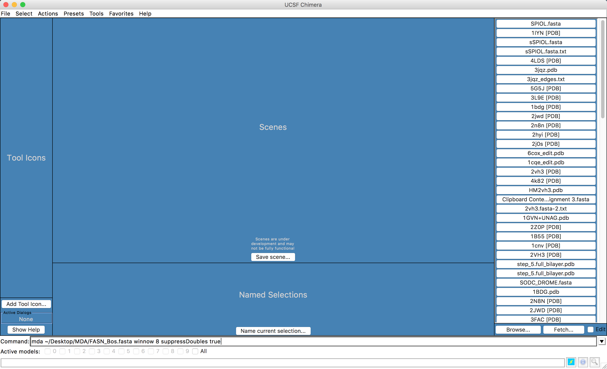

# Modelagem com o *Multidomain Assembler*

O *Multidomain Assembler* (MDA) ([Hertig et al. 2015](https://www.ncbi.nlm.nih.gov/pmc/articles/PMC4423039/)) é um programa para abordar os problemas especiais que surgem durante a modelagem de proteínas com grande número de domínios. Tais problemas incluem:

 - Organizar espacialmente estruturas não sobrepostas.
 - Obter a melhor cobertura para um modelo quando existem centenas de estruturas disponíveis para algumas regiões de seqüência, enquanto outras regiões têm poucos homólogos distantes.
 - Montar um único modelo de uma proteína com múltiplos domínios e diversos *templates* disponíveis.

O MDA automatiza as tarefas de pesquisa, visualização e seleção destes modelos e, em seguida, gera modelos multidomínios. Ele é bem simples de executar, sendo parte integrada ao UCSF CHIMERA ([Hertig et al. 2015](https://www.ncbi.nlm.nih.gov/pmc/articles/PMC4423039/)).

Em seus passos iniciais, o MDA também serve para obtenção de um resumo visual das estruturas disponíveis para uma seqüência de consulta, filtrada opcionalmente por critérios como o escore do BLAST e % de identidade, dispostos horizontalmente do N para o C-terminal. Os prováveis *templates* sobrepostos são organizados de maneira vertical e os segmentos de sequência sem cobertura estrutural são indicados com esferas. Adicionalmente, o MDA também mostra um  alinhamento dos vários *templates* com a sequência alvo, o que por si só já é um resultado extremamente útil (Fonte: [https://www.cgl.ucsf.edu/chimera/features.html](https://www.cgl.ucsf.edu/chimera/features.html)).

Para demonstrarmos a utilização do MDA, modelaremos a proteína Ácido Graxo sintase do Boi (*Bos taurus*), [Q71SP7 (FAS_BOVIN)](https://www.uniprot.org/uniprot/Q71SP7).

```
>Q71SP7_FAS_BOVIN
MEEVVITGMSGKLPESENLEEFWANLIGGVDMVTDDDRRWKAGLYGLPRRSGKLKDLSRF
DASFFGVHPKQAHNMDPQLRLLLEVTYEAIVDAGINPASIRGTNTGVWVGVSGSEASEAL
SRDPETLVGYSMVGCQRAMLANRLSFFFDFKGPSITLDTACSSSLLALQRAYQAIQRGEC
AMAIVGGVNIRLKPNTSVQFMKLGMLSPEGTCKFFDASGNGYCRAKAVMAILLTKKSLAR
RVYATILNAGTNTDGCKEKGVTFPSGEAQEQLISSLYKPAGLDPETLEYVEAHGTGTKVG
DPQELNGIVQALCGTRQSPLRIGSTKSNMGHPEPASGLAALAKVLLSLEHGLWAPNLHFH
NPNPKIPALQDGRLQVVDRPLPVLGGNVGINSFGFGGSNVHVILQPNSQPLPPPAPHAAL
PRLLRASGRTLEGVQGLLELGLQHSQNLAFVSMLNDIATPSPAAMPFRGYAVLGSQGGSQ
KVQQVLAGKRPLWFICSGMGTQWRGMGLSLMRLSRFRDSILRSDEAVKPLGLQVSQLLLS
TDEAIFDDMVISFVSLTAIQIALIDLLTSMGLQPDGIIGHSLGEVACGYADGCISQEEAI
LSAYWRGQCIKEANIPPGAMAAVGLTWEECKQRCPPGIVPACHNCIDTVTISGPQASMLE
FVQQLKQEGVFAKEVRTGGMAFHSYFMDAIAPMLLQQLKKVIREPQPRSPRWLSTSIPET
QWQESLARTFSAEYNVNNLVSPVLFQEALWRVPEDAVVLEIAPHALLQAVLKRGLKSSCT
IIPLMKKDHRDNLEFFLSNVGQLYLTGIDVNPNGLFPPVEFPAPRGTPLISPHIKWDHSQ
TWDVPTAEDFPSGSSSSSATIYKIDINPESPDHYLVDHCIDGRIIFPGTGYLCLVWKTLA
RALDQNMEHTPVVFEDVTLHQAVILPKTGIVLLKVRLLEASCTFEVSENGNLIASGKVYQ
WEDPNPKLFDNRYGPDPATPVDPTTAIHLSRGDVYKELQLQGFNYGPYFQGILEASSEGN
TGQLLWKDNWVTFMDTMLQMSILAPSKRSLRLPTRITAIYIHPATHQQKLYTLQDKTQVA
DVVINRCLDTTVAGGIYISRIHTSVAPRHQQEQLVPILEKFCFTPHVETGCLAGNLALQE
ELQLCVGLAQALQTRVAQQGIKMVVPGLDGAQAPQEAPQQGLPRLLATACQLQLNGNLQM
EMGQILAQERALLCDDPLLSGLLNSPALKACVTLALENMTSLKMKVVLAGDGQLYSRIPT
LLNTQPLLELDYTATDRHPQALEAAQAKLQQLDITQGQWDPSDPAPSNLGGANLVVCNYA
LASLGDPATAVGNMVAALKEGGFLLLHTLLRGHPLGETVTFLTCPEPQQGQRHLLSQDEW
ERLFAGASLHLVALKKSFYGSVLFLCRRLAPLDSPIFLPVEDTSFQWVDSLKNILADSSS
RAVWLMAVGCTTSGVVGLVNCLRKEPDGHRIRCVLVSNLNSTSPIPETDPKSLELQKVLQ
SDLVMNVYRDGAWGAFRHFPLEQDKPEEQTEHAFINVLTRGDLSSIRWVCSPLRHSQPTA
PGFQLCTIYYASLNFKRNHAGHGQAVPRRHPRNWASRNCLLGMEFSGRDASGKRVMGLVP
AEGLATSTLVPQSFLWDVPSNWTLEEAASVPVVYSTAYYALMVRGRMQPGETVLIHSGSG
GVGQAAIAIALSLGCRVFPLVGSAEKRAYLQSRFPQLNETSFANSRDTSFEQHVLWHTAG
KGADLVLNSLAEEKLQASVRCLAQHGRFLEIGKFDLSKNHPLGMAIFLKNVTFHGILLDS
LFEENNTMWQEVSTLLKAGIRKGVVQPLKRTVFPRTQAEDAFRYMAQGKHIGKVVIQVRE
EEQEAVLHGTKPTQMVALCKTFCPAHKSYIITGGLGGFGLELAHWLVERGAQKLVLTSRS
GIRTGYQARQVHEWRRQGVQVLVSTSDVSTLDGTRSLITEAAQLGPVGGIFNLAVVLRDA
MLDNQTPEFFQDVNKPKYNGTLNLDRVTREACPELDYFEVFSSVSCGRGNAGQTNYGFAN
STMERICEKRRHDGLPGLAVQWGAIADVGLLMELKGTKDKAIGGTLPQRITSCMEVLDLF
LNQPHPVLSSFVLAEKATSRGPSGSHQDLVKAVTHILGIRDLATVNLDSSLSDLGLDSLM
GVEVRQMLEREHNLLLSMREIRQLTIHKLQEISAQAGTADELTDSTPKFGSPAQSHTQLN
LSTLLVNPEGPTLTRLNSVQSSERPLFLVHPIEGSTTVFHSLATKLSIPTYGLQCTGAAP
LDSIQSLATYYIECIRQVQPEGNYRIAGYSYGACVAFEMCSQLQAQQNAGPTNNSLFLFD
GSHTFVMAYTQSYRAKLNPGCEAEAEAEAMCFFMQQFTEAEHSRVLEALLPLGDLEARVA
ATVELIVQSHAGLDRHALSFAARSFYHKLRAAEEYTPRATYHGNVTLLRAKMGSAYQEGL
GADYNLSQVCDGKVSVHIIEGDHRTLLEGSGLESILSIIHSSLAEPRVSVREG
```
A enzima FASN de mamíferos possui sete sítios ativos para reações distintas, em domínios separados. Tudo isto em uma única cadeia polipeptídica. Os múltiplos domínios atuam como enzimas distintas. A enzima final forma um homodímero. Mais informações pode ser obtidas do seu registro Uniprot ([Q71SP7 (FAS_BOVIN)](https://www.uniprot.org/uniprot/Q71SP7)).

Abaixo seguem as etapas para a modelagem desta proteína.

## Preparando os Arquivos

- Crie uma pasta no *desktop* chamada MDA.
- Dentro desta página, crie um arquivo no gedit e cole a sequência acima. Salve-o como ```FASN_Bos.fasta``` .

Esta pasta MDA será também onde os arquivos de saída do programa serão escritos.

## Executando o MDA

O MDA é executado via linha de comando no UCSF Chimera. Para isso, precisamos mostrar a linha de comando no programa e executar as etapas abaixo:

- Abra o UCSF Chimera.


- A linha de comando do UCSF Chimera irá aparecer embaixo da janela.
- Nesta caixa, digite o seguinte comando:

```
mda ~/Desktop/MDA/FASN_Bos.fasta winnow 8 suppressDoubles true
```
Ele deverá ficar de acordo com a figura abaixo.



> *Não esqueça de conferir se o caminho do diretório está correto.*
> 
> *O MDA também pode ser executado utilizando como entrada um código Uniprot.*

- O comando está sendo executado com duas opções:
	- ***winnow 8*** Acertos máximos por região. Valores mais baixos retornam menos *hits*.
	- ***suppressDoubles true:*** Manter apenas o *hit* de maior pontuação para uma entrada do PDB.

>*Descrições adicionais dos comandos do MDA e suas opções, podem ser encontradas [AQUI](https://www.cgl.ucsf.edu/chimera/docs/UsersGuide/midas/mda.html).*

- Pressione a tecla ```ENTER```para que o comando seja executado.

Nesta etapa o MDA faz uma busca BLAST contra o banco PDB para encontrar estruturas conhecidas com sequência similar, para toda extensão da sequência alvo. Depois, ele importa as estruturas do PDB correspondentes para o UCSF Chimera e as coloca da esquerda para a direita de acordo com as correspondências de seqüência ao longo da consulta do N ao C-terminal.

Na pasta de saída especificada, o MDA grava os seguintes arquivos de saída:

- O alinhamento pseudo-múltiplo de sequência do BLAST no formato FASTA alinhado.
- Um arquivo de texto contendo informações da execução.

Logo após a execução, a seguinte caixa de diálogo irá aparecer:


- Clique em ```Yes``` e espere que todos os arquivos PDBs sejam abertos.

Quando terminado o processo, os modelos alinhados de acordo com a sequência irão aparecer na área de trabalho do UCSF Chimera, além de duas novas janelas: uma com o alinhamento e a outra já com a interface para modelagem com Modeller.

- As estruturas encontradas pela busca BLAST aparecerão da seguinte maneira, sempre seguindo a sequência alvo, do N para o C-terminal.


>*Dê um zoom e veja as estruturas com mais detalhes.*

- A janela de alinhamento múltiplo (MAV) aparecerá com a seguinte:


- Verifique e navegue pelo alinhamento, para confirmar se toda a sequência da FASN_Bos teve estrutura correspondente.

## Fazendo a modelagem a partir do resultado do MDA

O restante dos passos é bem similar aos descritos no tutorial de [Modelagem Comparativa 1](https://sites.google.com/imd.ufrn.br/biomemodel/tutoriais-de-modelagem/modelagem-comparativa-1).

- Na janela aberta da interface com o Modeller, selecione as opções de acordo com a figura abaixo:


>*Não esqueça de colocar o caminho certo do executável do Modeller.* 
>
>*Deixe apenas como um único modelo, pois esta modelagem costuma ser demorada.*

- Clique em ```OK``` e espere os resultados.
- No final da modelagem, aparecerão o modelo na área de trabalho do UCSF Chimera e a janela **Modeller Results**.


## Salvando o Modelo

Salve o modelo obtido, seguindo os passos abaixo:

- Na janela principal do UCSF Chimera vá em:
	- **Select > Chain > (noID).**


- Depois vá em:
	- **Select > Invert (all models).** 


- Depois de selecionados todos os modelos, siga o caminho abaixo:
	- **Select > Actions > Atoms/Bonds > Delete.**


Agora você estará apenas com a estrutura que acabou de ser modelada e as estruturas *templates* foram apagadas.

- Dê um foco na sua estrutura com o seguinte passo:
	- Clique em **Actions > Focus**. 

Agora siga os passos abaixo:

- Vá em **Tools > General Controls > Model Panel.**
- Uma nova janela irá aparecer, chamada ***Model Panel***.
- Selecione as estruturas classificadas como *Gap* e aperte a tecla ```Close```ao lado. Faça isso em todas que aparecer. Até que a janela fique semelhante a abaixo:


- Clique em ```write PDB```. Na janela seguinte, dê um nome ao arquivo e salve o PDB.


