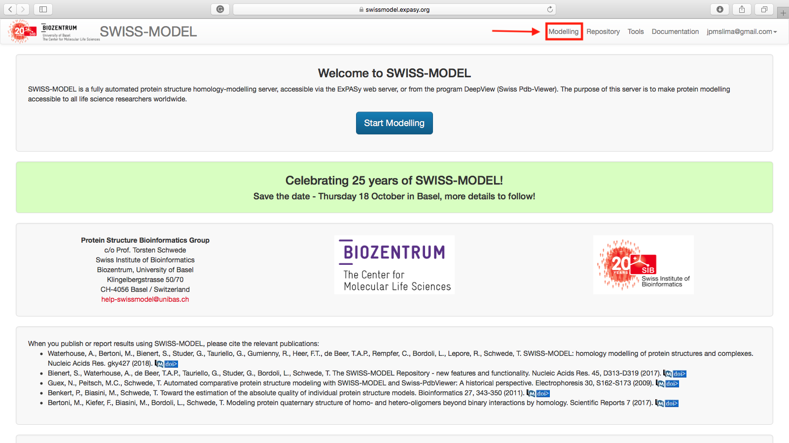

# Avaliação da Qualidade dos Modelos Proteicos Teóricos Gerados

Para avaliação dos modelos gerados pelas diferentes ferramentas utilizaremos o Módulo *Structural Assessment* do [Swiss-Model](http://swissmodel.expasy.org). Em versões anteriores, a avaliação de estruturas por este servidor era baseada nos programas ***Procheck*** e ***Anolea*** (Ver descrições abaixo). Na última versão (a que utilizaremos neste tutorial) a interface ficou mais simples e incluiu ferramentas muito utilizadas para validação de modelos teóricos, como o ***Molprobity***.

## *Structural Assessment* do Swiss-Model

- Abra a página do [Swiss-Model](https://swissmodel.expasy.org).
- Clique em ```Log in``` no canto superior direito e entre com suas credenciais.
- Você verá a seguinte página:



- Vá até ```Tools``` e clique em ```Structural Assessment```, da maneira indicada na página abaixo:


- Na página seguinte irá aparecer dois campos para preenchimento: um para o *upload* do arquivo de estrutura (```.pdb```) e o outro para inserir um título do projeto. É extremamente recomendável que você use este campo para dizer características do modelo que estás submetendo para avaliação. Neste exemplo, utilizaremos um dos arquivos gerados pelo I-TASSER, o [tAPX-itasser-model1.pdb](https://drive.google.com/uc?id=1gsl4QcdsMJVnrNZMMcl0WeC-XI91ZE0u).

- Clique em ```+ Upload Coordinate File:``` ou arraste o arquivo pdb para o campo. Após o reconhecimento, ele irá atribuir um nome automático ao Projeto. Edite-o se achar necessário.


- Agora clique em ```Start Assessment``` e espere os resultados completos.

### Resultados

Os resultados aparecem na seguinte ordem:

#### Gráfico de Ramachandran + Visualização do Modelo:


- Nos botões abaixo do gráfico você pode escolher as variações do Gráfico de Ramachandran e obter a figura para publicação.
- Na figura interativa ao lado, você poderá editar a estrutura, mudar o tipo de visualização e exportar como figura.

#### Avaliação pelo MolProbity


- A tabela descritiva dos parâmetros avaliados pelo MolProbity estará descrita no lado esquerdo.
- As colunas da tabela são, respectivamente: Parâmetro, Valor e Lista dos Resíduos com a sua respectiva posição.
- Ao lado de cada parâmetro há uma caixa. Se você selecionar esta caixa, por exemplo, ao lado do item ***Ramachandran Outliers***, os resíduos que estão fora  das regiões permitidas serão realçados na visualização lateral. O mesmo acontece com os outros parâmetros.

#### Avaliação da Qualidade


- Dois campos são agora mostrados:
	- Estimativas gerais de qualidade do modelo, realizadas em comparação a todas estruturas do banco RCSB PDB.
	- Estimativa de qualidade (escore QMean) de cada resíduo na sequência. Ao clicar no resíduo neste diagrama, ele ficará em evidência na figura interativa ao lado. A figura acima mostra o resíduo de Phe356.

O resumo dos escores de avaliação utilizados pelo Swiss-Model estão listados no item **Escores e Parâmteros** abaixo.

#### Tarefa

- Faça esta avaliação para os modelos que você obteve para a proteína O46921_SPIOL. 

## Outras Ferramentas recomendadas:

- 	**Modeller:**
	- Via ModEval: [https://modbase.compbio.ucsf.edu/evaluation/](https://modbase.compbio.ucsf.edu/evaluation/)

- **Molprobity:** 
	-	[http://molprobity.biochem.duke.edu](http://molprobity.biochem.duke.edu)

-	**Verify3D:**
	-	Direto: [http://services.mbi.ucla.edu/Verify_3D/](http://services.mbi.ucla.edu/Verify_3D/) 

-	**ERRAT:**
	-	[http://services.mbi.ucla.edu/ERRAT/](http://services.mbi.ucla.edu/ERRAT/)

-	**Análise no SAVES (*Structure Analysis and Verification Server*):**
	-	[http://services.mbi.ucla.edu/SAVES/](http://services.mbi.ucla.edu/SAVES/)
	-	Verifica todas estas ferramentas:
		-	Procheck.
		-	What_Check.
		-	ERRAT.
		-	Verify3D.
		-	Prove.
		-	CRYT1 *record matches*.
		-	Ramachandran Plot.


## Escores e parâmetros:
-	***DOPE:*** *Discrete Optimized Protein Energy*. É um potencial estatístico utilizado para avaliar modelos realizados por homologia. É baseado em um estado de referência que corresponde a átomos que não-interagem em uma esfera homogênea, com o raio dependente de uma estrutura nativa de amostra. Portanto, é relativo a forma nativa e esférica das estruturas nativas. Escores menores são mais favoráveis. No Modeller-Chimera ou no ModEval é representado como um escore Z (z-DOPE). Escores positivos provavelmente representam modelos pobres, enquanto escores menores do que -1 estão relacionados a estruturas nativas.

- ***RMSD:*** *Root-mean-square deviation* (RMSD). É a medida distância média entre os átomos de duas proteínas superpostas. Em relação as coordenadas atômicas do C-α ou em relação a todos os átomos (depende da forma como ele é computado).

- ***Predicted Native Overlap:*** Fração dos átomos Cα que estão preditos a estar dentro de 3.5 Å das suas posições na estrutura nativa.

- ***GA341:*** Escore para a confiabilidade de um modelo, derivado de potenciais estatísticos. Um modelo é considerado confiável quando o escore de modelagem é maior que um valor de corte pré-especificado (0.7). Um modelo confiável tem a probabilidade de ter assumindo um fold correto maior do que 95%. Um fold é correto quando pelo menos 30% dos seus Cα estão sobrepostos dentro de 3.5 Å de suas posições corretas.

- ***Z-Score:*** É uma medida da compatibilidade entre a sequência do modelo e sua estrutura. O Z-score do modelo deve ser comparável ao Z-score obtido pelo molde. Não é um parâmetro completamente excludente, pois alguns modelos bons podem apresentar Z-scores ruins.

- ***MolProbity Score:*** Estruturas de proteínas são muito bem empacotadas, com contatos de van der Waals interdigitados e sobreposição mínima entre átomos não envolvidos em ligações de hidrogênio (Pontes de hidrogênio). *Clashes* (conflitos) estéricos desfavoráveis são fortemente correlacionados com qualidade pobre de dados, com clashes reduzidos para perto de zero em partes bem ordenadas de estruturas cristalizadas de alta resolução. Números menores indicam melhores modelos. Leva em conta em seus cálculos:

	- ***Clashscore:*** Número de sobreposições estéricas desfavoráveis de todos os átomos > 0.4 Å por 1000 átomos.
	- ***Rotâmeros outliers:*** Porcentagem de conformações de cadeia laterais fora das regiões permitidas.
	- Número de cadeias fora das regiões favoráveis de Ramachandran.

- ***Anolea:*** Potencial de Força empírico médio atômico é utilizado para avaliar a qualidade de empacotamento do modelo. O eixo-y do gráfico gerado representa a energia de cada aminoácido da cadeia protéica. Valores negativos de energia (em verde) representam ambientes de energia favorável, enquanto valores positivos (vermelhos) representam regiões de energia desfavorável para aquele aminoácido.

- ***Verify3D:*** Avalia a estrutura das proteínas utilizando perfis 3D. Ele analisa a compatibilidade de um modelo atômico (3D) com a sua própria sequência primária (1D). Cada resíduo é atribuído a uma classe estrutural baseada na sua localização e ambiente (hélices, folhas, loops, polar, apolar, etc.). Daí um banco de dados gerado a partir de boas estruturas é utilizado para obter um escore para cada um dos 20 aminoácidos nesta classe estrutural. O eixo vertical no gráfico representa a média do escore do perfil 3D-1D para cada um dos resíduos em uma janela de 21 resíduos. Os escores variam de -1 (ruins) a +1 (bons).

- ***ERRAT:*** Analisa a estatística de interações não-covalentes entre diferentes tipos de átomos e plota o valor da função de erro versus a posição em uma “janela deslizante” de 9 resíduos, calculada por comparação estatística com estruturas refinadas.

- ***PROVE:*** Calcula o volume dos átomos nas macromoléculas usando um algoritmo que os trata como esferas rígidas e calcula um desvio de Z-escore estatístico para o modelo a partir de estruturas pdb depositadas bem resolvidas (de 2.0 Å ou melhores) ou refinadas (Fator-R de 0.2 ou melhor).

- ***Gromos:*** O eixo y do gráfico representa os GROMOS, campo de força e energia empírico para cada aminoácido da cadeia de proteína. Valores negativos de energia (em verde) representam ambiente favorável de energia enquanto os valores positivos (em vermelho) energia representam ambiente desfavorável para um determinado aminoácido.

- ***Procheck:*** Este grupo de programas avalia "qualidade estereoquímica" de uma dada estrutura de proteína. O objetivo do PROCHECK é avaliar o quão normal, ou, inversamente, quão anormal, a geometria dos resíduos de uma dada estrutura de proteínas é, em comparação com os parâmetros estereoquímicos derivados de estruturas de alta resolução refinadas (Por cristalização).

- ***What_check:*** Checagem extensiva de muitos parâmetros estereoquímicos dos resíduos de aminoácidos no modelo. 

- ***QMean:*** é uma função de pontuação composta que é capaz de derivar ambas estimativas de erro, global (isto é, por toda a estrutura) e local (ou seja, por resíduo) na base de um modelo único. É uma pontuação global de todo o modelo que reflecte a confiabilidade do modelo previsto que varia de 0 a 1.

- ***QMean Z-score:*** fornece uma estimativa da qualidade de um modelo absoluto, relacionando-a com referência a estruturas resolvidas por cristalografia de raios-X. O QMEAN Z-score é uma estimativa do "grau de natividade" das características estruturais observadas em um modelo por descrever a probabilidade de que um modelo é de qualidade comparável aos experimentais estruturas de alta resolução.

- ***Estimated absolute model quality:*** A pontuação QMEAN do modelo de consulta está relacionada com a pontuação de um conjunto não redundante de alta resolução de estruturas de raios-X de tamanho similar e um Z-score é calculado.
