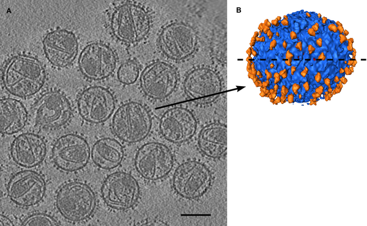
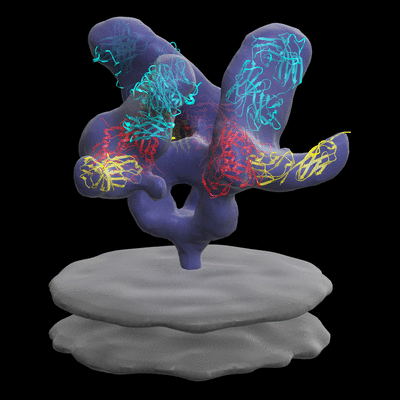
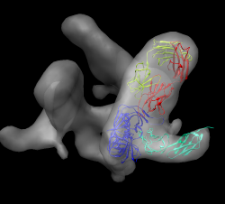
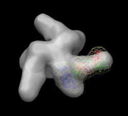
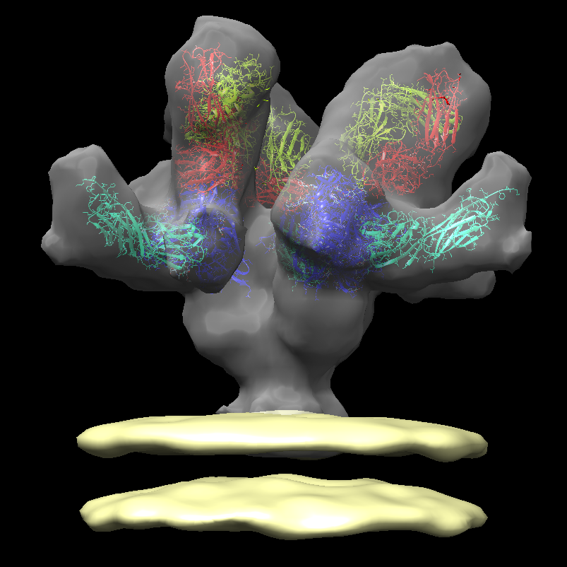
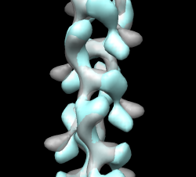

# Sobreposição de modelos moleculares a mapas de (crio)microscopia eletrônica (EM)

Neste tutorial você irá aprender a sobrepor e analisar a sobreposição de modelos moleculares, provenientes de modelagem *In silico* ou a partir de estruturas de cristalografia de raios-X, em mapas de (crio)microscopia eletrônica.

**Observações:**

- Este tutorial foi traduzido e adaptado dos tutoriais do programa UCSF Chimera. O tutorial foi desenvolvido por Tom Goddard, para o ***EMBO Practical Course: The combination of electron microscopy and x-ray crystallography for the structure determination of large biological complexes***. O tutorial no idioma original e sem adaptações pode ser acessado [AQUI](https://www.cgl.ucsf.edu/chimera/data/tutorials/emfit09/emfit.html) e [AQUI](http://cwp.embo.org/pc09-18/).
- A tradução/adaptação foi construída ***apenas para fins didáticos***.

## Protuberâncias do HIV

O vírus HIV se une e infecta células-alvo por meio da interação dos receptores e das estruturas pontiagudas do envelope viral (*Env*). *Env* é um heterodímero de uma glicoproteína transmembrana (gp41) e de uma glicoproteína de superfície (gp120), formando um trímero na superfície da membrana viral. A figura abaixo mostra a estrutura geral do virion do HIV.


O topo do Env consiste na proteína gp120 e tem a função de se acoplar ao receptor CD4 em células T humanas (célula-alvo). A gp41, por sua vez, se amarra à membrana externa do HIV, formando o “caule” da estrutura “afiada” (protuberância) do envelope.



Cabe a essa proteína preparar a inoculação do material genético do vírus nas células hospedeiras e auxiliar na fusão da membrana viral com a membrana celular. O formato espinhoso da estrutura também é fruto de contatos intensos entre as proteínas gp41 da base e de poucas ligações entre as gp120 do topo ([Liu et al. 2008](https://www.ncbi.nlm.nih.gov/pubmed/?term=18668044)).



### *Datasets* necessários

- env.map - Protuberância do HIV, sem ligantes ([emdb 5019](http://www.ebi.ac.uk/pdbe/entry/emdb/EMD-5019)).
- env_b12.map - Anticorpo FAB b12 ligado a protuberância do HIV ([emdb 5018](http://www.ebi.ac.uk/pdbe/entry/emdb/EMD-5018)).
- [2ny7.pdb](https://www.rcsb.org/structure/2NY7) - b12 ligado a gp120 (x-ray), b12 se liga numa região diferente do que o anticorpo 17b.
- env_cd4_17b.map - CD4 and FAB 17b bound to HIV spike ([emdb 5020](http://www.ebi.ac.uk/pdbe/entry/emdb/EMD-5020))
- [1gc1.pdb](https://www.rcsb.org/structure/1GC1) - CD4 e FAB 17b ligados a gp120 (x-ray).
- env_membrane.map - Membrana viral ([emdb 5023](http://www.ebi.ac.uk/pdbe/entry/emdb/EMD-5023)).

## Parte 1: sobreposição de estrutura de cristalografia de raios-x a mapa da protuberância

- Abra o arquivo ```env_cd4_17b.map``` ([emdb 5020](http://www.ebi.ac.uk/pdbe/entry/emdb/EMD-5020)).

> *Você pode abrir diretamente a partir da janela de ```Fetch``` do UCSF Chimera. Basta clicar em EMDB e digitar o código 5020.*

- A estrutura macromolecular irá aparecer na janela principal do programa, assim como a janela abaixo ***Volume Viewer***:


> *Nela você perceberá os valores e opções relativas ao mapa (histograma do mapa, o nível de contorno, a faixa de valores, cor, estilo (sólido usado para dados de tomografia), tamanho da grade, tamanho do passo (mostrar efeito com malha), mostrar / ocultar, fechar mapa.).*

- Abra a estrutura proveniente de cristalografia de raios-x [1gc1.pdb](https://www.rcsb.org/structure/1GC1).

> *Outra ação que também pode ser realizada pelo comando ```Fetch``` do UCSF Chimera.*

- Diminua o zoom caso a molécula esteja longe do mapa.
- Oculte por alguns instantes o mapa clicando no ícone com um *olho* na caixa de diálogo ```Volume Viewer```. Centralize na molécula usando ***Actions > Focus***.
- Mostre a linha de comando, usando ***Favorites > Command line***. Quando ela aparecer na parte inferior da janela principal do UCSF Chimera, digite:

```
rainbow chain
```

- Passe o mouse sobre as cadeias para mostrar os seus respectivos IDs no balão pop-up. O Modelo #, nome e número do resíduo também mostrado.
  - A cadeia G (azul) é gp120.
  - A cadeia C (ciano) é o fragmento do receptor CD4.
  - As cadeias L, H são o fragmento do anticorpo ligado (FAB) 17b.

### Sobrepor a estrutura molecular no mapa

Agora vamos começar o procedimento de sobreposição da estrutura. Observe atentamente a estrutura geral do mapa e da proteína. Verifique regiões que tenham formato semelhante. O UCSF Chimera não é um programa específico para isso, pois não fornece algoritmos de ajuste global e não faz cálculos de longa duração. Ele se concentra na visualização e análise interativa de dados, realizando cálculos que levam frações de segundo até alguns segundos, o que pode facilitar uma análise mais rápida.

Vamos aos passos:

- Exiba o mapa com o ícone de mostrar/ocultar da caixa de diálogo ```Volume Viewer```. Depois aplique um ***Actions > Focus***.
- Desmarque o botão ativo 0 abaixo da linha de comando. Isso irá "*congelar*" o mapa. Arraste então a molécula para perto do mapa.
- Verifique o botão ativo 0, gire para inspecionar a superposição.
- Esconda o mapa e examine a forma da molécula, como a letra "L". Procure por uma região similar a forma de um "L" no mapa.
- Ativando/Desativando o botão 0 na linha de comando repetidamente para alinhar a molécula no mapa.
- Segure a tecla ```Ctrl``` com o botão do meio do mouse para movimentar a estrutura em relação ao plano da tela (movimento tridimensional).
- Torne o mapa transparente com o botão de cor na caixa de diálogo ```Volume Viewer```, clique em Opacidade no editor de cores (isso também pode ser realizado a partir de ***Actions > Surface > transparency***).

A sobreposição geral deverá ficar similar a da figura abaixo:



> *Tente aproximar o melhor possível a molécula, evitando grandes regiões fora do mapa.*

### Otimização da Sobreposição

O UCSF Chimera faz uma otimização da sobreposição colocando a orientação em um *best fit* local. É importante você saber que tal adequação é apenas local, ou seja, se a estrutura for colocada numa região errada, ela irá adequar ao máximo a sobreposição naquela região. Em outras palavras, ele não faz correções de sobreposições erradas.

Com a estrutura sobreposta de forma similar a da figura anterior, siga os seguintes passos:

- Na caixa de diálogo ```Volume Viewer```, siga o menu ***Tools > Fit in Map***.
- Na caixa de diálogo ```Fit in Map```, escolha a estrutura 1gc1 e o mapa 5020. Depois, pressione o botão ```Fit```. Tal ação moverá a estrutura 1gc1 para o melhor ajuste local.
- Pressione os botões ```Undo``` e ```Redo``` (desfazer/refazer) para ver o quanto a estrutura se moveu.

### Qualidade do *Fit*

Observe o valor médio do mapa (*Average map value*) antes e depois da otimização (use desfazer/refazer). Esse valor está sendo maximizado pela rotação/tradução local. Apenas valores relativos são significativos, uma vez que a normalização do valor do mapa é arbitrária.

- Observe o número de átomos fora do contorno exibido antes e depois.
- Vamos agora alterar o nível de contorno, mexendo na barra cinza na caixa ```Volume Viewer```. Depois pressione o botão ```Update``` na caixa ```Fit in Map``` para ver o número de átomos fora das mudanças de contorno.
- Exiba os átomos, seguindo o menu: ***Actions > Atoms/Bonds > Show***.
- Aproxime a visão e observe que muitos átomos fora são relativos a moléculas de água (apenas o oxigênio será visualizado). Confirme, colocando o ponteiro do mouse em cima do átomo para ver o nome HOH.
- Agora vá em ***Select > Residue > HOH***. 603 átomos serão selecionados. Agora vamos apagá-los, seguindo o menu ***Actions > Atoms > Delete***.
- Verifique a atualização do número de átomos fora do contorno. Caso facilite, torne a superfície opaca novamente para ver onde os átomos se projetam.
- Pressione ```Fit``` mais vezes. Observe pequenas alterações. Esta operação tem o Limite de 100 passos.

### Coeficiente de Correlação

O valor médio do mapa ou o número de átomos fora do contorno não são valores muito úteis para relatar em um artigo ou em uma apresentação. Uma normalização é necessária, como valores de mapa normalizados para peso molecular por angstrom cúbico, ou conjunto de nível de contorno englobando o mesmo volume do envelope de modelo molecular. A medida mais comumente informada da qualidade do ajuste é a correlação.

- Na caixa de diálogo ```Fit in Map```, marque a opção ***Use map simulated from atoms, resolution*** e coloque a resolução de mapa de 20 A.

A correlação depende do domínio (volume dentro do nível de contorno mais baixo do mapa simulado). Portanto, também é um valor ambíguo, a menos que o ajuste corresponda ao volume inteiro. Isso não é típico. A maioria dos artigos envolvendo *fit* pdb-emdb apenas relata qual software foi utilizado sem especificar qualquer indicativo da qualidade do ajuste. O mapa simulado é inicialmente mostrado em nível de contorno contendo 95% de massa.

A correlação mostrada aumenta à medida que o contorno menor (domínio maior) é usado. Mesmo a medida de correlação do *goodness of fit* não é definida exclusivamente sem especificar um parâmetro adicional.

### Salvando o trabalho

- Salve a sessão com nome **cd4_17b_fit.py**. Ao salvar, um aviso aparecerá, porque o mapa simulado não foi salvo. Tudo bem, já que pode ser facilmente recalculado.
- Salve também o mapa calculado. Na janela ```Volume Viewer``` clique na parte do mapa calculado (1gc1) e nesta mesma janela vá em ***File > Save map as...***. Salve como .mrc.
- Salve o pdb em relação ao mapa, com o nome **1gc1_fit.pdb**.
- Feche a sessão, abra o mapa **env_cd4_17b.map** e os arquivos **1gc1_fit.pdb** e **1gc1.pdb**.
- Saia da Quimera, reinicie, carregue a sessão.

>  *Apenas Chimera irá ler o arquivo de sessão. Outros programas lerão mapas salvos e PDBs. Observe que ao abrir novamente o esquema de cores aplicado anteriormente será perdido.*

## Parte 2: *fit* da protuberância com FAB b12 ligado (sem CD4)

- Abra uma nova sessão do UCSF Chimera e repita os passos acima com o modelo de raios-x [2ny7.pdb](https://www.rcsb.org/structure/2NY7) em com o mapa da protuberância FAB b12 ([emdb 5018](http://www.ebi.ac.uk/pdbe/entry/emdb/EMD-5018)). A orientação geral é como a da figura abaixo:



- Dicas:
  - A cadeia FAB verde fica voltada para cima.
  - A correlação com o mapa simulado fica por volta de 0.68.
- Após terminar o *fit*, salve a sessão como **b12_fit.py**.

## Parte 3: *fit* da gp120 com protuberância não-ligada

- Feche a sessão anterior. Abra agora o mapa não vinculado env.map ([emdb 5019](http://www.ebi.ac.uk/pdbe/entry/emdb/EMD-5019)).
- Abra o pdb 1gc1.
- Use apenas a cadeia da gp120. Para isso selecione a cadeia G, inverta a seleção, e exclua os átomos.

> *Use o limite (threshold) do mapa alto para ver a localização provável.*

Este encaixe não é fácil e direto. O *core* gp120 é basicamente um triângulo com um *loop* para fora. O triângulo pode entrar na densidade de 6 maneiras.
As diferenças na qualidade do *fit* são muito pequenas. Veja o ajuste de 1gc1 no mapa cd4/17b para ver qual orientação ele possui. A ideia é que o pico ligado versus o não-ligado não deve ser muito diferente. Para isso:

- Inicie outra janela do UCSF Chimera e abra a sessão anteriomente salva **cd4-17b-fit.py**.
- Esconda CD4 e FAB. Selecione a cadeia G, inverta a seleção. Vá em **Actions > Ribbons > hide**.
- Na linha de comando, digite:

```
rainbow
```
Isto irá identificar os terminais N e C (azul / vermelho) apontando para baixo da base da protuberância. O *Loop* está mais perto do eixo da espiga.
Use o arco-íris em Quimera de ajuste ilimitado. Oriente N, C termina abaixo, volta perto do eixo.
- Faça o ***Fit in map***.

A orientação geral é similar a da figura abaixo:

.

## Parte 4: Fazendo um trímero

O objetivo aqui é fazer um modelo molecular trimérico, para caber 3 monômeros. Mas imperfeições na montagem tornariam o modelo não exatamente 3 vezes simétrico. Mesmo assim iremos tentar fazer um modelo simétrico de 3x um monômero sobreposto.

- Abra a sessão cd4_17b_fit.py, feche os modelos anteriores.
- O comando para copiar a molécula para a simetria de 3 dobras é:

```
 sym # 1 group c3
```
Você pode verificar que a simetria não está correta. Isto porque as coordenadas precisam ser dadas. Neste momento de aprendizagem iremos passar as coordenadas, mas elas podem ser aproximadas por uma série de funções no UCSF Chimera.

- Tente agora com o seguinte comando:

```
sym #1 group c3 coordinateSystem #0 center 207.9,204.9,0
```

Verifique que o *fit* agora ficou bem melhor. Agora vamos colocar a membrana do vírus. Para isso, abra o env_membrane.map ([emdb 5023](http://www.ebi.ac.uk/pdbe/entry/emdb/EMD-5023)). A representação final deverá ficar parecida com a da figura abaixo:

.

# Exercícios

- Salve cada uma das sessões acima e entregue junto com um pequeno resumo sobre a atividade.

## Filamento ParM

A proteína ParM é um homólogo da proteína actina em bactérias que formam filamentos semelhantes a actina.
Os filamentos empurram pares de plasmídeos de DNA de baixo número de cópias para lados opostos
da célula antes da divisão celular para assegurar que ambas as células-filhas assegurem cópias dos plasmídeos. Extremidades do filamento se anexam aos plasmídeos e, em seguida, os filamento cresce para alguns micrômetros de comprimento, empurrando os plasmídeos para longe um do outro. ATP é consumido como fonte de energia no crescimento deste filamento.

### *Datasets*:

- parm_open.map - filamento ParM em estado aberto, resolução 19.5 Å, emdb [5129](http://www.ebi.ac.uk/pdbe/entry/emdb/EMD-5129).
- parm_closed.map - filamento ParM em estado fechado, resolução 17.2 Å, emdb [5128](http://www.ebi.ac.uk/pdbe/entry/emdb/EMD-5128).
- PDB [1mwk](https://www.rcsb.org/structure/1MWK) - apo ParM.
- PDB [1mwm](https://www.rcsb.org/structure/1MWM) - Parm ligado ao ADP.

### Ajuste o mapa em conformação aberta

Este é exemplo é um pouco mais difícil do que as protuberâncias do HIV. Preste bem atenção nas formas das estruturas antes de fazer o ajuste.

- Abra o emdb [5129](http://www.ebi.ac.uk/pdbe/entry/emdb/EMD-5129) e o apo ParM ([1mwk](https://www.rcsb.org/structure/1MWK)) e faça o ajuste a molécula no mapa.
- O modelo de raios-x de [1mwk](https://www.rcsb.org/structure/1MWK) possui duas cópias de ParM. Para facilitar o processo de sobreposição, faça a exclusão da cadeia B.
- Observe na janela ```Volume Viewer``` que o *step size* é 2. Mudar para 1 irá facilitar o processo de sobreposição.
- O feixes de alfa-hélices entra no lóbulo. Duas possibilidades dão diferentes correlações 0.58 vs 0.76.
- Use a figura abaixo como guia:


#### Questões (1a Parte)

- Entregue as sessões salvas, com as sobreposições relativas as duas correlações acima. A correlação da figura é de 0.58 ou 0.76?

### Alinhando os mapas de conformação fechada e aberta

- Abra o mapa fechado parm_closed.map (emdb [5128](http://www.ebi.ac.uk/pdbe/entry/emdb/EMD-5128)) e tente alinhar com o mapa aberto.

> *Neste caso, girar e otimizar o ajuste produzirá resultados ruins.*

- Aumente o *threshold* na janela ```Volume Viewer``` em ambos os mapas para que dois os proto-filamentos não fiquem conectados. Exiba um mapa por vez e compare.
- Observe os pontos do lóbulo em baixo no mapa aberto e no mapa fechado.
- Inverta o mapa fechado de ponta a ponta e tente encaixar. Use *thresholds* altos.
- Uma vez bem alinhada a correlação nota é ~0.3 com alto *threshold* mas 0,7 com baixo *threshold* no mapa aberto já que o *match* é muito melhor se medido em uma região maior. Veja a figura abaixo:



#### Questões (2a Parte)

- Explique como se dá o funcionamento da proteína ParM, utilizando os mapas acima.

> *Procure também sobre a proteína actina ou sobre contração muscular. O funcionamento destas proteínas e da contração muscular irá lhe dar uma base para entender o funcionamento da ParM.*