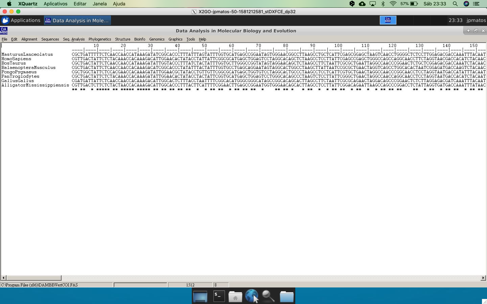
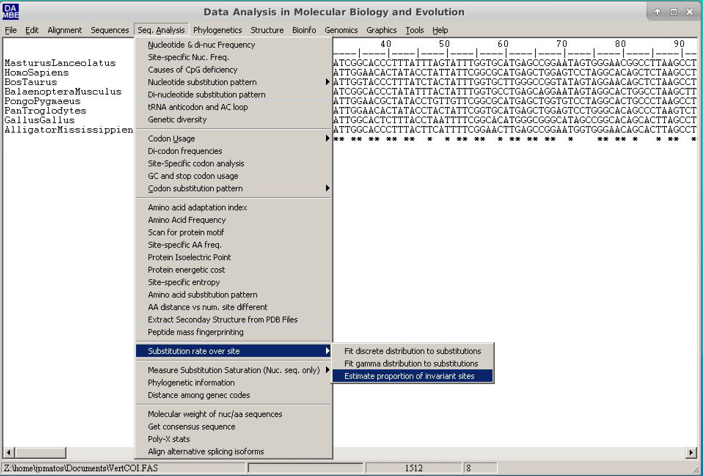

# Analysis of Substitution Saturation of nucleotide sequences

The substitutionhttp://www.postgradoquimica.cl/informacion-diplomado-en-bioinformatica-y-biologia-computacional/ saturation estimation is an **essential** analysis to check if the alignment sequences still maintain a phylogenetic signal. Saturation is much more common in nucleotide sequences. There are two methods: one extremely simple and qualitative and the other quantitative, with associated probability (the Xia method, 2009). Both are implemented in the program [DAMBE](http://dambe.bio.uottawa.ca/DAMBE/dambe.aspx) ([Xia, 2018](https://www.ncbi.nlm.nih.gov/pubmed/29669107)).

[DAMBE](http://dambe.bio.uottawa.ca/DAMBE/dambe.aspx) ([Xia, 2018](https://www.ncbi.nlm.nih.gov/pubmed/29669107)) is a suite with several phylogenetic and sequence analysis applications. Additionally, it is multi-platform (except if you run MacOS Catalina, as it is not completely 64 bits - Feb 2020) and simple to use. To our knowledge, it is the only phylogenetic analysis program that performs these tests.

## The Qualitative Method

The qualitative method of substitution saturation analysis consists of analyzing a plot called "transition and transversals versus divergence" (*transitions and transversals versus divergence*). This method assumes that the distance calculated between the sequences is directly proportional to the divergence time between them, either on any scale.

The steps to obtain this graph are:

- Open the DAMBE program. Click on *File* and then on *Open Standard Sequence File*.


- Select the *dataset* [VertCOI.fas](https://drive.google.com/uc?export=download&id=1sPodmXGkPCxWu7t8CIZzHmumYS_0kX18). Click ``Open``.
- In the dialog box that appears, called *SequenceInfo*, check the option *Protein-coding Nuc-Seq*. In this same window, in the Genetic Code options, choose the number 2 (from the Vertebrate mitochondria).


- In the main window, the alignment will appear in Clustal format. 



On DAMBE's main menu, go to *Graphics* and click on ***transition and transversion versus divergence**. 


A new dialog box will appear. In it, the default values can be used. However, we will change the genetic distance (*Genetic distance* field) to TN93, as shown in the figure below:


- Click on ``Go`` and watch the resulting graph. To make the visualization easier, leave the options as below:


> The letter "s" refers to the transitions and the letter "v" to the transversions*.

Compare the graph above with the figure below and draw your conclusions about the saturation of these sequences.


## The quantitative method

The Xia method is a quantitative method, based on entropy, that
assigns a significant value to the saturation of substitutions. It returns two criteria: Iss and Iss.c. The first is the substitution saturation index. The second is the critical substitution saturation index, which is the value of Iss at which sequences can no longer return the correct tree. When an observed Iss value is significantly lower than Iss.c (Iss < Iss.c), substitution saturation is not a problem for the *dataset* in question. The steps to perform this method are:

- Open the DAMBE program. Click on *File* and then on *Open Standard Sequence File*.
- Select VertCOI.fas dataset. Click on ``Open``.
- In the dialog box that appears, called *SequenceInfo*, check the option *Protein-coding Nuc-Seq*. In this same window, in the Genetic Code options, choose the number 2 (from the Vertebrate mitochondria).
- In the main window, the alignment will appear in Clustal format. Before continuing, the proportion of invariable sites (Pinvar) should be calculated for this *dataset*. This parameter is crucial for sequences with very different substitution rates along with the sites. 
- To do this, follow the path: *Seq.Analysis* > *Substitution rates over site* > *Estimate proportion of invariant sites*.



- In the dialog box that follows, check the "*Use a new tree*" option. In the new window, choose the *Neighbor-Joining* method, choose the appropriate *outgroup* (for this example, we will use *Alligator mississippis*) and keep the rest of the options the way it is. Click on ``Run`` and then click on ``Go``. At the end of the text output, Pinvar will be described, as below:

```
Estimation based on tree:
(AlligatorMississippiensis:0.13730,(MasturusLanceolatus:0.15730,(((HomoSapiens:0.04522,PanTroglodytes:0.04795):0.02113,PongoPygmaeus:0.08982):0.05970,(BosTaurus:0.09378,BalaenopteraMusculus:0.10744):0.01982):0.01484):0.01673,GallusGallus:0.12297);

Estimating the proportion of invariant sites by iteration.
(Poisson+I)
 Iter       Phi      Pinv
-------------------------------------
    0   0.85377   0.28746
    1   0.85377   0.25871
    2   0.85377   0.31960
    3   0.73189   0.42154
    4   0.62860   0.47955
    5   0.57154   0.51389
    6   0.56361   0.52394
    7   0.56361   0.53330
    8   0.56361   0.52737
    9   0.56361   0.52462
   10   0.56361   0.52224
   11   0.56361   0.52258
   12   0.56361   0.52122
   13   0.56361   0.52089
   14   0.56361   0.51988
   15   0.56361   0.51954
   16   0.56361   0.51887
   17   0.56361   0.51821
   18   0.56361   0.51754
   19   0.56361   0.51688
   20   0.56361   0.51621
   21   0.56361   0.51555
-------------------------------------
P(invariant) = 0.51555
```

- Save or write down the Pinvar value (0.51555).

> Depending on your operating system's language settings, you will have to use decimal notation as a period and not as a comma. Pay close attention to this.*

Now let us estimate the saturation of substitutions (the program may present some problems, and so, in some cases, the sequence file should be opened again).

- Click on "*Seq.Analysis* > *Measure substitution saturation* > *Test by Xia et al.*".


- In the window, just put the Pinvar value calculated and then click Go.


- Analyze the results (further comments will be made during the
  practice).

```
Test of substitution saturation (Xia et al. 2003; Xia and Lemey 2009)

Testing whether the observed Iss is significantly
lower than Iss.c.

Part I. For a symmetrical tree.
========================================================
Prop. invar. sites                0.5156
Mean H                            0.9205
Standard Error                    0.0183
Hmax                              1.6517
Iss                               0.5573
Iss.c                             0.8093
T                                13.7506
DF                              731
Prob (Two-tailed)                 0.0000
95% Lower Limit                   0.5214
95% Upper Limit                   0.5933

========================================================
Part II. For an extreme asymmetrical (and generally very
unlikely) tree.
========================================================
Iss.c                             0.7095
T                                 8.3050
DF                              731
Prob (Two-tailed)                 0.0000

95% Lower Limit                   0.5214
95% Upper Limit                   0.5933

========================================================

Interpretation of results:
               Significant Difference
               ----------------------
               Yes                 No
-------------------------------------------------------
Iss < Iss.c    Little             Substantial
               saturation         saturation
-------------------------------------------------------
Iss > Iss.c    Useless            Very poor
               sequences          for phylogenetics
-------------------------------------------------------

Please cite:

Xia, X., Z. Xie, M. Salemi, L. Chen, Y. Wang. 2003. An index of substitution saturation and its application. Molecular Phylogenetics and Evolution 26:1-7.

Xia, X. and Lemey, P. 2009. Assessing substitution saturation with DAMBE. Pp. 615-630 in Philippe Lemey, Marco Salemi and Anne-Mieke Vandamme, eds. The Phylogenetic Handbook: A Practical Approach to DNA and Protein Phylogeny. 2nd edition Cambridge University Press.
```

It can be verified that both scenarios have Iss<Iss.c. Therefore these sequences do not present substitution saturation and can be used for phylogenetic analysis.

## Influence of the position on the codon

Due to the genetic code characteristics, nucleotide sequences coding for proteins tends to show a higher number of changes in the 3rd position of the codon than in the 1st and 2nd position. Therefore, in these cases, the ideal is to perform both methods for all codon positions (this option will be shown during practice). The table below shows all Pinvar, Iss, and Iss.c data for all codon positions.

| Positions               | Pinvar  | *Iss*  | *Iss.c* | P      |
|:----------------------- |:-------:|:------:|:-------:|:------:|
| **All**                 | 0.51555 | 0.5573 | 0.8093  | 0.0000 |
| **1st position**        | 0.64014 | 0.3814 | 0.7519  | 0.0000 |
| **2nd position**        | 0.42518 | 0.0655 | 0.7519  | 0.0000 |
| **3rd position**        | 0.02485 | 0.7340 | 0.7519  | 0.3540 |
| **1st e 2nd positions** | 0.37664 | 0.1391 | 0.7886  | 0.0000 |

## Final Remarks

You should always perform the analysis of substitution saturation whenever working with a new or not widely known marker. If you are using genes or proteins already known and commonly used in the literature studies, these estimates, although still recommended, are not indispensable. However, you can still perform these tests to confirm if the marker is suitable to the taxonomic level/rank that you are working on. Sometimes qualitative analysis is sufficient, but you can (and should) use the quantitative method if the graph presents a problematic interpretation.sudo apt install ttf-mscorefonts-installer -y
