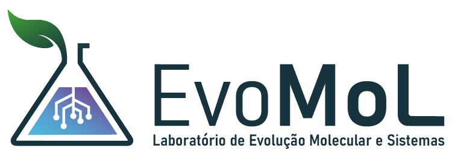
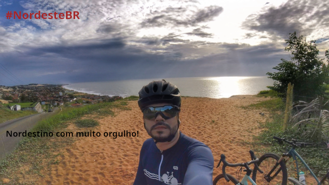

# Sobre o grupo:

## EvoMol-Lab

O Laboratório de Evolução de Moléculas e Sistemas (EvoMol-Lab) é um dos grupos de pesquisa associados ao [Centro Multiusuário de Bioinformática (BioME)](http://biome.ufrn.br), do [Instituto Metrópole Digital (IMD)](http://imd.ufrn.br) da Universidade Federal do Rio Grande do Norte ([UFRN](http://ufrn.br)). O EvoMol-Lab tem como missão estudar processos evolutivos que atuam em moléculas, complexos supramoleculares e sistemas (vias e redes de interação) e os efeitos estruturais e funcionais provocados pela variação genética, utilizando abordagens da Bioinformática, modelagem molecular e análise evolucionária de sequências. Seu Principal Investigador é o Prof. João Paulo MS Lima, Professor Titular da UFRN.

## About me:

### Profissional

Sou Biólogo (Bacharel) formado pela Universidade Federal do Ceará (UFC) (2000), Especialista em Bioinformática (2002), Mestre (2003) e Doutor em Bioquímica (2007). Atuei científicamente nas áreas de Bioquímica, Biologia Molecular e Bioinformática. Minha principal linha de pesquisa hoje é a Evolução de Moléculas e Vias Metabólicas, utilizando abordagens da Bioinformática/Bioinformática Estrutural e da Filogenia Molecular. Atualmente sou Professor Titular do Departamento de Bioquímica, Centro de Biociências da Universidade Federal do Rio Grande do Norte, membro permanente do [Programa de Pós-Graduação em Bioinformática (PPg-Bioinfo-IMD/UFRN), pesquisador (P.I.) do Centro Multiusuário de Bioinformática (CMB/IMD/UFRN)](http://bioinfo.imd.ufrn.br) e pesquisador associado do Instituto de Medicina Tropical do RN (IMT-RN).

- [CV Lattes](http://lattes.cnpq.br/3289758851760692)
- [Página Docente da UFRN](https://docente.ufrn.br/201900369630/perfil) / [SIGAA](https://sigaa.ufrn.br/sigaa/public/docente/portal.jsf?siape=1513597)
- [OrcID](https://orcid.org/0000-0002-6113-8834)
- [ResearchGate](https://www.researchgate.net/profile/Joao-Lima-31)
- [LinkedIN](https://www.linkedin.com/in/jo%C3%A3o-paulo-ms-lima-b0667351/)

### Pessoal
Pai de humanos e de cães. Cientista, ciclista amador, entusiasta do gravel.

Mastodon: [@jpmslima@mstdn.science](https://mstdn.science/@jpmslima)

