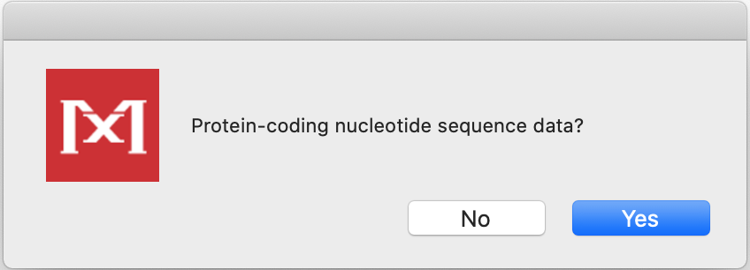

# Escolhendo um Modelo de Substituição Apropriado

## Introdução

O objetivo deste tutorial é mostrar as diferentes formas de avaliar e estimar um modelo de substituição de nucleotídeos (e aminoácidos) adequado para seu *conjunto de dados*, com o intuito de realizar uma análise filogenética posterior.

Como destacado durante a aula, a etapa de estimar um modelo de substituição **não é obrigatória** em toda análise filogenética. Quando as sequências em estudo e as características do alinhamento são bem conhecidas, o pesquisador pode escolher diretamente um modelo matemático. No entanto, como existem inúmeros modelos disponíveis, essa escolha pode ser desafiadora, principalmente para iniciantes. No pior cenário, o desconhecimento pode levar à escolha de um modelo que subestima características importantes do alinhamento, resultando em estimativas menos precisas. Por outro lado, incluir muitos parâmetros aumenta a variância e, consequentemente, a acurácia das análises (e, às vezes, o poder computacional necessário).

A maioria das ferramentas utiliza o princípio estatístico da **verossimilhança (*likelihood* - L)**. Para isso, calcula-se **L** para todos os modelos disponíveis e depois faz-se uma classificação hierárquica (com ou sem critérios de informação). Esses cálculos são computacionalmente intensivos, mesmo em muitos computadores atuais.

---

## Usando o MEGA X

Na sua primeira versão, o programa **MEGA** não possuía opções para testar o modelo de substituição. Ainda assim, foi um dos primeiros programas filogenéticos a incluir essa funcionalidade nativamente. O algoritmo é rápido, embora teste mais modelos do que estão disponíveis na própria ferramenta.

- Utilizaremos o arquivo de alinhamento múltiplo [vert-aligned.fasta](https://drive.google.com/uc?export=download&id=1CKutTUK4aAH-yGyZ1fhVfzz07SVVo3dD):
- Execute o programa **MEGA X**.
- Abra o alinhamento clicando no botão **TA** e depois em ***Open a File/Session...*** de acordo com a foto abaixo:


- Na janela seguinte, clique em ***Analyze*** (as sequências já estão alinhadas).


- O MEGA perguntará se são sequências de nucleotídeos. Clique em `Ok`.


- Perguntará se são **sequências codificadoras de proteínas** (*protein-coding sequences*). Clique em `Yes`.



- Escolha o código genético: ***Vertebrate Mitochondrial***.
- Com o arquivo aberto, clique em ***Models***,


-  e selecione ***Find Best DNA/Protein Models (ML)...***:
  


- Confirme o uso do conjunto de dados aberto clicando em `Yes`:


  
- Após confirmação, uma caixa irá aparecer. 


- Defina as opções:
   - *Tree to use* / Árvore inicial: *Automatic* / automática (*Neighbor-Joining*).
   - *Substitutions Type* / Tipo de substituições: *Nucleotide* / nucleotídeos.
   - *Gap/Missing data treatment* / Subgrupos de dados: *Use all sites* / todos os sítios -> todas as posições de códons, sem filtros (*Branch-swap filter*).
   - *Number of threads* / Número de threads: mantenha o padrão.
   - Clique em `Ok` e aguarde.
Os resultados irão aparecer em uma tabela:


Os modelos serão listados do mais adequado ao menos adequado, com base no critério ***BIC (Bayesiano)***. Com isso, podemos verificar que o modelo ***GTR (General Time-reversible)*** com correção gama **(+G)** foi o modelo escolhido pelo critério Bayesiano. No entanto, não é o modelo com a menor verossimilhança (lnL). O restante das informações dessa tabela será discutido durante a reunião remota.
Exemplo: modelo escolhido — `GTR+G`.

> 📌 **Dica:** Não se esqueça de salvar essa tabela em um dos formatos que o MEGA X oferece, utilizando os ícones localizados no canto superior esquerdo da tela.
> O MEGA X também possui a função para calcular o melhor modelo de substituição de aminoácidos. Para isso, basta iniciar as análises com um alinhamento de aminoácidos e, na caixa de diálogo, escolher a opção correta.

---

## Usando o jModelTest

O programa jModelTest ([Darriba et al. 2012](https://www.ncbi.nlm.nih.gov/pubmed/?term=Darriba+D%2C+Taboada+GL%2C+Doallo+R%2C+Posada+D.+2012.+jModelTest+2%3A+more+models%2C+new+heuristics+and+parallel+computing.+Nature+Methods+9(8)%2C+772.)) é uma versão estendida do popular programa ModelTest (que era uma rotina executada dentro do programa *PAUP*.) O programa agora é autônomo e muito mais rápido após a inclusão das ferramentas `PHYML`, `ReadSeq` e `Consense` do antigo pacote [PHYLIP](http://evolution.genetics.washington.edu/phylip.html). Além disso, o jModelTest permite a otimização de árvores de base para cada modelo, seleção de modelos de acordo com um novo critério de decisão teórico e filogenias médias de modelos. Recentemente, foi lançada uma nova versão aprimorada e mais rápida, que serve tanto para sequências de DNA quanto de proteínas, o ModelTest-NG ([Darriba et al. 2019](https://academic.oup.com/mbe/article/37/1/291/5552155)).


### Etapas:

1. Baixe e execute o **jModelTest.jar** (Java).  O programa é um aplicativo Java e é executado de duas maneiras distintas: linha de comando e GUI (Graphical User Interface).O programa depende da instalação de um JDK (Java Development Kit), seja ele o oficial da Oracle ou o OpenJDK.As etapas de instalação do JDK dependem do sistema operacional e, portanto, não serão detalhadas aqui neste tutorial. 📌 Versão recomendada: **2.1.10**
    - Não confunda *JDK* com *JRE (Java Runtime Environment)*, o qual geralmente está presente na maioria dos computadores.

   No Linux, abra o terminal, navegue até a pasta onde o jModelTest.jar está localizado e digite o comando abaixo:

   ```bash
   java -jar jModelTest.jar
   ```
    A janela abaixo irá aparecer:
2. Clique em **File > Load DNA alignment** e abra `vert-aligned.fasta`.
    - Usaremos o mesmo arquivo usado anteriormente: vert-aligned.fasta.
3. Clique em **Analysis > Compute likelihood scores** para iniciar a análise.
4. Será exibida uma caixa de diálogo que permite especificar o número de configurações de probabilidade, incluindo o número de modelos a serem testados. As outras configurações são diferentes frequências de base (+F), a proporção de locais invariáveis (+I) e a distribuição gama (+G) (variação na taxa entre os locais). Nessa caixa de diálogo, deixe as opções como na figura abaixo.
5. Clique em **Compute Likelihoods** e aguarde  (ou vá tomar um café, pois, dependendo do conjunto de dados, essa etapa levará mais tempo do que a executada no MEGA X). Para o alinhamento usado aqui e com essas opções, essa etapa levará de 1 a 4 minutos.

    ⚠️ Ás vezes, dependendo do sistema operacional, você terá de localizar novamente o executável do programa PhyML. Na janela principal, basta ir a **Edit > Preferences** (Editar > Preferências) e localizar novamente o executável correto para o sistema operacional do computador.
    
    📌 *Antes de continuar, verifique os dados que apareceram no console do jModelTest. Eles também serão discutidos na sala, mas são semelhantes aos encontrados no teste do modelo usando o MEGA X.*
6. Agora, clique novamente no menu **Analysis** (Análise). Você verá que os cálculos de *AIC, BIC e DT* agora estão disponíveis, enquanto os cálculos de hLRT estão esmaecidos (porque, na etapa anterior, optamos por ter topologias de árvore otimizadas). 
    - A janela abaixo irá aparecer, mostrando as probabilidades calculadas para cada modelo.
7. Vá em **Results > Show results table** e clique no topo da coluna `LnL` para ordenar os modelos, de acordo com o likehood. A tabela irá parecer com isso:
   - A tabela pode mostrar os esquemas de partição, o número de parâmetros incluídos, as frequências de base observadas e as taxas de transição e transversão. Observe que as tabelas dos resultados de AIC, AICc, BIC e DT estão em cinza. Para isso, a tabela pode ser fechada e, no menu ***Analysis*** (Análise), clique em ***Do BIC calculations...*** e em ***Do DT calculations...***, confirmando cada caixa de diálogo que aparecerá posteriormente, como pode ser verificado na figura abaixo:
   
   - *Certifique-se de que as opções Calcular importações de parâmetros e Fazer média de modelos estejam sempre selecionadas*

 8. Em seguida, vamos para ***Analysis > Do AIC calculations...***. Na caixa, marque a opção ***Use AICc correction (Usar correção AICc)***, conforme mostrado na figura abaixo:
    - Você também pode fazer o cálculo de Akaike sem a correção para fins de comparação. Apenas não selecione a opção acima.
 
 9. Volte em **Results > Show results table**. Será exibida uma janela mostrando as probabilidades calculadas para cada modelo, com os critérios de informação. Os modelos escolhidos para cada critério serão marcados em vermelho.
    
📌  Para evitar a repetição das análises (o que desperdiça tempo de computação), faça screeshot da tabela com os resultados finais e salve todo o conteúdo do console no menu Editar > Salvar console.

Com base nos resultados obtidos, você observará que os resultados convergem, embora com algumas discrepâncias. O modelo GTR+G+I é o melhor para o critério de Akaike, mas não é o melhor para o critério bayesiano. Então, qual deles escolher? Vamos discutir.


---

## Usando o ProtTest

O programa **ProtTest** (Darriba et al. 2011) é um programa muito semelhante ao jModelTest, porém específico para a escolha dos melhores modelos de substituição para alinhamentos de sequências de proteínas.

O Prottest 3 pode ser obtido AQUI e executado da mesma forma que o jModelTest (ele também é um aplicativo Java).

- O *MEGA X* também tem a função de calcular o melhor modelo de substituição de aminoácidos. Para isso, basta iniciar as análises com um alinhamento de aminoácidos e, na caixa de diálogo, escolher a opção correta.

Para demonstrar o funcionamento do ProtTest, usaremos o alinhamento de aminoácidos `COX2_PF0016`, um dos exemplos fornecidos com o próprio programa.

1. Baixe e abra o **ProtTest.jar**.
2. Clique em **File > Load alignment** e Carregue o arquivo `COX2_PF0016`.
3. Vá em **Analysis > Compute likelihood scores**.  Será exibida uma caixa de diálogo que permite especificar o número e os modelos a serem testados, além de algumas outras configurações.
   - Em **Starting Topology** escolha como **Maximum Likelihood** ou deixe a escolha padrão **Fixed BioNJ JTT**.
4. Clique em **Compute** e aguarde.
- Agora você deve tomar um café. O cálculo da probabilidade para modelos de substituição de aminoácidos é consideravelmente mais intenso, principalmente devido ao número mais significativo de alterações possíveis e ao número de caracteres envolvidos (20 aminoácidos).

5. Quando terminar, clique em **Selection > Results** para visualizar os resultados.

    Uma diferença notável entre o ProtTest e o jModelTest é que os cálculos dos critérios de informação estão na tabela de resultados. Analise a tabela. Mais informações serão fornecidas em sala de aula.

## Comparação de resultados
Compare os resultados obtidos para o alinhamento `COX2_PF0016` no ProtTest e no MEGA X. Para usar esse alinhamento no MEGA, use este arquivo. Abaixo está uma tabela com os resultados.

📌 Os critérios (AIC, BIC, etc) já estão incluídos na tabela final.

---

## Usando o ModelTest-NG

O ModelTest-NG é uma nova versão aprimorada e mais rápida do jModelTest, que serve tanto para sequências de DNA quanto de proteínas (Darriba et al. 2019). Seu desempenho em conjuntos de dados maiores é muito melhor, e seus cálculos são mais otimizados. No entanto, sua instalação nos sistemas Windows e macOS ainda não é acessível, especialmente para iniciantes. No Linux, a instalação é relativamente rápida. Por esse motivo, veremos apenas uma rápida demonstração.

Para isso, vamos usar o mesmo arquivo, usado anteriormente: `vert-aligned.fasta.`

### Etapas:

1. Abra o programa ModelTest-NG.
2. Clique em **Load MSA** e selecione `vert-aligned.fasta`.  As características de alinhamento serão exibidas.
3. Vá em **Settings** e você verá as opções de teste, semelhantes às dos programas anteriores.
   - Altere a Árvore inicial para **Maximum likelihood**

4. Clique em **Run**.
Observe como o ModelTest-NG é mais rápido do que suas versões anteriores.
Os resultados são quase os mesmos do jModelTest.
- Agora vamos clicar em Reset e repetir as etapas anteriores para o alinhamento `COX2_PF0016`. Como esse alinhamento é de sequências de aminoácidos, não se esqueça de marcar na guia Settings a opção *Protein*, pois em nossos testes o ModelTest-NG nem sempre identifica corretamente o tipo de sequência. Veja abaixo uma prévia do resultado:

---

## Considerações Finais

#### *Que critérios devo usar para escolher o modelo de substituição?*

Essa não é uma pergunta trivial. Para inferências bayesianas, o critério BIC tende a ser mais apropriado. O AICc é mais adequado para conjuntos de dados pequenos do que o AIC (sem correção); no entanto, os dois tendem a convergir em conjuntos de dados mais massivos, portanto, sempre recomendamos o uso do AICc. O critério DT (teoria da decisão) deve ser usado com cautela, como recomenda o próprio manual do jModelTest. Portanto, o AICc e o BIC são os critérios mais confiáveis. Quando eles convergem (e isso acontece com frequência), o problema está resolvido. Mesmo sem convergência, você estará seguro se fizer a análise filogenética tanto com o modelo escolhido pelo AICc quanto com o escolhido pelo BIC.

#### *O modelo escolhido não existe na ferramenta que usarei*

Isso não é o fim do mundo. Há muitos modelos, mas também há muitas sobreposições entre eles. Daí a importância de conhecer as características de alinhamento e as diferenças de parâmetros entre os diferentes modelos. Muitas vezes, os modelos selecionados por essas ferramentas têm pequenas diferenças. Basta procurar o modelo equivalente ou o mais próximo em termos de parâmetros. A execução do jModelTest apresenta outra vantagem significativa: o console fornece um resumo dos parâmetros avaliados em cada um dos modelos testados para que você faça uma escolha mais adequada. Mesmo assim, nada substituirá a compreensão dos modelos e de seus parâmetros. É por isso que alguns filogeneticistas não consideram o teste do modelo uma etapa indispensável.

#### *Filogenia média de todos os modelos*

A filogenia média de todos os modelos é uma função que somente o ModelTest e suas variantes têm. Essa função calcula as filogenias médias dos modelos, que são árvores de consenso de todas as árvores basais otimizadas. No entanto, atualmente ele depende do pacote PHYLIP para essa função. Ela pode não funcionar se os nomes dos táxons tiverem mais de 10 caracteres (quem já usou o PHYLIP sabe como essa limitação é insuportável).

Para obtê-la, no menu Analysis (Análise), clique em *Model-averaged Phylogeny* (Filogenia com média de modelo). Será aberta uma janela com as configurações, na qual você deixará todas as configurações no padrão e clicará em `Run` (Executar). O resultado listará algumas configurações, os modelos e a filogenia média desses modelos. Esse é um ótimo guia, mas deve ser usado com muita cautela.