# Bancos de dados de Mutações e Polimorfismos

***"Mutation, then, is a feature, not a bug in DNA"***

Sean B. Carroll​, ["A series of fortunate events: Chance and the Making of the Planet, Life, and You."](https://press.princeton.edu/books/hardcover/9780691201757/a-series-of-fortunate-events?srsltid=AfmBOorz9DA37jnIUzhXSU7rgLw5QQ3WaXWFsHrWD6Kj39fCmejIF-On)​

**Observações:**

- Este tutorial foi construído ***apenas para fins didáticos para a disciplina de Bioinformática, do curso de Biomedicina da UFRN***. **A reprodução dele para qualquer outro fim não é permitida e nem consentida pelos professores do curso.**

**ATENÇÃO:**

- O tutorial usa exemplos de doenças genéticas, neurológicas e comportamentais.

## Introdução e Conceitos

O avanço da genômica nas últimas décadas tem levado ao descobrimento de um número cada vez maior de variantes estruturais 
e de sequência do genoma humano. Informações como SNVs, MNVs, mutações associadas ao câncer e suas respectivas correlações 
com dados clínicos e síndromes genéticas/erros inatos do metabolismo estão catalogadas em diversos bancos de dados primários 
e secundários. Apesar da inerente redundância, cada banco apresenta particularidades na forma como o dado está organizado e 
nas informações relacionadas a cada mudança encontrada.

Antes de começarmos a explorar alguns desses bancos (acredite, são muitos!), precisamos revisar alguns conceitos importantes.

### Mutações

Qualquer alteração encontrada na sequência de nucleotídeos de uma molécula de DNA de um organismo.​ Não estão presentes na maioria dos indivíduos de uma espécie.​ São raras, com frequência alélica menor que 1%.​

### Polimorfismos

Diferenças na sequência de DNA entre indivíduos, grupos, ou populações.​ Presentes em pelo menos 2% de uma amostra populacional aleatória, com frequência alélica maior que 1%.​

### Variação no número de cópias

A variação no número de cópias (CNV) é um termo geral usado para descrever um fenômeno molecular em que sequências do genoma são repetidas, e o número de repetições varia entre indivíduos da mesma espécie.​

## dbSNP

O **dbSNP** contém informações sobre variações genéticas, incluindo SNPs e pequenas inserções/deleções.

### Exemplo de uso:

O [rs6275](https://www.ncbi.nlm.nih.gov/snp/rs6275) é um SNP no gene ***DRD2***, que está associado a diferenças na resposta dopaminérgica, mas não é considerado patogênico.

#### Passos para buscar o rs6275 no dbSNP:
- Acesse o site do [dbSNP](https://www.ncbi.nlm.nih.gov/snp/).
- Na barra de pesquisa, digite **rs6275** e pressione **Enter**.

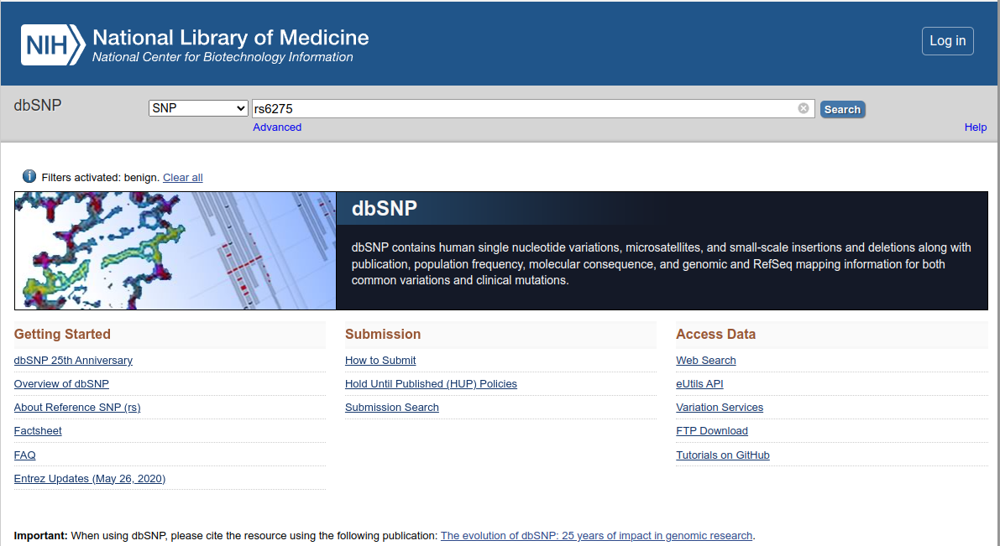

- A página inicial de resultados trará um resumo de cada *rs* relacionado a sua busca.

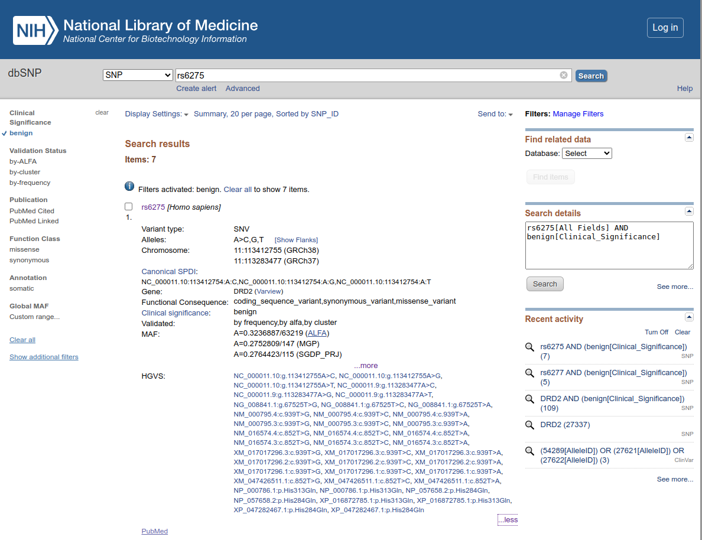

- O resultado resumido mostrará informações como:
   - **Localização genômica** (cromossomo e posição exata).
   - **Consequência funcional**.
   - **Frequência alélica** em diferentes populações.
   - **Estudos associados** que analisaram sua influência em características humanas.
  
- Você pode explorar os detalhes clicando no primeiro resultado, obtendo assim a página abaixo:

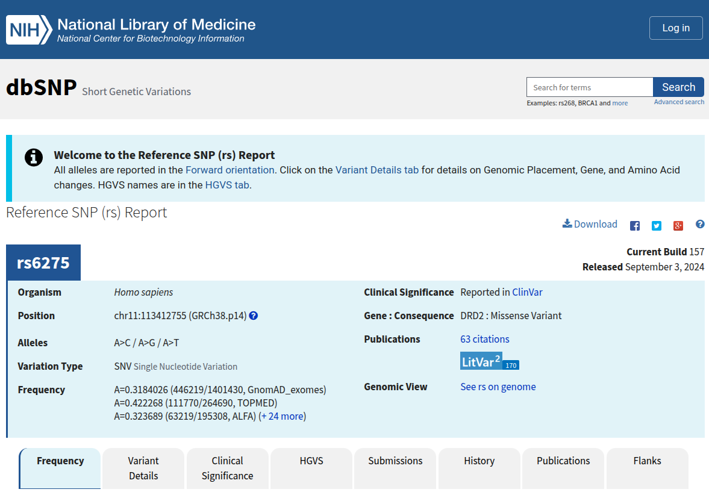

- Nas abas abaixo você terá informações mais detalhadas sobre essa variante.

Esse SNP é um ótimo exemplo de como variações genéticas podem influenciar características sem necessariamente causar doenças. Vamos agora verificar um patogênico?

Repita os passos acima com o SNP de código [rs121913529](https://www.ncbi.nlm.nih.gov/snp/rs121913529) e responda:
- Em qual gene esse SNP é relatado?
- Qual o seu efeito?
- Qual a sua frequência alélica na população 

### Para os apressados:
- Acesse o site oficial do dbSNP [aqui](https://www.ncbi.nlm.nih.gov/snp/).
- Utilize a barra de pesquisa para buscar um SNP específico usando um **RefSNP ID (rsID)** ou um **gene**.
- Filtre os resultados por **significância clínica**, **frequência alélica** e **localização genômica**.
- Para baixar os dados, vá até a seção **FTP Download**.

## ClinVar

O [ClinVar](https://www.ncbi.nlm.nih.gov/clinvar) é um banco de dados que relaciona variações genéticas com condições médicas.

### Exemplo de uso:

O exemplo para uso do ClinVar será um pouco diferente do anterior, embora você também possa procurar códigos **rs** diretamente nele. Aqui iremos iniciar a busca com uma condição. A condição é a esquizofrenia (em inglês, *Schizophrenia*).

- Acesse o site do [ClinVar](https://www.ncbi.nlm.nih.gov/clinvar).
- Coloque o termo *Schizophrenia* no campo de busca.

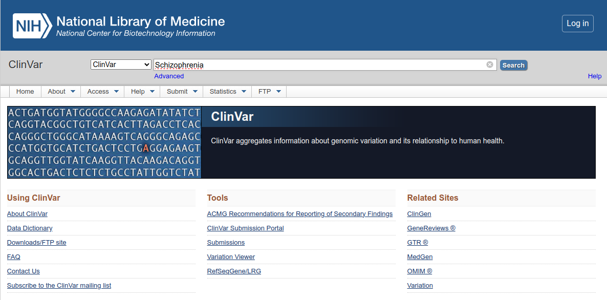

- Observe a página inicial dos resultados:

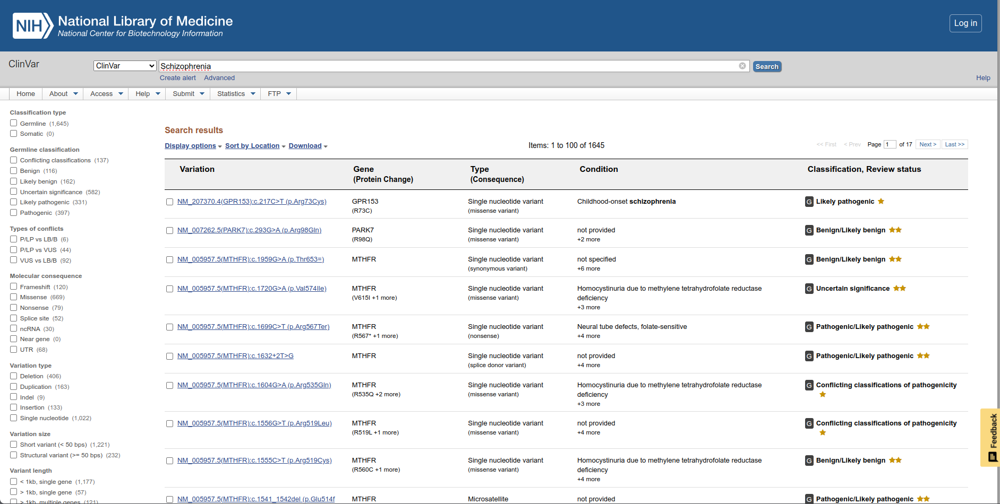

- No menu lateral esquerdo, vamos filtrar os resultados por:
  - *Germline classification: Pathogenic.*
  - *Molecular consequence: UTR.*

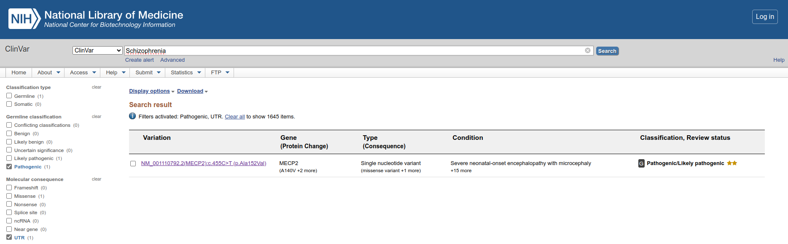

- Clique no resultado único e explore a página seguinte de descrição dessa variante.

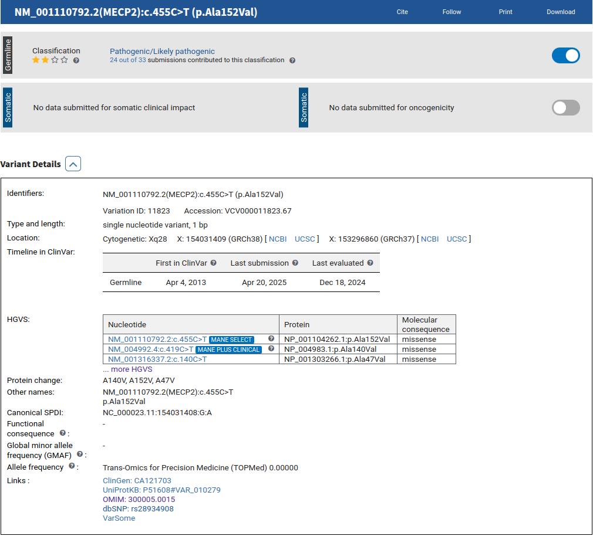

- Verifique todas as informações nessa página e principalmente os links para outros bancos de dados.

#### Para os apressados:

- Acesse o site do [ClinVar](https://www.ncbi.nlm.nih.gov/clinvar).
- Use a barra de pesquisa para buscar variantes associadas a doenças específicas: códigos do dbSNP, variante, condição, etc.
- Explore os detalhes de cada variante, incluindo **significância clínica**, **publicações científicas** e **frequência populacional**.

## OMIM

O [**OMIM**](https://www.omim.org/) (*Online Mendelian Inheritance in Man*) é um banco de dados que contém informações sobre doenças genéticas e genes associados.

### Exemplo de uso:

No OMIM também iremos procurar por uma condição genética, a *Mucoviscidosis*, que é um outro nome para a Fibrose Cística.

- Abra a página do [**OMIM**](https://www.omim.org/).

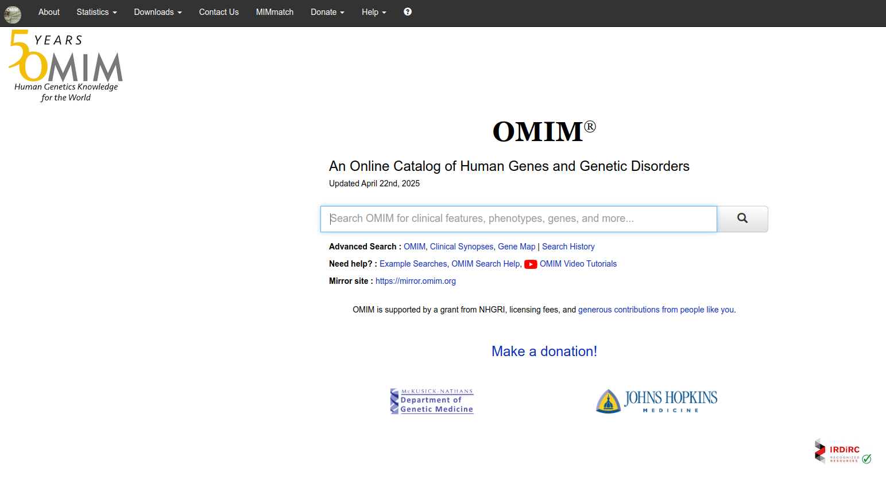

- No campo de busca, coloque o termo Mucoviscidosis.
- Clique no único resultado que aparece, *Cystic fibrosis*.
- Veja a página de resultados, com a descrição completa da doença.

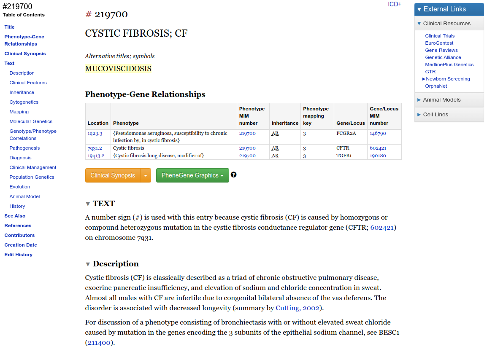

- Verifique a tabela e clique no link da última coluna na segunda linha da tabela (onde tem [602421](https://www.omim.org/entry/602421)).
- Além de registros para doenças, o OMIM tem também registros para cada gene. Nessa página temos o registro do gene CFTR. Na coluna à esquerda da página temos várias informações textuais sobre o gene.

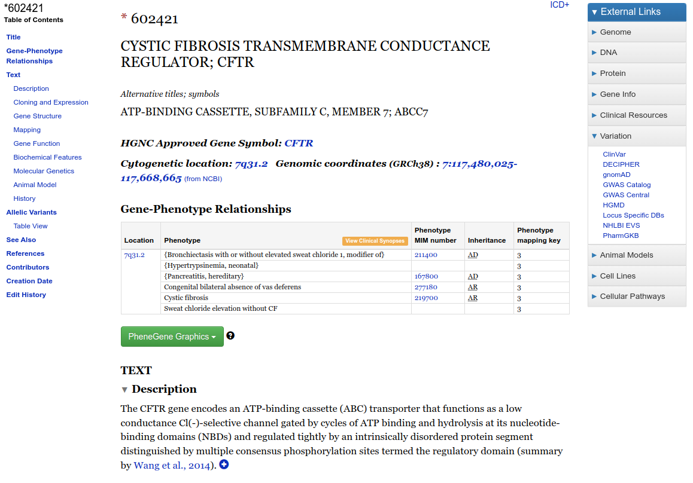.

- Ainda na coluna à esquerda existe um menu chamado *Allelic Variants*. Clique no link logo abaixo, chamado *Table View*. Uma nova página irá abrir:

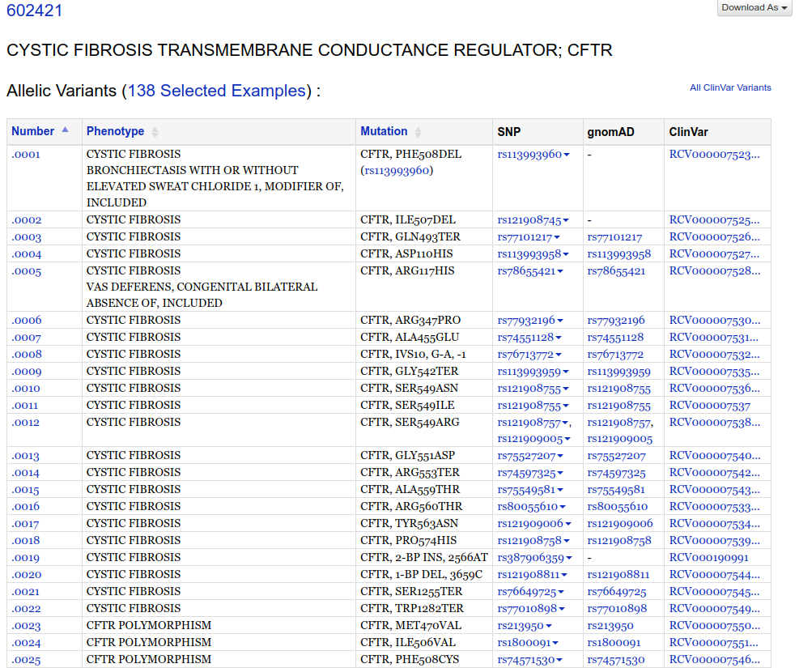.

- Na tabela acima você encontra:
  - O número da mutação/polimorfismo no formato **602421#0001** (Registro do Gene # Número da mutação).
  - O fenótipo (*phenotype*).
  - A descrição da mutação (*Mutation*), no formato PHE508DEL (XNY).
  - O código dela no dbSNP (*SNP* - código com início em *rs*).
  - A frequência alélica descrita no banco de genomas/exomas [gnomAD™](https://gnomad.broadinstitute.org/) (*Genome Aggregation Database*, antes conhecido como ExAC).
  - O código dela no [ClinVar](https://www.ncbi.nlm.nih.gov/clinvar).

Esse exemplo demonstra a integração que existe entre os diversos bancos de dados. Em todos os bancos acima, existem links que direcionam uma determinada variante aos outros bancos de dados em que ela é descrita.

#### Para os apressados:
1. Acesse o site do OMIM [aqui](https://www.omim.org/).
2. Utilize a barra de pesquisa para buscar um gene ou uma doença específica.
3. Leia as descrições detalhadas sobre a condição genética e suas variantes associadas.

## TCGA

O [TCGA](https://www.cancer.gov/ccg/research/genome-sequencing/tcga) (*The Cancer Genome Atlas*) contém dados genômicos de diversos tipos de câncer.

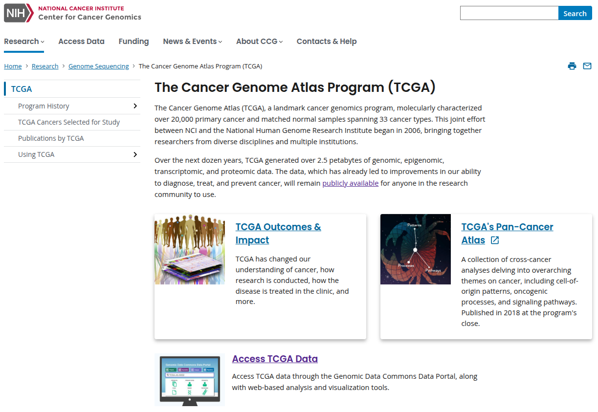

Para acessar diretamente os dados, você pode ir diretamente para o link [Access TCGA Data](https://portal.gdc.cancer.gov/).

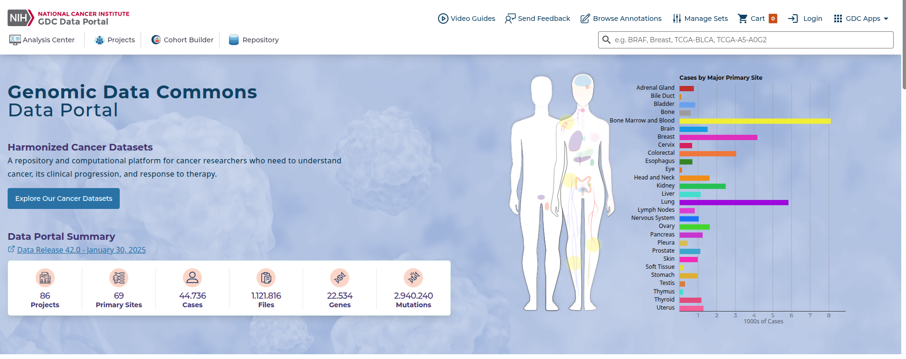.

No campo de busca à direita, vamos procurar por um gene, o BRCA1, que está relacionado a diversos tipos de câncer, especialmente o de mama. Ao acessar a página de resultados, uma série de informações serão mostradas para o gene, assim como suas associações à doenças.

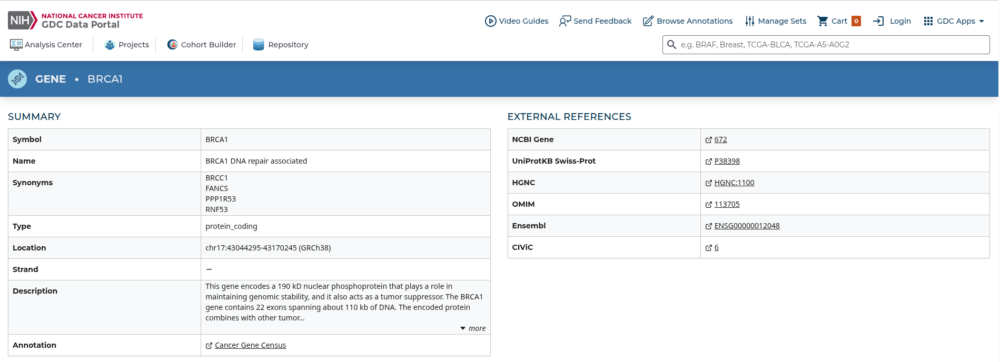

Nela você também encontrará integração com diversos outros bancos de dados biológicos.

Na página anterior você pode também analisar diretamente os dados presente no TCGA. Existem links para demonstrações para cada tipo de análise.

#### Para os Apressados:
1. Acesse o portal do TCGA [aqui](https://www.cancer.gov/ccg/research/genome-sequencing/tcga).
2. Utilize a ferramenta de busca para encontrar dados genômicos de diferentes tipos de câncer.
3. Explore os dados de expressão gênica, mutações e análises clínicas.
4. Para baixar os dados, é necessário criar uma conta no **Genomic Data Commons (GDC)**.

## *CBioPortal for Cancer Genomics*

O [CBioPortal](https://www.cbioportal.org/) é uma base de conhecimento que apresenta dados complexos de diversos coortes e projetos genoma de câncer de uma forma interativa e de fácil análise para profissionais de saúde.

### Exemplo de uso:

Vamos obter uma visão geral de um conjunto de dados de câncer de mama (*Breast cancer*). Na coluna à direita no site inicial do CBioPortal, selecione **Breast**. Em seguida, à esquerda, selecione a segunda caixa (*MSK Cancer Cell 2018*). Após isso, clique na caixa azul na parte inferior da página `Explore Selected Studies`.

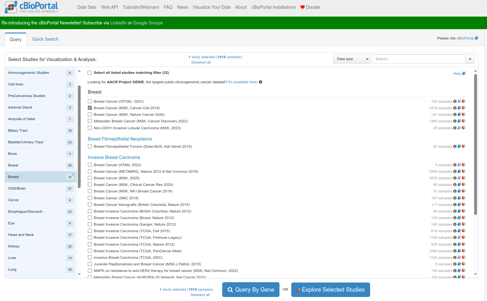

Verifique a página com o sumário dos resultados:

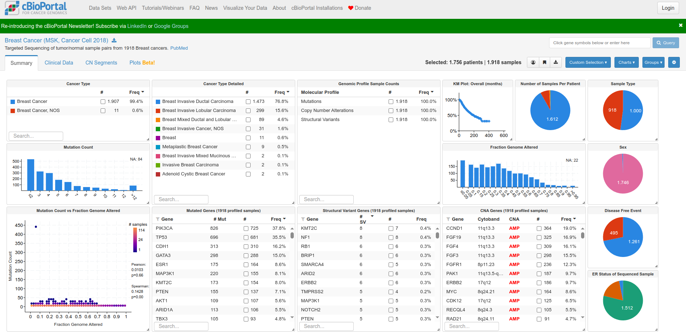

Quais dos dados lhe chama mais atenção nessa análise?

## COSMIC-3D

O [COSMIC-3D](https://cancer.sanger.ac.uk/cosmic3d/) é um banco de dados que integra mutações associadas ao câncer com estruturas tridimensionais do proteoma humano. É uma base muito interessante para visualizar o efeito de mutações na estrutura das proteínas.

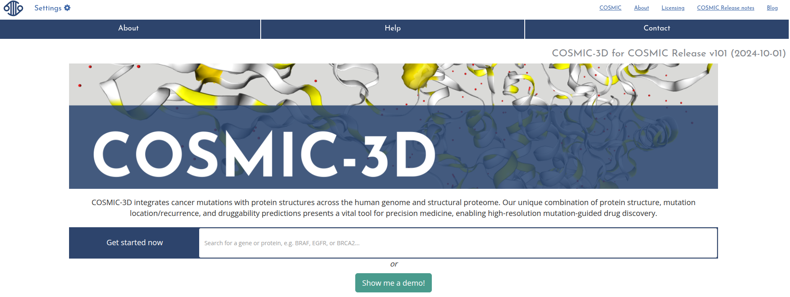

### Exemplo de uso:

Vamos continuar utilizando o gene BRCA1, colocando sua sigla (na verdade, seu *GeneSymbol*) no campo de busca. Logo abaixo uma caixa com o código Uniprot da proteína e o número de estruturas disponíveis aparece embaixo. Aperte `ENTER`.

Na página seguinte você verá a estrutura da proteína e um gráfico que resume as mutações reportadas, a sua cobertura estrutural e a sua frequência de ocorrência. Ao clicar na mutação, a mudança de aminoácido é visualizada na estrutura.

O vídeo abaixo demonstra a procura pelo gene EGFR:

<iframe src="https://drive.google.com/file/d/1pFc1kVYLBHkjd4zQZOcx61kXjuIapBVP/preview" width="640" height="480" allow="autoplay"></iframe>

