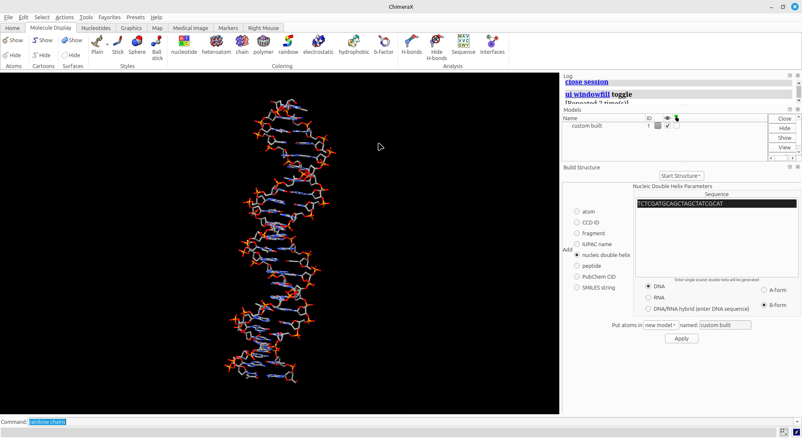
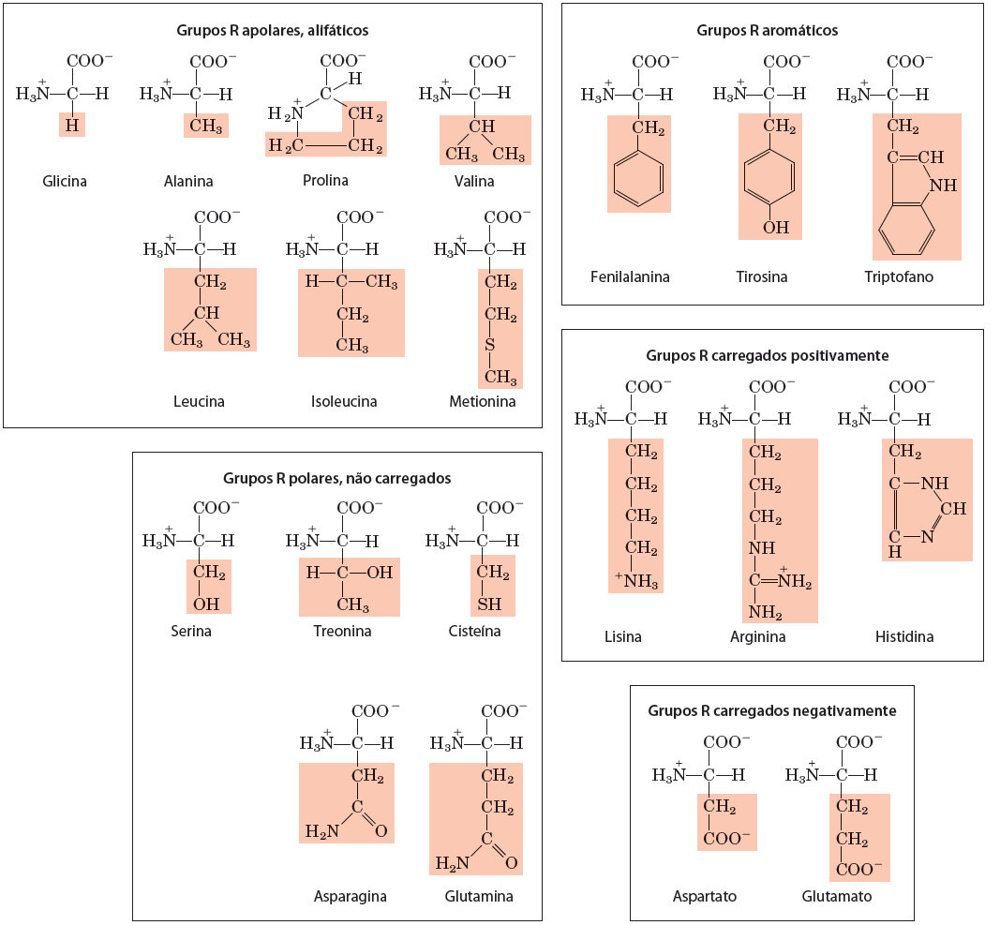
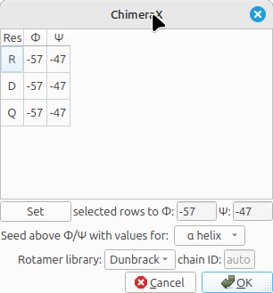
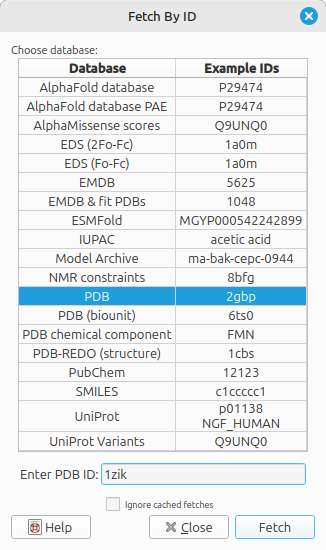
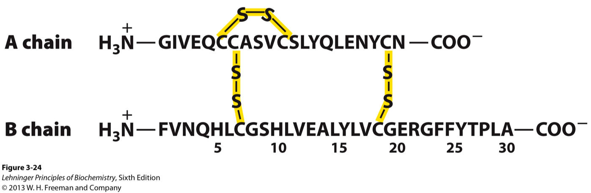

# Representação computacional de Biomoléculas

O objetivo deste tutorial é introduzir conceitos relacionados a representação 
e visualização computacional de moléculas biológicas, como proteínas, ácidos nucléicos,
pequenos ligantes, etc. Serve como suporte visual para o entendimento das estruturas tridimensionais e
as ligações/interações químicas que a estabilizam.

**Observações:**

- Este tutorial foi construído ***apenas para fins didáticos***. <span style="color:red">**A reprodução dele para qualquer outro fim não é permitida e nem consentida.**</span>
- Para fins de otimização de tempo, as ferramentas/programas aqui utilizados já devem estar instalados na máquina. Navegue pelo restante do site para verificar as etapas necessárias para instalação delas.

***Veja também o tutorial comentado em áudio (gerado de forma automática por Inteligência Artificial):***

<iframe
  src="https://drive.google.com/file/d/1NJhVgb-8Oo6rEI7woKalrN03GtbCpZyM/preview"
  width="300"
  height="60"
  frameborder="0"
  allow="autoplay; encrypted-media"
  allowfullscreen
></iframe>

**ATENÇÃO**

<span style="color:red">O aúdio acima é apenas para ajudar na acessibilidade do tutorial, ele não narra todos os passos dele. Ouví-lo não subtitui a execução das etapas abaixo nem substitui as aulas presenciais com a presença do professor/instrutor.</span>

## Noções Básicas de Visualização computacional de moléculas

### Ácidos Nucleicos

Os ácidos nucleicos são moléculas informacionais e com estrutura tridimensional. Esta é uniforme no caso da dupla-hélice (DNA ou RNA) ou variável, no caso de RNAs com estruturas secundárias/terciárias ativas biologicamente. A informação pode ser representada na forma de simples caracteres, como um arquivo de texto (texto simples, não em um .doc). A forma mais comum de representação da informação de sequências de nucleotídeos ou proteínas em Bioinformática é o formato **fasta**. Ele foi desenvolvido por David J. Lipman e William R. Pearson em 1985, junto a um programa de busca de similaridades de sequências chamado [FASTA](https://pubmed.ncbi.nlm.nih.gov/2983426/), que foi substituído em muitas aplicações posteriormente pelo [BLAST](https://blast.ncbi.nlm.nih.gov/Blast.cgi).

Ele começa com uma linha de descrição precedida por `>` seguida pela sequência propriamente dita, sem espaços ou números. Sua simplicidade facilita a manipulação e análise de dados biológicos. Segue abaixo um exemplo de uma sequência nucleotídica nesse formato:

```fasta
>Sequencia_1
TCTCGATGCAGCTAGCTATCGCAT
```
Nas linhas relativas à sequência, são apenas aceitos os caracteres canônicos para nucleotídeos e para aminoácidos, que podem ser conferidos [AQUI](https://web.archive.org/web/20110811073845/http://www.dna.affrc.go.jp/misc/MPsrch/InfoIUPAC.html).

Copie a sequência acima e cole um documento de texto simples (usando o bloco de notas ou gedit, em SOs Windows e Linux, respectivamente).

#### Transformando em visulização tridimensional

Para transformar a visualização dessa informação em estrutura tridimensional vamos utilizar o programa [UCSF ChimeraX](https://www.cgl.ucsf.edu/chimerax/) e seguir os seguintes passos:

- Abra o ChimeraX.
- Ao abrir o programa, uma tela semelhante a abaixo deverá aparecer:


>*Caso uma tela preta apareça, clique no ícone marcado na figura acima.*

- Vamos agora seuir o seguinte caminho no menu: 
  - *Tools... Structure Editing... Build Structure*


- Na aba lateral irá aparecer uma caixa de diálogo. Clique em *helical DNA/RNA* e cole a sequência descrita acima na caixa, mantendo as opções *DNA* e *B-Form* marcadas, de acordo com a figura abaixo:


- Clique em `Apply`. Sua molécula deverá aparecer.



- Explore a molécula e suas diferentes representações, clicando na aba acima *Molecule Display*. Esses passos serão direcionados pelo professor durante a demonstração.

>*Você pode também usar sua própria sequência ou mudar a forma de visualização. Exemplo, que tal fazer uma dupla-hélice híbrida DNA/RNA?*

- Vamos salvar a molécula em um outro formato de arquivo, chamado `pdb`. 
  - Vá em *File* > *Save...* e salve a molécula com o nome `Seq1.pdb`.
- Agora abriremos esse arquivo em editor de texto. 
- Vamos verificar seu formato?
  
## Representando pequenas moléculas

Vamos agora usar uma notação química simplificada, chamada de SMILES (*Simplified Molecular Input Line Entry System*), que serve para a representação de moléculas e reações.

> *Mais informações sobre o SMILES podem ser encontradas [AQUI](https://www.daylight.com/dayhtml/doc/theory/theory.smiles.html).*

A partir do site de informações sobre o [SMILES](https://www.daylight.com/dayhtml/doc/theory/theory.smiles.html) ou partir de buscas Google ou em bancos de dados de estruturas químicas (como o [PubChem](https://pubchem.ncbi.nlm.nih.gov)) procure pelo nome e desenhe outras moléculas do seu interesse. Por exemplo, vamos visualizar a estrutura da Rosuvastatina[Clique aqui](https://pubchem.ncbi.nlm.nih.gov/compound/446157)?

- Na página de informações sobre o fármaco, procure o código SMILES, que estará no Campo "*Canonical SMILES*":

```
CC(C)C1=NC(=NC(=C1/C=C/[C@H](C[C@H](CC(=O)O)O)O)C2=CC=C(C=C2)F)N(C)S(=O)(=O)C
```
- Esse código SMILES pode ser utilizado para construir a molécula na caixa de diálogo ```Build Structure``` do UCSF Chimera.

O código da molécula da Rosuvastatina no PubChem é 446157. Em em *File > Fetch by ID*, marque o banco PubChem e coloque este código.

- Observe a representação da Rosuvastatina, nos diferentes tipos de visualização. Veja outras moléculas lhe interessam.

### Proteínas

As proteínas também são moléculas informacionais, no entanto, com um "alfabeto" maior, com 20 aminoácidos proteicos (que estão codfificados no código genético), descritos na figura abaixo:



A tabela abaixo sumariza os códigos de 1 e de 3 letras destes aminoácidos:

| Aminoácido | Código de 3 letras | Código de 1 Letra |
|:-------|:--:|:--:|
| Alanina | Ala | A |
| Arginina | Arg | R |
| Asparagina | Asn | N |
| Aspartato | Asp | D |
| Cisteína | Cys | C |
| Glutamato | Glu | E |
| Glutamina | Gln | Q |
| Glicina | Gly | G |
| Histidina | His | H |
| Isoleucina | Ile | I |
| Leucina | Leu | L |
| Lisina | Lys | K |
| Metionina | Met | M |
| Fenilalanina | Phe | F |
| Prolina | Pro | P |
| Serina | Ser | S |
| Treonina | Thr | T |
| Triptofano | Trp | W |
| Tirosina | Tyr | Y |
| Valina | Val | V |

Em outro momento, você poder ver a fórmula individual de todos estes aminoácidos, usando o menu ```Build Structure``` do UCSF Chimera, clicando em peptide e colocando apenas um aminoácido, utilizando sempre o código de uma letra.

A informação da estrutura primária das proteínas é também descrita no formato `fasta`:

```
>Pep1
RDQ
```
### Verificando ângulos de rotação

Agora iremos trabalhar com o peptídeo acima (RDQ), para visualizar as diferentes possibilidades dos ângulos de rotação **ø** (*phi*) **Ψ** (*psi*), e relacioná-los ao [Gráfico de Ramanchandran](https://en.wikibooks.org/wiki/Structural_Biochemistry/Proteins/Ramachandran_Plot). Para isso, siga os passos abaixo:

- *Tools... Structure Editing... Build Structure*

Na janela que aparecer clique em ```peptide``` e no espaço indicado coloque **RDQ**.


- No campo ```named```, dê um nome a molécula ou deixe o padrão.
- Clique em ```Apply```.

Na janela que abrir em seguida, verifique os ângulos **ø** (*phi*) **Ψ** (*psi*) atribuídos por padrão no resíduo D (-57/-47). Clique novamente em ```Apply```, mas neste caso deixe esta janela aberta. A primeira molécula irá aparecer.



Nesta mesma janela, você irá mudar os ângulos de rotação, da seguinte forma:
	- Você irá selecionar o resíduo D e nas caixas abaixo você irá colocar 0 graus, para ambos os ângulos *ø* e *Ψ*. Aperte a tecla ```Set```, verifique se os ângulos relativos ao resíduo D mudaram e aperte em ```Apply```.


- Adicione os átomos de H para as 3 moléculas de acordo com o mostrado em aula (*Tools > Structure Editing > Add Hydrogens*). Mude também as opções de visualização para sua visualização favorita.

As duas moléculas irão aparecer sobrepostas. Clique na aba `Right Mouse`na janela principal do ChimeraX, clique em *Drag Model* e com o ponteiro do mouse em cima de um dos peptídeos, clique no botão direito do mouse e arraste-o para outro lugar na tela, para não termos sobreposição.


Verifique as sobreposições entre os átomos causadas pelos diferentes ângulos de torção em torno da ligação peptídica em torno resíduo D.

### Estruturas secundárias

Agora vamos abrir uma primeira estrutura completa.

- Clique em *File > Fetch by ID*.
- Na janela que apareceu, selecione o banco ```PDB``` e no campo digite [1ZIK](https://www.rcsb.org/structure/1ZIK).



- Clique em ```Fetch```.
- Mexa e observe as características desta estrutura.

Esta proteína é zíper de leucine formado por dois peptídeos.

> *Qual o tipo de estrutura secundária principal desta proteína?*

A exibição inicial padrão é fitas (ribbons). Para exibir também seus átomos, clique em:

- *Actions... Atoms/Bonds... show*.

O comando mostra todos os átomos e ligações na estrutura, exceto aqueles que na cadeia do peptídeo são suprimidos pela exibição da fita. Inicialmente, os heteroátomos (átomos além do carbono) são codificados por cores por elementos: oxigênio vermelho, azul de nitrogênio, etc. Os carbonos retêm a cor do modelo.

- Tente mover a estrutura com o mouse na janela principal de gráficos.

Agora vamos retirar a visualização em fitas:

- *Actions... Ribbon... hide* (Para mostrar apenas os átomos).

Identifique os aminoácidos, suas cadeias laterais e as ligações peptídicas.

Agora selecione uma das cadeias da estrutura 1ZIK e mostre as ligações de hidrogênio, com a opção:

- *Tools... Structure Analysis... H-Bonds*. Na janela que abrir em seguida, clique em ```Ok```.

Observe as ligações de hidrogênio que estabilizam a estrutura das alfa-hélices.

>*No ChimeraX, todos os comandos acima podem ser realizados por cliques nos ícones.*

Vamos analisar agora uma estrutura que também tenha folhas-betas.

- Clique em *File > Fetch by ID*.
- Na janela que apareceu, selecione o banco ```PDB``` e no campo digite [5BVL](https://www.rcsb.org/structure/5BVL).
- Clique em ```Fetch```.
- Mexa e observe as características desta estrutura.

Vamos visualizar de forma diferenciada os tipos de estrutura secundária nesta estrutura:

- Vá na linha de comando, na parte inferior do ChimeraX e digite *color strand red* e aperte `ENTER`. A folhas betas deverão agora aparecer em vermelho.

### Estruturas Terciária e Quaternária
 
A estrutura primária da insulina está representada na figura abaixo:



Vamos agora trabalhar com a estrutura terciária deste hormônio. Abra da forma acima indicada a estrutura [1ZEH](https://www.rcsb.org/structure/1ZEH).

Com ele aberto, identifique:

- As cadeias do hormônio insulina.
- Os tipos de estruturas secundárias envolvidas.
- Obtenha o gráfico de Ramachandran.
- Visualize as ligações de H.
- Localize e visualize as pontes dissulfeto (S-S).
> *Para este último item, a dica é procurar pelas cisteínas, de acordo com a figura abaixo.*

Para verificar estruturas quaternárias, iremos baixar estrutura da HMG-CoA Sintase Humana em complexo com a Rosuvastatina. Essa estrutura é o pdb [1HWL](https://www.rcsb.org/structure/1HWL). Siga os passos orientados em sala de aula.

## Predição do efeito de modificações

A partir do número de acesso [Uniprot](http://uniprot.org) (ou do *entry name*) da proteína iremos obter informações sobre a modelagem computacional automática dessa proteína e sobre a predição funcional de modificações de sua sequência a partir do [AlphaMissense](https://deepmind.google/discover/blog/a-catalogue-of-genetic-mutations-to-help-pinpoint-the-cause-of-diseases/). O número de acesso Uniprot que utilizaremos é o [P04035 · HMDH_HUMAN](https://www.uniprot.org/uniprotkb/P04035/entry). Clique nesse registro para verificar a descrição dessa proteína.

- Abra a página do [AlphaFoldDB](https://alphafold.ebi.ac.uk/).
- No campo de busca, coloque o número de acesso Uniprot ou o seu *entry name* e clique em `SEARCH`.
- Clique no resultado obtido ou você pode ir diretamente [AQUI](https://alphafold.ebi.ac.uk/entry/P04035).
  
No registro do AlphaFoldDB, você verá a estrutura tridimensional modelada e logo abaixo você verá um gráfico com a predição de impacto funcional realizada pelo [AlphaMissense](https://deepmind.google/discover/blog/a-catalogue-of-genetic-mutations-to-help-pinpoint-the-cause-of-diseases/). Cada modificação prevista (troca de um aminoácido por qualquer um dos outros 19) em cada sítio da sequência primária pode ser observada no gráfico, que descreve o resultado em três categorias: Benginas (Azuis), Provavelmente Patogênicas (Vermelhas) e Efeito incerto (Gradiente entre azul e vermelho). Esta escala reflete o AlphaMissense escore (*am_score*), que varia entre 0 (mais benigna) até 1 (mais patogênica).

## COSMIC-3D

O [COSMIC-3D](https://cancer.sanger.ac.uk/cosmic3d/) é um banco de dados que integra mutações associadas ao câncer com estruturas tridimensionais do proteoma humano. É uma base muito interessante para visualizar o efeito de mutações/polimorfismos na estrutura das proteínas.


### Exemplo de uso:

Vamos utilizar o gene FGFR2, colocando sua sigla (na verdade, seu *GeneSymbol*) no campo de busca. Logo abaixo uma caixa com o código Uniprot da proteína e o número de estruturas disponíveis aparece embaixo. Aperte `ENTER`.

Na página seguinte você verá a estrutura da proteína e um gráfico que resume as mutações reportadas, a sua cobertura estrutural e a sua frequência de ocorrência. Ao clicar na mutação, a mudança de aminoácido é visualizada na estrutura.

- Qual é o impacto de uma mutação na posição 376 dessa proteína?
- Ela possui cobertura estrutural?

O vídeo abaixo demonstra a procura pelo gene EGFR:

<iframe src="https://drive.google.com/file/d/1pFc1kVYLBHkjd4zQZOcx61kXjuIapBVP/preview" width="640" height="480" allow="autoplay"></iframe>

