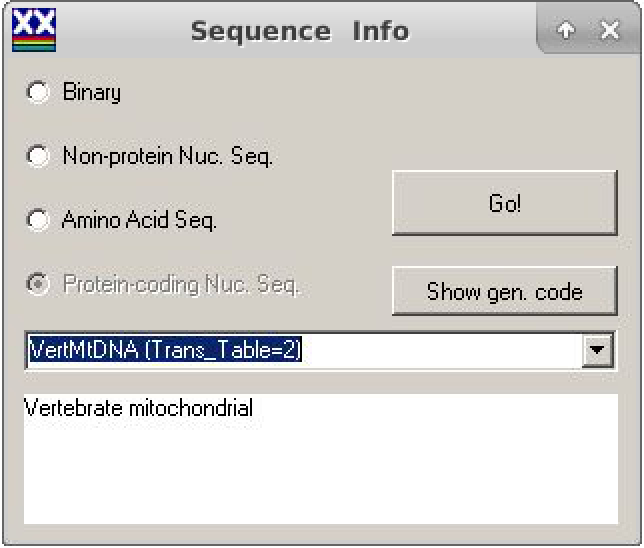
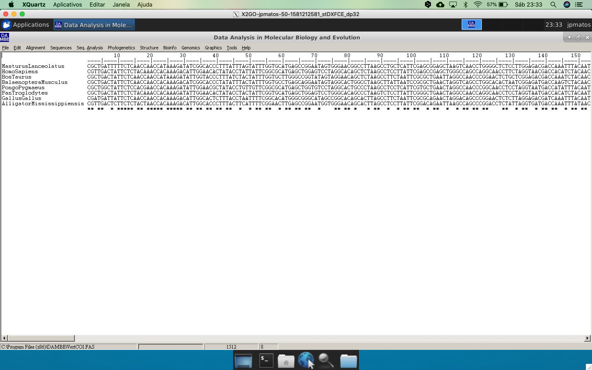
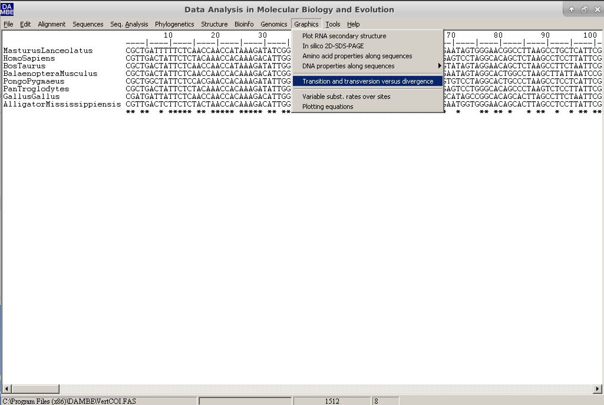
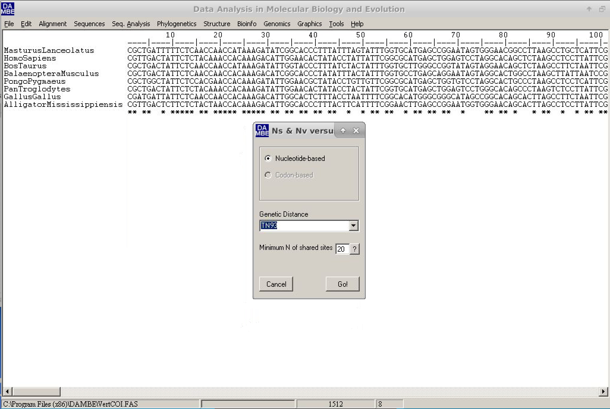
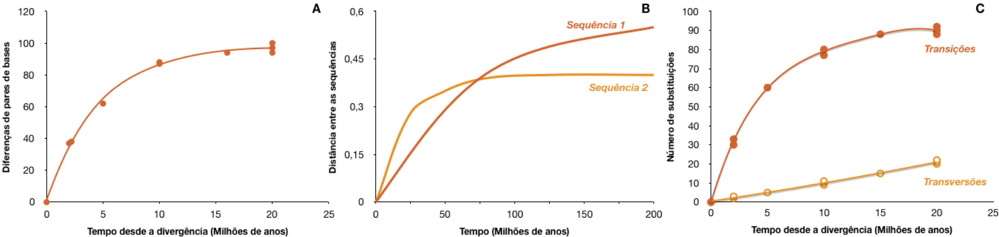
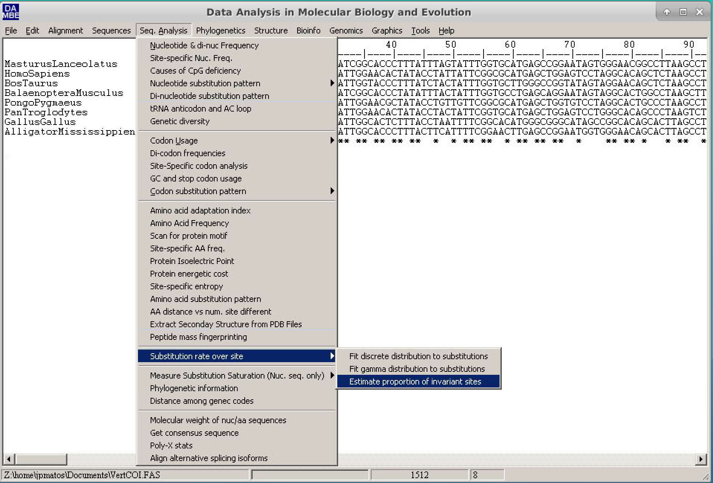
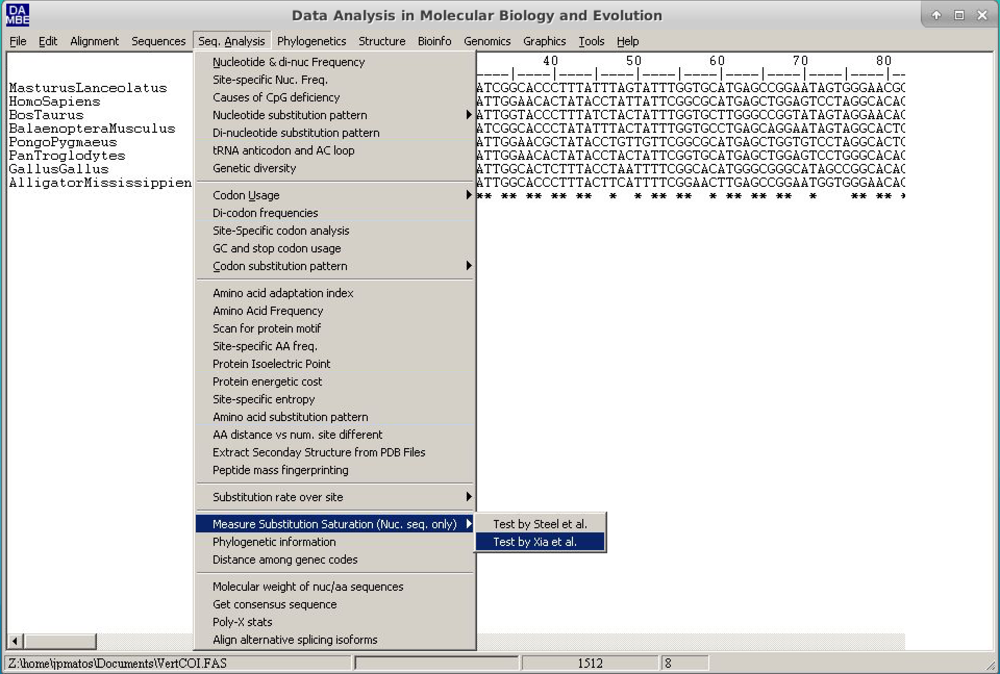
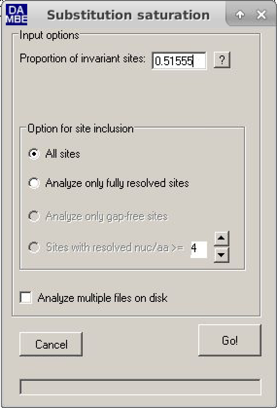

# Estimativa da Saturação de Substituições em Sequências Nucleotídicas

A estimativa de saturação por substituição é uma análise essencial para verificar se os alinhamentos de sequências ainda mantêm um sinal filogenético. A saturação é muito mais comum em sequências de nucleotídeos. Existem dois métodos para essa estimativa: um extremamente simples e qualitativo, e outro quantitativo, com probabilidade associada (o método de Xia, 2009). Ambos estão implementados no programa [DAMBE](http://dambe.bio.uottawa.ca/DAMBE/dambe.aspx) ([Xia, 2018](https://www.ncbi.nlm.nih.gov/pubmed/29669107))

O **DAMBE** (Xia, 2018) é um pacote de programas com diversas aplicações para análise de sequências e filogenia. Além disso, é multiplataforma (com exceção de sistemas com macOS Catalina, que não é completamente compatível com programas de 64 bits – atualização de fevereiro de 2020) e possui uma interface simples de usar. Até onde se sabe, é o único programa de análise filogenética que realiza esses testes.

## Método Qualitativo

O método qualitativo para análise de saturação por substituição consiste na visualização de um gráfico chamado “transições e transversões versus divergência” (*transitions and transversions versus divergence*). Esse método assume que a distância calculada entre as sequências é diretamente proporcional ao tempo de divergência entre elas, qualquer que seja a escala utilizada.

Os passos para gerar esse gráfico são:

Abra o programa DAMBE. Clique em ***File*** e depois em ***Open Standard Sequence File***:


Selecione o arquivo de dados (*dataset*) [VertCOI.fas](https://drive.google.com/uc?export=download&id=1sPodmXGkPCxWu7t8CIZzHmumYS_0kX18) e clique em ***Open*** (Abrir).



Na caixa de diálogo que será exibida, chamada *SequenceInfo*, marque a opção **Protein-coding Nuc-Seq** (Sequência de nucleotídeos codificadora de proteína).
Ainda nessa mesma janela, na seção Genetic Code (Código Genético), selecione o número **2**, que corresponde ao mitocondrial de vertebrados (*Vertebrate mitochondria*).



Na janela principal, o alinhamento será exibido no formato **Clustal**.



No menu principal do **DAMBE**, vá até ***Graphics*** e clique em ***transition and transversion versus divergence*** (transições e transversões versus divergência).



Uma nova janela de diálogo será exibida. Nela, os valores padrão podem ser mantidos. No entanto, vamos alterar a distância genética (campo ***Genetic distance***) para **TN93**, conforme mostrado na figura abaixo:


Clique em `Go` e observe o gráfico gerado. Para facilitar a visualização, mantenha as opções conforme ilustrado abaixo:


	
> *A letra *s* se refere às transições, e a letra *v* às transversões.*

Compare o gráfico obtido com a figura de referência abaixo e tire suas próprias conclusões sobre o nível de saturação dessas sequências.

## O Método Quantitativo

O método de Xia é um método quantitativo, baseado em entropia, que atribui um valor significativo à saturação por substituição. Ele retorna dois critérios: ***Iss*** e ***Iss.c***.
- O primeiro (***Iss***) é o índice de saturação por substituição observado.
- O segundo (***Iss.c***) é o índice de saturação crítica — o valor a partir do qual as sequências não conseguem mais recuperar uma árvore filogenética correta.

Quando o *valor observado* de ***Iss*** é significativamente *menor* que o valor crítico ***Iss.c*** (***Iss < Iss.c***), a saturação por substituição **não** é um problema para o conjunto de dados analisado.

Os passos para realizar esse método são:

- Abra o programa DAMBE. Clique em ***File*** e depois em ***Open Standard Sequence File***.
- Selecione o mesmo arquivo acima utilizado `VertCOI.fas` e clique em ***Open***.
- Na caixa de diálogo que aparece (***SequenceInfo***), marque a opção ***Protein-coding Nuc-Seq***. Ainda nesta janela, em ***Genetic Code***, selecione o número ***2*** (relativo ao código genético mitocondrial de vertebrados).
- Na janela principal, o alinhamento será exibido no formato **Clustal**. 
- Antes de continuar, é necessário calcular a **proporção de sítios invariantes (Pinvar)** para este conjunto de dados. Esse parâmetro é fundamental quando há taxas de substituição muito diferentes entre os sítios da sequência.
- Para isso, siga o caminho: *Seq.Analysis > Substitution rates over site > Estimate proportion of invariant sites.*



- Na janela que se abrirá - Marque a opção ***Use a new tree***.
- Em seguida, selecione o método ***Neighbor-Joining***, escolha o grupo externo apropriado (*outgroup*) — neste exemplo, utilizaremos *Alligator mississippis* — e mantenha o restante das opções como estão.

- Clique em `Run` e depois em `Go`.

1. No final da saída de texto, o valor de **Pinvar** será exibido, como no exemplo abaixo:

```
Estimation based on tree:
(AlligatorMississippiensis:0.13730,(MasturusLanceolatus:0.15730,(((HomoSapiens:0.04522,PanTroglodytes:0.04795):0.02113,PongoPygmaeus:0.08982):0.05970,(BosTaurus:0.09378,BalaenopteraMusculus:0.10744):0.01982):0.01484):0.01673,GallusGallus:0.12297);

Estimating the proportion of invariant sites by iteration.
(Poisson+I)
 Iter       Phi      Pinv
-------------------------------------
    0   0.85377   0.28746
    1   0.85377   0.25871
    2   0.85377   0.31960
    3   0.73189   0.42154
    4   0.62860   0.47955
    5   0.57154   0.51389
    6   0.56361   0.52394
    7   0.56361   0.53330
    8   0.56361   0.52737
    9   0.56361   0.52462
   10   0.56361   0.52224
   11   0.56361   0.52258
   12   0.56361   0.52122
   13   0.56361   0.52089
   14   0.56361   0.51988
   15   0.56361   0.51954
   16   0.56361   0.51887
   17   0.56361   0.51821
   18   0.56361   0.51754
   19   0.56361   0.51688
   20   0.56361   0.51621
   21   0.56361   0.51555
-------------------------------------
P(invariant) = 0.51555
```

- Salve ou anote o valor de Pinvar (0.51555).

> ⚠️ *Dependendo das configurações de idioma do sistema operacional, pode ser necessário usar ponto (.) como separador decimal, e não vírgula (,). Fique atento(a)!*

Agora, vamos estimar a saturação por substituições (o programa pode apresentar alguns problemas, em alguns casos, o artigo the sequencia deve ser aberto novamente):

- Clique em ***Seq.Analysis > Measure substitution saturation > Test by Xia et al***.



- Na janela que abrir, insira o valor de **Pinvar** calculado e clique em `Go`.



- Analise os resultados (Comentários adicionais serão feitos durante a prática).

```
Test of substitution saturation (Xia et al. 2003; Xia and Lemey 2009)

Testing whether the observed Iss is significantly
lower than Iss.c.

Part I. For a symmetrical tree.
========================================================
Prop. invar. sites                0.5156
Mean H                            0.9205
Standard Error                    0.0183
Hmax                              1.6517
Iss                               0.5573
Iss.c                             0.8093
T                                13.7506
DF                              731
Prob (Two-tailed)                 0.0000
95% Lower Limit                   0.5214
95% Upper Limit                   0.5933

========================================================
Part II. For an extreme asymmetrical (and generally very
unlikely) tree.
========================================================
Iss.c                             0.7095
T                                 8.3050
DF                              731
Prob (Two-tailed)                 0.0000

95% Lower Limit                   0.5214
95% Upper Limit                   0.5933

========================================================

Interpretation of results:
               Significant Difference
               ----------------------
               Yes                 No
-------------------------------------------------------
Iss < Iss.c    Little             Substantial
               saturation         saturation
-------------------------------------------------------
Iss > Iss.c    Useless            Very poor
               sequences          for phylogenetics
-------------------------------------------------------

Please cite:

Xia, X., Z. Xie, M. Salemi, L. Chen, Y. Wang. 2003. An index of substitution saturation and its application. Molecular Phylogenetics and Evolution 26:1-7.

Xia, X. and Lemey, P. 2009. Assessing substitution saturation with DAMBE. Pp. 615-630 in Philippe Lemey, Marco Salemi and Anne-Mieke Vandamme, eds. The Phylogenetic Handbook: A Practical Approach to DNA and Protein Phylogeny. 2nd edition Cambridge University Press.
```

>Pode-se verificar que em ambos os cenários ***Iss < Iss.c***. Portanto, essas sequências **não apresentam saturação por substituição** e podem ser utilizadas para análise filogenética.

## Influência da Posição no Códon

Devido às características do código genético, as sequências de nucleotídeos codificadoras de proteínas tendem a apresentar um número maior de substituições na **3ª posição do códon** do que nas **1ª e 2ª posições**. Por isso, o ideal é realizar **ambos os métodos para cada posição do códon separadamente** (essa opção será mostrada durante a prática).

A tabela abaixo deve conter os valores de **Pinvar**, **Iss** e **Iss.c** para todas as posições do códon.

| Positions               | Pinvar  | *Iss*  | *Iss.c* | P      |
|:----------------------- |:-------:|:------:|:-------:|:------:|
| **All**                 | 0.51555 | 0.5573 | 0.8093  | 0.0000 |
| **1st position**        | 0.64014 | 0.3814 | 0.7519  | 0.0000 |
| **2nd position**        | 0.42518 | 0.0655 | 0.7519  | 0.0000 |
| **3rd position**        | 0.02485 | 0.7340 | 0.7519  | 0.3540 |
| **1st e 2nd positions** | 0.37664 | 0.1391 | 0.7886  | 0.0000 |

## Considerações Finais

Sempre que for trabalhar com um marcador novo ou pouco conhecido, **a análise de saturação por substituição deve ser realizada**. Se estiver utilizando genes ou proteínas já bem estabelecidos na literatura, esses testes são recomendados, mas não obrigatórios.

No entanto, realizar essas análises pode confirmar se o marcador é adequado ao **nível taxonômico** com o qual você está trabalhando. Às vezes, uma análise qualitativa é suficiente, mas o ideal é sempre realizar o método quantitativo, especialmente se o gráfico apresentar interpretação ambígua.